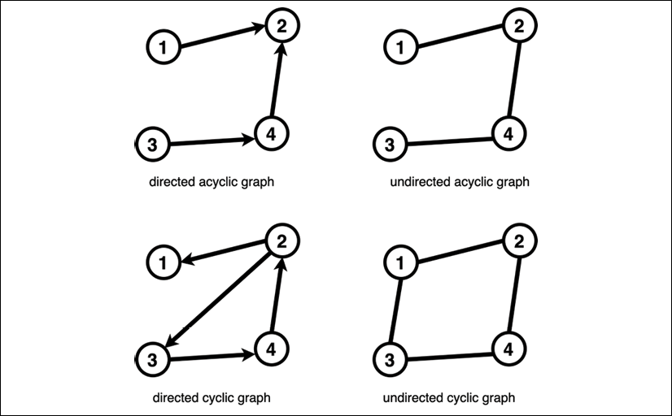
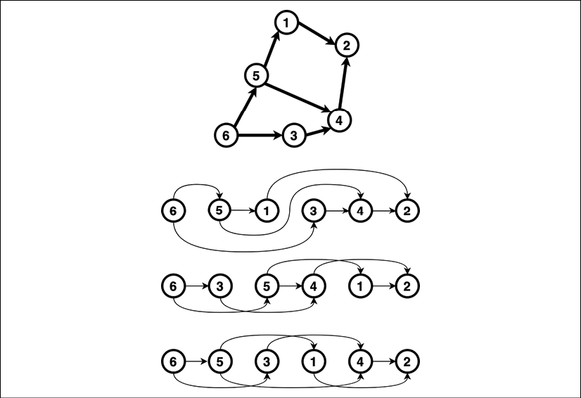

Python 历史上最重要的步骤之一可能是 Python 3.0 的发布。该版本中发生的最显着变化是：

- 解决有关文本、数据和 Unicode 处理的多个问题
- 摆脱旧式课程
- 开始标准库重组
- 引入函数注解
- 引入用于异常处理的新语法

正如我们在第 1 章，Python 的现状中所知道的，Python 3 并非向后不兼容 Python 2。这是 Python 社区花了这么多年才完全接受它的主要原因。对于 Python 核心开发人员和 Python 社区来说，这是一个艰难但必要的教训。

幸运的是，与采用 Python 3 相关的问题并没有阻止语言发展的进程。自 2008 年 12 月 3 日（Python 3.0 正式发布）以来，我们已经看到新的主要 Python 更新的稳定流入。每个新版本都对语言、标准库和解释器进行了新的改进。此外，从 3.9 版本开始，Python 采用了年度发布周期。这意味着我们每年都可以使用新功能和改进。

> 如果你想了解有关 Python 发布周期的更多信息，请阅读 PEP 602 — Python 年度发布周期文档，可从 https://www.python.org/dev/peps/pep-0602/ 获得。

在本章中，我们将仔细研究最近的 Python 演变。我们将审查最新几个版本中的一些重要新增内容。我们还将展望未来，并展示一些在 PEP 过程中已被接受的特性，并将在不久的将来成为 Python 编程语言的正式组成部分。在此过程中，我们将涵盖以下主题：

- 最近添加的语言
- 不是那么新，但仍然闪亮
- 未来可能会发生什么？

但在我们回顾这些功能之前，让我们首先考虑技术要求。

## 技术要求

以下是本章提到的 Python 包，可以从 PyPI 下载：

- mypy
- pyright

关于如何安装包的信息包含在第 2 章，现代 Python 开发环境中。

本章的代码文件可以在 https://github.com/PacktPublishing/Expert-Python-Programming-Fourth-Edition/tree/main/Chapter%203 找到。

## 最近添加的语法

Python 的每个版本都伴随着许多不同类型的变化。几乎每个 Python 版本都带来了一些新的语法元素。但是，大部分更改都与 Python 的标准库、CPython 解释器、Python API 和 CPython 的 C API 相关。由于篇幅所限，本书不可能涵盖所有这些内容。这就是为什么我们将只关注新的语法特性和标准库的新增内容。

就 Python 的两个最新版本而言，我们可以区分出四个主要的语法更新：

- 字典和合并更新运算符（在 Python 3.9 中添加）
- 赋值表达式（在 Python 3.8 中添加）
- 类型提示泛型（在 Python 3.9 中添加）
- 仅位置参数（在 Python 3.8 中添加）

这四个功能最好被描述为生活质量的改善。它们不会引入任何新的编程范式，也不会彻底改变你的代码编写方式。它们只是允许更好的编码模式或启用更严格的 API 定义。

近年来，Python 核心开发人员主要专注于从标准库中删除死模块或冗余模块，而不是添加任何新内容。尽管如此，我们还是会不时看到一些标准库的添加。在最近的两个版本中，我们受益于两个全新的模块：

- 支持 IANA（互联网号码分配机构）时区数据库的 zoneinfo 模块（在 Python 3.9 中添加）
- 用于操作类图结构的 graphlib 模块（在 Python 3.8 中添加）

就 API 大小而言，这两个模块都相当小。稍后，我们将讨论一些你可以应用它们的示例领域。但首先，让我们放大一下 Python 3.8 和 Python 3.9 中包含的语法更新。

###  字典合并和更新运算

Python 允许使用许多选定的算术运算符来操作内置容器类型，包括列表、元组、集合和字典。

对于列表和元组，你可以使用 +（加法）运算符连接两个变量，只要它们的类型相同即可。还有 += 运算符，它允许就地修改现有变量。以下成绩单展示了在交互式会话中串联列表和元组的示例：

```python
>>> [1, 2, 3] + [4, 5, 6]
[1, 2, 3, 4, 5, 6]
>>> (1, 2, 3) + (4, 5, 6)
(1, 2, 3, 4, 5, 6)
>>> value = [1, 2, 3]
>>> value += [4, 5, 6]
>>> value
[1, 2, 3, 4, 5, 6]
>>> value = (1, 2, 3)
>>> value += (4, 5, 6)
>>> value
(1, 2, 3, 4, 5, 6)
```

当涉及到集合时，正好有四个二元运算符（有两个操作数）产生一个新集合：

- 交集：用&（按位或）表示。 这产生了一个集合，其中包含两个集合共有的元素。
- 并集：由 | 代表 （按位或）。 这产生了两个集合中所有元素的集合。
- 差集：用-（减法）表示。 这产生了一个集合，其中包含左侧集合中不包含在右侧集合中的元素。
- 异或：用^（按位异或）表示。 这产生了一个集合，其中包含两个集合中的元素，但不是两个集合中的任何一个。

以下抄本提供了交互式会话中集合的交集和并集操作的示例：

```python
>>> {1, 2, 3} & {1, 4}
{1}
>>> {1, 2, 3} | {1, 4}
{1, 2, 3, 4}
>>> {1, 2, 3} - {1, 4}
{2, 3}
>>> {1, 2, 3} ^ {1, 4}
{2, 3, 4}
```

很长一段时间内，Python 都没有专用的二元运算符来允许从两个现有字典生成新字典。 从 Python 3.9 开始，我们可以使用 | （按位或）和 |=（就地按位或）运算符对字典执行字典合并和更新操作。 这应该是生成两个字典联合的惯用方式。 PEP 584 - Add Union Operators To Dict 文档中概述了添加新运算符背后的原因。

> 编程习语是在给定的编程语言中执行特定任务的常用和最可取的方式。 编写地道的代码是 Python 文化的重要组成部分。 Python 之禅说：“应该有一种——最好只有一种——明显的方法来做到这一点。”
>
> 我们将在第 4 章 Python 与其他语言的比较中讨论更多习语。

为了将两个字典合并成一个新字典，请使用以下表达式：

```dictionary_1 | dictionary_2```

生成的字典将是一个全新的对象，它将拥有两个源字典的所有键。 如果两个字典都有重叠的键，则生成的对象将从最右边的对象接收值。

以下是在两个字典文字上使用此语法的示例，其中左侧字典使用右侧字典中的值进行更新：

```python
>>> {'a': 1} | {'a': 3, 'b': 2}
{'a': 3, 'b': 2}
```

如果你更喜欢使用来自不同字典的键更新字典变量，你可以使用以下就地运算符：

```python
existing_dictionary |= other_dictionary
```

以下是使用实数变量的示例：

```python
>>> mydict = {'a': 1}
>>> mydict |= {'a': 3, 'b': 2}
>>> mydict
{'a': 3, 'b': 2}
```

在旧版本 Python 中，使用另一个字典的内容更新现有字典的最简单方法是使用 update() 方法，如下例所示：

```python
existing_dictionary.update(other_dictionary)
```

此方法在适当的位置修改 existing_dictionary 并且不返回任何值。 这意味着它不允许将合并字典直接生成为表达式，并且始终用作语句。

> 表达式和语句之间的区别将在赋值表达式部分进行解释。

#### 替代方案 - 字典解包

一个鲜为人知的事实是，Python 在 3.9 版本之前已经支持一种相当简洁的方式，通过称为字典解包的功能来合并两个字典。 Python 3.5 中通过 PEP 448 Additional Unpacking Generalizations 引入了对 dict 文字中的字典解包的支持。 将两个（或更多）字典解包成一个新对象的语法如下：

```python
{**dictionary_1, **dictionary_2}
```

示例如下：

```python
>>> a = {'a': 1}; b = {'a':3, 'b': 2}
>>> {**a, **b}
{'a': 3, 'b': 2}
```

此功能与列表解包（使用 *value 语法）一起，对于具有编写可以接受未定义参数集和关键字参数（也称为可变参数函数）的函数的经验的人来说可能很熟悉。这在编写装饰器时特别有用。

> 我们将在第4章 Python 与其他语言的比较中详细讨论可变参数函数和装饰器的主题。

你应该记住，字典解包虽然在函数定义中非常流行，但它是一种特别罕见的合并字典的方法。它可能会使正在阅读你的代码的经验不足的程序员感到困惑。这就是为什么在 Python 3.9 和更新版本中运行的代码中，你应该更喜欢新的合并运算符而不是字典解包。对于旧版本的 Python，有时最好使用临时字典和简单的 update() 方法。

#### 替代方案——来自 collections 模块的 ChainMap

另一种创建对象的方法，从功能上讲，是两个字典的合并，是通过集合模块中的 ChainMap 类。这是一个包装类，它接受多个映射对象（在这个实例中是字典）并且就像一个单独的映射对象一样。

ChainMap合并两个字典的语法如下：

```new_map = ChainMap(dictionary_2, dictionary_1)```

请注意，与 | 相比，字典的顺序是相反的。 这意味着如果你尝试访问 new_map 对象的特定键，它将以从左到右的顺序对包装的对象执行查找。 考虑以下脚本，它说明了使用 ChainMap 类的操作示例：

```python
>>> from collections import ChainMap
>>> user_account = {"iban": "GB71BARC20031885581746", "type": "account"}
>>> user_profile = {"display_name": "John Doe", "type": "profile"}
>>> user = ChainMap(user_account, user_profile)
>>> user["iban"]
'GB71BARC20031885581746'
>>> user["display_name"]
'John Doe'
>>> user["type"]
'account'
```

在前面的例子中，我们可以清楚地看到 ChainMap 类型的结果用户对象包含来自 user_account 和 user_profile 字典的键。 如果任何键重叠，ChainMap 实例将返回具有特定键的最左侧映射的值。 这与字典合并运算符完全相反。

ChainMap 是一个包装对象。 这意味着它不会复制提供的源映射的内容，而是将它们存储为引用。 这意味着如果底层对象发生变化，ChainMap 将能够返回修改后的数据。 考虑上一个交互式会话的以下延续：

```python
>>> user["display_name"]
'John Doe'
>>> user_profile["display_name"] = "Abraham Lincoln"
>>> user["display_name"]
'Abraham Lincoln'
```

此外，ChainMap 是可写的，并将更改填充回底层映射。 你需要记住的是，写入、更新和删除只影响最左边的映射。 如果不小心使用，这可能会导致一些混乱的情况，如上一节的以下继续：

```python
>>> user["display_name"] = "John Doe"
>>> user["age"] = 33
>>> user["type"] = "extension"
>>> user_profile
{'display_name': 'Abraham Lincoln', 'type': 'profile'}
>>> user_account
{'iban': 'GB71BARC20031885581746', 'type': 'extension', 'display_name': 'John Doe', 'age': 33}
```

在前面的示例中，我们可以看到“display_name”键被填充回 user_account 字典，其中 user_profile 是包含此类键的初始源字典。 在许多情况下，ChainMap 的这种反向传播行为是不可取的。 这就是为什么将它用于合并两个字典的常见习惯用法实际上涉及显式转换为新字典。 以下是使用先前定义的输入字典的示例：

```python
>>> dict(ChainMap(user_account, user_profile))
{'display_name': 'John Doe', 'type': 'account', 'iban': 'GB71BARC20031885581746'}
```

如果你想简单地合并两个字典，你应该更喜欢一个新的合并运算符而不是 ChainMap。然而，这并不意味着 ChainMap 完全没有用。如果更改的来回传播是你想要的行为，则 ChainMap 将是要使用的类。此外，ChainMap 适用于任何映射类型。因此，如果你需要提供对多个对象的统一访问，就好像它们是字典一样，ChainMap 将允许提供单个类似合并的单元来这样做。

如果你有一个自定义的类似 dict 的类，你总是可以用特殊的 __or__() 方法扩展它以提供与 | 的兼容性。运算符而不是使用 ChainMap。覆盖特殊方法将在第 4 章，Python 与其他语言的比较中介绍。无论如何，使用 ChainMap 通常比编写自定义 __or__() 方法更容易，并且允许你使用无法修改的类的预先存在的对象实例。

通常，使用 ChainMap 而不是字典解包或联合运算符的最重要原因是向后兼容性。在 3.9 之前的 Python 版本上，你将无法使用新的字典合并运算符语法。因此，如果你必须为旧版本的 Python 编写代码，请使用 ChainMap。如果不这样做，最好使用合并运算符。

另一个对向后兼容性有很大影响的语法变化是赋值表达式。

### 赋值表达式

赋值表达式是一个相当有趣的特性，因为它们的引入影响了 Python 语法的基本部分：表达式和语句之间的区别。表达式和语句是几乎所有编程语言的关键构建块。它们之间的区别非常简单：表达式有值，而语句没有。

将语句视为程序执行的连续动作或指令。因此，赋值、if 子句以及 for 和 while 循环都是语句。函数和类定义也是语句。

将表达式视为可以放入 if 子句中的任何内容。表达式的典型示例是文字、运算符返回的值（不包括就地运算符）和推导式，例如列表、字典和集合推导式。函数调用和方法调用也是表达式。

许多编程语言的某些元素通常与语句密不可分。这些通常是：

- 函数和类定义
- 循环
- if...else 子句
- 变量赋值

Python 能够通过提供与此类语言元素的表达式对应的语法特性来打破这一障碍，即：

- 匿名函数的 Lambda 表达式作为函数定义的对应物：
    ```lambda x: x**2```
- 类型对象实例化作为类定义的对应物：
    ```type("MyClass", (), {})```
- 作为循环对应物的各种理解：
    ```squares_of_2 = [x**2 for x in range(10)]```
- 复合表达式作为 if ... else 语句的对应物：
    ```"odd" if number % 2 else "even"```

然而，多年来，我们一直无法使用语法来传达以表达式的形式为变量赋值的语义，这无疑是 Python 创造者有意识的设计选择。 在诸如 C 之类的语言中，变量赋值既可以用作表达式也可以用作语句，这通常会导致赋值运算符被相等比较混淆的情况。 任何用 C 编程的人都可以证明这是一个非常烦人的错误来源。 考虑以下 C 代码示例：

```c
int err = 0;
if (err = 1) {
    printf("Error occured");
}
```

并将其与以下内容进行比较：

```c
int err = 0;
if (err == 1) {
    printf("Error occured");
}
```

两者在 C 中都在语法上有效，因为 err = 1 是 C 中的表达式，其计算结果为 1。将其与 Python 进行比较，其中以下代码将导致语法错误：

```python
err = 0
if err = 1:
     printf("Error occured")
```

然而，在极少数情况下，有一个可以评估为一个值的变量赋值操作可能真的很方便。 幸运的是，Python 3.8 引入了专用的 := 运算符，它为变量赋值，但充当表达式而不是语句。 由于其视觉外观，它很快被称为海象操作员。

坦率地说，此运算符的用例是有限的。 它们有助于使代码更简洁。 通常，更简洁的代码更容易理解，因为它可以提高信噪比。 海象算子最常见的场景是需要计算一个复杂的值，然后立即在后面的语句中使用。

一个常用的例子是使用正则表达式。 让我们想象一个简单的应用程序，它读取用 Python 编写的源代码并使用正则表达式扫描它以查找导入的模块。

如果不使用赋值表达式，代码可能如下所示：

```python
import os
import re
import sys
import_re = re.compile(
    r"^\s*import\s+\.{0,2}((\w+\.)*(\w+))\s*$"
)
import_from_re = re.compile(
    r"^\s*from\s+\.{0,2}((\w+\.)*(\w+))\s+import\s+(\w+|\*)+\s*$"
)
if __name__ == "__main__":
    if len(sys.argv) != 2:
        print(f"usage: {os.path.basename(__file__)} file-name")
        sys.exit(1)
    with open(sys.argv[1]) as file:
        for line in file:
            match = import_re.search(line)
            if match:
                print(match.groups()[0])
            match = import_from_re.search(line)
            if match:
                print(match.groups()[0])
```

如你所见，我们不得不重复两次评估复杂表达式匹配的模式，然后检索分组标记。 可以通过以下方式使用赋值表达式重写该代码块：

```python
if match := import_re.match(line):
    print(match.groups()[0])
if match := import_from_re.match(line):
    print(match.groups()[0])
```

正如你所看到的，在可读性方面有一个小的改进，但并不显着。 在你需要多次重复相同模式的情况下，这种类型的更改真的很受欢迎。 将临时结果连续分配给同一个变量会使代码看起来不必要地臃肿。

另一个用例可能是在更大的表达式中的多个位置重用相同的数据。 考虑一个字典文字的例子，它代表了一个虚构用户的一些预定义数据：

```python
first_name = "John"
last_name = "Doe"
height = 168
weight = 70
user = {
    "first_name": first_name,
    "last_name": last_name,
    "display_name": f"{first_name} {last_name}",
    "height":  height,
    "weight": weight,
    "bmi": weight / (height / 100) ** 2,
}
```

让我们假设在我们的情况下，保持所有元素一致很重要。 因此，显示名称应始终由名字和姓氏组成，并且 BMI 应根据体重和身高计算。 为了防止我们在编辑特定数据组件时出错，我们不得不将它们定义为单独的变量。 一旦创建了字典，就不再需要这些了。 赋值表达式使前面的字典能够以更简洁的方式编写：

```python
user = {
    "first_name": (first_name := "John"),
    "last_name": (last_name := "Doe"),
    "display_name": f"{first_name} {last_name}",
    "height": (height := 168),
    "weight": (weight := 70),
    "bmi": weight / (height / 100) ** 2,
}
```

如你所见，我们必须用括号将赋值表达式括起来。不幸的是， := 语法与用作字典文字中的关联运算符的 : 字符发生冲突，括号是一种解决方法。

赋值表达式是一种用于完善代码的工具，仅此而已。始终确保一旦应用，它们实际上会提高可读性，而不是使其更加晦涩。

### 类型提示泛型

类型提示注解虽然完全可选，但却是 Python 越来越流行的特性。它们允许你使用类型定义注解变量、参数和函数返回类型。这些类型注解用于文档目的，但也可用于使用外部工具验证你的代码。许多编程 IDE 能够理解打字注解并在视觉上突出显示潜在的打字问题。还有静态类型检查器，例如 mypy 或 pyright，可用于扫描整个代码库并报告使用注解的代码单元的所有键入错误。

> mypy 项目的故事非常有趣。它以博士的身份开始生活。 Jukka Lehtosalo 的研究，但当他开始与 Dropbox 的 Guido van Rossum（Python 创造者）一起工作时，它才真正开始成形。你可以在 Dropbox 的技术博客 https://blog.dropbox.com/topics/company/thank-you--guido 上从给 Guido 的告别信中了解有关该故事的更多信息。

在最简单的形式中，类型提示可以与内置或自定义类型结合使用，以指定所需的类型、函数输入参数和返回值，以及局部变量。考虑以下函数，它允许在字符串键字典中执行不区分大小写的键查找：

```python
from typing import Any
def get_ci(d: dict, key: str) -> Any:
    for k, v in d.items():
        if key.lower() == k.lower():
            return v
```

当然，前面的示例是区分大小写查找的简单实现。如果你想以更高效的方式执行此操作，你可能需要一个专门的类。我们最终将在本书后面重新讨论这个问题。

第一条语句从 Typing 模块导入 Any 类型，它定义变量或参数可以是任何类型。我们函数的签名指定第一个参数 d 应该是一个字典，而第二个参数 key 应该是一个字符串。签名以返回值的规范结束，返回值可以是任何类型。

如果你正在使用类型检查工具，前面的注解足以检测许多错误。例如，如果调用者切换位置参数的顺序，你将能够快速检测到错误，因为 key 和 d 参数使用不同类型进行注解。但是，在用户传递使用不同类型键的字典的情况下，这些工具不会抱怨。

正是因为这个原因，诸如元组、列表、字典、集合、冻结集等泛型类型可以进一步用它们的内容类型进行注解。对于字典，注解具有以下形式：

```python
dict[KeyType, ValueType]
```

get_ci() 函数的签名，带有更严格的类型注解，如下所示：

```python
def get_ci(d: dict[str, Any], key: str) -> Any: ...
```

在旧版本的 Python 中，内置集合类型无法用它们的内容类型轻松注解。打字模块提供了可用于该目的的特殊类型。这些类型包括：

- typing.Dict for dictionaries
- typing.List for lists
- typing.Tuple for tuples
- typing.Set for sets
- typing.FrozenSet for frozen sets

如果你需要为各种 Python 版本提供功能，这些类型仍然很有用，但如果你只为 Python 3.9 和更新版本编写代码，则应改用内置泛型。从类型模块导入这些类型已被弃用，将来它们将从 Python 中删除。

> 我们将在第 4 章 Python 与其他语言的比较中仔细研究输入注解。

### 仅位置参数

在将参数传递给函数时，Python 非常灵活。有两种方法可以将函数参数提供给函数：

- 作为位置参数
- 作为关键字参数

对于许多函数，它是调用者在如何传递参数方面的选择。这是一件好事，因为函数的用户可以决定特定用法在给定情况下更易读或更方便。考虑以下使用分隔符连接字符串的函数示例：

```python
def concatenate(first: str, second: str, delim: str):
    return delim.join([first, second])
```

就如何调用此函数而言，有多种方式：

- 使用位置参数： concatenate("John", "Doe", " ")
- 使用关键字参数： concatenate(first="John", second="Doe", delim=" ")
- 混合使用位置参数和关键字参数： concatenate("John", "Doe", delim=" ")

如果你正在编写一个可重用的库，你可能已经知道你的库打算如何使用。有时，你可能会从自己的经验中了解到，特定的使用模式会使生成的代码更具可读性，或者恰恰相反。你可能还不确定你的设计，并希望确保你的库的 API 可以在合理的时间范围内更改而不影响你的用户。在任何一种情况下，以支持预期用途并允许未来扩展的方式创建函数签名都是一种很好的做法。

发布库后，函数签名会与你的库形成使用合同。对参数名称及其顺序的任何更改都可能破坏使用该库的程序员的应用程序。

如果你在某个时间点意识到参数名称 first 和 second 不能正确解释它们的用途，则无法在不破坏向后兼容性的情况下更改它们。那是因为可能有程序员使用了以下调用：

```python
concatenate(first="John", second="Doe", delim=" ")
```

如果你想将该函数转换为接受任意数量字符串的形式，则不能在不破坏向后兼容性的情况下执行此操作，因为可能有程序员使用了以下调用：

```python
concatenate("John", "Doe", " ")
```

幸运的是，Python 3.8 添加了将特定参数定义为仅位置参数的选项。 这样，你可以指出哪些参数不能作为关键字参数传递，以避免将来出现向后兼容性问题。 你还可以将特定参数表示为仅关键字。 仔细考虑哪些参数应该作为仅位置传递，哪些作为关键字仅用于使函数的定义更容易受到未来更改的影响。 我们的 concatenate() 函数使用仅位置参数和仅关键字参数定义，如下所示：

```python
def concatenate(first: str, second: str, /, *, delim: str):
    return delim.join([first, second])
```

你阅读此定义的方式如下：

/ 标记之前的所有参数都是仅位置参数
* 标记后面的所有参数都是关键字参数
* 前面的定义确保对 concatenate() 函数的唯一有效调用将采用以下形式：

```concatenate("John", "Doe", delim="")```
如果你尝试以不同方式调用它，则会收到 TypeError 错误，如下例所示：

```python
>>> concatenate("John", "Doe", " ")
Traceback (most recent call last):
  File "<stdin>", line 1, in <module>
TypeError: concatenate() takes 2 positional arguments but 3 were given
```

假设我们已经以最后一种格式在库中发布了我们的函数，现在我们想让它接受无限数量的位置参数。 由于只有一种方法可以使用此函数，我们现在可以使用参数解包来实现以下更改：

```python
def concatenate(*items, delim: str):
    return delim.join(items)
```

*items 参数将捕获 items 元组中的所有位置参数。 由于这些更改，用户将能够使用具有可变数量的位置项的函数，如下例所示：

```python
>>> concatenate("John", "Doe", delim=" ")
'John Doe'
>>> concatenate("Ronald", "Reuel", "Tolkien", delim=" ")
'Ronald Reuel Tolkien'
>>> concatenate("Jay", delim=" ")
'Jay'
>>> concatenate(delim=" ")
''
```

仅位置参数和仅关键字参数对于库创建者来说是一个很好的工具，因为它们为将来不会影响用户的设计更改创造了一些空间。但它们也是编写应用程序的绝佳工具，尤其是当你与其他程序员一起工作时。你可以使用仅位置参数和仅关键字参数来确保按预期调用函数。这可能有助于未来的代码重构。

### 区域信息模块

处理时间和时区是编程中最具挑战性的方面之一。主要原因是程序员对时间和时区有许多常见的误解。另一个原因是对实际时区定义的永无止境的更新流。这些变化每年都会发生，通常是出于政治原因。

从版本 3.9 开始，Python 使访问有关当前和历史时区的信息比以往任何时候都更容易。 Python 标准库提供了一个 zoneinfo 模块，该模块是时区数据库的接口，由操作系统提供或作为第一方 tzdata 包从 PyPI 获得。

> 来自 PyPI 的包被视为第三方包，而标准库模块被视为第一方包。 tzdata 非常独特，因为它由 CPython 的核心开发人员维护。将 IANA 数据库的内容提取到 PyPI 上的单独包的原因是为了确保独立于 CPython 的发布节奏的定期更新。

实际使用涉及使用以下构造函数调用创建 ZoneInfo 对象：

```ZoneInfo(timezone_key)```
此处，timezone_key 是来自 IANA 时区数据库的文件名。这些文件名类似于时区在各种应用程序中的显示方式。例子包括：

- Europe/Warsaw
- Asia/Tel_Aviv
- America/Fort_Nelson
- GMT-0

ZoneInfo 类的实例可以用作 datetime 对象构造函数的 tzinfo 参数，如下例所示：

```python
from datetime import datetime
from zoneinfo import ZoneInfo
dt = datetime(2020, 11, 28, tzinfo=ZoneInfo("Europe/Warsaw"))
```

这允许你创建所谓的时区感知日期时间对象。 时区感知日期时间对象对于正确计算特定时区的时差至关重要，因为它们能够考虑标准时间和夏令时之间的变化，以及对 IANA 时区数据库所做的任何历史更改。

你可以使用 zoneinfo.available_timezones() 函数获取系统中所有可用时区的完整列表。

### 图形库模块

Python 标准库的另一个有趣的补充是在 Python 3.9 中添加的 graphlib 模块。这是一个模块，提供用于处理类似图形的数据结构的实用程序。

图是由边连接的节点组成的数据结构。图是数学领域的一个概念，称为图论。根据边类型，我们可以区分两种主要类型的图：

- 无向图是每条边都是无向的图。如果图是由道路连接的城市系统，则无向图中的边将是可以从任一侧穿过的双向道路。因此，如果两个节点 A 和 B 连接到无向图中的边 E，则可以使用相同的边 E 从 A 遍历到 B，从 B 遍历到 A。
- 有向图是每条边都是有向的图。同样，如果图是由道路连接的城市系统，则有向图中的边将是只能从单个原点穿过的单向道路。如果两个节点 A 和 B 连接到从节点 A 开始的单个边 E，你可以使用该边从 A 遍历到 B，但不能从 B 遍历到 A。

此外，图可以是循环的或非循环的。循环图是至少有一个循环的图——一条在同一节点开始和结束的闭合路径。无环图是没有任何环的图。图 3.1 展示了有向图和无向图的示例表示：




图论处理许多可以使用图结构建模的数学问题。在编程中，图用于解决许多算法问题。在计算机科学中，图形可用于表示数据流或对象之间的关系。这有许多实际应用，包括：

- 建模依赖树
- 以机器可读的格式表示知识
- 可视化信息
- 运输系统建模

graphlib 模块应该在处理图形时帮助 Python 程序员。这是一个新模块，因此它目前仅包含一个名为 TopologicalSorter 的实用程序类。顾名思义，这个类能够执行拓扑排序的有向无环图。

拓扑排序是以特定方式对有向无环图（DAG）的节点进行排序的操作。拓扑排序的结果是所有节点的列表，其中每个节点都出现在你可以从该节点遍历的所有节点之前，换句话说：

第一个节点将是不能从任何其他节点遍历的节点
每个下一个节点都将是一个节点，你无法从该节点遍历到前一个节点
最后一个节点将是一个节点，你不能从中遍历到任何节点
一些图可能有多个满足拓扑排序要求的排序。图 3.2 展示了一个具有三种可能拓扑排序的 DAG 示例：



为了更好地理解拓扑排序的使用，让我们考虑以下问题。我们有一个复杂的操作要执行，它由多个相关任务组成。例如，这项工作可能是在两个不同的数据库系统之间迁移多个数据库表。这是一个众所周知的问题，已经有多种工具可以在各种数据库管理系统之间迁移数据。但是为了说明起见，让我们假设我们没有这样的系统并且需要从头开始构建一些东西。

在关系数据库系统中，表中的行通常是交叉引用的，这些引用的完整性由外键约束保护。如果我们想确保在任何给定的时间点，目标数据库是引用完整的，我们就必须按特定顺序迁移所有表。假设我们有以下数据库表：

- 客户表，其中包含与客户有关的个人信息。
- 一个帐户表，其中包含有关用户帐户的信息，包括其余额。一个用户可以拥有多个账号（例如个人账号和企业账号），同一个账号不能被多个用户访问。
- 产品表，其中包含有关我们系统中可供销售的产品的信息。
- 订单表，保存单个用户在单个帐户中的多个产品的单个订单。
- order_products 表，其中包含有关单个订单中各个产品数量的信息。

Python 没有任何专门用于表示图形的特殊数据类型。但它有一个字典类型，擅长映射键和值之间的关系。让我们定义假想表之间的引用：

```python
table_references = {
    "customers": set(),
    "accounts": {"customers"},
    "products": set(),
    "orders": {"accounts", "customers"},
    "order_products": {"orders", "products"},
}
```

如果我们的参考图没有环，我们可以对其进行拓扑排序。 该排序的结果将是可能的表迁移顺序。 graphlib.TopologicalSorter 类的构造函数接受单个字典作为输入，其中键是源节点，值是目标节点集。 这意味着我们可以将 table_references 变量直接传递给 TopologicalSorter() 构造函数。 要执行拓扑排序，我们可以使用 static_order() 调用，如下面的交互式会话记录所示：

```python
>>> from graphlib import TopologicalSorter
>>> table_references = {
...     "customers": set(),
...     "accounts": {"customers"},
...     "products": set(),
...     "orders": {"accounts", "customers"},
...     "order_products": {"orders", "products"},
... }
>>> sorter = TopologicalSorter(table_references)
>>> list(sorter.static_order())
['customers', 'products', 'accounts', 'orders', 'order_products']
```

拓扑排序只能在 DAG 上执行。 TopologicalSorter 在初始化期间不检查循环是否存在，尽管它会在排序期间检测循环。如果找到循环，则 static_order() 方法将引发 graphlib.CycleError 异常。

当然，我们的示例很简单，而且很容易手动解决。然而，真正的数据库往往由几十个甚至几百个表组成。为如此大的数据库手动准备这样的计划将是一项非常乏味且容易出错的任务。

到目前为止，我们所审查的功能都很新，因此它们成为 Python 的主流元素还需要一些时间。那是因为它们不向后兼容，并且许多库维护者仍然支持旧版本的 Python。

在下一节中，我们将回顾 Python 3.6 和 Python 3.7 中引入的一些重要的 Python 元素，因此我们肯定会有更广泛的 Python 版本覆盖。不过，并非所有这些新元素都受欢迎，所以我希望你仍然能学到一些东西。

## 不是那么新，但仍然闪亮

每个 Python 版本都会带来新的东西。有些变化是真正的启示；它们极大地改进了我们的编程方式，并且几乎立即被社区采用。然而，其他变化的好处在一开始可能并不明显，它们可能需要更多的时间才能真正起飞。

我们已经在函数注释中看到了这种情况，从第一个 3.0 版本开始，函数注释就是 Python 的一部分。建立一个可以利用它们的工具生态系统需要数年时间。现在，注释在现代 Python 应用程序中几乎无处不在。

核心 Python 开发人员对于向标准库添加新模块非常保守，我们很少看到新增模块。尽管如此，如果你没有机会处理需要操作类似图形的数据结构或仔细处理时区的问题，你可能很快就会忘记使用 graphlib 或 zoneinfo 模块。你可能已经忘记了在过去几年中对 Python 进行的其他不错的补充。这就是为什么我们将对 Python 3.7 之前版本中发生的一些重要更改进行简要回顾。这些要么是很容易被遗漏的小而有趣的补充，要么是需要时间来适应的东西。

### breakpoint()函数

我们在第 2 章现代 Python 开发环境中讨论了调试器的主题。那里已经提到了 breakpoint() 函数是调用 Python 调试器的惯用方式。

它是在 Python 3.7 中添加的，所以已经有一段时间了。尽管如此，它仍然是需要一些努力才能适应的变化之一。多年来，我们一直被告知和教导，从 Python 代码调用调试器的最简单方法是通过以下代码段：

```python
import pdb; pdb.set_trace()
```

它看起来不漂亮，也不直截了当，但是，如果你多年来每天都这样做，就像许多程序员那样，你的肌肉记忆中就会有这些。问题？跳转到代码，输入几个键来调用pdb，然后重新启动程序。现在你在解释器 shell 中，与你的错误发生在同一位置。完毕？回到代码，去掉import pdb； pdb.set_trace()，然后开始修复。

那你为什么要打扰呢？这不是个人喜好吗？断点是否会出现在生产代码中？

事实是，调试通常是一项孤独且非常个人化的任务。我们经常花费大量时间与错误作斗争，寻找线索，一遍又一遍地阅读代码，拼命地试图找到破坏我们应用程序的小错误。当你专注于查找问题的原因时，你绝对应该使用你认为最方便的方法。一些程序员更喜欢将调试器集成到 IDE 中。一些程序员甚至不使用调试器，而是更喜欢在整个代码中展开精心设计的 print() 调用。始终选择你认为最方便的任何内容。

但是，如果你习惯了基于 shell 的普通旧式调试器，则 breakpoint() 可以使你的工作更轻松。此函数的主要优点是它不绑定到单个调试器。默认情况下，它调用 pdb 会话，但可以使用 PYTHONBREAKPOINT 环境变量修改此行为。如果你更喜欢使用替代调试器（例如 ipdb，如第 2 章，现代 Python 开发环境所述），你可以将此环境变量设置为一个值，该值将告诉 Python 调用哪个函数。

标准做法是在 shell 配置文件脚本中设置你的首选调试器，这样你就不必在每个 shell 会话中修改此变量。例如，如果你是 Bash 用户并希望始终使用 ipdb 而不是 pdb，你可以在 .bash_profile 文件中插入以下语句：

```PYTHONBREAKPOINT=ipdb.set_trace()```
这种方法在一起工作时也很有效。例如，如果有人在调试方面寻求你的帮助，你可以要求他们在可疑的地方插入断点语句。这样，当你在自己的计算机上运行代码时，你将使用你选择的调试器。

> 如果你不知道将断点放在哪里，但应用程序在出现未处理的异常时退出，你可以使用 pdb 的事后分析功能。使用以下命令，你可以在调试会话中启动 Python 脚本，该会话将在引发异常时暂停：
>
> python3 -m pdb -c continue script.py

### 开发模式

从 3.7 版本开始，可以在专用开发模式下调用 Python 解释器，这引入了额外的运行时检查。这些有助于诊断运行代码时可能出现的潜在问题。在正常工作的代码中，这些检查会不必要地昂贵，因此默认情况下它们是禁用的。

可以通过两种方式启用开发模式：

- 使用 Python 解释器的 -X dev 命令行选项，例如：
    ```python -X dev my_application.py```
- 使用 PYTHONDEVMODE 环境变量，例如：
    ```PYTHONDEVMODE=1 my_application```

此模式启用的最重要的效果如下：

- 内存分配钩子：缓冲区下/溢出，违反内存分配器 API，全局解释器锁 (GIL) 的不安全使用
- 与导入模块时可能出现的错误有关的导入警告
- 在资源处理不当的情况下发出资源警告，例如未关闭打开的文件
- 关于标准库中已弃用并将在未来版本中删除的元素的弃用警告
- 启用故障处理程序，当应用程序接收到 SIGSEGV、SIGFPE、SIGABRT、SIGBUS 或 SIGILL 系统信号时输出应用程序堆栈跟踪

在开发模式中发出的警告表明某些事情没有按应有的方式工作。它们可能有助于发现在你的代码正常运行期间不一定表现为错误的问题，但从长远来看可能会导致有形的缺陷。

对打开的文件的不当清理可能会在某些时候导致应用程序运行环境的资源耗尽。文件描述符是资源，与 RAM 或磁盘存储相同。每个操作系统都有数量有限的文件可以同时打开。如果你的应用程序打开新文件而不关闭它们，在某些时候，它将无法打开新文件。

开发模式使你可以提前发现此类问题。这就是为什么建议在应用程序测试期间使用此模式的原因。由于开发模式启用检查的额外开销，不建议在生产环境中使用它。

有时，开发模式也可用于诊断现有问题。真正有问题的情况的一个例子是当你的应用程序遇到分段错误时。

在 Python 中发生这种情况时，你通常不会得到任何错误的详细信息，除了在 shell 的标准输出上打印的非常简短的消息：

```Segmentation fault: 11```
当出现分段错误时，Python 进程会收到一个 SIGSEGV 系统信号并立即终止。在某些操作系统上，你会收到一个核心转储，它是崩溃时记录的进程内存状态的快照。这可用于调试你的应用程序。不幸的是，在 CPython 的情况下，这将是解释器进程的内存快照，因此调试将在 C 代码级别进行。

开发模式安装额外的故障处理程序代码，每当它接收到故障信号时就会输出 Python 堆栈跟踪。多亏了这一点，你将获得有关代码的哪一部分可能导致问题的更多信息。以下是在 Python 3.9 中会导致分段错误的已知代码示例：

```python
import sys
sys.setrecursionlimit(1 << 30)
def crasher():
    return crasher()
crasher()
```

如果在带有 -X dev 标志的 Python 解释器中执行此操作，你将获得类似于以下内容的输出：

```sh
Fatal Python error: Segmentation fault
Current thread 0x000000010b04edc0 (most recent call first):
  File "/Users/user/dev/crashers/crasher.py", line 6 in crasher
  File "/Users/user/dev/crashers/crasher.py", line 6 in crasher
  File "/Users/user/dev/crashers/crasher.py", line 6 in crasher
  File "/Users/user/dev/crashers/crasher.py", line 6 in crasher
  File "/Users/user/dev/crashers/crasher.py", line 6 in crasher
  ...
```

此故障处理程序也可以在开发模式之外启用。为此，你可以使用 -X faulthandler 命令行选项或将 PYTHONFAULTHANDLER 环境变量设置为 1。

在 Python 中不容易引起分段错误。这通常发生在一些用 C 或 C++ 编写的 Python 扩展或从共享库（例如 DLL、.dylib 或 .so 对象）调用的函数中。尽管如此，在一些已知且有据可查的情况下，纯 Python 代码中可能会出现此问题。 CPython 解释器的存储库包括一组此类已知的“崩溃程序”。这可以在 https://github.com/python/cpython/tree/master/Lib/test/crashers 下找到。

### 模块级 \_\_getattr\_\_() 和 \_\_dir\_\_() 函数

每个 Python 类都可以定义自定义的 \_\_getattr\_\_() 和 \_\_dir\_\_() 方法来自定义对象的动态属性访问。 \_\_getattr\_\_() 函数在未找到给定属性名称时调用以捕获缺失的属性查找并可能动态生成值。 \_\_dir\_\_() 方法在一个对象被传递给 dir() 函数时被调用，它应该返回一个对象属性名称的列表。

从 Python 3.7 开始，可以在模块级别定义 \_\_getattr\_\_() 和 \_\_dir\_\_() 函数。语义类似于对象方法。 \_\_getattr\_\_() 模块级函数（如果已定义）将在模块成员查找失败时调用。 \_\_dir\_\_() 函数将在模块对象传递给 dir() 函数时被调用。

在弃用模块函数或类时，此功能可能对库维护者有用。假设我们从名为 dict_helpers.py 的开源库中的类型提示泛型部分公开了 get_ci() 函数。如果我们想将函数重命名为 lookup_ci() 并仍然允许以旧名称导入它，我们可以使用以下弃用模式：

```python
from typing import Any
from warnings import warn
def ci_lookup(d: dict[str, Any], key: str) -> Any:
    ...
def __getattr__(name: str):
    if name == "get_ci":
        warn(f"{name} is deprecated", DeprecationWarning)
        return ci_lookup
    raise AttributeError(f"module {__name__} has no attribute {name}")
```

前面的模式将发出 DeprecationWarning，无论 get_ci() 函数是直接从模块导入（例如通过 from dict_helpers import get_ci）还是作为 dict_helpers.get_ci 属性访问。

默认情况下，弃用警告不可见。 你可以在开发模式下启用它们。

### 用 f-strings 格式化字符串

F 字符串，也称为格式化字符串文字，是 Python 3.6 中最受欢迎的 Python 功能之一。 随着 PEP 498 的引入，他们添加了一种格式化字符串的新方法。 在 Python 3.6 之前，我们已经有两种不同的字符串格式化方法。 所以现在，可以通过三种不同的方式来格式化单个字符串：

- 使用 % 格式：这是最古老的方法，并使用类似于 C 标准库中 printf() 函数语法的替换模式：
    ```python
    >>> import math
    >>> "approximate value of π: %f" % math.pi
    'approximate value of π: 3.141593'
    ```
- 标记以及多次重用相同的值：
    ```python
    >>> import math
    >>> " approximate value of π: {:f}".format(pi=math.pi)
    'approximate value of π: 3.141593'
    ```
- 用本地命名空间中的变量和表达式自动替换文字中的值：
    ```python
    >>> import math
    >>> f"approximate value of π: {math.pi:f}"
    'approximate value of π: 3.141593'
    ```

来表示格式化文本中的替换字段。在 str.format() 方法中，文本替换是指位置和关键字参数。 f-strings 的特殊之处在于替换字段可以是任何 Python 表达式，并且将在运行时进行评估。在字符串内部，你可以访问与格式化文字在同一命名空间中可用的任何变量。

使用表达式作为替换字段的能力使格式化代码更简单、更短。你还可以使用与 str.format() 方法相同的替换字段格式说明符（用于填充、对齐、符号等），语法如下：

```f"{replacement_field_expression:format_specifier}"```

以下是在交互式会话中执行的简单代码示例，该示例使用 f 字符串打印数字 10 的前十次幂，并使用带填充的字符串格式对齐结果：

```python
>>> for x in range(10):
...     print(f"10^{x} == {10**x:10d}")
... 
10^0 ==          1
10^1 ==         10
10^2 ==        100
10^3 ==       1000
10^4 ==      10000
10^5 ==     100000
10^6 ==    1000000
10^7 ==   10000000
10^8 ==  100000000
10^9 == 1000000000
```

> Python 字符串的完整格式规范在 Python 中形成了一种单独的迷你语言。对此的最佳参考来源是官方文档，你可以在 https://docs.python.org/3/library/string.html 下找到该文档。关于此主题的另一个有用的互联网资源是 https://pyformat.info/，它使用实际示例展示了本规范中最重要的元素。

### 数字文字中的下划线

数字文字中的下划线可能是最容易采用的一种特性，但仍然没有它们应有的流行。从 Python 3.6 开始，你可以使用 _（下划线）字符来分隔数字文字中的数字。这有助于提高大数字的可读性。考虑以下值分配：

```account_balance = 100000000```
有这么多零，很难立即判断我们是在处理数百万还是数十亿。你可以改为使用下划线来分隔数千、数百万、数十亿等：

```account_balance = 100_000_000```
现在，无需仔细计算零即可立即判断 account_balance 等于 1 亿。

### secrets模块

许多程序员犯下的普遍安全错误之一是假设随机模块具有随机性。 random 模块生成的随机数的性质足以用于统计目的。它使用 Mersenne Twister 伪随机数生成器。它具有已知的均匀分布和足够长的周期长度，可用于模拟、建模或数值积分。

然而，Mersenne Twister 是一个完全确定性的算法，随机模块也是如此。这意味着由于知道其初始条件（种子数），你可以生成相同的伪随机数。此外，通过了解伪随机生成器的足够连续结果，通常可以检索种子编号并预测下一个结果。 Mersenne Twister 也是如此。

> 如果你想了解如何预测 Mersenne Twister 中的随机数，可以查看 GitHub 上的以下项目：https://github.com/kmyk/mersenne-twister-predictor。

伪随机数生成器的这一特性意味着它们永远不应该用于在安全上下文中生成随机值。例如，如果你需要生成一个随机机密，即用户密码或令牌，你应该使用不同的随机源。

secrets 模块正是为了这个目的。它依赖于给定操作系统提供的最佳随机源。因此，在 Unix 和类 Unix 系统上，这将是 /dev/urandom 设备，而在 Windows 上，它将是 CryptGenRandom 生成器。

三个最重要的功能是：

- secrets.token_bytes(nbytes=None)：这将返回 nbytes 的随机字节。该函数由secrets.token_hex() 和secrets.token_urlsafe() 内部使用。如果未指定 nbytes，它将返回默认的字节数，记录为“合理”。
- secrets.token_hex(nbytes=None)：这会以十六进制编码的字符串（不是 bytes() 对象）的形式返回 nbytes 的随机字节。由于编码一个字节需要两个十六进制数字，因此生成的字符串将由 nbytes × 2 个字符组成。如果未指定 nbytes，它将返回与 secrets.token_bytes() 相同的默认字节数。
- secrets.token_urlsafe(nbytes=None)：这会以 URL 安全的 base64 编码字符串的形式返回 nbytes 的随机字节。由于单个字节在 base64 编码中大约需要 1.3 个字符，因此生成的字符串将由 nbytes × 1.3 个字符组成。如果未指定 nbytes，它将返回与 secrets.token_bytes() 相同的默认字节数。

另一个重要但经常被忽视的函数是 secrets.compare_digest(a, b)。这以一种不允许攻击者通过测量比较它们所花费的时间来猜测它们是否至少部分匹配的方式比较两个字符串或类似字节的对象。使用普通字符串比较（== 运算符）比较两个秘密很容易受到所谓的计时攻击。在这种情况下，攻击者可以尝试执行多次秘密验证，并通过统计分析，逐步猜测原始值的连续字符。

## 未来可能会发生什么？

在撰写本书时，Python 3.9 还只有几个月的历史，但是当你阅读本书时，Python 3.10 可能已经发布或即将发布。

由于 Python 开发过程是开放和透明的，我们不断了解 PEP 文档中已接受的内容以及 alpha 和 beta 版本中已实现的内容。这使我们可以查看将在 Python 3.10 中引入的选定功能。以下是对我们在不久的将来可以预期的最重要变化的简要回顾。

### 联合类型与 |操作员

为了类型提示，Python 3.10 将带来另一种语法简化。多亏了这种新语法，构建联合类型的注释会更容易。

Python 是动态类型的，缺乏多态性。因此，函数可以很容易地接受相同的参数，根据调用可以是不同的类型，如果这些类型具有相同的接口，则可以正确处理它。为了更好地理解这一点，让我们带回一个允许字符串键控字典值不区分大小写环回的函数的签名：

```python
def get_ci(d: dict[str, Any], key: str) -> Any: ...
```

在内部，我们使用了从字典中获取的键的 upper() 方法。 这就是我们将 d 参数的类型定义为 dict[str, Any]，将 key 参数的类型定义为 str 的主要原因。

但是， str 类型并不是唯一具有 upper() 方法的内置类型。 具有相同方法的另一种类型是字节。 如果我们想让 get_ci() 函数接受字符串键控和字节键控的字典，我们需要指定可能类型的联合。

目前，指定类型联合的唯一方法是通过typing.Union 提示。 此提示允许将 bytes 和 str 类型的并集指定为 Typing.Union[bytes, str]。 get_ci() 函数的完整签名如下：

```python
def get_ci(
    d: dict[Union[str, bytes], Any], 
    key: Union[str, bytes]
) -> Any: 
    ...
```

这已经很冗长了，对于更复杂的功能，它只会变得更糟。 这就是为什么 Python 3.10 将允许使用 | 进行类型联合的原因。 要指定的运算符。 将来，你将能够简单地编写以下内容：

```python
def get_ci(d: dict[str | bytes, Any], key: str | bytes) -> Any: ...
```

与类型提示泛型相反，类型联合运算符的引入不会弃用 types.Union 提示。 这意味着我们将能够交替使用这两个约定。

### 结构模式匹配

结构模式匹配绝对是近十年来最具争议的 Python 新特性，也是最复杂的一个。

在接受该功能之前，进行了无数激烈的辩论和无数的设计草案。 如果我们查看所有试图解决该问题的 PEP 文档，就可以清楚地看到该主题的复杂性。 以下是与结构模式匹配相关的所有 PEP 文档的表格（截至 2021 年 3 月的准确状态）：

| 日期        | PEP  | 标题                         | 类型     | 状态            |
| ----------- | ---- | ---------------------------- | -------- | --------------- |
| 23-Jun-2020 | 622  | 结构模式匹配                 | 标准跟踪 | 被 PEP 634 取代 |
| 12-Sep-2020 | 634  | 结构模式匹配：规范           | 标准跟踪 | Accepted        |
| 12-Sep-2020 | 635  | 结构模式匹配：动机和基本原理 | 信息性   | Final           |
| 12-Sep-2020 | 636  | 结构模式匹配：教程           | 信息性   | Final           |
| 26-Sep-2020 | 642  | 结构模式匹配的显式模式语法   | 标准跟踪 | 草案            |
| 9-Feb-2021  | 653  | 模式匹配的精确语义           | 标准跟踪 | 草案            |

那是很多文件，而且没有一个是简短的。 那么，什么是结构模式匹配，它有什么用呢？

结构模式匹配引入了一个 match 语句和两个新的软关键字：match 和 case。 顾名思义，它可用于将给定的值与指定的“案例”列表进行匹配，并根据匹配采取相应的行动。

> 软关键字是不是在每个上下文中都保留的关键字。 match 和 case 都可以用作 match 语句上下文之外的普通变量或函数名称。

对于某些程序员来说，match 语句的语法类似于 C、C++、Pascal、Java 和 Go 等语言中的 switch 语句的语法。 它确实可以用来实现相同的编程模式，但肯定要强大得多。

match 语句的一般（和简化）语法如下：

```
match expression:
    case pattern:
        ...
```

表达式可以是任何有效的 Python 表达式。 模式表示实际匹配模式，这是 Python 中的一个新概念。 在一个 case 块中，你可以有多个语句。 匹配语句的复杂性主要源于最初可能难以理解的匹配模式的引入。 模式也很容易与表达式混淆，但它们不像普通表达式那样求值。

但在我们深入研究匹配模式的细节之前，让我们看一个简单的 match 语句示例，它复制了来自不同编程语言的 switch 语句的功能：

```python
import sys
match sys.platform:
    case "windows":
        print("Running on Windows")
    case "darwin" :
        print("Running on macOS")
    case "linux": 
        print("Running on Linux")
    case _:
        raise NotImplementedError(
            f"{sys.platform} not supported!"
        )
```

当然，这是一个非常简单的例子，但已经展示了一些重要的元素。首先，我们可以使用文字作为模式。其次，有一个特殊的 _（下划线）通配符模式。通配符模式和仅从语法就可以证明匹配的其他模式总是会创建一个无可辩驳的 case 块。无可辩驳的 case 块只能作为 match 语句的最后一块放置。

当然，前面的例子可以用一个简单的 if、elif 和 else 语句链来实现。一个常见的入门级招聘挑战是编写 FizzBuzz 程序。

FizzBuzz 程序从 0 迭代到任意数字，并根据值执行三件事：

- 如果该值可被 3 整除，则打印 Fizz
- 如果该值可被 5 整除，则打印 Buzz
- 如果该值可被 3 和 5 整除，则打印 FizzBuzz
- 它在所有其他情况下打印值

这确实是一个小问题，但你会惊讶于人们在面试压力下如何偶然发现即使是最简单的事情。当然，这可以通过几个 if 语句来解决，但是使用 match 语句可以使我们的解决方案变得自然优雅：

```python
for i in range(100):
    match (i % 3, i % 5):
        case (0, 0): print("FizzBuzz")
        case (0, _): print("Fizz")
        case (_, 0): print("Buzz")
        case _: print(i)
```

在前面的示例中，我们在循环的每次迭代中都匹配 (i % 3, i % 5)。我们必须做两个模除法，因为每次迭代的结果取决于两个除法结果。一旦找到匹配的块，匹配表达式将停止评估模式，并且只执行一个代码块。

与前一个示例的显着区别是我们主要使用序列模式而不是文字模式：

- (0, 0) 模式：如果两个元素都等于 0，这将匹配一个双元素序列。
- (0, \_) 模式：如果第一个元素等于 0，这将匹配两个元素的序列。另一个元素可以是任何值和类型。
- (_, 0) 模式：如果第二个元素等于 0，这将匹配双元素序列。另一个元素可以是任何值和类型。
- _ 模式：这是一个将匹配所有值的通配符模式。

匹配表达式不限于简单的文字和文字序列。你还可以匹配特定的类，实际上，使用类模式，事情开始变得非常神奇。这绝对是整个功能中最复杂的部分。

在撰写本文时，Python 3.10 尚未发布，因此很难展示类匹配模式的典型和实际用例。因此，我们将看一下官方教程中的示例。以下是 PEP 636 文档中的修改示例，其中包含一个简单的 where_is() 函数，该函数可以与提供的 Point 类实例的结构进行匹配：

```python
class Point:
    x: int
    y: int
    def __init__(self, x, y):
        self.x = x
        self.y = y
def where_is(point):
    match point:
        case Point(x=0, y=0):
            print("Origin")
        case Point(x=0, y=y):
            print(f"Y={y}")
        case Point(x=x, y=0):
            print(f"X={x}")
        case Point():
            print("Somewhere else")
        case _:
            print("Not a point")
```

在前面的例子中发生了很多事情，所以让我们迭代这里包含的所有模式：

Point(x=0, y=0)：如果 point 是 Point 类的一个实例，并且它的 x 和 y 属性等于 0，则匹配。
Point(x=0, y=y)：如果 point 是 Point 类的一个实例并且其 x 属性等于 0，则匹配。 y 属性被捕获到 y 变量中，可以在 case 块中使用。
Point(x=x, y=0)：如果 point 是 Point 类的一个实例并且其 y 属性等于 0，则匹配。 x 属性被捕获到 x 变量中，该变量可以在 case 块中使用。
Point()：如果 point 是 Point 类的实例，则匹配。
_：这总是匹配的。
如你所见，模式匹配可以深入查看对象属性。尽管 Point(x=0, y=0) 模式看起来像构造函数调用，但 Python 在评估模式时并不调用对象构造函数。它也不检查 \_\_init\_\_() 方法的参数和关键字参数，因此你可以访问匹配模式中的任何属性值。

匹配模式也可以使用“位置属性”语法，但这需要做更多的工作。你只需要提供一个额外的 \_\_match_args\_\_ 类属性来指定类实例属性的自然位置顺序，如下例所示：
```python
class Point:
    x: int
    y: int
    __match_args__ = ["x", "y"]
    def __init__(self, x, y):
        self.x = x
        self.y = y
def where_is(point):
    match point:
        case Point(0, 0):
            print("Origin")
        case Point(0, y):
            print(f"Y={y}")
        case Point(x, 0):
            print(f"X={x}")
        case Point():
            print("Somewhere else")
        case _:
            print("Not a point")
```

而这只是冰山一角。 Match 语句实际上比我们在这个简短部分中演示的要复杂得多。如果我们要考虑所有潜在的用例、语法变体和极端情况，我们可能会在整章中讨论它们。如果你想了解更多关于它们的信息，你绝对应该阅读三个“规范”PEP：634、635 和 636。

## 概括

在本章中，我们涵盖了 Python 的最后四个版本中发生的最重要的语言语法和标准库更改。如果你没有积极关注 Python 发行说明或尚未过渡到 Python 3.9，这应该为你提供足够的信息以保持最新状态。

在本章中，我们还介绍了编程习语的概念。这是我们将在整本书中多次提及的想法。在下一章中，我们将通过将 Python 的选定特性与不同的编程语言进行比较，来仔细研究许多 Python 习语。如果你是刚刚过渡到 Python 的经验丰富的程序员，这将是学习“Python 做事方式”的绝佳机会。这也将是一个机会，可以看到 Python 真正闪耀的地方，以及它可能仍然落后于竞争对手的地方。
