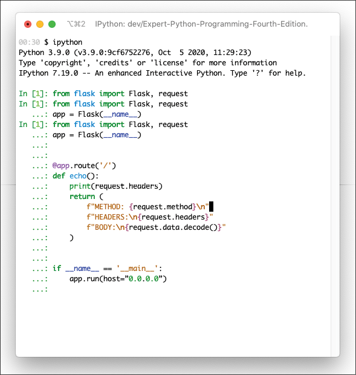

深入了解所选择的编程语言是成为编程专家最重要的部分。尽管如此，如果不了解给定语言社区中常见的最佳工具和实践，就很难有效地开发出好的软件。 Python 没有任何其他语言无法找到的单一功能。因此，在比较语法、表现力或性能时，总会有一个或多个领域更好的解决方案。但是 Python 真正脱颖而出的领域是围绕该语言构建的整个生态系统。 Python 社区多年来一直在完善有助于在更短的时间内创建高质量软件的标准实践和库。

编写新软件始终是一个昂贵且耗时的过程。但是，能够重用现有代码而不是重新发明轮子可以大大减少开发时间和成本。对于一些公司来说，这是他们的项目在经济上可行的唯一原因。这就是为什么生态系统中最重要的部分是解决大量问题的大量可重复使用的包。大量的这些包可以通过 Python 包索引 (PyPI) 作为开源提供。

由于 Python 开源社区的重要性，Python 开发人员投入了大量精力来创建工具和标准以使用其他人创建的 Python 包——从虚拟隔离环境、改进的交互式 shell 和调试器到实用程序帮助你发现、搜索和分析 PyPI 上可用的大量软件包。

在本章中，我们将涵盖以下主题：

- Python 打包生态系统概述
- 隔离运行时环境
- 使用 Python 的 venv
- 系统级环境隔离
- 流行的生产力工具

在我们进入 Python 生态系统的某些特定元素之前，让我们首先考虑技术要求。

## 技术要求

你可以从以下站点安装本章中提到的免费系统虚拟化工具：

- Vagrant: https://www.vagrantup.com
- Docker: https://www.docker.com
- VirtualBox: https://www.virtualbox.org/

以下是本章提到的 Python 包，可以从 PyPI 下载：

- poetry
- flask
- wait-for-it
- watchdog
- ipython
- ipdb

关于如何安装包的信息包含在使用 pip 安装 Python 包部分。

本章的代码文件可以在 https://github.com/PacktPublishing/Expert-Python-Programming-Fourth-Edition/tree/main/Chapter%202 找到。

## Python 的打包生态系统

Python 打包生态系统的核心是 Python Packaging Index。 PyPI 是（大部分）免费使用的 Python 项目的庞大公共存储库，在撰写本文时，它托管着超过 250,000 个包的近 350 万个发行版。这并不是所有包存储库中的最大数量（npm 在 2019 年超过了 100 万个包），但它仍然将 Python 置于打包生态系统的领导者之列。

如此庞大的软件包生态系统并非没有代价。现代应用程序通常使用来自 PyPI 的多个包构建，这些包通常有自己的依赖项。这些依赖项也可以有自己的依赖项。在大型应用程序中，这样的依赖链可以继续下去。再加上一些包可能需要其他包的特定版本，你可能很快就会陷入依赖地狱——在这种情况下，手动解决冲突的版本需求几乎是不可能的。

这就是为什么了解可以帮助你使用 PyPI 上可用包的工具至关重要的原因。

### 使用 pip 安装 Python 包

如今，许多操作系统都以 Python 作为标准组件。大多数 Linux 发行版和类 UNIX 系统（例如 FreeBSD、NetBSD、OpenBSD 和 macOS）都带有 Python，默认情况下安装或通过系统包存储库提供。他们中的许多人甚至将其用作某些核心组件的一部分——Python 为 Ubuntu（Ubiquity）、Red Hat Linux（Anaconda）和 Fedora（又是 Anaconda）的安装程序提供支持。不幸的是，预装操作系统的 Python 版本通常比最新的 Python 版本旧。

由于 Python 作为操作系统组件的流行，许多来自 PyPI 的包也可作为由系统包管理工具管理的本机包提供，例如 apt-get（Debian、Ubuntu）、rpm（Red Hat Linux）或emerge (Gentoo)。然而，应该记住，可用库的列表通常非常有限，与 PyPI 相比，它们大多已经过时。有时，它们可能与特定于平台的补丁一起均匀分布，以确保它们将正确支持其他系统组件。

由于这些事实，在构建自己的应用程序时，你应该始终依赖 PyPI 上可用的包分发。 Python Packaging Authority (PyPA)——一组标准 Python 打包工具的维护者——推荐使用 pip 来安装包。这个命令行工具允许你直接从 PyPI 安装包。虽然它是一个独立的项目，从 CPython 的 2.7.9 和 3.4 版本开始，每个 Python 版本都带有一个 ensurepip 模块。这个简单的实用程序模块可确保在你的环境中安装 pip，无论发布维护者是否决定捆绑 pip。可以使用 ensurepip 模块引导 pip 安装，如下例所示：

```sh
$ python3 -m ensurepip
Looking in links: /var/folders/t6/n6lw_s3j4nsd8qhsl1jhgd4w0000gn/T/tmpouvorgu0
Requirement already satisfied: setuptools in ./.venv/lib/python3.9/site-packages (49.2.1)
Processing /private/var/folders/t6/n6lw_s3j4nsd8qhsl1jhgd4w0000gn/T/tmpouvorgu0/pip-20.2.3-py2.py3-none-any.whl
Installing collected packages: pip
Successfully installed pip-20.2.3
```

当你有 pip 可用时，安装一个新包就像这样简单：

```python
pip install <package-name>
```

所以，如果你想安装一个名为 django 的包，你只需运行：

```sh
pip install django
```

除其他功能外，pip 允许安装特定版本的软件包（使用 pip install \<package-name\>==\<version\>）或升级到可用的最新版本（使用 pip install --upgrade \<package-name\>）。

pip 不仅仅是一个软件包安装程序。 除了 install 命令之外，它还提供了额外的命令，允许你检查包、搜索 PyPI 或构建你自己的包分发。 可以通过 pip --help 获取所有可用命令的列表，如以下命令所示：

```$ pip --help```

它将产生以下输出：

```
Usage:
  pip <command> [options]
Commands:
  install                     Install packages.
  download                    Download packages.
  uninstall                   Uninstall packages.
  freeze                      Output installed packages in requirements format.
  list                        List installed packages.
  show                        Show information about installed packages.
  check                       Verify installed packages have compatible dependencies.
  config                      Manage local and global configuration.
  search                      Search PyPI for packages.
  cache                       Inspect and manage pip's wheel cache.
  wheel                       Build wheels from your requirements.
  hash                        Compute hashes of package archives.
  completion                  A helper command used for command completion.
  debug                       Show information useful for debugging.
  help                        Show help for commands.
(...)
```

有关如何为旧 Python 版本安装 pip 的最新信息，请访问项目的文档页面 https://pip.pypa.io/en/stable/installing/。

## 隔离运行时环境

当你使用 pip 从 PyPI 安装新包时，它将安装到可用的 site-packages 目录之一。 site-packages 目录的确切位置特定于操作系统。 你可以使用 site 模块作为命令来检查 Python 将在其中搜索模块和包的路径，如下所示：

```sh
$ python3 -m site
```

以下是在 macOS 上运行 python3 -m 站点的示例输出：

```python
sys.path = [
    '/Users/swistakm',
    '/Library/Frameworks/Python.framework/Versions/3.9/lib/python39.zip',
    '/Library/Frameworks/Python.framework/Versions/3.9/lib/python3.9',
    '/Library/Frameworks/Python.framework/Versions/3.9/lib/python3.9/lib-dynload',
    '/Users/swistakm/Library/Python/3.9/lib/python/site-packages',
    '/Library/Frameworks/Python.framework/Versions/3.9/lib/python3.9/site-packages',
]
USER_BASE: '/Users/swistakm/Library/Python/3.9' (exists)
USER_SITE: '/Users/swistakm/Library/Python/3.9/lib/python/site-packages' (exists)
ENABLE_USER_SITE: True
```

前面输出中的 sys.path 变量是模块搜索位置的列表。 这些是 Python 将尝试从中加载模块的位置。 第一个条目始终是当前工作目录（在本例中为 /users/swistakm），最后一个条目是全局 site-packages 目录，通常称为 dist-packages 目录。

前面输出中的 USER_SITE 描述了用户 site-packages 目录的位置，该目录始终特定于当前调用 Python 解释器的用户。 安装在本地 site-packages 目录中的包将优先于安装在全局 site-packages 目录中的包。

获取站点包的另一种方法是调用 sys.getsitepackages()。 以下是在交互式 shell 中使用该函数的示例：

```python
>>> import site
>>> site.getsitepackages()
['/Library/Frameworks/Python.framework/Versions/3.9/lib/python3.9/site-packages']
```

你还可以通过调用 sys.getusersitepackages() 函数来获取用户站点包目录，如下所示：

```python
>>> import site
>>> site.getusersitepackages()
/Users/swistakm/Library/Python/3.9/lib/python/site-packages
```

运行 pip install 时，软件包将安装在用户或全局 site-packages 目录中，具体取决于按以下顺序评估的几个条件：

- 如果指定了 --user 开关，则为用户站点包
- global site-packages 如果全局站点包目录对调用 pip 的用户是可写的
- 否则用户站点包

前面的条件只是意味着如果没有 --user 开关，pip 将始终尝试将包安装到全局 site-packages 目录，并且只有在不可能的情况下才回退到用户 site-packages。在默认情况下提供 Python 的大多数操作系统（许多 Linux 发行版、macOS）上，系统的 Python 发行版的全局 site-packages 目录受到保护，不会受到非特权用户的写入。这意味着为了使用系统的 Python 发行版在全局 site-packages 目录中安装软件包，你必须使用授予你超级用户权限的命令，例如 sudo。在类 UNIX 和 Linux 系统上，此类超级用户调用 pip 将如下所示：

```python
$ sudo -H pip install <package-name>
```

> 在 Windows 上不需要安装系统范围的 Python 包的超级用户权限，因为它默认不提供 Python 解释器。此外，对于某些其他操作系统（如 macOS），如果你从 python.org 网站上提供的安装程序安装 Python，它将以全局站点包目录可供普通用户写入的方式安装。

虽然直接从 PyPI 安装包到全局 site-packages 目录是可能的，并且在某些环境中默认会发生，但通常不推荐并且应该避免。请记住，pip 只会在 site-packages 目录中安装单个版本的包。如果旧版本已经可用，新安装将覆盖它。这可能会有问题，尤其是当你计划使用 Python 构建不同的应用程序时。建议不要在全局 site-packages 目录中安装任何东西可能听起来令人困惑，因为这是 pip 的半默认行为，但有一些严重的原因。

正如我们之前提到的，Python 通常是通过操作系统包存储库提供的许多包的重要组成部分，并且可能为许多重要服务提供支持。系统分发维护人员付出了很多努力来选择正确版本的包以匹配各种包依赖项。

通常，可从系统包存储库（如 apt、yum 或 rpm）获得的 Python 包包含自定义补丁或故意保持过时以确保与某些其他系统组件兼容。使用 pip 强制将此类软件包更新为破坏某些向后兼容性的版本可能会导致某些关键系统服务出现错误。

最后但并非最不重要的一点是，如果你同时处理多个项目，你会注意到维护适用于所有项目的单个包版本列表实际上是不可能的。包发展很快，并不是每一个变化都是向后兼容的。你最终会遇到这样一种情况：你的一个新项目迫切需要某个库的最新版本，但另一个项目无法使用它，因为存在一些向后不兼容的更改。如果你将一个包安装到全局站点包中，你将只能使用该包的一个版本。

幸运的是，这个问题有一个简单的解决方案：环境隔离。有多种工具允许在不同的系统抽象级别隔离 Python 运行时环境。主要思想是将项目依赖项与不同项目和/或系统服务所需的包隔离。这种方法的好处如下：

它解决了项目 X 依赖于包 1.x 但项目 Y 需要包 4.x 的困境。开发人员可以处理具有不同依赖项的多个项目，这些项目甚至可能发生冲突，而不会相互影响。
该项目不再受开发人员系统分发存储库（如 apt、yum、rpm 等）中提供的软件包版本的限制。
不存在破坏依赖于某些包版本的其他系统服务的风险，因为新的包版本仅在这样的环境中可用。
可以轻松锁定属于项目依赖项的包列表。锁定通常会捕获所有依赖链中所有包的准确版本，因此很容易在另一台计算机上重现这样的环境。
如果你正在并行处理多个项目，你会很快发现，如果没有某种隔离，就不可能维护它们的依赖项。

让我们在下一节讨论应用程序级隔离和系统级隔离之间的区别。

### 应用级隔离与系统级隔离

最简单、最轻量级的隔离方法是通过虚拟环境使用应用程序级隔离。 Python 有一个内置的 venv 模块，可以极大地简化此类虚拟环境的使用和创建。

虚拟环境侧重于隔离 Python 解释器及其中可用的包。这种环境很容易设置但不可移植，主要是因为它们依赖于绝对系统路径。这意味着它们不能在不破坏事物的情况下轻松地在计算机和操作系统之间复制。它们甚至不能在同一文件系统上的目录之间移动。尽管如此，它们仍然足够健壮，可以确保在小型项目和包的开发过程中进行适当的隔离。由于 Python 发行版中的内置支持，你的同行也可以轻松复制它们。

虚拟环境通常足以编写独立于操作系统的重点库或没有太多外部依赖项的低复杂性项目。此外，如果你编写的软件只能在你自己的计算机上运行，那么虚拟环境应该足以提供足够的隔离性和可再现性。

不幸的是，在某些情况下，这可能不足以确保足够的一致性和可重复性。尽管用 Python 编写的软件通常被认为是非常可移植的，但并非每个包在每个操作系统上的行为都相同。对于依赖第三方共享库（Windows 上的 DLL，Linux 上的 .so，macOS 上的 .dylib）或大量使用用 C 或 C++ 编写的已编译 Python 扩展的包尤其如此，但也可能发生在纯使用特定于给定操作系统的 API 的 Python 库。

在这种情况下，系统级隔离是工作流程的一个很好的补充。这种方法通常尝试使用经典操作系统虚拟化工具（例如，VMware、Parallels 和 VirtualBox）或容器系统（例如，Docker 和火箭）。一些提供这种隔离的可用解决方案将在后面的系统级环境隔离部分详细介绍。

如果你在与执行软件不同的计算机上编写软件，系统级隔离应该是开发环境的首选选项。如果你在远程服务器上运行你的软件，你绝对应该从一开始就考虑系统级隔离，因为它可以避免将来出现可移植性问题。无论你的应用程序是否依赖编译代码（共享库、编译扩展），你都应该这样做。如果你的应用程序大量使用数据库、缓存、搜索引擎等外部服务，那么使用系统级隔离也值得考虑。这是因为许多系统级隔离解决方案也允许你轻松隔离这些依赖项。

由于这两种环境隔离方法在现代 Python 开发中都占有一席之地，我们将详细讨论它们。让我们从更简单的开始——使用 Python 的 venv 模块的虚拟环境。

## 应用级环境隔离

Python 内置支持创建虚拟环境。它以 venv 模块的形式出现，可以直接从你的系统外壳调用。要创建新的虚拟环境，只需使用以下命令：

```sh
$ python3.9 -m venv <env-name>
```

此处，env-name 应替换为新环境所需的名称（也可以是绝对路径）。请注意我们如何使用 python3.9 命令而不是普通的 python3。这是因为根据环境的不同，python3 可能会链接到不同的解释器版本，并且在创建新的虚拟环境时，最好非常明确地说明 Python 版本。 python3.9 -m venv 命令将在当前工作目录路径中创建一个新的 env-name 目录。在里面，它将包含几个子目录：

- bin/：这是存储新的 Python 可执行文件和其他包提供的脚本/可执行文件的地方。

    > Windows 用户注意事项
    > Windows 下的 venv 模块对其内部目录结构使用不同的命名约定。你需要使用 Scripts/、Libs/ 和 Include/，而不是 bin/、lib/ 和 include/，以匹配该操作系统上常用的开发约定。用于激活/停用环境的命令也不同；你需要使用 ENV-NAME/Scripts/activate.bat 和 ENV-NAME/Scripts/deactivate.bat 而不是在激活和停用脚本上使用源。

- lib/ 和 include/：这些目录包含虚拟环境中新 Python 解释器的支持库文件。新软件包将安装在 ENV-NAME/lib/pythonX.Y/site-packages/ 中。

    > 许多开发人员将他们的虚拟环境与源代码放在一起，并选择一个通用的路径名，如 .venv 或 venv。许多 Python 集成开发环境 (IDE) 能够识别该约定并自动加载库以进行语法补全。通用名称还允许你从代码版本控制中自动排除虚拟环境目录，这通常是一个好主意。例如，Git 用户可以将此路径名添加到他们的全局 .gitgnore 文件中，该文件列出了在对源代码进行版本控制时应忽略的路径模式。

创建新环境后，需要在当前 shell 会话中激活它。如果你使用 Bash 作为 shell，你可以使用 source 命令激活虚拟环境：

```sh
$ source env-name/bin/activate
```

还有一个较短的版本，它应该可以在任何 POSIX 兼容系统下运行，而不管 shell 是什么：

```
$ . env-name/bin/activate
```

这通过影响其环境变量来更改当前 shell 会话的状态。 为了让用户知道他们已经激活了虚拟环境，它将通过在开头附加 (ENV-NAME) 字符串来更改 shell 提示。 为了说明这一点，下面是一个创建新环境并激活它的示例会话：

```sh
$ python3 -m venv example
$ source example/bin/activate
(example) $ which python
/home/swistakm/example/bin/python 
(example) $ deactivate
$ which python
/usr/local/bin/python
```

关于 venv 需要注意的重要一点是，它不提供任何额外的功能来跟踪应该安装哪些软件包。 虚拟环境也不是可移植的，不应移动到另一个系统/机器，甚至是不同的文件系统路径。 这意味着每次要在新主机上安装应用程序时都需要创建一个新的虚拟环境。

因此，pip 用户使用最佳实践将所有项目依赖项的定义存储在一个位置。 最简单的方法是创建一个requirements.txt 文件（这是命名约定），其内容如以下代码所示：

```python
# lines followed by hash (#) are treated as a comment.
 
# pinned version specifiers are best for reproducibility 
eventlet==0.17.4 
graceful==0.1.1 
 
# for projects that are well tested with different 
# dependency versions the version ranges are acceptable
falcon>=0.3.0,<0.5.0 
 
# packages without versions should be avoided unless 
# latest release is always required/desired 
pytz
```

有了这样的文件，所有依赖项都可以轻松地在一个步骤中安装。 pip install 命令了解此类需求文件的格式。 你可以使用 -r 标志指定需求文件的路径，如下例所示：

```python
$ pip install -r requirements.txt
```

请记住，需求文件仅指定要安装的包，而不指定当前环境中的包。如果你在环境中手动安装某些东西，它不会自动反映在你的需求文件中。因此，需要非常小心地使你的需求文件保持最新，尤其是对于大型和复杂的项目。

有 pip freeze 命令，它会打印当前环境中的所有包及其版本，但应谨慎使用。这个列表也会包括你的依赖的依赖，所以对于大型项目，它会很快变得非常大。你必须仔细检查列表中是否包含意外或错误安装的任何内容。

对于需要更好地再现虚拟环境和严格控制已安装依赖项的项目，你可能需要更复杂的工具。我们将在下一节中讨论这样一种工具——Poetry。

### Poetry作为依赖管理系统

Poetry 是一种非常新颖的 Python 依赖项和虚拟环境管理方法。它是一个开源项目，旨在为使用 Python 打包生态系统提供更可预测和更方便的环境。

由于 Poetry 是 PyPI 上的一个包，你可以使用 pip 安装它：

```python
$ pip install --user poetry
```

请注意，Poetry 负责创建 Python 虚拟环境，因此不应将其安装在虚拟环境本身中。 你可以将它安装在用户站点包或全局站点包中，尽管用户站点包是推荐选项（请参阅隔离运行时环境部分）。

正如在使用 pip 安装 Python 包部分中强调的那样，上面的命令将在你的 site-packages 目录中安装poetry包。 根据你的系统配置，它将是全局站点包目录或用户站点包目录。 为避免这种歧义，Poetry 项目创建者建议使用替代引导方法。

在 macOS、Linux 和其他 POSIX 兼容系统上，可以使用 curl 实用程序安装 Poetry：

```python
$ curl -sSL https://raw.githubusercontent.com/python-poetry/poetry/master/get-poetry.py | python
```

在 Windows 上，它可以使用 PowerShell 安装：

```sh
> (Invoke-WebRequest -Uri https://raw.githubusercontent.com/python-poetry/poetry/master/get-poetry.py -UseBasicParsing).Content | python -
```

安装后，Poetry 可用于：

- 与虚拟环境一起创建新的 Python 项目
- 使用虚拟环境初始化现有项目
- 管理项目依赖
- 包库

要使用 Poetry 创建一个全新的项目，你可以使用如以下示例中的poetry new 命令：

```sh
$ poetry new my-project
```

上面的命令将创建一个新的 my-project 目录，其中包含一些初始文件。 该目录的结构大致如下：

```
my-project/
├── README.rst
├── my_project
│   └── __init__.py
├── pyproject.toml
└── tests
    ├── __init__.py
    └── test_my_project.py
```

如你所见，它创建了一些可用作存根以进行进一步开发的文件。 如果你有一个预先存在的项目，你可以使用项目目录中的poetry init 命令在其中初始化 Poetry。 不同之处在于它不会创建任何新的项目文件，除了 pyproject.toml 配置文件。

Poetry 的核心是 pyproject.toml 文件，该文件存储了项目配置。 对于 my-project 示例，它可能包含以下内容：

```toml
[tool.poetry]
name = "my-project"
version = "0.1.0"
description = ""
authors = ["Michał Jaworski <swistakm@gmail.com>"]
[tool.poetry.dependencies]
python = "^3.9"
[tool.poetry.dev-dependencies]
pytest = "^5.2"
[build-system]
requires = ["poetry-core>=1.0.0"]
build-backend = "poetry.core.masonry.api"
```

如你所见，pyproject.toml 文件分为四个部分：

- [tool.poetry]：这是一组基本的项目元数据，如名称、版本描述和作者。如果你想在 PyPI 上将项目作为包发布，则此信息是必需的。
- [tool.poetry.dependencies]：这是一个项目依赖列表。在新项目中，它仅列出 Python 版本，但也可以包括通常在 requirements.txt 文件中描述的所有包版本。
- [tool.poetry.dev-dependencies]：这是需要本地开发的依赖项列表，例如测试框架或生产力工具。通常的做法是单独列出此类依赖项，因为在生产环境中通常不需要它们。
- [build-system]：将 Poetry 描述为用于管理项目的构建系统。

pyproject.toml 文件是 PEP 518 文档中描述的官方 Python 标准的一部分。你可以在 https://www.python.org/dev/peps/pep-0518/ 阅读有关其结构的更多信息。

如果你使用 Poetry 创建一个新项目或初始化一个现有项目，它将能够在你需要时在共享位置创建一个新的虚拟环境。你可以使用 Poetry 而不是“采购”激活脚本来激活它。这比使用普通的 venv 模块更方便，因为你不需要记住实际虚拟环境的存储位置。你唯一需要做的就是将你的 shell 移动到你的项目源代码树中的任何位置，并使用如以下示例所示的Poetry shell 命令：

```sh
$ cd my-project
$ poetry shell
```

从这一刻起，当前的 shell 将激活 Poetry 的虚拟环境。你可以使用 which python 或 python -m site 命令来验证它。

Poetry 改变的另一件事是你管理依赖项的方式。正如我们已经提到的，requirements.txt 文件是管理依赖项的一种非常基本的方式。它们描述了要安装的包，但不会自动跟踪通过开发在环境中安装的包。如果你使用 pip 安装了某些东西，但忘记在 requirements.txt 文件中反映该更改，则其他程序员可能会在重新创建你的环境时遇到问题。

有了 Poetry，这个问题就迎刃而解了。只有一种方法可以向你的项目添加依赖项，那就是使用poetry add \<package-name\> 命令。它会：

- 如果其他包共享依赖关系，则解析整个依赖关系树
- 在与你的项目关联的虚拟环境中安装依赖树中的所有包
- 反映 pyproject.toml 文件中的变化

以下文字记录展示了在 my-project 环境中安装 Flask 框架的过程：

```sh
$ poetry add flask
```

这将产生如下输出：

```
Using version ^1.1.2 for Flask
Updating dependencies
Resolving dependencies... (38.9s)
Writing lock file
Package operations: 15 installs, 0 updates, 0 removals
  • Installing markupsafe (1.1.1)
  • Installing pyparsing (2.4.7)
  • Installing six (1.15.0)
  • Installing attrs (20.3.0)
  • Installing click (7.1.2)
  • Installing itsdangerous (1.1.0)
  • Installing jinja2 (2.11.2)
  • Installing more-itertools (8.6.0)
  • Installing packaging (20.4)
  • Installing pluggy (0.13.1)
  • Installing py (1.9.0)
  • Installing wcwidth (0.2.5)
  • Installing werkzeug (1.0.1)
  • Installing flask (1.1.2)
  • Installing pytest (5.4.3)
```

以下是生成的 pyproject.toml 文件，其中突出显示了对项目依赖项的更改：

```toml
[tool.poetry]
name = "my-project"
version = "0.1.0"
description = ""
authors = ["Michał Jaworski <swistakm@gmail.com>"]
[tool.poetry.dependencies]
python = "^3.9"
Flask = "^1.1.2"
[tool.poetry.dev-dependencies]
pytest = "^5.2"
[build-system]
requires = ["poetry-core>=1.0.0"]
```

前面的记录显示，当我们只要求一个依赖项时，Poetry 已经安装了 15 个包。那是因为 Flask 有自己的依赖项，而这些依赖项也有自己的依赖项。这种依赖的依赖称为传递依赖。库通常有松散的版本说明符，例如 6 个 >=1.0.0 来表示它们能够接受广泛的版本。 Poetry 实现了一种依赖解析算法，以找出哪些版本集可以满足所有依赖传递依赖约束。

传递依赖的问题在于它们随时间变化的能力。请记住，库的依赖项可能具有宽松的版本说明符。因此，在不同日期创建的两个环境可能会安装不同的最终版本的软件包。对于大型项目来说，无法重现所有可传递依赖项的精确版本可能是一个大问题，并且在 requirements.txt 文件中手动跟踪它们通常是一个很大的挑战。

Poetry 通过使用所谓的依赖锁文件解决了传递依赖的问题。每当你确定你的环境具有一组有效且经过测试的软件包版本时，你可以发出以下命令：

```
$ poetry lock
```

这将创建一个非常冗长的poetry.lock 文件，它是依赖项解析过程的完整快照。然后该文件将用于确定传递依赖的版本，而不是普通的依赖过程。

每当使用poetry添加命令添加新包时，poetry都会评估依赖关系树并更新 poetry.lock 文件。到目前为止，锁定文件方法是处理项目中传递依赖项的最佳和最可靠的方法。

> 你可以在 https://python-poetry.org 下的官方文档中找到有关 Poetry 高级用法的更多信息。

## 系统级环境隔离

软件实现快速迭代的关键推动因素是现有软件组件的重用。不要重复自己——这是许多程序员的共同口头禅。使用其他包和模块将它们包含在代码库中只是这种心态的一部分。也可以被视为重用组件的是二进制库、数据库、系统服务、第三方 API 等。甚至整个操作系统也应该被视为一个正在重用的组件。

基于 Web 的应用程序的后端服务是此类应用程序复杂程度的一个很好的例子。最简单的软件栈通常由几层组成。考虑一些虚构的应用程序，它允许你存储其用户的一些信息并通过 HTTP 协议将其公开给 Internet。它至少可以有以下三层（从最低层开始）：

- 数据库或其他类型的存储引擎
- 在 Python 中实现的应用程序代码
- 工作在反向代理模式的 HTTP 服务器，例如 Apache 或 NGINX

尽管非常简单的应用程序可以是单层的，但对于复杂的应用程序或旨在处理非常大的流量的应用程序，这种情况很少发生。事实上，大型应用程序有时非常复杂，以至于它们不能被表示为一堆层，而是被表示为互连服务的拼凑或网格。大小应用程序都可以使用许多不同的数据库，分为多个独立的进程，并使用许多其他系统服务进行缓存、排队、日志记录、服务发现等。可悲的是，这种复杂性没有限制。

真正重要的是，并非所有软件堆栈元素都可以在 Python 运行时环境级别上进行隔离。无论是 HTTP 服务器，如 NGINX，还是 RDBMS，如 PostgreSQL，或共享库，这些元素通常不属于 Python 发行版或 Python 包生态系统的一部分，无法封装在 Python 的虚拟环境中.这就是为什么它们被视为你的软件的外部依赖项的原因。

非常重要的是，外部依赖项通常在不同操作系统上的不同版本和风格中可用。例如，如果两个开发人员使用完全不同的 Linux 发行版，比如说 Debian 和 Gentoo，那么他们在任何时候都不太可能通过他们系统的软件包存储库访问相同版本的软件，如 NGINX。此外，它们可以使用不同的编译时标志（例如，启用特定设置）进行编译，或者提供自定义扩展或特定于发行版的补丁。

因此，如果没有合适的工具，确保开发团队中的每个人都使用每个组件的相同版本是非常困难的。从理论上讲，一个团队中的所有开发人员都可以在他们的开发设备上获得相同版本的服务。但是，如果他们不使用与生产环境中相同的操作系统，那么所有这些努力都是徒劳的。强迫程序员从事其他工作而不是他们心爱的选择系统也不总是可行的。

> 生产环境 是你的应用程序安装和运行以达到其目的的实际环境。例如，桌面应用程序的生产环境将是你的用户安装其应用程序的实际桌面计算机。通过互联网可用的 Web 应用程序的后端服务器的生产环境通常是在某种数据中心运行的远程服务器（有时是虚拟的）。

问题在于便携性仍然是一个很大的挑战。并非所有服务在生产环境中的工作方式都与它们在开发人员的机器上的工作方式完全相同。这不太可能改变。甚至 Python 在不同系统上的行为也可能不同，尽管为使其跨平台投入了大量工作。通常，对于 Python，这是有据可查的，并且只发生在直接与操作系统交互的地方。尽管如此，依靠程序员记住一长串兼容性怪癖的能力是一种非常容易出错的策略。

此问题的流行解决方案是将整个系统隔离为应用程序环境。这通常是通过利用不同类型的系统虚拟化工具来实现的。当然，虚拟化可能会对性能产生影响；但是使用具有虚拟化硬件支持的现代 CPU，性能损失大大减少。另一方面，可能的收益清单很长：

- 开发环境可以与生产中使用的系统版本、服务和共享库完全匹配，有助于解决兼容性问题。
- 系统配置工具的定义，例如 Puppet、Chef 或 Ansible（如果使用），可以重复用于配置生产和开发环境。
- 如果此类环境的创建是自动化的，则新聘用的团队成员可以轻松加入项目。
- 开发人员可以直接使用低级系统功能，这些功能在他们用于工作的操作系统上可能不可用。例如，用户空间中的文件系统 (FUSE) 是 Linux 操作系统的一项功能，如果没有虚拟化，你将无法在 Windows 上使用。

在下一节中，我们将研究实现开发环境的系统级隔离的两种不同方法。

### 容器化与虚拟化

系统级隔离技术可用于开发目的的主要方式有两种：

- 机器虚拟化，模拟整个计算机系统
- 操作系统级虚拟化，也称为容器化，它在单个操作系统中隔离完整的用户空间

机器虚拟化技术专注于在其他计算机系统中模拟整个计算机系统。可以将其视为提供可以作为软件在你自己的计算机上运行的虚拟硬件。由于这是完整的硬件仿真，因此你可以在主机环境中运行任何操作系统。这是驱动虚拟专用服务器 (VPS) 和云计算提供商的基础架构的技术，因为它允许你在单个主机内运行多个独立和隔离的操作系统。

这也是出于开发目的运行许多操作系统的便捷方法，因为启动新操作系统不需要重新启动计算机。你还可以在不需要时轻松处理虚拟机。这是典型的多引导系统安装无法轻松完成的事情。

另一方面，操作系统级虚拟化不依赖于模拟硬件。它以容器的形式封装了用户空间环境（共享库、资源约束、文件系统卷、代码等），不能在严格定义的容器环境之外运行。所有容器都运行在相同的操作系统内核上，但除非你明确允许，否则不能相互干扰。

操作系统级虚拟化不需要硬件仿真。尽管如此，它仍然可以对系统资源的使用设置特定的限制，例如存储空间、CPU 时间、RAM 或网络。这些约束仅由系统内核管理，因此性能开销通常小于机器虚拟化。这就是为什么操作系统级虚拟化通常被称为轻量级虚拟化。

通常，容器仅包含应用程序代码及其系统级依赖项，主要是共享库或运行时二进制文件（如 Python 解释器），但可以根据需要大小。 Linux 容器的映像通常基于整个系统发行版，例如 Debian、Ubuntu 或 Fedora。从运行在容器内的进程的角度来看，它看起来像是一个完全隔离的系统环境。

当涉及用于开发目的的系统级隔离时，这两种方法都提供了类似的足够级别的隔离和可再现性。然而，由于其更轻量级的特性，操作系统级虚拟化似乎更受开发人员的青睐，因为它允许更便宜、更快、更精简地使用此类环境，以及方便的打包和便携性。这对于并行处理多个项目或需要与其他程序员共享环境的程序员特别有用。

有两种领先的工具可用于提供开发环境的系统级隔离：

- 用于操作系统级虚拟化的 Docker
- 用于机器虚拟化的 Vagrant

Docker 和 Vagrant 似乎在功能上有重叠。它们之间的主要区别在于它们被建造的原因。 Vagrant 主要是作为开发工具构建的。它允许你使用单个命令引导整个虚拟机，但很少用于将这样的环境简单地打包为一个完整的工件，可以轻松地交付到生产环境并按原样执行。另一方面，Docker 正是为此目的而构建的——准备可以作为完整包发送和部署到生产的完整容器。如果实施得好，这可以大大改善产品部署的过程。

由于一些实现上的细微差别，基于容器的环境有时可能与基于虚拟机的环境表现不同。它们也不打包操作系统内核，因此对于高度特定于操作系统的代码，它们在每个主机上的行为可能并不总是相同。此外，如果你决定使用容器进行开发，但不决定在目标生产环境中使用它们，你将失去一些作为环境隔离主要原因的一致性保证。

但是，如果你已经在目标生产环境中使用容器，那么你应该始终使用相同的技术在开发阶段复制生产条件。幸运的是，目前最流行的容器解决方案 Docker 提供了一个了不起的 docker-compose 工具，使本地容器化环境的管理变得非常容易。

容器是完整机器虚拟化的绝佳替代方案。它是一种轻量级的虚拟化方法，其中内核和操作系统允许运行多个隔离的用户空间实例。如果你的操作系统本身支持容器，则这种虚拟化方法所需的开销比全机虚拟化要少。

### 使用 Docker 的虚拟环境

软件容器的流行主要归功于 Docker，它是 Linux 操作系统的可用实现之一。

Docker 允许你以称为 Dockerfile 的简单文本文档的形式描述容器的图像。可以在图像存储库中构建和存储来自此类定义的图像。图像存储库允许多个程序员重用现有图像，而无需自己构建它们。 Docker 还支持增量更改，因此如果向容器添加新内容，则无需从头开始重新创建。

Docker 是 Linux 操作系统的操作系统虚拟化方法，因此 Windows 和 macOS 的内核不支持它。尽管如此，这并不意味着你不能在 Windows 或 macOS 上使用 Docker。在这些操作系统上，Docker 成为机器虚拟化和操作系统级虚拟化之间的混合体。在这两个系统上安装 Docker 将创建一个带有 Linux 操作系统的中间虚拟机，它将充当你的容器的主机。 Docker 守护进程和命令行实用程序将负责在你自己的操作系统和在该虚拟机上运行的容器之间无缝代理任何流量和图像。

> 你可以在 https://www.docker.com/get-started 上找到 Docker 安装说明。

中间虚拟机的存在意味着 Windows 或 macOS 上的 Docker 不如 Linux 上的轻量级。尽管如此，性能开销不应明显高于其他严格基于机器虚拟化的开发环境的性能开销。

#### 编写你的第一个 Dockerfile
每个基于 Docker 的环境都从一个 Dockerfile 开始。 Dockerfile 是对如何创建 Docker 镜像的描述。你可以以类似于考虑虚拟机映像的方式来考虑 Docker 映像。它是一个单一文件（由许多层组成），封装了执行应用程序所需的所有系统库、文件、源代码和其他依赖项。

Dockerfile 中的每一层 Docker 镜像都通过以下格式的单个指令进行描述：

```INSTRUCTION arguments```
Docker 支持大量指令，但为了开始使用，你需要了解的最基本的指令如下：

- FROM \<image-name>：这描述了你的图像将基于的基本图像。它们通常基于常见的 Linux 系统发行版，并且通常会安装额外的库和软件。默认的 Docker 镜像存储库称为 Docker Hub。可以在 https://hub.docker.com/ 上免费访问和浏览。
- COPY \<src>... <dst>：这会从本地构建上下文（通常是项目文件）复制文件并将它们添加到容器的文件系统中。
- ADD \<src>... <dst>：这与 COPY 的工作方式类似，但会自动解压缩档案并允许 <src> 成为 URL。
- RUN \<command>：这会在前一层之上运行指定的命令。执行后，它将此命令对文件系统所做的更改作为新的图像层提交。
- ENTRYPOINT ["\<executable>", "<param>", ...]：这将配置默认命令在容器启动时运行。如果在镜像层的任何地方都没有指定入口点，则 Docker 默认为 /bin/sh -c，这是给定镜像的默认 shell（通常是 Bash，但也可以是另一个 shell）。
- CMD ["\<param>", ...]：指定图像入口点的默认参数。知道 Docker 的默认入口点是 /bin/sh -c，该指令也可以采用 CMD ["\<executable>", "<param>", ...] 的形式。建议直接在 ENTRYPOINT 指令中定义目标可执行文件，并仅将 CMD 用于默认参数。
- WORKDIR \<dir>：这会为以下任何 RUN、CMD、ENTRYPOINT、COPY 和 ADD 指令设置当前工作目录。

为了正确说明 Dockerfile 的典型结构，我们将尝试 dockerize 一个简单的 Python 应用程序。假设我们要创建一个 HTTP 回显 Web 服务器，该服务器用它收到的 HTTP 请求的详细信息进行回复。我们将使用 Flask，这是一个非常流行的 Python 网络微框架。

> Flask 不是 Python 标准库的一部分。 你可以使用 pip 将其安装在你的环境中，如下所示：
>
> ```sh
> $ pip install flask
> ```
>
> 你可以在 https://flask.palletsprojects.com/ 上找到有关 Flask 框架的更多信息。

我们应用程序的代码将保存在 Python 脚本 echo.py 中，如下所示：

```python
from flask import Flask, request
app = Flask(__name__)
@app.route('/')
def echo():
    return (
        f"METHOD: {request.method}\n"
        f"HEADERS:\n{request.headers}"
        f"BODY:\n{request.data.decode()}"
    )
if __name__ == '__main__':
    app.run(host="0.0.0.0")
```

我们的脚本从 Flask 类和请求对象的导入开始。 Flask 类的实例代表我们的 Web 应用程序。 request 对象是一个特殊的全局对象，它始终代表当前处理的 HTTP 请求的上下文。

echo() 是一个所谓的视图函数，它负责处理传入的请求。 @app.route('/') 在 / 路径下注册 echo() 视图函数。这意味着只有匹配 / 路径的请求才会被分派到这个视图函数。在我们的视图中，我们读取传入的请求详细信息（方法、标题和正文）并以文本形式返回它们。 Flask 将在请求响应正文中包含该文本输出。

我们的脚本以调用 app.run() 方法结束。它启动我们应用程序的本地开发服务器。这个开发服务器不是为生产环境使用而设计的，但是对于开发来说已经足够了，并且大大简化了我们的例子。

如果你安装了 Flask 包，你可以使用以下命令运行你的应用程序：

```sh
$ python3 echo.py
```

上述命令将在端口 5000 上启动 Flask 开发服务器。你可以在浏览器中访问 http://localhost:5000 地址或使用命令行实用程序。

以下是使用 curl 调用 GET 请求的示例：

```
$ curl localhost:5000
METHOD: GET
HEADERS:
Host: localhost:5000
User-Agent: curl/7.64.1
Accept: */*
BODY:
```

当我们确认我们的应用程序返回了它收到的请求的 HTTP 详细信息时，我们几乎准备好对其进行 dockerize。 我们的项目文件的结构可能如下：

```
.
├── Dockerfile
├── echo.py
└── requirements.txt
```

requirements.txt 文件将只包含一个条目，flask==1.1.2，以确保我们的图像将始终使用相同版本的 Flask。 在我们跳转到 Dockerfile 之前，让我们决定我们希望我们的图像如何工作。 我们想要实现的目标如下：

对用户隐藏一些复杂性——尤其是我们使用 Python 和 Flask 的事实
打包 Python 3.9 可执行文件及其所有依赖项
打包requirements.txt文件中定义的所有项目依赖
了解了上述要求，我们准备编写我们的第一个 Dockerfile。 它将采用以下形式：

```dockerfile
FROM python:3.9-slim
WORKDIR /app/
COPY requirements.txt .
RUN pip install -r requirements.txt
COPY echo.py .
ENTRYPOINT ["python", "echo.py"]
```

FROM python:3.9-slim 定义了我们自定义容器镜像的基础镜像。 Python 在 Docker Hub 上有一系列官方镜像，python:3.9-slim 就是其中之一。 3.9-slim 是包含 Python 3.9 的镜像的标签，其中只包含运行 Python 所需的最少系统包。 它通常是基于 Python 的应用程序图像的明智起点。

在下一节中，我们将学习如何从上述 Dockerfile 构建 Docker 镜像以及如何运行我们的容器。

#### 运行容器

在启动容器之前，你首先需要构建在 Dockerfile 中定义的镜像。 你可以使用以下命令构建镜像：

```sh
$ docker build -t <name> <path>
```

-t \<name> 参数允许我们使用可读标识符命名镜像。 它是完全可选的，但没有它，你将无法轻松引用新创建的镜像。 \<path> 参数指定 Dockerfile 所在目录的路径。 假设我们已经从上一节中介绍的项目的根目录运行命令。 我们还想用名称 echo 标记我们的镜像。 docker build 命令调用如下：

```sh
$ docker build -t echo .
```

它的输出可能如下：

```
Sending build context to Docker daemon   16.8MB
Step 1/6 : FROM python:3.9-slim
3.9-slim: Pulling from library/python
bb79b6b2107f: Pull complete
35e30c3f3e2b: Pull complete
b13c2c0e2577: Pull complete
263be93302fa: Pull complete
30e7021a7001: Pull complete
Digest: sha256:c13fda093489a1b699ee84240df4f5d0880112b9e09ac21c5d6875003d1aa927
Status: Downloaded newer image for python:3.9-slim
 ---> a90139e6bc2f
Step 2/6 : WORKDIR /app/
 ---> Running in fd85d9ac44a6
Removing intermediate container fd85d9ac44a6
 ---> b781318cdec7
Step 3/6 : COPY requirements.txt .
 ---> 6d56980fedf6
Step 4/6 : RUN pip install -r requirements.txt
 ---> Running in 5cd9b86ac454
(...)
Successfully installed Jinja2-2.11.2 MarkupSafe-1.1.1 Werkzeug-1.0.1 click-7.1.2 flask-1.1.2 itsdangerous-1.1.0
Removing intermediate container 5cd9b86ac454
 ---> 0fbf85e8f6da
Step 5/6 : COPY echo.py .
 ---> a546d22e8c98
Step 6/6 : ENTRYPOINT ["python", "echo.py"]
 ---> Running in 0b4e57680ac4
Removing intermediate container 0b4e57680ac4
 ---> 0549d15959ef
Successfully built 0549d15959ef
Successfully tagged echo:latest
```

创建后，你可以使用 docker images 命令检查可用镜像列表：

```sh
$ docker images
REPOSITORY      TAG       IMAGE ID         CREATED              SIZE
echo            latest    0549d15959ef     About a minute ago   126MB
python          3.9-slim  a90139e6bc2f     10 days ago          115MB
```

> 容器镜像的惊人大小
>
> 我们的镜像大小为 126 MB，因为它实际上捕获了运行 Python 应用程序所需的整个 Linux 系统发行版。这听起来可能很多，但实际上并没有什么可担心的。为简洁起见，我们使用了一个易于使用的基础镜像。还有其他专门制作的镜像以最小化这个大小，但这些通常专供更有经验的 Docker 用户使用。此外，由于 Docker 镜像的分层结构，如果你使用多个容器，则可以缓存和重用基础层，因此最终的空间开销很少成为问题。在前面的示例中，用于两个镜像的总存储大小仅为 126 MB，因为 echo:latest 图像仅在 python:3.9-slim 图像之上增加了 11 MB。

构建并标记镜像后，你可以使用 docker run 命令运行容器。我们的容器是 Web 服务的一个示例，因此我们必须另外告诉 Docker 我们希望通过在本地绑定它们来发布容器的端口：

```docker run -it --rm --publish 5000:5000 echo```

以下是对上述命令的具体参数的解释：

- -it：这实际上是两个串联选项：-i 和 -t。 -i（用于交互）保持 STDIN 打开，即使容器进程分离，并且 -t（用于 tty）为容器分配伪 TTY。 TTY 代表电传打字机，在 Linux 和类 UNIX 操作系统上代表连接到程序标准输入和输出的终端。简而言之，多亏了这两个选项，我们将能够从我们的应用程序中看到实时日志，并确保键盘中断会导致进程退出。它的行为方式与我们直接从命令行启动 Python 的方式相同。
- --rm：告诉 Docker 在退出时自动删除容器。如果没有此选项，将保留容器，以便你可以重新附加到它以诊断其状态。默认情况下，Docker 不会删除容器只是为了使调试更容易。它们可以快速堆积在你的磁盘上，因此良好的做法是默认使用 --rm，除非你确实需要保留退出的容器以供以后查看。
- --publish 5000:5000：告诉 Docker 通过在主机接口上绑定端口 5000 来发布容器的端口 5000。你还可以使用此选项重新映射应用程序端口。例如，如果你想在本地公开端口 8080 上的 echo 应用程序，你可以使用 --publish 8080:5000 参数。

使用 docker 命令构建和运行你自己的镜像非常简单明了，但一段时间后可能会变得很麻烦。它需要使用相当长的命令调用并记住很多自定义标识符。对于更复杂的环境，这可能非常不方便。在下一节中，我们将看到如何使用 Docker Compose 实用程序简化 Docker 工作流程。

#### 设置复杂的环境
虽然 Docker 的基本用法对于基本设置来说非常简单，但一旦你开始在多个项目中使用它，它可能会有点不知所措。很容易忘记特定的命令行选项，或者应该在哪些图像上发布哪些端口。

但是，当你拥有一项需要与其他服务进行通信时，事情就会变得非常复杂。一个 Docker 容器应该只包含一个正在运行的进程。

这意味着你真的不应该在容器镜像中加入任何额外的进程监督工具，比如 Supervisor 和 Circus，而是设置多个相互通信的容器。每个服务可能使用完全不同的映像，提供不同的配置选项，并公开可能重叠或可能不重叠的端口。如果要运行多个不同的进程，每个进程应该是一个单独的容器。

容器的大型生产部署使用专用容器编排系统（如 Kubernetes、Nomad 或 Docker Swarm）来跟踪所有容器及其执行细节，如镜像、端口、卷、端口、配置等。你可以在本地使用其中一种工具，但这对于开发目的来说太过分了。

你可以在计算机上使用且适用于简单和复杂场景的最佳容器开发工具是 Docker Compose。 Docker Compose 通常与 Docker 一起分发，但在某些 Linux 发行版（例如 Ubuntu）中，它可能默认不可用。在这种情况下，它必须作为独立于系统软件包存储库的软件包安装。 Docker Compose 提供了一个名为 docker-compose 的强大命令行实用程序，并允许你使用 YAML 语法描述多容器应用程序。

Compose 期望特别命名的 docker-compose.yml 文件位于你的项目根目录中。我们之前项目的此类文件的示例如下：

```yaml
version: '3.8'
services:
  echo-server:
    # this tell Docker Compose to build image from
    # local (.) directory
    build: .
    # this is equivalent to "-p" option of
    # the "docker run" command
    ports:
    - "5000:5000"
    # this is equivalent to "-t" option of
    # the "docker run" command
    tty: true
```

如果你在项目中创建了这样的 docker-compose.yml 文件，那么你的整个应用程序环境可以通过两个简单的命令启动和停止：

- docker-compose up：这会启动 docker-compose.yml 文件中定义的所有容器并主动打印它们的标准输出
- docker-compose down：这会停止当前项目目录中由 docker-compose 启动的所有容器

如果你的镜像尚未构建，Docker Compose 将自动构建它。这是在配置文件中编码开发环境的好方法。如果你和其他程序员一起工作，你可以为你的项目提供一个 docker-compose.yml 文件。这样，设置一个完全工作的本地开发环境将是一个 docker-compose up 命令的问题。如果你使用代码版本控制工具，docker-compose.yml 文件绝对应该与你的其余代码一起进行版本控制。

此外，如果你的应用程序需要额外的外部服务，你可以轻松地将它们添加到你的 Docker Compose 环境中，而不是将它们安装在你的主机系统上。考虑以下使用官方 Docker Hub 映像添加 PostgreSQL 数据库和 Redis 内存存储实例的示例：

```yaml
version: '3.8'
services:
  echo-server:
    build: .
    ports:
    - "5000:5000"
    tty: true
  database:
    image: postgres
  cache:
    image: redis
```

Docker Hub 是 Docker 镜像的官方存储库。许多开源开发人员在那里托管他们的官方项目镜像。你可以在 https://hub.docker.com 上找到有关 Docker Hub 的更多信息。

它是如此简单。为了确保更好的重现性，你应该始终指定外部镜像的版本标签（如 postgres:13.1 和 redis:6.0.9）。这样，你将确保使用 docker-compose.yml 文件的每个人都将使用完全相同版本的外部服务。感谢 Docker Compose，你可以同时使用同一服务的多个版本而不会受到任何干扰。这是因为默认情况下，不同的 Docker Compose 环境在网络级别是隔离的。

#### 适用于 Python 的有用 Docker 和 Docker Compose 食谱

Docker 和容器一般是一个如此庞大的主题，以致于在本书的一小部分中不可能涵盖它们。多亏了 Docker Compose，在不了解 Docker 内部工作原理的情况下开始使用 Docker 真的很容易。如果你是 Docker 的新手，你最终将不得不放慢速度，阅读 Docker 文档并通读一遍。

> 官方 Docker 文档可以在 https://docs.docker.com/ 找到。

以下是一些快速提示和食谱，可让你推迟那个时刻并解决你迟早可能需要处理的大多数常见问题。

**减少容器的大小**

Docker 新用户的一个常见问题是他们的容器镜像的大小。与普通的 Python 包相比，容器确实提供了大量的空间开销，但如果我们将其与虚拟机的图像大小进行比较，通常就不算什么。但是，在单个虚拟机上托管多个服务仍然很常见，但是使用基于容器的方法，你绝对应该为每个服务拥有一个单独的镜像。这意味着对于大量服务，开销可能会变得很明显。

如果要限制镜像的大小，可以使用两种互补技术：

- 使用专门为此目的设计的基础镜像：Alpine Linux 是一个紧凑型 Linux 发行版的示例，专门为提供非常小且轻量级的 Docker 镜像而量身定制。基本映像大小约为 5 MB，并提供了一个优雅的包管理器，可让你保持映像紧凑。
- 考虑 Docker 覆盖文件系统的特性：Docker 镜像由层组成，其中每一层封装了根文件系统自身与前一层之间的差异。一旦层被提交，镜像的大小就不能减小。这意味着，如果你需要一个系统包作为构建依赖项，并且稍后可能会从映像中丢弃它，那么与其使用多个 RUN 指令，不如使用链式 shell 命令在单个 RUN 指令中完成所有操作，以避免过多的层提交。

这两种技术可以通过以下 Dockerfile 来说明：

```dockerfile
FROM alpine:3.13
WORKDIR /app/
RUN apk add --no-cache python3
COPY requirements.txt .
RUN apk add --no-cache py3-pip && \
    pip3 install -r requirements.txt && \
    apk del py3-pip
COPY echo.py .
CMD ["python", "echo.py"]
```

上面的例子使用 alpine:3.12 基础镜像来说明在提交层之前清理不必要的依赖项的技术。不幸的是，Alpine 发行版中的 apk 管理器无法正确控制将安装哪个版本的 Python。这就是为什么推荐的用于 Python 项目的 Alpine 基础镜像来自官方 Python 存储库。对于 Python 3.9，这将是 python:3.9-alpine 基础映像。

apk（Alpine 的包管理器）的 --no-cache 标志有两个作用。首先，它会导致 apk 忽略包列表的现有缓存，因此它将安装包存储库中正式可用的最新包版本。其次，它不会更新现有的包列表缓存，因此使用此指令创建的层将比使用 --update-cache 标志稍小，否则在其最新版本中安装包是必需的。差异并不大（可能大约 2 MB），但是这些小块缓存可以添加到更大的镜像中，这些镜像具有多层 apk add 调用。不同 Linux 发行版的包管理器通常提供类似的方法来禁用它们的包列表缓存。

第二条 RUN 指令是考虑 Docker 镜像层工作方式的示例。在 Alpine 上，Python 包没有安装 pip，所以我们需要自己安装它。通常，在安装了所有必需的 Python 包后，不再需要 pip 并且可以将其删除。我们可以使用 ensurepip 模块来引导 pip，但是我们没有明显的方法来删除它。相反，我们使用依赖于 apk 的长链指令来安装 py3-pip 包，并在安装其他 Python 包后将其删除。 Alpine 3.13 上的这个技巧甚至可以为我们节省多达 16 MB。

如果你运行 Docker 镜像命令，你会发现基于 Alpine 的镜像和基于 python:slim 的基础镜像有很大的大小差异：

```
$ docker images
REPOSITORY    TAG        IMAGE ID         CREATED              SIZE
echo-alpine   latest     e7e3a2bc7b71     About a minute ago   53.7MB
echo          latest     6b036d212e8f     40 minutes ago       126MB
```

生成的镜像现在比基于 python:3.9-slim 镜像的镜像小两倍多。这主要是由于精简的 Alpine 发行版总共大约 5 MB。如果没有我们删除 pip 和使用 --no-cache 标志的技巧，图像大小可能约为 72 MB（包列表缓存约为 2 MB，py3-pip 约为 16 MB）。总的来说，它让我们节省了将近 25% 的尺寸。对于具有更多依赖项的大型应用程序而言，这样的大小减少没有多大意义，其中 18 MB 不会产生太大差异。尽管如此，该技术仍可用于其他构建时依赖项。例如，某些软件包在安装时需要额外的编译器，如 gcc（GNU 编译器集合）和额外的头文件。在这种情况下，你可以使用相同的模式来避免在最终镜像中包含完整的 GNU 编译器集合。这实际上会对图像大小产生相当大的影响。

**在 Docker Compose 环境中寻址服务**

复杂的应用程序通常由多个相互通信的服务组成。 Compose 允许我们轻松定义此类应用程序。以下是一个示例 docker-compose.yml 文件，该文件将应用程序定义为两个服务的组合：

```yaml
version: '3.8'
services:
  echo-server:
    build: .
    ports:
    - "5000:5000"
    tty: true
  database:
    image: postgres
    restart: always
```

前面的配置定义了两个服务：

- echo-server：这是我们的 echo 应用程序服务容器，其中包含从本地 Dockerfile 构建的图像
- 数据库：这是来自官方 postgres Docker 映像的 PostgreSQL 数据库容器

我们假设回声服务器服务希望通过网络与数据库服务进行通信。为了建立这种通信，我们需要知道服务 IP 地址或主机名，以便将其用作应用程序配置。值得庆幸的是，Docker Compose 是一款专为此类场景设计的工具，因此它会让我们更轻松。

每当你使用 docker-compose up 命令启动你的环境时，Docker Compose 都会默认创建一个专用的 Docker 网络，并将使用其名称作为主机名注册该网络中的所有服务。这意味着 echo-server 服务可以使用 database:5432 地址与数据库通信（5432 是默认的 PostgreSQL 端口），并且该 Docker Compose 环境中的任何其他服务都可以访问 echo 的 HTTP 端点http://echo-server:80 地址下的服务器服务。

尽管 Docker Compose 中的服务主机名很容易预测，但在应用程序代码中硬编码任何地址并不是一个好习惯。最好的方法是将它们作为环境变量提供，你的应用程序可以在启动时读取这些变量。以下示例显示了如何为 docker-compose.yml 文件中的每个服务定义任意环境变量：

```yaml
version: '3.8'
services:
  echo-server:
    build: .
    ports:
    - "5000:5000"
    tty: true
    environment:
      - DATABASE_HOSTNAME=database
      - DATABASE_PORT=5432
      - DATABASE_PASSWORD=password
  database:
    image: postgres
    restart: always
    environment:
      POSTGRES_PASSWORD: password
```

突出显示的行提供了环境变量，告诉我们的回显服务器数据库的主机名和端口是什么。环境变量是为容器提供配置参数的最推荐方式。

> Docker 容器是短暂的。这意味着一旦容器被移除（通常在退出时），其内部文件系统更改就会丢失。对于数据库，这意味着如果你不想丢失容器中运行的数据库中的数据，你应该在容器内应该存储数据的目录下挂载一个卷。数据库 Docker 镜像的维护者通常会记录如何挂载此类卷，因此如果你想保证数据库数据的安全，请务必参考你正在使用的 Docker 镜像的文档。将 Docker 卷用于稍微不同的目的的示例显示在为绝对任何代码添加实时重新加载部分中。

**Docker Compose 环境之间的通信**

如果你构建一个由多个独立服务和/或应用程序组成的系统，你很可能希望将它们的代码保存在多个独立的代码存储库（项目）中。每个 Docker Compose 应用程序的 docker-compose.yml 文件通常与应用程序代码保存在同一代码存储库中。 Compose 为单个应用程序创建的默认网络与其他应用程序的网络隔离。那么，如果你突然希望多个独立的应用程序相互通信，你该怎么办？

幸运的是，这是另一件使用 Compose 非常容易的事情。 docker-compose.yml 文件的语法允许你将命名的外部 Docker 网络定义为该配置中定义的所有服务的默认网络。

以下是定义名为 my-interservice-network 的外部网络的示例配置：

```yaml
version: '3.8'
networks:
  default:
    external:
      name: my-interservice-network
services:
  webserver:
    build: .
    ports:
    - "80:80"
    tty: true
    environment:
      - DATABASE_HOSTNAME=database
      - DATABASE_PORT=5432
      - DATABASE_PASSWORD=password
  database:
    image: postgres
    restart: always
    environment:
      POSTGRES_PASSWORD: password
```

此类外部网络不由 Docker Compose 管理，因此你必须使用 docker network create 命令手动创建它，如下所示：

```$ docker network create my-interservice-network```

完成此操作后，你可以在其他 docker-compose.yml 文件中将此外部网络用于所有应在同一网络中注册其服务的应用程序。 以下是其他应用程序的示例配置，这些应用程序将能够通过 my-interservice-network 与数据库和网络服务器服务进行通信，即使它们没有在同一个 docker-compose.yml 文件中定义：

```yaml
version: '3.8'
networks:
  default:
    external:
      name: my-interservice-network
services:
  other-service:
    build: .
    ports:
    - "80:80"
    tty: true
    environment:
      - DATABASE_HOSTNAME=database
      - DATABASE_PORT=5432
      - ECHO_SERVER_ADDRESS=http://echo-server:80
```

上述方法允许你在单独的 shell 中启动两个独立的 Docker Compose 环境。 所有服务将能够通过共享的 Docker 网络相互通信。

**延迟代码启动直到服务端口打开**

如果你运行 docker-compose up，所有服务将同时启动。 你可以使用服务定义中的depends_on 键在一定程度上控制服务启动，如下例所示：

```yaml
version: '3.8'
services:
  echo-server:
    build: .
    ports:
    - "5000:5000"
    tty: true
    depends_on:
      - database
  database:
    image: postgres
    environment:
      POSTGRES_PASSWORD: password
```

前面的设置将确保我们的回显服务器将在数据库服务之后启动。 不幸的是，在开发环境中确保正确的服务启动顺序并不总是足够的。

考虑这样一种情况，echo-server 必须在启动后立即从数据库中读取某些内容。 Docker Compose 将确保服务按顺序启动，但不会确保 PostgreSQL 准备好实际接受来自回显服务器的连接。 那是因为 PostgreSQL 初始化可能需要几秒钟。

对此的解决方案非常简单。 有许多脚本实用程序允许你在继续执行命令之前测试特定网络端口是否打开。 一个这样的实用程序名为 wait-for-it，它实际上是用 Python 编写的，因此你可以使用 pip 轻松安装它。

你可以使用以下语法调用 wait-for-it：

```$ wait-for-it --service <service-address> -- command [...]```

-- command [...] 使用模式是包装不同命令执行的实用程序的常见模式，其中 [...] 表示命令的任何参数集。 等待进程将尝试创建一个 TCP 连接，当它成功时，它将执行命令 [...]。 例如，如果我们想在启动 python echo.py 命令之前等待端口 2000 上的本地主机连接，我们只需执行：

```$ wait-for-it --service localhost:2000 -- python echo.py```

下面是一个修改过的 docker-compose.yml 文件的例子，它优雅地覆盖了默认的 Docker 图像命令，并通过调用 wait-for-it 实用程序来修饰它，以确保我们的 echo 服务器仅在它能够连接时启动 到数据库：

```yaml
version: '3.8'
services:
  echo-server:
    build: .
    ports:
    - "5000:5000"
    tty: true
    depends_on:
      - database
    command:
      wait-for-it --service database:5432 --
      python echo.py
  database:
    image: postgres
    environment:
      POSTGRES_PASSWORD: password
```

wait-for-it 默认在 15 秒后超时。超时后，无论连接是否成功，它都会在 -- 标记之后启动进程。你可以使用 --timeout 0 参数禁用超时。如果没有超时，wait-for-it 将无限期等待。

**为绝对任何代码添加实时重新加载**

在开发新应用程序时，我们通常会迭代地使用代码。我们实施更改并查看结果。我们要么手动验证代码，要么运行测试。有一个恒定的反馈回路。

使用 Docker，我们需要将代码包含在容器映像中以使其工作。但是，每次对主机系统进行更改时都运行 docker build 或 docker-compose build 会适得其反。

这就是为什么在开发阶段使用 Docker 时向容器提供代码的最佳方式是通过 Docker 卷。这个想法是将本地文件系统目录绑定到容器的内部文件系统路径。这样，对主机文件系统中的文件所做的任何更改都将自动反映在容器内。使用 Docker Compose，它非常容易，因为它允许你在服务配置中定义卷。以下是我们的 docker-compose.yml 文件的修改版本，用于将项目的根目录挂载在 /app/ 路径下的 echo 服务：

```yaml
version: '3.8'
services:
  echo-server:
    build: .
    ports:
    - "5000:5000"
    tty: true
    volumes:
      - .:/app/
```

已挂载的 Docker 卷上发生的更改会在双方主动传播。许多 Python 框架或服务器在注意到你的代码发生更改时都支持主动热重载。这极大地改善了开发体验，因为你可以在编写应用程序时看到应用程序的行为如何变化，而无需手动重启。

可能并非你编写的每段代码都使用支持主动重新加载的框架构建。幸运的是，有一个名为 watchdog 的优秀 Python 包，它允许你重新加载任何监视代码更改的应用程序。这个包提供了一些 watchmedo 实用程序，类似于 wait-for-it 可以包装任何进程执行。

> watchdog 包中的 watchmedo 实用程序需要一些额外的依赖项才能执行。要安装具有额外依赖项的包，请使用以下 pip install 语法：
>
> ```pip install watchdog[watchmedo]```


以下是当前工作目录中任何 Python 文件发生更改时重新加载指定进程的基本使用格式：

```$ watchmedo auto-restart --patterns "*.py" --recursive -- command [...]```

--patterns "*.py" 选项指示 watchmedo 进程应该监视哪些文件的更改。 --recursive 标志使它递归遍历当前工作目录，因此即使它们嵌套在目录树的深处，它也能够获取所做的更改。 -- 命令 [...] 使用模式与延迟代码启动直到服务端口打开中提到的等待命令相同。 它只是意味着 -- 标记之后的所有内容都将被视为带有（可选）参数的单个命令。 watchmedo 启动该命令并在发现受监控文件中的更改时重新启动它。

如果你在你的 Docker 镜像中安装了 watchdog 包，你将能够优雅地将它包含在你的 docker-compose.yml 中，如下例所示：

```yaml
version: '3.8'
services:
  echo-server:
    build: .
    ports:
    - "5000:5000"
    tty: true
    depends_on:
      - database
    command:
      watchmedo auto-restart --patterns "*.py" --recursive --
      python echo.py
    volumes:
      - .:/app/
```

每当你的 Python 代码发生更改时，上述 Docker Compose 设置都会重新启动容器内的进程。在我们的示例中，这将是位于 /app/ 路径下的任何扩展名为 .py 的文件。由于将源目录安装为 Docker 卷，watchmedo 实用程序将能够获取对主机文件系统所做的任何更改，并在你在编辑器中保存更改后立即重新启动。

使用 Docker 和 Docker Compose 的开发环境非常有用和方便，但也有其局限性。显而易见的是，它们只允许你在 Linux 操作系统下运行你的代码。尽管 Docker 可用于 macOS 和 Windows，但它仍然依赖 Linux 虚拟机作为中间层，因此你的 Docker 容器仍将在 Linux 下运行。如果你需要开发你的应用程序，就好像它完全在不同于 Linux 的特定系统上运行一样，你需要一种完全不同的环境隔离方法。在下一节中，我们将了解一个这样的工具。

### 使用 Vagrant 的虚拟开发环境

尽管 Docker 与 Docker Compose 一起为创建可复制和隔离的开发环境提供了很好的基础，但在某些情况下，真正的虚拟机只是更好（或唯一）的选择。这种情况的一个例子可能是需要为不同于 Linux 的操作系统进行一些系统编程。

Vagrant 目前似乎是开发人员出于本地开发目的管理虚拟机的最流行工具之一。它提供了一种简单方便的方式来描述具有所有系统依赖项的开发环境，这种方式与项目的源代码直接相关。它适用于 Windows、macOS 和一些流行的 Linux 发行版（请参阅 https://www.vagrantup.com）。

它没有任何额外的依赖项。 Vagrant 以虚拟机或容器的形式创建新的开发环境。确切的实现取决于虚拟化提供商的选择。 VirtualBox 是默认提供程序，它与 Vagrant 安装程序捆绑在一起，但也可以使用其他提供程序。最显着的选择是 VMware、Docker、Linux Containers (LXC) 和 Hyper-V。

最重要的配置在名为 Vagrantfile 的单个文件中提供给 Vagrant。每个项目都应该是独立的。以下是它提供的最重要的东西：

- 虚拟化提供商的选择
- 一个盒子，用作虚拟机镜像
- 供应方法的选择
- 虚拟机和虚拟机主机之间的共享存储
- 虚拟机与其主机之间需要转发的端口

Vagrantfile 的语法语言是 Ruby。示例配置文件提供了一个很好的模板来启动项目，并且有很好的文档，所以不需要了解这种语言。可以使用单个命令创建模板配置：

```$ vagrant init```

这将在当前工作目录中创建一个名为 Vagrantfile 的新文件。 存储此文件的最佳位置通常是相关项目源的根目录。 这个文件已经是一个有效的配置，它将使用 VirtualBox 提供程序和基于 Ubuntu Linux 发行版的框映像创建一个新的虚拟机。 使用 vagrant init 命令创建的默认 Vagrantfile 内容包含大量注释，可指导你完成完整的配置过程。

以下是基于 Ubuntu 操作系统的 Python 3.9 开发环境的 Vagrantfile 的最小示例，其中包含一些合理的默认值，其中包括启用端口 80 转发，以防你想使用 Python 进行一些 Web 开发：

```
Vagrant.configure("2") do |config|
  # Every Vagrant development environment requires a box.
  # You can search for boxes at https://vagrantcloud.com/search.
  # Here we use Bionic version Ubuntu system for x64 architecture.
  config.vm.box = "ubuntu/bionic64"
  # Create a forwarded port mapping which allows access to a specific
  # port within the machine from a port on the host machine and only
  # allow access via 127.0.0.1 to disable public access
  config.vm.network "forwarded_port", guest: 80, host: 8080, host_ip: "127.0.0.1"
  config.vm.provider "virtualbox" do |vb|
    vb.gui = false
    # Customize the amount of memory on the VM:
    vb.memory = "1024"
  end
  # Enable provisioning with a shell script.
  config.vm.provision "shell", inline: <<-SHELL
    apt-get update
    apt-get install python3.9 -y
  SHELL
end
```

在前面的示例中，我们使用 config.vm.provision 部分内的简单 shell 脚本设置了系统包的附加配置。 ubuntu/bionic64“box”提供的默认虚拟机镜像不包含Python 3.9版本，所以我们需要使用apt-get包管理器安装。

当你觉得 Vagrantfile 已准备就绪时，你可以使用以下命令运行你的虚拟机：

```$ vagrant up```

初始启动可能需要几分钟，因为必须从 Web 下载实际的盒子图像。 每次启动现有虚拟机时，也有一些初始化过程可能需要一段时间，时间长短取决于提供程序、映像和系统性能的选择。 通常，一旦下载了图像，这只需几秒钟。 当 Vagrant 环境启动并运行时，你可以使用以下 shell 速记通过 SSH 连接到它：

```$ vagrant ssh```

这可以在 Vagrantfile 位置下方的项目源树中的任何位置完成。为了开发者的方便，Vagrant 会遍历文件系统树中用户当前工作目录以上的所有目录，寻找配置文件并与相关的虚拟机实例匹配。然后，它建立安全的shell连接，这样开发环境就可以像普通的远程机器一样进行交互。唯一的区别是整个项目源树（根定义为 Vagrantfile 的位置）在虚拟机的文件系统上位于 /vagrant/ 下。该目录会自动与你的主机文件系统同步，因此你通常可以在主机上使用你选择的 IDE 或代码编辑器，并将 SSH 会话与你的 Vagrant 虚拟机的会话视为普通的本地 shell 会话。

## 流行的生产力工具

几乎每个在 PyPI 上发布的开源 Python 包都是一种生产力助推器——它为某些问题提供了现成的解决方案。这样我们就不必一直重新发明轮子了。有些人还可以说 Python 本身就是关于生产力的。这种语言中的几乎所有内容以及围绕它的社区似乎都旨在使软件开发尽可能高效。

这会创建一个正反馈循环。由于使用 Python 编写代码既有趣又容易，因此许多程序员利用空闲时间来创建工具，使其变得更简单、更有趣。这个事实将在此处用作生产力工具的非常主观和非科学定义的基础 - 一种使开发更容易和更有趣的软件。

本质上，生产力工具主要关注开发过程的某些元素，例如测试、调试和管理包，而不是它们帮助构建的产品的核心部分。在某些情况下，尽管每天都在使用它们，但它们甚至可能不会在项目代码库的任何地方被引用。

我们已经讨论了围绕包管理和虚拟环境隔离的工具。这些无疑是生产力工具，因为它们的目的是简化和减轻设置本地工作环境的繁琐过程。在本书的后面，我们将讨论更多有助于解决特定问题的生产力工具，例如分析和测试。本节专门介绍真正值得一提但本书中没有可以介绍它们的特定章节的其他工具。

### 自定义 Python shell

Python 程序员在交互式解释器会话中花费了大量时间。这些会话非常适合测试小代码片段、访问文档，甚至在运行时调试代码。默认的交互式 Python 会话非常简单，并没有提供很多功能，例如 Tab 补全或代码自省助手。幸运的是，默认的 Python shell 可以轻松扩展和自定义。

如果你经常使用交互式 shell，则可以轻松修改其提示的行为。 Python 在启动时读取 PYTHONSTARTUP 环境变量，查找自定义初始化脚本的路径。 Python 是常见系统组件的某些操作系统发行版（例如，Linux 或 macOS）可能已经预先配置为提供默认启动脚本。它通常位于 .pythonstartup 名称下的用户主目录中。

这些脚本通常将 readline 模块（基于 GNU readline 库）与 rlcompleter 一起使用，以提供交互式选项卡完成和命令历史记录。这两个模块都是 Python 标准库的一部分。

> readline 模块在 Windows 上不可用。 Windows 用户经常使用 PyPI 上可用的 pyreadline 包作为缺失模块的替代品。

如果你没有默认的 Python 启动脚本，你可以轻松构建自己的脚本。命令历史记录和选项卡完成的基本脚本可以像下面一样简单：

```python
# python startup file 
import atexit 
import os 
 
try:
   import readline
except ImportError:
   print("Completion unavailable: readline module not available")
else:
    import rlcompleter
    # tab completion 
    readline.parse_and_bind('tab: complete') 
 
    # Path to history file in user's home directory.
    # Can use your own path. 
    history_file = os.path.expanduser('~/.python_shell_history') 
    try: 
        readline.read_history_file(history_file) 
    except IOError:
        pass 
 
    atexit.register(readline.write_history_file, history_file)
    del os, history_file, readline, rlcompleter
```

在的的主目录中创建此文件并将其命名为 .pythonstartup。 然后，使用文件路径在你的环境中添加 PYTHONSTARTUP 变量。

如果你运行的是 Linux 或 macOS，则可以在你的主文件夹中创建 Python 启动脚本。 然后，将它与在系统 shell 启动脚本中设置的 PYTHONSTARTUP 环境变量相关联。 例如，Bash 和 Korn shell 使用 .profile 文件，你可以在其中插入一行，如下所示：

```
export PYTHONSTARTUP=~/.pythonstartup
```

如果你运行的是 Windows，则可以轻松地以管理员身份在系统首选项中设置新的环境变量，并将脚本保存在公共位置，而不是使用特定的用户位置。

编写 PYTHONSTARTUP 脚本可能是一个很好的练习，但单独创建一个好的自定义 shell 是一项很少有人能抽出时间来完成的挑战。幸运的是，有一些自定义的 Python shell 实现极大地改善了 Python 中交互式会话的体验。在下一节中，我们将仔细研究一个特别受欢迎的——IPython。

### 使用 IPython

IPython 提供了一个扩展的 Python 命令外壳。它作为 PyPI 上的一个包提供，因此你可以使用 pip 或诗歌轻松安装它。在它提供的所有功能中，一些有趣的功能如下：

- 动态对象自省
- 从提示符访问系统 shell
- 多行代码编辑
- 语法高亮
- 复制粘贴助手
- 直接分析支持
- 调试设施

现在，IPython 是一个名为 Jupyter 的更大项目的一部分，该项目为交互式笔记本提供了可以用多种不同语言编写的实时代码。 Jupyter notebook 在 Python 真正闪耀的数据科学社区中非常受欢迎。所以很高兴认识他们的壳兄弟。

IPython shell 通过 ipython 命令调用。启动 IPython 后，你会立即注意到标准 Python 提示符被大量彩色执行单元替换：

```python
$ ipython
Python 3.9.0 (v3.9.0:9cf6752276, Oct  5 2020, 11:29:23)
Type 'copyright', 'credits' or 'license' for more information
IPython 7.19.0 -- An enhanced Interactive Python. Type '?' for help.
In [1]:
```

IPython shell 有两个非常方便的属性：

- 它允许你轻松处理多行代码，包括从剪贴板粘贴的代码
- 提供检查文档字符串、模块文档和导入模块代码的快捷方式

仅这两个特性就使 IPython 非常适合用于学习目的。 首先，如果你发现任何有用的代码片段（包括本书中的代码片段），你可以轻松地将它们从系统剪贴板粘贴并修改它们，就像 Python 解释器是代码编辑器一样。 以下是带有交互式 IPython 会话的终端的屏幕截图，回显应用程序的源代码已粘贴到该会话中：



在代码自省方面，IPython 提供了一种非常快速的方式来查看导入的模块、函数和类的文档和源代码。 只需键入你要检查的名称并在其后加上 ? 查看文档字符串。 以下终端记录展示了来自 urllib.parse 模块的 urlunparse() 函数的示例探索会话：

```python
In [1]: urllib.parse.urlunparse?
Signature: urllib.parse.urlunparse(components)
Docstring:
Put a parsed URL back together again.  This may result in a
slightly different, but equivalent URL, if the URL that was parsed
originally had redundant delimiters, e.g. a ? with an empty query
(the draft states that these are equivalent).
File:      /Library/Frameworks/Python.framework/Versions/3.9/lib/python3.9/urllib/parse.py
Type:      function
```

用 ?? 在函数名称之后，你将看到整个源代码：

```python
In [2]: urllib.parse.urlunparse??
Signature: urllib.parse.urlunparse(components)
Source:
def urlunparse(components):
    """Put a parsed URL back together again.  This may result in a
    slightly different, but equivalent URL, if the URL that was parsed
    originally had redundant delimiters, e.g. a ? with an empty query
    (the draft states that these are equivalent)."""
    scheme, netloc, url, params, query, fragment, _coerce_result = (
                                                  _coerce_args(*components))
    if params:
        url = "%s;%s" % (url, params)
    return _coerce_result(urlunsplit((scheme, netloc, url, query, fragment)))
File:      /Library/Frameworks/Python.framework/Versions/3.9/lib/python3.9/urllib/parse.py
Type:      function
```

IPython 并不是唯一可供你使用的增强型 Python shell。你可能需要查看 btpython 和 ptpython 项目，它们具有相似的功能，但用户体验略有不同。

交互式会话非常适合实验和模块探索，但有时在最终应用中也很有用。在下一节中，你将学习如何将它们嵌入到你自己的代码中。

### 在你的脚本和程序中加入 shell

有时，需要在你自己的软件中加入类似于 Python 交互式会话的读取-评估-打印循环 (REPL)。这样可以更轻松地对你的代码进行实验并检查其内部状态。有时，嵌入交互式终端比为应用程序设计自定义命令行界面 (CLI) 更容易（尤其是在极少数情况下必须使用它时）。交互式解释器通常嵌入在 Web 应用程序框架中，以允许开发人员使用 Python REPL 而不是特定于数据库的终端实用程序与应用程序中存储的数据进行交互。

允许模拟 Python 交互式解释器的最简单模块已经随标准库一起提供并命名为代码。

启动交互式会话的脚本由一个导入和一个函数调用组成：

```python
import code
code.interact()
```

你可以轻松地进行一些细微的调整，例如修改提示值或添加横幅和退出消息，但任何更高级的操作都需要做更多的工作。 如果你想拥有更多功能，例如代码突出显示、完成或直接访问系统 shell，最好使用某人已经构建的东西。 幸运的是，上一节中提到的 IPython shell 可以像代码模块一样轻松地嵌入到你自己的程序中。

以下是如何在代码中调用所有前面提到的 shell 的示例：

```python
# Example for IPython
import IPython
IPython.embed()
# Example for bpython
import bpython
bpython.embed()
# Example for ptpython
from ptpython.repl import embed
embed(globals(), locals())
```

embed() 函数的前两个参数是对象的字典，这些对象将在交互式会话期间用作全局和本地命名空间。这可用于使用可能在该会话期间使用的模块、变量、函数或类来预填充交互式会话。

交互式会话非常适合直接向用户提供应用程序的低级界面。有时，它们可用于通过提供对局部或全局变量的访问来手动检查应用程序的内部状态。尽管如此，如果你想以交互方式跟踪应用程序如何执行代码，你可能需要使用调试器。幸运的是，Python 带有一个内置的调试器，它以交互式会话的形式提供了这种可能性。

### 交互式调试器

代码调试是软件开发过程的一个组成部分。许多程序员一生中的大部分时间都只使用广泛的日志记录和 print() 函数作为他们的主要调试工具，但大多数专业开发人员更喜欢依赖某种调试器。

Python 已经附带了一个名为 pdb 的内置交互式调试器。可以在已有脚本上从命令行调用，所以如果程序异常退出，Python会进入事后调试：

```python
$ python3 -m pdb -c continue script.py
```

实现类似行为的另一种方法是使用 -i 标志运行解释器：

```python
$ python3 -i script.py
```

前面的代码将在 Python 正常退出的那一刻打开一个交互式会话。 从那里，你可以通过导入 pdb 模块并使用 pdb.pm() 函数来启动事后调试会话，如下例所示：

```python
>>> import pdb
>>> pdb.pm()
```

事后调试虽然有用，但并未涵盖所有场景。 仅当发生错误时应用程序以某种异常退出时才有用。 在许多情况下，错误代码行为异常但不会意外退出。 在这种情况下，可以使用 breakpoint() 函数在特定代码行上设置自定义断点。 以下是在简单函数内部设置断点的示例：

```python
import math
def circumference(r: float):
    breakpoint()
    return 2 * math.pi * r
```

breakpoint() 函数在 Python 3.7 之前不可用，因此你可能会看到一些较老的 Python 开发人员使用以下习语：

导入 pdb； pdb.set_trace()
这将导致 Python 解释器在运行时在此行上启动调试器会话。

pdb 模块对于跟踪问题非常有用，乍一看，它可能与著名的 GNU 调试器 (GDB) 非常相似。因为 Python 是一种动态语言，所以 pdb 会话与普通的解释器会话非常相似。这意味着开发人员不仅可以跟踪代码执行，还可以调用任何代码甚至执行模块导入。

遗憾的是，由于它的根源 (gdb)，由于存在神秘的短字母调试器命令，例如 h、b、s、n、j 和 r，你对 pdb 的第一次体验可能会有些不知所措。如有疑问，可以在调试器会话期间键入的 help pdb 命令将提供广泛的使用信息。你还可以使用 h 快捷方式。

pdb 中的调试器会话非常简单，不提供其他功能，例如选项卡完成或代码突出显示。幸运的是，与增强的 Python shell 一样，PyPI 上有几个增强的调试 shell。甚至还有一个基于 IPython 的。它的名字是 ipdb。

如果你想使用 ipdb 而不是普通的 pdb，你可以使用修改后的调试习惯用法（import ipdb; ipdb.set_trace()）或将 PYTHONBREAKPOINT 环境变量设置为 ipdb.set_trace 值。

最后但并非最不重要的一点是，许多 IDE 提供了可视化调试器，一些开发人员发现它们非常有用。这些调试器允许你在应用程序的多个位置设置断点，而无需通过手动 breakpoint() 调用修改代码。它们通常还允许添加变量监视，当所选变量具有特定值时停止程序执行。

### 其他生产力工具

到目前为止，我们一直专注于特定于 Python 的生产力工具。但真正的事实是，用不同的语言编程并没有什么不同。程序员使用什么语言并不重要，他们经常面临相同的问题和繁琐的任务，例如以各种格式传输数据、下载网络工件、搜索文件系统和导航项目。

可能有史以来最灵活的生产力工具是 Bash 以及在每个 POSIX 和类 UNIX 操作系统中都能找到的通用标准实用程序。对一个普通人来说，想彻底了解它们，恐怕是不可能的。但是了解一些知识会让你真正富有成效。

简而言之，如果你可以快速地将一些 curl、grep、sed 和 sort 命令的调用连接起来并通过管道连接在一起，那么有时就无需为一次性工作编写复杂的 Python 脚本。有时，已经有专门的工具用于特定且重要的工作（例如计算代码行数），这需要花费大量时间从头开始实施。

下表列出了我认为在处理任何代码时都非常有用的实用实用程序的简短列表。把它想象成一个很棒的编程生产力工具列表：

| Utility                                                | Description                                                  |
| ------------------------------------------------------ | ------------------------------------------------------------ |
| [jq](https://stedolan.github.io/jq/)                   | 用于操作 JSON 文档形式的数据的实用程序。 对于直接在 shell 中操作 Web API 的输出非常有用。 数据从标准输入读取，结果打印在标准输出上。 操作是通过一种非常容易学习的自定义领域特定语言来描述的。 |
| [yq](https://pypi.org/project/yq/)                     | jq 的兄弟，使用相同的语法来操作 YAML 文档。                  |
| [curl](https://curl.se)                                | 通过 URL 传输数据的老式经典。 最常用于与 HTTP 接口，但实际上支持 20 多种协议。 |
| [HTTPie](https://httpie.io)                            | 用于与 HTTP 服务器交互的基于 Python 的实用程序。 许多开发人员发现它比 curl 更方便使用。 |
| [autojump](https://github.com/wting/autojump)          | Shell 实用程序，允许用户快速导航到最近访问的目录。 对于同时处理数十个项目的程序员来说，这是必不可少的。 只需键入 j 和所需目录名称的几个字符，你可能就会找到正确的位置。 与 Poetry 工作流程配合得很好。 |
| [cloc](https://github.com/AlDanial/cloc)               | 用于计算代码行数的最佳和最完整的实用程序之一。 有时你需要了解一个项目有多大以及它使用了多少种编程或标记语言。 cloc 会很快给你正确的答案。 |
| [ack-grep](https://beyondgrep.com)                     | 类固醇的 grep。 允许你快速搜索大型代码库以查找特定字符串。 允许按编程语言进行过滤，而且通常比在 IDE 中打开项目更快更好。 |
| [GNU parallel](https://www.gnu.org/software/parallel/) | 增强替换 xargs。 如果你想在 shell 或 Bash 脚本中并行执行许多操作，这真的非常宝贵，尤其是如果你想可靠且高效地执行此操作。 |

## 概括

本章是关于 Python 程序员的开发环境。我们已经讨论了环境隔离对 Python 项目的重要性。你已经了解了两种不同级别的环境隔离（应用程序级别和系统级别），以及多种工具，可以让你以一致且可重复的方式创建它们。我们还讨论了在项目中管理 Python 依赖项的一些基本主题。本章最后回顾了一些工具，这些工具改进了你可以试验 Python 或调试程序并有效工作的方式。

一旦你的工具带中拥有所有这些工具，你就为接下来的几章做好了充分的准备，我们将在其中讨论现代 Python 语法的多个特性。你可能已经渴望使用 Python 代码，因此我们将首先快速概述 Python 在最近几个版本中包含的新内容。

如果你对 Python 中发生的事情非常了解，你可能可以跳过下一章。不过，快速浏览一下标题——你可能漏掉了一些东西，因为 Python 发展得非常快。
