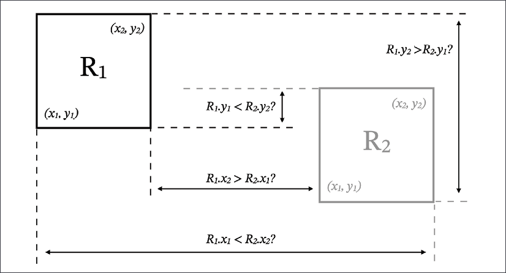

在本章中，我们将通过接口、模式和模块化的视角深入探讨设计模式的领域。在介绍编程习语的概念时，我们已经接近了这个领域。习语可以理解为解决小问题的小而公认的编程模式。编程习语的关键特征是它特定于一种编程语言。虽然习语通常可以移植到不同的语言，但不能保证生成的代码对于该编程语言的“本地”用户来说是自然的。

习语通常关注小的编程结构——通常是几行代码。另一方面，设计模式处理更大的代码结构——函数和类。它们也绝对更普遍。设计模式是软件工程中出现的许多常见设计问题的可重用解决方案。它们通常与语言无关，因此可以使用多种编程语言来表达。

在本章中，我们将看到一个非常不寻常的设计模式主题。许多编程书籍都从追溯软件设计模式的非官方起源开始——Gamma、Vlissides、Helm 和 Johnson 合着的《设计模式：可重用面向对象软件的元素》一书。通常遵循的是一个冗长的经典设计模式目录，其中包含或多或少的 Python 实现的惯用示例。单身人士、工厂、适配器、享元、桥梁、访客、策略等等。

也有无数的网络文章和博客在做完全相同的事情，所以如果你有兴趣学习经典的设计模式，那么在网上寻找资源应该不会有任何问题。

> 如果你有兴趣了解 Python 中“经典”设计模式的实现，可以访问 https://python-patterns.guide 站点。它提供了一个全面的设计模式目录以及 Python 代码示例。

相反，我们将关注两个关键的“设计模式促成因素”：

- 接口
- 控制反转和依赖注入器

这两个概念是“使能者”，因为没有它们我们甚至没有合适的语言术语来谈论设计模式。通过讨论接口和控制反转的话题，我们将能够更好地理解构建模块化应用程序的挑战。只有深入了解这些挑战，我们才能弄清楚为什么我们实际上需要模式。

我们当然会在途中使用许多经典的设计模式，但我们不会专注于任何特定的模式。

## 技术要求

以下是本章提到的 Python 包，你可以从 PyPI 下载：

- zope.interface
- mypy
- redis
- flask
- injector
- flask-injector

关于如何安装包的信息包含在第 2 章，现代 Python 开发环境中。

本章的代码文件可以在 https://github.com/PacktPublishing/Expert-Python-Programming-Fourth-Edition/tree/main/Chapter%205 找到。

## 接口

从广义上讲，接口是参与两个实体之间交互的中介。例如，汽车的界面主要由方向盘、踏板、变速杆、仪表板、旋钮等组成。计算机的界面传统上由鼠标、键盘和显示器组成。

在编程中，接口可能意味着两件事：

代码可以拥有的交互平面的整体形状
与代码的可能交互的抽象定义，有意与其实现分离
本着第一个含义的精神，界面是用于与代码单元交互的特定符号组合。例如，函数的接口将是该函数的名称、它的输入参数和它返回的输出。一个对象的接口将是它所有可以调用的方法和所有可以访问的属性。

代码单元（函数、对象、类）的集合通常被分组到库中。在 Python 中，库采用模块和包（模块的集合）的形式。他们也有接口。模块和包的内容通常可以以各种组合使用，你不必与它们的所有内容进行交互。这使它们成为可编程的应用程序，这就是为什么库的接口通常被称为应用程序编程接口 (API)。

接口的这种含义可以扩展到计算世界的其他元素。操作系统具有文件系统和系统调用形式的接口。 Web 和远程服务具有通信协议形式的接口。

接口的第二种含义可以理解为对前者的形式化。这里的接口被理解为代码的特定元素声明要履行的契约。这样一个正式的接口可以从实现中提取出来，并且可以作为一个独立的实体存在。这使得构建依赖于特定接口但不关心实际实现的应用程序成为可能，只要它存在并履行合同即可。

接口的这种正式含义也可以扩展到更大的编程概念：

- 库：C 编程语言定义了其标准库的 API，也称为 ISO C 库。与 Python 不同，C 标准库有许多实现。对于 Linux，最常见的可能是 GNU C 库 (glibc)，但它也有诸如dietlibc 或 musl 之类的替代品。其他操作系统带有自己的 ISO C 库实现。
- 操作系统：便携式操作系统接口 (POSIX) 是一组标准，用于定义操作系统的通用接口。有许多系统经过认证符合该标准（仅举几例 macOS 和 Solaris）。也有大多数兼容的操作系统（Linux、Android、OpenBSD 等等）。我们可以说这些系统实现了 POSIX 接口，而不是使用术语“POSIX 合规性”。
- Web 服务：OpenID Connect (OIDC) 是基于 OAuth 2.0 协议的身份验证和授权框架的开放标准。想要实现 OIDC 标准的服务必须提供本标准中描述的特定明确定义的接口。

形式接口是面向对象编程语言中极其重要的概念。在这种情况下，接口抽象了建模对象的形式或目的。它通常描述一个类应该实现的具有所需行为的方法和属性的集合。

在纯粹的方法中，接口的定义不提供任何可用的方法实现。它只是为任何希望实现接口的类定义了一个显式契约。接口通常是可组合的。这意味着单个类可以同时实现多个接口。这样，接口是设计模式的关键构建块。单个设计模式可以理解为特定接口的组合。与接口类似，设计模式没有固有的实现。它们只是开发人员解决常见问题的可重用脚手架。

Python 开发人员更喜欢鸭子类型而不是显式接口定义，但类之间定义良好的交互契约通常可以提高软件的整体质量并减少潜在错误的区域。例如，新接口实现的创建者可以获得给定类需要公开的方法和属性的清晰列表。通过正确的实现，不可能忘记给定接口所需的方法。

对抽象接口的支持是许多静态类型语言的基石。例如，Java 具有显式声明类实现特定接口的特性。这允许 Java 程序员在没有类型继承的情况下实现多态，这有时会成为问题。另一方面，Go 没有类，也不提供类型继承，但 Go 中的接口允许选择的面向对象模式和多态性，而无需类型继承。对于这两种语言，接口就像鸭子类型行为的显式版本——Java 和 Go 使用接口在编译时验证类型安全，而不是在运行时使用鸭子类型将事物联系在一起。

Python 具有与这些语言完全不同的类型哲学，因此它没有对在编译时验证的接口的本机支持。无论如何，如果你想对应用程序界面进行更明确的控制，有一些解决方案可供选择：

- 使用像 zope.interface 这样的第三方框架添加了接口的概念
- 使用抽象基类 (ABC)
- 利用类型注解、typing.Protocol 和静态类型分析器。

我们将在以下部分仔细审查这些解决方案中的每一个。

### 一点历史：zope.interface

有一些框架允许你在 Python 中构建显式接口。最引人注目的是 Zope 项目的一部分。它是 zope.interface 包。尽管现在 Zope 不像十年前那么流行，但 zope.interface 包仍然是仍然流行的 Twisted 框架的主要组件之一。 zope.interface 也是 Python 中常用的最古老且仍然活跃的界面框架之一。它早于 ABC 等主流 Python 功能，因此我们将从它开始，然后看看它与其他接口解决方案的比较。

> zope.interface 包是由 Jim Fulton 创建的，用于模仿 Java 接口在其诞生时的特性。

接口概念最适用于单个抽象可以有多个实现或可以应用于可能不应该与继承结构纠缠在一起的不同对象的领域。为了更好地表达这个想法，我们将以一个问题为例，该问题可以处理具有一些共同特征但并不完全相同的不同实体。

我们将尝试构建一个简单的碰撞系统，可以检测多个重叠对象之间的碰撞。这是可以在简单的游戏或模拟中使用的东西。我们的解决方案将是相当琐碎和低效的。请记住，这里的目标是探索界面的概念，而不是为重磅游戏构建防弹碰撞引擎。

我们将使用的算法称为轴对齐边界框 (AABB)。这是检测两个轴对齐（无旋转）矩形之间碰撞的简单方法。它假设所有要测试的元素都可以用矩形边界框约束。该算法相当简单，只需要比较四个矩形坐标：



我们将从一个检查两个矩形是否重叠的简单函数开始：

```python
def rects_collide(rect1, rect2):
    """Check collision between rectangles
    Rectangle coordinates:
        ┌─────(x2, y2)
        │            │
        (x1, y1) ────┘
    """
    return (
        rect1.x1 < rect2.x2 and
        rect1.x2 > rect2.x1 and
        rect1.y1 < rect2.y2 and
        rect1.y2 > rect2.y1
    )
```

我们还没有定义任何类型注解，但是从上面的代码中可以清楚地看到，我们期望 rects_collide() 函数的两个参数都具有四个属性：x1、y1、x2、y2。 这些对应于边界框的左下角和右上角的坐标。

有了 rects_collide() 函数，我们可以定义另一个函数来检测一批对象中的所有碰撞。 它可以简单如下：

```python
import itertools
def find_collisions(objects):
    return [
        (item1, item2)
        for item1, item2
        in itertools.combinations(objects, 2)
        if rects_collide(
            item1.bounding_box,
            item2.bounding_box
        )
    ]
```

剩下的就是定义一些可以一起测试以防止碰撞的对象类。 我们将模拟几种不同的形状：正方形、矩形和圆形。 每个形状都不同，因此会有不同的内部结构。 没有任何明智的阶级可以让我们成为一个共同的祖先。 为了简单起见，我们将使用数据类和属性。 以下均为初始定义：

```python
from dataclasses import dataclass
@dataclass
class Square:
    x: float
    y: float
    size: float
    @property
    def bounding_box(self):
        return Box(
            self.x,
            self.y,
            self.x + self.size,
            self.y + self.size
        )
@dataclass
class Rect:
    x: float
    y: float
    width: float
    height: float
    @property
    def bounding_box(self):
        return Box(
            self.x,
            self.y,
            self.x + self.width,
            self.y + self.height
        )
@dataclass
class Circle:
    x: float
    y: float
    radius: float
    @property
    def bounding_box(self):
        return Box(
            self.x - self.radius,
            self.y - self.radius,
            self.x + self.radius,
            self.y + self.radius
        )
```

这些类（除了作为数据类）唯一的共同点是返回 Box 类实例的 bounding_box 属性。 Box 类也是一个数据类：

```python
@dataclass
class Box:
    x1: float
    y1: float
    x2: float
    y2: float
```

数据类的定义非常简单，不需要解释。 我们可以通过将一堆实例传递给 find_collisions() 函数来测试我们的系统是否工作，如下例所示：

```python
for collision in find_collisions([
    Square(0, 0, 10),
    Rect(5, 5, 20, 20),
    Square(15, 20, 5),
    Circle(1, 1, 2),
]):
    print(collision)
```

如果我们做的一切都正确，上面的代码应该会产生以下三个碰撞的输出：

```python
(Square(x=0, y=0, size=10), Rect(x=5, y=5, width=20, height=20))
(Square(x=0, y=0, size=10), Circle(x=1, y=1, radius=2))
(Rect(x=5, y=5, width=20, height=20), Square(x=15, y=20, size=5))
```

一切都很好，但让我们做一个思想实验。 想象一下，我们的应用程序增长了一点，并扩展了额外的元素。 如果是游戏，则可以包含代表精灵、演员或效果粒子的对象。 假设有人定义了以下 Point 类：

```python
@dataclass
class Point:
    x: float
    y: float
```

如果将该类的实例放在可能的碰撞器列表中会发生什么？ 你可能会看到类似于以下内容的异常回溯：

```python
Traceback (most recent call last):
  File "/.../simple_colliders.py", line 115, in <module>
    for collision in find_collisions([
  File "/.../simple_colliders.py", line 24, in find_collisions
    return [
  File "/.../simple_colliders.py", line 30, in <listcomp>
    item2.bounding_box
AttributeError: 'Point' object has no attribute 'bounding_box
```

这提供了有关问题所在的一些线索。问题是我们是否可以做得更好并更早地发现此类问题？我们至少可以验证所有输入对象的 find_collisions() 函数以检查它们是否可碰撞。但是怎么做呢？

因为没有一个可碰撞的类共享一个共同的祖先，我们不能轻易地使用 isinstance() 函数来查看它们的类型是否匹配。我们可以使用 hasattr() 函数检查 bounding_box 属性，但是如果这样做足够深入以查看该属性是否具有正确的结构，则会导致我们编写丑陋的代码。

这就是 zope.interface 派上用场的地方。 zope.interface 包的核心类是 Interface 类。它允许你显式定义新接口。让我们定义一个 ICollidable 类，该类将声明可以在我们的碰撞系统中使用的任何内容：

```python
from zope.interface import Interface, Attribute
class ICollidable(Interface):
    bounding_box = Attribute("Object's bounding box")
```

Zope 的常见约定是在接口类前加上 I。 Attribute 构造函数表示实现接口的对象所需的属性。接口类中定义的任何方法都将用作接口方法声明。这些方法应该是空的。常见的约定是仅使用方法主体的文档字符串。

当你定义了这样一个接口时，你必须指出你的哪些具体类实现了该接口。这种接口实现风格称为显式接口，本质上类似于 Java 中的特征。为了表示特定接口的实现，你需要使用implementer() 类装饰器。在我们的例子中，这将如下所示：

```python
from zope.interface import implementer
@implementer(ICollidable)
@dataclass
class Square:
    ...
@implementer(ICollidable)
@dataclass
class Rect:
    ...
@implementer(ICollidable)
@dataclass
class Circle:
    ...
```

> 为简洁起见，上面示例中数据类的主体已被截断。

通常说接口定义了一个具体实现需要履行的契约。这种设计模式的主要好处是能够在使用对象之前验证契约和实现之间的一致性。使用普通的鸭子类型方法，只有在运行时缺少属性或方法时才会发现不一致。

使用 zope.interface，你可以使用 zope.interface.verify 模块中的两种方法内省实际实现，以尽早发现不一致之处：

- verifyClass(interface, class_object)：这会在不查找属性的情况下验证类对象的方法是否存在及其签名的正确性。
- verifyObject(interface, instance)：这会验证方法、它们的签名以及实际对象实例的属性。

这意味着我们可以扩展 find_collisions() 函数以在进一步处理之前执行对象接口的初始验证。我们可以这样做：

```python
from zope.interface.verify import verifyObject
def find_collisions(objects):
    for item in objects:
        verifyObject(ICollidable, item)
    ...
```

现在，如果有人将没有 @implementer(ICollidable) 装饰器的类的实例传递给 find_collisions() 函数，他们将收到类似于以下内容的异常回溯：

```python
Traceback (most recent call last):
  File "/.../colliders_interfaces.py", line 120, in <module>
    for collision in find_collisions([
  File "/.../colliders_interfaces.py", line 26, in find_collisions
    verifyObject(ICollidable, item)
  File "/.../site-packages/zope/interface/verify.py", line 172, in verifyObject
    return _verify(iface, candidate, tentative, vtype='o')
  File "/.../site-packages/zope/interface/verify.py", line 92, in _verify
    raise MultipleInvalid(iface, candidate, excs)
zope.interface.exceptions.MultipleInvalid: The object Point(x=100, y=200) has failed to implement interface <InterfaceClass __main__.ICollidable>:
    Does not declaratively implement the interface
    The __main__.ICollidable.bounding_box attribute was not provided
```

最后两行告诉我们两个错误：

- 声明错误：未明确声明无效项来实现接口，这是一个错误。
- 结构性错误：无效项目没有界面需要的所有元素。

后一个错误保护我们免于不完整的接口。如果 Point 类具有 @implementer(ICollidable) 装饰器但不包含 bounding_box() 属性，我们仍然会收到异常。

verifyClass() 和 verifyObject() 方法只验证接口的表面积，不能遍历到属性类型。你可以选择使用 zope.interface 的每个接口类提供的 validateInvariants() 方法进行更深入的验证。它允许挂钩函数验证接口的值。因此，如果我们想要更加安全，我们可以使用以下接口模式及其验证：

```python
from zope.interface import Interface, Attribute, invariant
from zope.interface.verify import verifyObject
class IBBox(Interface):
    x1 = Attribute("lower-left x coordinate")
    y1 = Attribute("lower-left y coordinate")
    x2 = Attribute("upper-right x coordinate")
    y2 = Attribute("upper-right y coordinate")
class ICollidable(Interface):
    bounding_box = Attribute("Object's bounding box")
    invariant(lambda self: verifyObject(IBBox, self.bounding_box))
def find_collisions(objects):
    for item in objects:
        verifyObject(ICollidable, item)
        ICollidable.validateInvariants(item)
    ...
```

由于使用了 validateInvariants() 方法，我们能够检查输入项是否具有满足 ICollidable 接口所需的所有属性，并验证这些属性的结构（此处为 bounding_box）是否满足更深层次的约束。在我们的例子中，我们使用 invariant() 来验证嵌套接口。

使用 zope.interface 是一种解耦应用程序的有趣方式。它允许你强制执行正确的对象接口，而无需过多继承的过度复杂性，并且还允许你及早发现不一致。

zope.interface 的最大缺点是需要显式声明接口实现器。如果你需要验证来自内置库的外部类的实例，这尤其麻烦。该库为该问题提供了一些解决方案，尽管它们最终会使代码变得过于冗长。当然，你可以通过使用适配器模式，甚至猴子修补外部类来自行处理此类问题。无论如何，这种解决方案的简单性至少是值得商榷的。

### 使用函数注解和抽象基类

正式接口旨在在大型应用程序中实现松散耦合，而不是为你提供更多层的复杂性。 zope.interface 是一个很棒的概念，可能非常适合某些项目，但它不是灵丹妙药。通过使用它，你可能很快就会发现自己花费更多时间来修复第三方类的不兼容接口的问题，并提供永无止境的适配器层，而不是编写实际的实现。

如果你有这种感觉，则表明出现问题。幸运的是，Python 支持构建显式接口的轻量级替代方案。它不是一个成熟的解决方案，例如 zope.interface 或其替代品，但通常提供更灵活的应用程序。你可能需要编写更多的代码，但最终，你将拥有更可扩展、更好地处理外部类型，并且可能更经得起未来考验的东西。

请注意，Python 的核心没有明确的接口概念，并且可能永远不会有，但它具有一些特性，允许构建类似于接口功能的东西。特点如下：

- ABCs
- 函数注解
- 类型注解

我们解决方案的核心是抽象基类，因此我们将首先介绍它们。

你可能知道，直接类型比较被认为是有害的，而不是 Pythonic。你应该始终避免进行比较，如下例所示：

```python
assert type(instance) == list
```

以这种方式比较函数或方法中的类型完全破坏了将类子类型作为参数传递给函数的能力。稍微好一点的方法是使用 isinstance() 函数，它将考虑继承：

```python
assert isinstance(instance, list)
```

isinstance() 的另一个优点是你可以使用更大范围的类型来检查类型兼容性。例如，如果你的函数希望接收某种序列作为参数，你可以将其与基本类型列表进行比较：

```python
assert isinstance(instance, (list, tuple, range))
```

而且这种类型兼容性检查在某些情况下是可以的，但仍然不完美。它适用于列表、元组或范围的任何子类，但如果用户传递的行为与这些序列类型之一完全相同但不继承自它们中的任何一个，则它将失败。例如，让我们放宽我们的要求，假设你希望接受任何类型的可迭代对象作为参数。你会怎么办？

可迭代的基本类型列表实际上很长。你需要涵盖列表、元组、范围、字符串、字节、字典、集合、生成器等等。适用的内置类型列表很长，即使你涵盖了所有这些类型，它仍然不允许检查定义 __iter__() 方法但直接从 object 继承的自定义类。

在这种情况下，ABC 是正确的解决方案。 ABC 是一个不需要提供具体实现的类，而是定义了一个可用于检查类型兼容性的类的蓝图。这个概念与C++语言中已知的抽象类和虚拟方法的概念非常相似。

抽象基类有两个用途：

- 检查实现的完整性
- 检查隐式接口兼容性

ABC 的使用非常简单。首先定义一个新类，该类继承自 abc.ABC 基类或将 abc.ABCMeta 作为其元类。我们将在第 8 章元编程元素之前讨论元类，因此在本章中，我们将仅使用经典继承。

下面是一个基本抽象类的例子，它定义了一个不做任何特殊事情的接口：

```python
from abc import ABC, abstractmethod
class DummyInterface(ABC):
    @abstractmethod
    def dummy_method(self): ...
    @property
    @abstractmethod
    def dummy_property(self): ...
```

@abstractmethod 装饰器表示必须在将我们的 ABC 子类化的类中实现（通过覆盖）的接口的一部分。如果一个类将有一个未被覆盖的方法或属性，你将无法实例化它。任何这样做的尝试都会导致 TypeError 异常。

这种方法是确保实现完整性的好方法，并且与 zope.interface 替代方案一样明确。如果我们想在上一节的示例中使用 ABCs 而不是 zope.interface，我们可以对类定义进行以下修改：

```python
from abc import ABC, abstractmethod
from dataclasses import dataclass
class ColliderABC(ABC):
    @property
    @abstractmethod
    def bounding_box(self): ...
@dataclass
class Square(ColliderABC):
    ...
@dataclass
class Rect(ColliderABC):
    ...
@dataclass
class Circle(ColliderABC):
    ...
```

Square、Rect 和 Circle 类的主体和属性不会改变，因为我们界面的本质根本没有改变。改变的是显式接口声明的方式。我们现在使用继承而不是 zope.interface.implementer() 类装饰器。如果我们还想验证 find_collisions() 的输入是否符合接口，则需要使用 isinstance() 函数。这将是一个相当简单的修改：

```python
def find_collisions(objects):
    for item in objects:
        if not isinstance(item, ColliderABC):
            raise TypeError(f"{item} is not a collider")
    ...
```

我们不得不使用子类化，因此组件之间的耦合更加紧密，但仍然与 zope.interface 的耦合相当。就我们依赖接口而不是具体实现而言（因此，使用 ColliderABC 而不是 Square、Rect 或 Circle），耦合仍然被认为是松散的。

但事情可以更灵活。这是 Python，我们有充分的自省能力。 Python 中的鸭子类型允许我们使用任何“像鸭子一样嘎嘎叫”的对象，就好像它是一只鸭子一样。不幸的是，通常是本着“试试看”的精神。我们假设给定上下文中的对象与预期的接口匹配。正式接口的全部目的是实际上有一个我们可以验证的合同。有没有办法检查对象是否与接口匹配，而无需实际尝试先使用它？

是的。在某种程度上。抽象基类提供了特殊的 \_\_subclasshook\_\_(cls) 方法。它允许你将自己的逻辑注入到确定对象是否是给定类的实例的过程中。不幸的是，你需要自己提供逻辑，因为 abc 创建者不想限制开发人员覆盖整个 isinstance() 机制。我们对它有完全的控制权，但我们不得不编写一些样板代码。

尽管你可以为所欲为，但通常在 \_\_subclasshook\_\_() 方法中唯一合理的做法是遵循通用模式。为了验证给定的类是否与给定的抽象基类隐式兼容，我们必须检查它是否具有抽象基类的所有方法。

标准过程是检查定义的方法集是否在给定类的方法解析顺序 (MRO) 中的某处可用。如果我们想使用子类钩子扩展我们的 ColliderABC 接口，我们可以执行以下操作：

```python
class ColliderABC(ABC):
    @property
    @abstractmethod
    def bounding_box(self): ...
    @classmethod
    def __subclasshook__(cls, C):
        if cls is ColliderABC:
            if any("bounding_box" in B.__dict__ for B in C.__mro__):
                return True
        return NotImplemented
```

通过以这种方式定义的 \_\_subclasshook\_\_() 方法，ColliderABC 成为一个隐式接口。这意味着任何对象都将被视为 ColliderABC 的实例，只要它具有通过子类挂钩检查的结构。多亏了这一点，我们可以添加与 ColliderABC 接口兼容的新组件，而无需显式继承它。以下是 Line 类的示例，该类将被视为 ColliderABC 的有效子类：

```python
@dataclass
class Line:
    p1: Point
    p2: Point
    @property
    def bounding_box(self):
        return Box(
            self.p1.x,
            self.p1.y,
            self.p2.x,
            self.p2.y,
        )
```

如你所见，Line 数据类在其代码中的任何地方都没有提及 ColliderABC。但是你可以通过使用 isinstance() 函数将 Line 实例与 ColliderABC 进行比较来验证 Line 实例的隐式接口兼容性，如下例所示：

```python
>>> line = Line(Point(0, 0), Point(100, 100))
>>> line.bounding_box
Box(x1=0, y1=0, x2=100, y2=100)
>>> isinstance(line, ColliderABC)
True
```

我们使用了属性，但同样的方法也可以用于方法。不幸的是，这种验证类型兼容性和实现完整性的方法没有考虑类方法的签名。因此，如果实现中预期参数的数量不同，它仍然会被认为是兼容的。在大多数情况下，这不是问题，但如果你需要对接口进行如此细粒度的控制，zope.interface 包允许这样做。如前所述，\_\_subclasshook\_\_() 方法不会限制你向 isinstance() 函数的逻辑添加更多复杂性以实现类似级别的控制。

#### 使用 collections.abc
ABC 就像用于创建更高抽象级别的小型构建块。它们允许你实现真正可用的接口，但非常通用，旨在处理比这种单一设计模式更多的事情。你可以释放你的创造力并做一些神奇的事情，但是构建一些通用且真正可用的东西可能需要大量的工作，而这些工作可能永远不会有回报。 Python 的标准库和 Python 的内置类型完全包含抽象基类。

collections.abc 模块提供了许多预定义的 ABC，允许检查类型与通用 Python 接口的兼容性。使用此模块中提供的基类，你可以检查例如给定对象是否可调用、映射或它是否支持迭代。将它们与 isinstance() 函数一起使用比与基本 Python 类型进行比较要好得多。即使你不想使用 abc.ABC 定义自己的自定义接口，你也绝对应该知道如何使用这些基类。

你将经常使用的 collections.abc 中最常见的抽象基类是：

- Container：这个接口表示对象支持 in 操作符，并实现了 \_\_contains\_\_() 方法。
- Iterable：这个接口表示对象支持迭代并实现了\_\_iter\_\_()方法。
- Callable：这个接口意味着它可以像函数一样被调用，并实现了 \_\_call\_\_() 方法。
- Hashable：这个接口意味着对象是可散列的（即它可以包含在集合中并作为字典中的键）并实现了 \_\_hash\_\_ 方法。
- Sized：这个接口表示对象有一个大小（即可以是len()函数的一个subject），并实现了\_\_len\_\_()方法。

> collections.abc 模块中可用抽象基类的完整列表可在 https://docs.python.org/3/library/collections.abc.html 下的官方 Python 文档中找到。

collections.abc 模块很好地展示了 ABC 最擅长的地方：为对象的小而简单的协议创建契约。它们不是方便地确保大型界面的细粒度结构的好工具。它们也不附带允许你轻松验证属性或对函数参数和返回类型执行深入验证的实用程序。

幸运的是，对于这个问题有一个完全不同的解决方案：静态类型分析和 types.Protocol 类型。

### 通过类型注解的接口

Python 中的类型注解被证明在提高软件质量方面非常有用。越来越多的专业程序员默认使用 mypy 或其他静态类型分析工具，将传统的无类型编程留给原型和快速丢弃脚本。

近年来，对输入标准库和社区项目的支持大大增加。因此，每个 Python 版本都增加了键入注解的灵活性。它还允许你在全新的上下文中使用键入注解。

一种这样的上下文是使用类型注解来执行结构子类型（或静态鸭子类型）。这只是隐式接口概念的另一种方法。它还本着 ABC 子类挂钩的精神提供了最小的简单的运行时检查可能性。

结构子类型的核心是typing.Protocol类型。通过继承此类型，你可以创建接口的定义。以下是我们可以在之前的碰撞检测系统示例中使用的基本协议接口示例：

```python
from typing import Protocol, runtime_checkable


@runtime_checkable
class IBox(Protocol):
    x1: float
    y1: float
    x2: float
    y2: float

        
@runtime_checkable
class ICollider(Protocol):
    @property
    def bounding_box(self) -> IBox: ...
```

这次我们使用了两个接口。像 mypy 这样的工具将能够执行深度类型验证，因此我们可以使用额外的接口来提高类型安全性。 @runtime_checkable 装饰器使用 isinstance() 检查扩展了协议类。这是我们必须在上一节中使用子类挂钩手动为 ABC 执行的操作。在这里，它几乎是免费的。

> 我们将在第 10 章，测试和质量自动化中了解更多关于静态类型分析工具的使用。

为了充分利用静态类型分析，我们还必须用适当的注解来注解其余的代码。以下是基于协议类的带有运行时接口验证的完整碰撞检查代码：

```python
import itertools
from dataclasses import dataclass
from typing import Iterable, Protocol, runtime_checkable


@runtime_checkable
class IBox(Protocol):
    x1: float
    y1: float
    x2: float
    y2: float

        
@runtime_checkable
class ICollider(Protocol):
    @property
    def bounding_box(self) -> IBox: ...


def rects_collide(rect1: IBox, rect2: IBox):
    """Check collision between rectangles
    Rectangle coordinates:
        ┌───(x2, y2)
        │       │
      (x1, y1)──┘
    """
    return (
        rect1.x1 < rect2.x2 and
        rect1.x2 > rect2.x1 and
        rect1.y1 < rect2.y2 and
        rect1.y2 > rect2.y1
    )


def find_collisions(objects: Iterable[ICollider]):
    for item in objects:
        if not isinstance(item, ICollider):
            raise TypeError(f"{item} is not a collider")
    return [
        (item1, item2)
        for item1, item2
        in itertools.combinations(objects, 2)
        if rects_collide(item1.bounding_box, item2.bounding_box)
    ]
```

我们没有包含 Rect、Square 和 Circle 类的代码，因为它们的实现不需要改变。这就是隐式接口的真正美妙之处：在来自实际实现的固有接口之外的具体类中没有显式接口声明。

最后，我们可以使用任何以前的 Rect、Square 和 Circle 类迭代（普通数据类、zope 声明的类或 ABC 后代）。它们都将通过typing.Protocol 类进行结构子类型化。

如你所见，尽管 Python 缺乏对接口的本机支持（就像 Java 或 Go 语言所做的那样），但我们有很多方法来标准化类、方法和函数的契约。当实现各种设计模式来解决常见的编程问题时，这种能力变得非常有用。设计模式都是关于可重用性的，接口的使用有助于将它们构建成可以反复重用的设计模板。

但是接口（和类似的解决方案）的使用并没有以设计模式结束。为单个代码单元（函数、类或方法）创建定义明确且可验证的契约的能力也是特定编程范式和技术的关键要素。值得注意的例子是控制反转和依赖注入。这两个概念紧密耦合，因此我们将在下一节中一起讨论它们。

## 控制反转和依赖注入

控制反转 (IoC) 是某些软件设计的一个简单属性。根据维基词典，如果一个设计展示了 IoC，这意味着：

> (...) 与传统架构相比，系统中的控制流程是颠倒的。

但什么是传统建筑？ IoC 并不是一个新想法，我们至少可以将其追溯到 1985 年 David D. Clark 题为 The structuring of systems using upcalls 的论文。这意味着传统设计可能是指 1980 年代常见或被认为是传统的软件设计。

> 你可以在 https://groups.csail.mit.edu/ana/Publications/PubPDFs/The%20Structuring%20of%20Systems%20Using%20Upcalls.pdf 以数字化形式访问 Clark 的全文。

Clark 将程序的传统体系结构描述为程序的分层结构，其中控制总是从上到下进行。较高层调用较低层的过程。

那些被调用的过程获得控制权，并且可以在向上返回控制权之前调用更深层次的过程。在实践中，控制传统上从应用程序传递到库函数。库函数可能会将其更深入地传递给更低级别的库，但最终将其返回给应用程序。

当库将控制权传递给应用程序以便应用程序可以参与库行为时，就会发生 IoC。为了更好地理解这个概念，请考虑以下对整数列表进行排序的简单示例：

```python
sorted([1,2,3,4,5,6])
```

内置的 sorted() 函数接受一个可迭代的项目并返回一个已排序项目的列表。控制权直接从调用者（你的应用程序）转到 sorted() 函数。当 sorted() 函数完成排序后，它只返回排序结果并将控制权交还给调用者。没什么特别的。

现在假设我们想以一种非同寻常的方式对我们的数字进行排序。例如，可以按照与数字 3 的绝对距离对它们进行排序。最接近 3 的整数应该在结果列表的开头，最远的应该在结尾。我们可以通过定义一个简单的键函数来指定元素的顺序键：

```python
def distance_from_3(item):
    return abs(item - 3)
```

现在我们可以将该函数作为回调键参数传递给 sorted() 函数：

```python
sorted([1,2,3,4,5,6], key=distance_from_3)
```

现在将发生的是 sorted() 函数将在可迭代参数的每个元素上调用 key 函数。它现在将比较键函数的返回值，而不是比较项目值。这就是 IoC 发生的地方。 sorted() 函数“调用”回应用程序提供的 distance_from_3() 函数作为参数。现在它是一个从应用程序调用函数的库，因此控制流程是相反的。

> 基于回调的 IoC 也被幽默地称为好莱坞原则，参考“不要打电话给我们，我们会打电话给你”这句话。

请注意，IoC 只是设计的一个属性，而不是设计模式本身。 sorted() 函数的示例是基于回调的 IoC 的最简单示例，但它可以采用多种不同的形式。例如：

- 多态：当自定义类继承自基类并且基方法应该调用自定义方法时
- 参数传递：当接收函数应该调用所提供对象的方法时
- 装饰器：当装饰器函数调用被装饰的函数时
- 闭包：当嵌套函数调用其作用域外的函数时

如你所见，IoC 是面向对象或函数式编程范式的一个相当普遍的方面。它也经常发生，你甚至没有意识到。虽然它本身不是一种设计模式，但它是许多实际设计模式、范式和方法的关键组成部分。最值得注意的是依赖注入，我们将在本章后面讨论。

Clark 在过程编程中的传统控制流也发生在面向对象的编程中。在面向对象的程序中，对象本身是控制的接收者。我们可以说，每当调用该对象的方法时，控制就会传递给该对象。因此，传统的控制流将要求对象拥有实现对象行为所需的所有依赖对象的完全所有权。

### 应用程序中的控制反转

为了更好地说明各种控制流之间的差异，我们将构建一个小而实用的应用程序。它最初将从传统的控制流开始，然后我们将看看它是否可以在选定的地方从 IoC 中受益。

我们的用例将非常简单和常见。我们将构建一个服务，该服务可以使用所谓的跟踪像素来跟踪网页浏览量，并通过 HTTP 端点提供页面浏览量统计信息。这种技术通常用于跟踪广告浏览量或电子邮件打开情况。当你大量使用 HTTP 缓存并希望确保缓存不会影响页面查看统计信息时，它也很有用。

我们的应用程序必须在某些持久存储中跟踪页面浏览量。这也将使我们有机会探索应用程序模块化——一个没有 IoC 就无法实现的特性。

我们需要构建的是一个小型 Web 后端应用程序，它将有两个端点：

- /track：此端点将返回一个带有 1x1 像素 GIF 图像的 HTTP 响应。根据请求，它将存储 Referer 标头并增加与该值关联的请求数。
- /stats：此端点将读取在 track/ 端点上接收到的前 10 个最常见的 Referer 值，并以 JSON 格式返回包含结果摘要的 HTTP 响应。

> Referer 标头是一个可选的 HTTP 标头，Web 浏览器将使用它来告诉 Web 服务器请求资源的源网页的 URL 是什么。请注意“referrer”一词的拼写错误。标头首先在 RFC 1945 中标准化，超文本传输协议 - HTTP/1.0（参见 https://tools.ietf.org/html/rfc1945）。当发现拼写错误时，修复它已经太晚了。

我们已经在第 2 章现代 Python 开发环境中介绍了 Flask 作为一个简单的 Web 微框架，因此我们也将在这里使用它。让我们首先导入一些模块并设置我们将在途中使用的模块变量：

```python
from collections import Counter
from http import HTTPStatus
from flask import Flask, request, Response


app = Flask(__name__)
storage = Counter()
PIXEL = (
    b'GIF89a\x01\x00\x01\x00\x80\x00\x00\x00'
    b'\x00\x00\xff\xff\xff!\xf9\x04\x01\x00'
    b'\x00\x00\x00,\x00\x00\x00\x00\x01\x00'
    b'\x01\x00\x00\x02\x01D\x00;'
)
```

app 变量是 Flask 框架的核心对象。它代表一个 Flask Web 应用程序。我们稍后将使用它来注册端点路由并运行应用程序开发服务器。

storage 变量保存一个 Counter 实例。它是标准库中的一种方便的数据结构，允许你跟踪任何不可变值的计数器。我们的最终目标是以持久的方式存储页面查看统计信息，但从更简单的东西开始会容易得多。这就是为什么我们最初将使用此变量作为页面查看统计信息的内存存储。

最后但并非最不重要的是 PIXEL 变量。它包含一个 1x1 透明 GIF 图像的字节表示。跟踪像素的实际视觉外观无关紧要，可能永远不会改变。它也非常小，无需费心从文件系统加载它。这就是为什么我们将它内联到我们的模块中以将整个应用程序放入单个 Python 模块中。

设置完成后，我们可以为 /track 端点处理程序编写代码：

```python
@app.route('/track')
def track():
    try:
        referer = request.headers["Referer"]
    except KeyError:
        return Response(status=HTTPStatus.BAD_REQUEST)
    storage[referer] += 1
    return Response(
        PIXEL, headers={
            "Content-Type": "image/gif",
            "Expires": "Mon, 01 Jan 1990 00:00:00 GMT",
            "Cache-Control": "no-cache, no-store, must-revalidate",
            "Pragma": "no-cache",
        }
    )
```

> 我们使用额外的 Expires、Cache-Control 和 Pragma 标头来控制 HTTP 缓存机制。我们设置它们，以便它们在大多数 Web 浏览器实现中禁用任何形式的缓存。我们还以一种应该禁用潜在代理缓存的方式来做到这一点。请注意过去的 Expires 标头值。这是可能的最低纪元时间，实际上意味着资源总是被认为已过期。

Flask 请求处理程序通常以 @app.route(route) 装饰器开始，该装饰器为给定的 HTTP 路由注册以下处理程序函数。请求处理程序也称为视图。在这里，我们将 track() 视图注册为 /track 路由端点的处理程序。这是我们应用程序中第一次出现 IoC：我们在 Flask 框架中注册我们自己的处理程序实现。它是一个框架，它将在匹配相关路由的传入请求上回调我们的处理程序。

签名后，我们有处理请求的简单代码。我们检查传入的请求是否具有预期的 Referer 标头。这是浏览器用来判断请求的资源包含在哪个 URI 上的值（例如，我们要跟踪的 HTML 页面）。如果没有这样的标头，我们将返回一个带有 400 Bad Request HTTP 状态代码的错误响应。

如果传入的请求具有 Referer 标头，我们将增加存储变量中的计数器值。 Counter 结构具有类似 dict 的界面，允许你轻松修改尚未注册的键的计数器值。在这种情况下，它会假设给定键的初始值为 0。这样我们就不需要检查是否已经看到特定的 Referer 值，这大大简化了代码。增加计数器值后，我们返回一个像素响应，最终可以被浏览器显示。

请注意，尽管存储变量是在 track() 函数之外定义的，但它还不是 IoC 的示例。那是因为调用 stats() 函数的人不能替代存储的实现。我们将尝试在我们应用程序的下一次迭代中改变它。

/stats 端点的代码更简单：

```python
@app.route('/stats')
def stats():
    return dict(storage.most_common(10))
```

在 stats() 视图中，我们再次利用 Counter 对象的便捷接口。它提供了 most_common(n) 方法，该方法最多返回存储在结构中的 n 个最常见的键值对。我们立即将其转换为字典。我们不使用 Response 类，因为 Flask 默认将非 Response 类的返回值序列化为 JSON 并假定 HTTP 响应为 200 OK 状态。

为了轻松测试我们的应用程序，我们通过简单调用内置开发服务器来完成我们的脚本：

```python
if __name__ == '__main__':
    app.run(host="0.0.0.0", port=8000)
```

如果你将应用程序存储在 tracking.py 文件中，你将能够使用 python tracking.py 命令启动服务器。它将开始侦听端口 8000。如果你想在自己的浏览器中测试该应用程序，可以使用以下端点处理程序对其进行扩展：

```python
@app.route('/test')
def test():
    return """
    <html>
    <head></head>
    <body></body>
    </html>
    """
```

如果你在 Web 浏览器中多次打开地址 http://localhost:8000/test，然后转到 http://localhost:8000/stats，你将看到类似于以下内容的输出：

```python
{"http://localhost:8000/test":6}
```

当前实现的问题在于它将请求计数器存储在内存中。每当应用程序重新启动时，现有的计数器将被重置，我们将丢失重要数据。为了在重新启动之间保留数据，我们将不得不替换我们的存储实现。

提供数据持久性的选项有很多。例如，我们可以使用：

- 一个简单的文本文件
- 内置搁架模块
- 关系数据库管理系统 (RDBMS)，如 MySQL、MariaDB 或 PostgreSQL
- 内存键值或数据结构存储服务，如 Memcached 或 Redis

根据我们的应用程序需要处理的工作负载的上下文和规模，最佳解决方案会有所不同。如果我们还不知道什么是最好的解决方案，我们也可以使存储可插拔，以便我们可以根据实际用户需求切换存储后端。为此，我们必须反转 track() 和 stats() 函数中的控制流。

好的设计要求对负责 IoC 的对象的接口进行某种定义的准备。 Counter 类的接口似乎是一个很好的起点。使用起来很方便。唯一的问题是 += 操作可以通过 \_\_add\_\_() 或 \_\_iadd\_\_() 特殊方法实现。我们绝对想避免这种歧义。此外，Counter 类有太多额外的方法，我们只需要两个：

- 一种允许你将计数器值增加一的方法
- 一种允许你检索 10 个最常请求的密钥的方法

为了保持简单和可读，我们将视图存储接口定义为以下形式的抽象基类：

```python
from abc import ABC, abstractmethod
from typing import Dict


class ViewsStorageBackend(ABC):
    @abstractmethod
    def increment(self, key: str): ...
    @abstractmethod
    def most_common(self, n: int): Dict[str, int] ...
```

从现在开始，我们可以提供视图存储后端的各种实现。以下是将之前使用的 Counter 类调整到 ViewsStorageBackend 接口的实现：

```python
from collections import Counter
from typing import Dict
from .tracking_abc import ViewsStorageBackend


class CounterBackend(ViewsStorageBackend):
    def __init__(self):
        self._counter = Counter()
    def increment(self, key: str):
        self._counter[key] += 1
    def most_common(self, n: int) -> Dict[str, int]:
        return dict(self._counter.most_common(n))
```

如果我们想通过 Redis 内存存储服务提供持久性，我们可以通过实现一个新的存储后端来实现，如下所示：

```python
from typing import Dict
from redis import Redis


class RedisBackend(ViewsStorageBackend):
    def __init__(
        self,
        redis_client: Redis,
        set_name: str
    ):
        self._client = redis_client
        self._set_name = set_name
    def increment(self, key: str):
        self._client.zincrby(self._set_name, 1, key)
    def most_common(self, n: int) -> Dict[str, int]:
        return {
            key.decode(): int(value)
            for key, value in
            self._client.zrange(
                self._set_name, 0, n-1,
                desc=True,
                withscores=True,
            )
        }
```

> Redis 是一种内存数据存储。这意味着默认情况下，数据仅存储在内存中。 Redis 会在重启期间将数据持久保存在磁盘上，但可能会在意外崩溃时丢失数据（例如，由于断电）。尽管如此，这只是默认行为。 Redis 提供了多种数据持久化模式，其中一些模式可以与其他数据库相媲美。这意味着 Redis 是我们简单用例的完全可行的存储解决方案。你可以在 https://redis.io/topics/persistence 阅读有关 Redis 持久性的更多信息。

两个后端都有相同的接口，通过抽象基类松散地强制执行。这意味着两个类的实例可以互换使用。问题是，我们将如何以允许我们插入不同视图存储实现的方式反转对 track() 和 stats() 函数的控制？

让我们回忆一下我们函数的签名：

```python
@app.route('/stats')
def stats():
   ...

@app.route('/track')
def track():
   ...
```

在 Flask 框架中， app.route() 装饰器将一个函数注册为特定的路由处理程序。你可以将其视为 HTTP 请求路径的回调。你不再手动调用该函数，Flask 完全控制传递给它的参数。但是我们希望能够轻松替换存储实现。一种方法是通过推迟处理程序注册并让我们的函数接收额外的存储参数。考虑以下示例：

```python
def track(storage: ViewsStorageBackend):
    try:
        referer = request.headers["Referer"]
    except KeyError:
        return Response(status=HTTPStatus.BAD_REQUEST)
    storage.increment(referer)
    return Response(
        PIXEL, headers={
            "Content-Type": "image/gif",
            "Expires": "Mon, 01 Jan 1990 00:00:00 GMT",
            "Cache-Control": "no-cache, no-store, must-revalidate",
            "Pragma": "no-cache",
        }
    )


def stats(storage: ViewsStorageBackend):
    return storage.most_common(10)
```

我们的额外参数使用 ViewsStorageBackend 类型进行注解，因此可以使用 IDE 或其他工具轻松验证该类型。因此，我们对这些功能进行了反向控制，并实现了更好的模块化。现在，你可以使用兼容的接口轻松切换不同类的存储实现。 IoC 的额外好处是我们可以轻松地独立于存储实现对 stats() 和 track() 方法进行单元测试。

> 我们将在第 10 章“测试和质量自动化”中讨论单元测试主题以及利用 IoC 的详细测试示例。

唯一缺少的部分是实际的路线注册。我们不能再直接在我们的函数上使用 app.route() 装饰器。这是因为 Flask 无法自行解决存储参数。我们可以通过将所需的存储实现“预注入”到处理程序函数中来克服这个问题，并创建可以轻松地通过 app.route() 调用注册的新函数。

这样做的简单方法是使用 functools 模块中的 partial() 函数。它采用单个函数以及一组参数和关键字参数，并返回一个新函数，该函数已选择预配置的参数。我们可以使用这种方法来准备我们服务的各种配置。例如，这里是一个使用 Redis 作为存储后端的应用程序配置：

```python
from functools import partial


if __name__ == '__main__':
    views_storage = RedisBackend(Redis(host="redis"), "my-stats")
    app.route("/track", endpoint="track")(
        partial(track, storage=views_storage))
    app.route("/stats", endpoint="stats")(
        partial(stats, storage=views_storage))
    app.run(host="0.0.0.0", port=8000)
```

所提出的方法可以应用于许多其他 Web 框架，因为它们中的大多数具有相同的路由到处理程序结构。对于只有少数端点的小型服务，它尤其适用。不幸的是，它在大型应用程序中可能无法很好地扩展。写起来很简单，但绝对不是最容易阅读的。经验丰富的 Flask 程序员肯定会觉得这种方法是不自然的和不必要的重复。在这里，它只是打破了编写 Flask 处理程序函数的常见约定。

最终的解决方案是允许你编写和注册视图函数而无需手动注入依赖对象。因此，例如：

```python
@app.route('/track')
def track(storage: ViewsStorageBackend):
   ...
```

为了做到这一点，我们需要从 Flask 框架中：

- 将额外的参数识别为视图的依赖关系。
- 允许为所述依赖项定义默认实现。
- 自动解析依赖项并在运行时将它们注入到视图中。

这种机制被称为依赖注入，我们之前提到过。一些 Web 框架提供了内置的依赖注入机制，但在 Python 生态系统中，这种情况非常罕见。幸运的是，有很多轻量级的依赖注入库可以添加到任何 Python 框架之上。我们将在下一节探讨这种可能性。

### 使用依赖注入框架

当 IoC 被大规模使用时，它很容易变得势不可挡。上一节中的示例非常简单，因此不需要进行大量设置。不幸的是，为了更好的模块化和责任隔离，我们牺牲了一些可读性和表达性。对于较大的应用程序，这可能是一个严重的问题。

专用的依赖注入库通过将标记函数或对象依赖项的简单方法与运行时依赖项解析相结合来解决问题。所有这些通常都可以在对整体代码结构影响最小的情况下实现。

Python 有很多依赖注入库，因此绝对没有必要从头构建自己的库。它们在实现和功能上通常很相似，所以我们将简单地选择一个，看看它如何应用在我们的视图跟踪应用程序中。

我们选择的库将是注入器库，它可以在 PyPI 上免费获得。我们会选择它有几个原因：

- 相当活跃和成熟：开发超过 10 年，每隔几个月发布一次。
- 框架支持：它通过flask-injector 包为包括Flask 在内的各种框架提供社区支持。
- 类型注解支持：它允许编写不显眼的依赖注解并利用静态类型分析。
- 很简单：injector 有一个 Pythonic API。它使代码易于阅读和推理。

> 你可以使用 pip 在你的环境中安装注入器，如下所示：
>
> ```python
> $ pip install injector
> ```
>
> 你可以在 https://github.com/alectomas/injector 找到有关注入器的更多信息。

在我们的示例中，我们将使用 flask-injector 包，因为它提供了一些初始样板来无缝集成注入器与 Flask。但在我们这样做之前，我们首先将我们的应用程序分成几个模块，以便更好地模拟更大的应用程序。毕竟，依赖注入在具有多个组件的应用程序中确实大放异彩。

我们将创建以下 Python 模块：

- 接口：这将是保存我们接口的模块。它将包含上一节中的 ViewsStorageBackend，没有任何更改。
- 后端：这将是包含存储后端的特定实现的模块。它将包含上一节中的 CounterBackend 和 RedisBackend，没有任何更改。
- 跟踪：这将是包含应用程序设置和视图功能的模块。
- di：这将是包含注入器库定义的模块，这将允许它自动解析依赖项。

注入器库的核心是一个 Module 类。它定义了一个所谓的依赖注入容器——依赖接口与其实际实现实例之间映射的原子块。最小的 Module 子类可能如下所示：

```python
from injector import Module, provider


def MyModule(Module):
    @provider
    def provide_dependency(self, *args) -> Type:
        return ...
```

@provider 装饰器将 Module 方法标记为为特定 Type 接口提供实现的方法。某些对象的创建可能很复杂，因此注入器允许模块具有额外的未修饰的辅助方法。

提供依赖的方法也可能有自己的依赖。它们被定义为带有类型注解的方法参数。这允许级联依赖项解析。注入器支持从多个模块组合依赖注入上下文，因此无需在单个模块中定义所有依赖项。

使用上面的模板，我们可以在 di.py 文件中创建我们的第一个注入器模块。它将是 CounterModule，它为 ViewsStorageBackend 接口提供 CounterBackend 实现。定义如下：

```python
from injector import Module, provider, singleton
from interfaces import ViewsStorageBackend
from backends import CounterBackend


class CounterModule(Module):
    @provider
    @singleton
    def provide_storage(self) -> ViewsStorageBackend:
        return CounterBackend()
```

CounterStorage 不接受任何参数，因此我们不必定义额外的依赖项。与通用模块模板的唯一区别是@singleton 装饰器。它是单例设计模式的显式实现。单例只是一个只能有一个实例的类。在这种情况下，这意味着每次解决此依赖项时，注入器将始终返回相同的对象。我们需要它，因为 CounterStorage 在内部 _counter 属性下存储视图计数器。如果没有@singleton 装饰器，对 ViewsStorageBackend 实现的每个请求都将返回一个全新的对象，因此我们将不断失去对视图编号的跟踪。

RedisModule 的实现只会稍微复杂一点：

```python
from injector import Module, provider, singleton
from redis import Redis
from interfaces import ViewsStorageBackend
from backends import RedisBackend


class RedisModule(Module):
    @provider
    def provide_storage(self, client: Redis) -> ViewsStorageBackend:
        return RedisBackend(client, "my-set")

    @provider
    @singleton
    def provide_redis_client(self) -> Redis:
        return Redis(host="redis")
```

> 本章的代码文件提供了一个完整的 docker-compose 环境，其中包含一个预配置的 Redis Docker 映像，因此你不必在自己的主机上安装 Redis。

在 RedisStorage 模块中，我们利用了注入器库解决级联依赖项的能力。 RedisBackend 构造函数需要一个 Redis 客户端实例，因此我们可以将其视为另一个 provide_storage() 方法参数。注入器将识别输入注解并自动匹配提供 Redis 类实例的方法。我们可以更进一步，提取一个主机参数来分离配置依赖。为简单起见，我们不会这样做。

现在我们必须将跟踪模块中的所有内容联系起来。我们将依赖注入器来解决对视图的依赖。这意味着我们最终可以使用额外的存储参数定义 track() 和 stats() 处理程序，并将它们注册到 @app.route() 装饰器，就好像它们是普通的 Flask 视图一样。更新后的签名如下：

```python
@app.route('/stats')
def stats(storage: ViewsStorageBackend):
   ...

@app.route('/track')
def track(storage: ViewsStorageBackend):
   ...
```

剩下的是应用程序的最终配置，它指定应该使用哪些模块来提供接口实现。如果我们想使用 RedisBackend，我们将使用以下代码完成我们的跟踪模块：

```python
import di


if __name__ == '__main__':
    FlaskInjector(app=app, modules=[di.RedisModule()])
    app.run(host="0.0.0.0", port=8000)
```

以下是跟踪模块的完整代码：

```python
from http import HTTPStatus
from flask import Flask, request, Response
from flask_injector import FlaskInjector
from interfaces import ViewsStorageBackend
import di


app = Flask(__name__)
PIXEL = (
    b'GIF89a\x01\x00\x01\x00\x80\x00\x00\x00'
    b'\x00\x00\xff\xff\xff!\xf9\x04\x01\x00'
    b'\x00\x00\x00,\x00\x00\x00\x00\x01\x00'
    b'\x01\x00\x00\x02\x01D\x00;'
)


@app.route('/track')
def track(storage: ViewsStorageBackend):
    try:
        referer = request.headers["Referer"]
    except KeyError:
        return Response(status=HTTPStatus.BAD_REQUEST)
    storage.increment(referer)
    return Response(
        PIXEL, headers={
            "Content-Type": "image/gif",
            "Expires": "Mon, 01 Jan 1990 00:00:00 GMT",
            "Cache-Control": "no-cache, no-store, must-revalidate",
            "Pragma": "no-cache",
        }
    )


@app.route('/stats')
def stats(storage: ViewsStorageBackend):
    return storage.most_common(10)


@app.route("/test")
def test():
    return """
    <html>
    <head></head>
    <body></body>
    </html>
    """


if __name__ == '__main__':
    FlaskInjector(app=app, modules=[di.RedisModule()])
    app.run(host="0.0.0.0", port=8000)
```

如你所见，依赖注入机制的引入并没有对我们应用程序的核心产生太大影响。前面的代码与第一个也是最简单的迭代非常相似，它没有 IoC 机制。以一些接口和注入器模块定义为代价，我们为模块化应用程序搭建了脚手架，它可以很容易地成长为更大的东西。例如，我们可以使用额外的存储对其进行扩展，以用于更多的分析目的，或者提供一个仪表板，让你可以从不同角度查看数据。

依赖注入的另一个优点是松耦合。在我们的示例中，视图从不创建存储后端的实例或其底层服务客户端（在 RedisBackend 的情况下）。它们依赖于共享接口但独立于实现。松散耦合通常是构建良好的应用程序的良好基础。

当然，很难用我们刚刚看到的一个非常简洁的例子来展示 IoC 和依赖注入的效用。那是因为这些技术在大型应用程序中确实大放异彩。无论如何，我们将在第 10 章“测试和质量自动化”中重新讨论像素跟踪应用程序的用例，我们将在那里展示 IoC 极大地提高了代码的可测试性。

## 概括

本章是穿越时空的旅程。 Python 被认为是一种现代语言，但为了更好地理解它的模式，我们不得不进行一些历史旅行。

我们从接口开始——一个几乎和面向对象编程一样古老的概念（第一个 OOP 语言——Simula——可以追溯到 1967 年！）。我们查看了 zope.interface，它可能是 Python 生态系统中最古老的积极维护的接口库之一。我们了解了它的一些优点和缺点。这使我们能够真正接受两种主流 Python 替代方案：抽象基类和通过高级类型注解的结构子类型。

在熟悉了接口之后，我们研究了控制反转。关于这个主题的互联网资源可能真的很混乱，这个概念经常与依赖注入混淆。为了解决任何争议，我们将这个术语的起源追溯到 80 年代，当时没有人梦想过依赖注入容器。我们学习了如何识别各种形式的控制反转，并了解它如何提高应用程序的模块化。我们尝试在一个简单的应用程序中手动反转控制。我们看到有时它会降低我们的可读性和表现力。多亏了这一点，我们现在能够充分认识到现成依赖注入库的简单性所带来的价值。

下一章应该令人耳目一新。我们将完全远离面向对象编程、语言特性、设计模式和范式的话题。这将是关于并发性的。我们将学习如何编写并行执行很多操作的代码，并且希望能快速完成。
