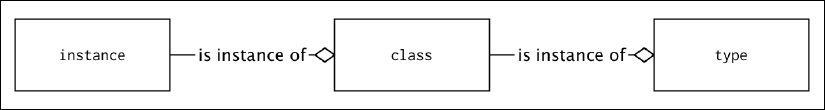
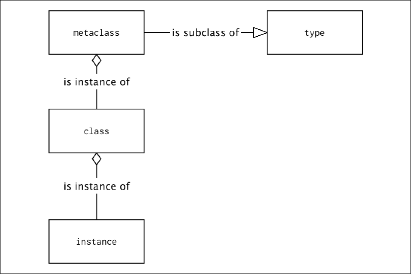
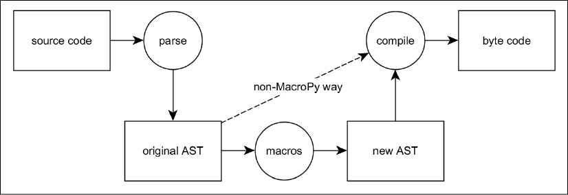

元编程是一组编程技术，专注于程序自省、理解自己的代码和修改自己的能力。这种编程方法为程序员提供了强大的功能和灵活性。如果没有元编程技术，我们可能不会拥有现代编程框架，或者至少这些框架的表现力会差很多。

元编程一词通常笼罩在神秘的光环中。许多程序员几乎只将它与可以在源代码级别检查和操作他们自己的代码的程序相关联。操作自己的源代码的程序绝对是应用元编程中最引人注目和最复杂的例子之一，但元编程有多种形式，并不总是复杂或困难。 Python 特别丰富的特性和模块使某些元编程技术变得简单和自然。

在本章中，我们将解释元编程的真正含义，并介绍一些在 Python 中进行元编程的实用方法。我们将从简单的元编程技术开始，比如函数和类装饰器，但也会涵盖高级技术来覆盖类实例创建过程和元类的使用。我们将以最强大但也最危险的元编程方法的示例结束，即代码生成模式。

在本章中，我们将涵盖以下主题：

- 什么是元编程？
- 使用装饰器在使用前修改函数行为
- 拦截类实例创建过程
- 元类
- 代码生成

在我们进入 Python 开发人员可用的一些元编程技术之前，让我们首先考虑技术要求。

## 技术要求

以下是本章提到的 Python 包，你可以从 PyPI 下载：

- inflection
- macropy3
- falcon
- hy

关于如何安装包的信息包含在第 2 章，现代 Python 开发环境中。

> 本章的代码文件可以在 https://github.com/PacktPublishing/Expert-Python-Programming-Fourth-Edition/tree/main/Chapter%208 找到。

## 什么是元编程？

也许我们可以找到元编程的一个很好的学术定义，但这是一本关于良好的软件工艺而不是计算机科学理论的书。这就是为什么我们将使用我们自己的元编程的非正式定义：

> “元编程是一种编写可以将自己视为数据的计算机程序的技术，因此它们可以在运行时内省、生成和/或修改自己。”

使用这个定义，我们可以区分 Python 中元编程的两个主要分支：

- 面向内省的元编程：专注于语言的自然内省能力以及函数和类型的动态定义
- 面向代码的元编程：元编程专注于将代码视为可变数据结构

面向内省的元编程专注于语言内省其基本元素（例如函数、类或类型）以及在旅途中创建或修改它们的能力。 Python 在这方面确实提供了很多工具。集成开发环境 (IDE) 经常使用 Python 语言的这一特性来提供实时代码分析和名称建议。 Python 中利用语言内省功能的最简单的元编程工具是装饰器，它允许向现有函数、方法或类添加额外的功能。接下来是允许你干扰类实例创建过程的类的特殊方法。最强大的是元类，它允许程序员甚至完全重新设计 Python 的面向对象编程的实现。

面向代码的元编程允许程序员直接使用原始（纯文本）格式或更易于编程的抽象语法树 (AST) 格式的代码。当然，第二种方法更复杂且更难使用，但允许进行非常特别的事情，例如扩展 Python 的语言语法，甚至创建你自己的领域特定语言 (DSL)。

在下一节中，我们将讨论元编程上下文中的装饰器。

## 使用装饰器在使用前修改函数行为

装饰器是 Python 中最常见的面向检查的元编程技术之一。因为 Python 中的函数是一等对象，它们可以在运行时被检查和修改。装饰器是能够检查、修改或包装其他功能的特殊功能。

装饰器语法在第 4 章 Python 与其他语言的比较中进行了解释，实际上它是一种语法糖，旨在使使用扩展现有代码对象并具有附加行为的函数变得更容易。

你可以编写使用简单装饰器语法的代码，如下所示：

```python
@some_decorator
def decorated_function(): 
    pass
```

你还可以用以下（更详细）的方式编写它：

```python
def decorated_function(): 
    pass 
decorated_function = some_decorator(decorated_function)
```

这种冗长的函数装饰形式清楚地显示了装饰器的作用。它接受一个函数对象并在运行时修改它。装饰器通常会返回一个新的函数对象，该对象替换预先存在的装饰函数名称。

在第 5 章，接口、模式和模块化中，我们已经看到函数装饰器在实现许多设计模式中是如何不可或缺的。函数装饰器通常用于拦截和预处理原始函数参数、修改返回值或通过其他功能方面（如日志记录、分析或评估调用者的授权/身份验证声明）来增强函数调用上下文。

例如，让我们考虑以下来自 functools 模块的 @lru_cache 装饰器的示例用法：

```python
from functools import lru_cache
@lru_cache(size=100)
def expensive(*args, **kwargs):
```

@lru_cache 装饰器为给定函数创建一个最近使用（LRU）的返回值缓存。它拦截传入的函数参数并将它们与最近使用的参数集列表进行比较。如果匹配，则返回缓存值而不是调用装饰函数。如果没有匹配，则先调用原函数，返回值保存在缓存中，以备后用。在我们的示例中，缓存将保存不超过 100 个值。

真正有趣的是，@lru_cache 的使用已经是一种元编程技术。它接受一个现有的代码对象（这里是 expensive() 函数）并修改其行为。它还拦截参数并检查它们的值和类型来决定是否可以缓存这些参数。

这是个好消息。我们已经在第 4 章 Python 与其他语言的比较中看到，装饰器在 Python 中相对容易编写和使用。在大多数情况下，装饰器使代码更短、更易于阅读且维护成本更低。这意味着它们可以作为元编程的完美介绍技术。 Python 中可用的其他元编程工具可能更难理解和掌握。

函数装饰器的自然进步是类装饰器。我们将在下一节中介绍它们。

### 更深一层：类装饰器

Python 鲜为人知的语法特性之一是类装饰器。它们的语法和实现与函数装饰器完全相同。唯一的区别是它们应该返回一个类而不是函数对象。

我们在前面的章节中已经使用了一些类装饰器。它们是来自第 4 章 Python 与其他语言的比较中介绍的 dataclasses 模块中的 @dataclass 装饰器，以及来自类型模块中的 @runtime_checkable，在第 5 章接口、模式和模块化中进行了解释。两个装饰器都依赖 Python 的自省能力来增强现有类的额外行为：

- @dataclass 装饰器检查类属性注释以创建 \_\_init\_\_() 方法和比较协议的默认实现，从而使开发人员免于编写可重复的样板代码。它还允许你使用可用作字典键的不可变和可散列实例创建自定义“冻结”类。
- @runtime_checkable 装饰器将协议子类标记为“运行时可检查”。这意味着协议子类的参数和返回值注释可用于在运行时确定另一个类是否实现了协议类定义的接口。

理解类装饰器如何工作的最好方法是边做边学。 @dataclass 和 @runtime_checkable 装饰器具有相当复杂的内部工作原理，因此我们将尝试构建自己的简单示例，而不是查看它们的实际代码。

数据类的一大特点是能够提供 \_\_repr\_\_() 方法的默认实现。该方法返回可以在交互式会话、日志或标准输出中显示的对象的字符串表示形式。

对于自定义类，此 \_\_repr\_\_() 方法默认仅包含类名和内存地址，但对于数据类，它会自动包含数据类的每个单独字段的表示。我们将尝试构建一个数据类装饰器，为任何类提供类似的功能。

我们将首先编写一个函数，如果给定要表示的属性列表，该函数可以返回任何类实例的人类可读表示：

```python
from typing import Any, Iterable
UNSET = object()
def repr_instance(instance: object, attrs: Iterable[str]) -> str:
    attr_values: dict[str, Any] = {
        attr: getattr(instance, attr, UNSET)
        for attr in attrs
    }
    sub_repr = ", ".join(
        f"{attr}={repr(val) if val is not UNSET else 'UNSET'}"
        for attr, val in attr_values.items()
    )
    return f"<{instance.__class__.__qualname__}: {sub_repr}>"
```

我们的 repr_instance() 函数首先使用 getattr() 函数遍历 attrs 参数中提供的所有属性名称的实例属性。在我们创建表示时可能未设置某些实例属性。如果属性未设置，getattr() 函数将返回 None——然而，None 也是一个有效的属性值，所以我们需要有一种方法来区分未设置的属性和 None 值。这就是我们使用 UNSET 标记值的原因。

> UNSET = object() 是创建唯一标记值的常见模式。裸对象类型实例仅在与自身进行比较时才在 is 运算符检查中返回 True。

一旦属性及其值已知，我们的函数就使用 f-strings 来创建类实例的实际表示，其中将包括 attrs 参数中定义的每个单独属性的表示。

我们很快就会看到如何在自定义类中自动包含这样的表示，但首先，让我们尝试看看它如何处理现有对象。例如，这里是在交互式会话中使用 instance_repr() 函数来获取虚数表示的示例：

```python
>>> repr_instance(1+10j, ["real", "imag"])
'<complex: real=1.0, imag=10.0>'
```

到目前为止一切都很好，但我们需要明确地传递对象实例并在我们想要打印它们之前知道所有可能的属性名称。这不是很方便，因为每次类的结构发生变化时，我们都必须更新 repr_instance() 的参数。我们将编写一个类装饰器，它将能够采用 repr_instance() 函数并将其注入到一个装饰类中。我们还将使用存储在类的 \_\_annotations\_\_ 属性下的类属性注释来确定我们要在表示中包含哪些属性。以下是我们装饰器的代码：

```python
def autorepr(cls):
    attrs = set.union(
        *(
            set(c.__annotations__.keys())
            for c in cls.mro()
            if hasattr(c, "__annotations__")
        )
    )
    def __repr__(self):
        return repr_instance(self, sorted(attrs))
    cls.__repr__ = __repr__
    return cls
```

在这几行中，我们使用了很多在第 4 章 Python 与其他语言的比较中学到的东西。我们首先从类方法解析顺序 (MRO) 中的每个类的 cls.\_\_annotations\_\_ 字典中获取带注释的属性列表。我们必须遍历整个 MRO，因为注释不是从基类继承的。

稍后，我们使用闭包来定义一个内部 \_\_repr\_\_() 函数，该函数可以从外部作用域访问 attrs 变量。完成后，我们用新的实现覆盖现有的 cls.\_\_repr\_\_() 方法。我们可以这样做，因为函数对象已经是非数据描述符。这意味着在类上下文中，它们成为方法并简单地接收一个实例对象作为第一个参数。

现在我们可以在一些自定义实例上测试我们的装饰器。让我们将代码保存在 autorepr.py 文件中，并定义一些带有属性注释的简单类，这些类将使用我们的 @autorepr 装饰器进行装饰：

```python
from typing import Any
@autorepr
class MyClass:
    attr_a: Any
    attr_b: Any
    attr_c: Any
    def __init__(self, a, b):
        self.attr_a = a
        self.attr_b = b
```

如果你保持警惕，你可能已经注意到我们错过了 attr_c 属性初始化。这是故意的。它将让我们看到@autorepr 如何处理未设置的属性。让我们启动 Python，导入我们的类，然后查看自动生成的表示：

```python
>>> from autorepr import MyClass
>>> MyClass("Ultimate answer", 42)
<MyClass: attr_a='Ultimate answer', attr_b=42, attr_c=UNSET>
>>> MyClass([1, 2, 3], ["a", "b", "c"])
<MyClass: attr_a=[1, 2, 3], attr_b=['a', 'b', 'c'], attr_c=UNSET>
>>> instance = MyClass(None, None)
>>> instance.attr_c = None
>>> instance
<MyClass: attr_a=None, attr_b=None, attr_c=None>
```

上面来自交互式 Python 会话的示例显示了 @autorepr 装饰器如何使用类属性注释来发现需要包含在实例表示中的字段。它还能够将未设置的属性与具有显式 None 值的属性区分开来。装饰器是可重用的，因此你可以轻松地将其应用于任何具有属性类型注释的类，而不是手动创建新的 \_\_repr\_\_() 方法。

此外，它不需要经常维护。如果你使用附加属性注释扩展类，它将自动包含在实例表示中。

就地修改现有类（也称为猴子补丁）是类装饰器中常用的技术。使用装饰器增强现有类的另一种方法是利用闭包动态创建新的子类。如果我们必须将我们的示例重写为子类化模式，我们可以这样写：

```python
def autorepr(cls):
    attrs = cls.__annotations__.keys()
    class Klass(cls):
        def __repr__(self):
            return repr_instance(self, attrs)
    return Klass
```

以这种方式在类装饰器中使用闭包的主要缺点是这种技术会影响类层次结构。其中，这将覆盖类的 \_\_name\_\_、\_\_qualname\_\_ 和 \_\_doc\_\_ 属性。在我们的例子中，这也意味着部分预期功能将丢失。以下是使用此类装饰器装饰的 MyClass 的示例表示：

```python
<autorepr.<locals>.Klass: attr_a='Ultimate answer', attr_b=42, attr_c=UNSET>
<autorepr.<locals>.Klass: attr_a=[1, 2, 3], attr_b=['a', 'b', 'c'], attr_c=UNSET>
```

这不容易解决。 functools 模块提供了@wraps 实用装饰器，可以在普通函数装饰器中使用它来保存带注释函数的元数据。不幸的是，它不能与类装饰器一起使用。这使得在类装饰器中子类化的使用受到限制。例如，它们可以破坏自动文档生成工具的结果。

尽管如此，尽管有这个警告，类装饰器是流行的 mixin 类模式的简单轻量级替代品。 Python 中的 mixin 是一个不打算实例化的类，而是用于为其他现有类提供一些可重用的 API 或功能。 Mixin 类几乎总是使用多重继承添加。它们的用法通常采用以下形式：

```python
class SomeConcreteClass(MixinClass, SomeBaseClass): 
    pass
```

Mixin 类形成了一种有用的设计模式，可在许多库和框架中使用。举个例子，Django 是一个广泛使用它们的示例框架。虽然有用且流行，但如果设计不当，mixin 类会引起一些麻烦，因为在大多数情况下，它们需要开发人员依赖多重继承。正如我们之前所说，由于其明确的 MRO 实现，Python 可以相对较好地处理多重继承。无论如何，如果可以，尽量避免子类化多个类，因为多重继承使代码变得复杂且难以使用。这就是为什么类装饰器可以很好地替代 mixin 类的原因。

通常，装饰器专注于在实际使用之前修改函数和类的行为。函数装饰器用它们的包装替代品和类装饰器替换现有的函数，通常修改类定义。但是有一些元编程技术更专注于在实际使用时修改代码行为。其中一种技术依赖于通过覆盖 \_\_new\_\_() 方法来拦截类实例的创建过程。我们将在下一节讨论这个问题。

## 拦截类实例创建过程

有两个特殊的方法与类实例的创建和初始化过程有关。它们是 \_\_init\_\_() 和 \_\_new\_\_()。

\_\_init\_\_() 方法与许多面向对象的编程语言中的构造函数的概念最接近。它接收一个新的类实例和初始化参数，并负责初始化类实例状态。

特殊方法\_\_new\_\_() 是一个静态方法，实际上负责创建类实例。这个 \_\_new\_\_(cls, [,...]) 方法在 \_\_init\_\_() 初始化方法之前被调用。通常，重写的 \_\_new\_\_() 方法的实现使用带有合适参数的 super().\_\_new\_\_() 调用其超类版本，并在返回之前修改实例。

> \_\_new\_\_() 方法是一种特殊情况的静态方法，因此无需使用 staticmethod 装饰器将其声明为静态方法。

下面是一个示例类，它具有重写的 \_\_new\_\_() 方法实现，以计算类实例的数量：

```python
class InstanceCountingClass:
    created = 0
    number: int

    def __new__(cls, *args, **kwargs):
        instance = super().__new__(cls)
        instance.number = cls.created
        cls.created += 1
        return instance

    def __repr__(self):
        return (
            f"<{self.__class__.__name__}: "
            f"{self.number} of {self.created}>"
        )
```

这是示例交互式会话的日志，显示了我们的 InstanceCountingClass 实现是如何工作的：

```python
>>> instances = [InstanceCountingClass() for _ in range(5)]
>>> for i in instances:
...     print(i)
...
<InstanceCountingClass: 0 of 5>
<InstanceCountingClass: 1 of 5>
<InstanceCountingClass: 2 of 5>
<InstanceCountingClass: 3 of 5>
<InstanceCountingClass: 4 of 5>
>>> InstanceCountingClass.created
5
```

\_\_new\_\_() 方法通常应该返回特色类的实例，但它也可以返回其他类的实例。如果发生这种情况（返回不同的类实例），则跳过对 \_\_init\_\_() 方法的调用。当需要修改不可变类实例（如 Python 的某些内置类型）的创建/初始化行为时，这一事实非常有用。

以下是不包含零值的子类 int 类型的示例：

```python
class NonZero(int): 
    def __new__(cls, value): 
        return super().__new__(cls, value) if value != 0 else None 
 
    def __init__(self, skipped_value): 
        # implementation of __init__ could be skipped in this case 
        # but it is left to present how it may be not called 
        print("__init__() called") 
        super().__init__()
```

上面的示例包括几个打印语句，以展示 Python 在某些情况下如何跳过 __init__() 方法调用。让我们在以下交互式会话中回顾这些：

```python
>>> type(NonZero(-12))
__init__() called
<class '__main__.NonZero'>
>>> type(NonZero(0))
<class 'NoneType'>
>>> NonZero(-3.123)
__init__() called
-3
```

那么，我们什么时候应该使用 \_\_new\_\_() 呢？答案很简单：仅当 \_\_init\_\_() 不够用时。已经提到了一种这样的情况，即子类化不可变的内置 Python 类型，例如 int、str、float、frozenset 等。这是因为一旦创建了 \_\_init\_\_() 方法，就无法修改这样的不可变对象实例。

一些程序员会争辩说 \_\_new\_\_() 可能对执行重要的对象初始化很有用，如果用户忘记在重写的初始化方法中使用 super().\_\_init\_\_() 调用可能会错过这些初始化。虽然听起来很合理，但这有一个主要缺点。使用这种方法，如果这是已经需要的行为，程序员就很难明确跳过之前的初始化步骤。它还打破了在 \_\_init\_\_() 中执行的所有初始化的潜规则。

因为 \_\_new\_\_() 不限于返回相同的类实例，所以很容易被滥用。不负责任地使用这种方法可能会对代码的可读性造成很大的伤害，因此应该始终谨慎使用它并有大量文档作为支持。通常，最好为给定的问题寻找可能可用的其他解决方案，而不是以破坏基本程序员期望的方式影响对象创建。甚至不可变类型的覆盖初始化也可以用更可预测和完善的设计模式（如工厂方法）替换。

> Python 中的工厂方法通常使用 classmethod 装饰器定义，它可以在调用类构造函数之前拦截参数。这通常允许你将多个初始化语义打包到一个类中。下面是一个列表类型子类的例子，它有两个工厂方法来创建大小增加一倍或三倍的列表实例：
>
> ```python
> from collections import UserList
> class XList(UserList):
>     @classmethod
>     def double(cls, iterable):
>         return cls(iterable) * 2
>     @classmethod
>     def triple(cls, iterable):
>         return cls(iterable) * 3
> ```

至少在 Python 编程的一个方面，\_\_new\_\_() 方法的广泛使用是有充分理由的。这些是元类，将在下一节中描述。

## 元类

元类是 Python 的一个特性，许多人认为它是语言中最难理解的东西之一，因此被大量开发人员避免。实际上，一旦你了解了一些基本概念，它就没有听起来那么复杂。作为奖励，知道如何使用元类使你能够做没有它们就不可能的事情。

元类是定义其他类型（类）的类型（类）。为了理解它们的工作原理，最重要的事情是类（因此，定义对象结构和行为的类型）也是对象。因此，如果它们是对象，则它们具有关联的类。每个类定义的基本类型就是内置类型类（见图 8.1）。



在 Python 中，可以用你自己的类型替换类对象的元类。通常，新的元类仍然是类型元类的子类（参见图 8.2），因为不这样做会使生成的类在继承方面与其他类高度不兼容：



让我们在下一节中看看元类的一般语法。

### 一般语法

对内置 type() 类的调用可以用作 class 语句的动态等效项。以下是带有 type() 调用的类定义示例：

```python
def method(self): 
    return 1 
 
MyClass = type('MyClass', (), {'method': method})
```

第一个参数是类名，第二个是基类列表（这里是一个空元组），第三个是类属性（通常是方法）的字典。这等效于使用 class 关键字显式定义类：

```python
class MyClass: 
    def method(self): 
        return 1
```

使用 class 语句创建的每个类都隐式地使用 type 作为其元类。可以通过向 class 语句提供 metaclass 关键字参数来更改此默认行为，如下所示：

```python
class ClassWithAMetaclass(metaclass=type): 
    pass
```

作为元类参数提供的值通常是另一个类对象，但它可以是任何其他接受与类型类相同的参数并预期返回另一个类对象的可调用对象。

元类的详细调用签名为 type(name, bases, namespace) ，参数含义如下：

- name：这是将存储在 \_\_name\_\_ 属性中的类的名称
- bases：这是将成为 \_\_bases\_\_ 属性并将用于构造新创建类的 MRO 的父类列表
- namespace：这是一个命名空间（映射），其中包含将成为 \_\_dict\_\_ 属性的类主体的定义

考虑元类的一种方法是 \_\_new\_\_() 方法，但处于更高级别的类定义。

尽管可以使用显式调用 type() 的函数来代替元类，但通常的方法是为此使用从 type 继承的不同类。元类的通用模板如下：

```python
class Metaclass(type):
    def __new__(mcs, name, bases, namespace):
        return super().__new__(mcs, name, bases, namespace)

    @classmethod
    def __prepare__(mcs, name, bases, **kwargs):
        return super().__prepare__(name, bases, **kwargs)

    def __init__(cls, name, bases, namespace, **kwargs):
        super().__init__(name, bases, namespace)

    def __call__(cls, *args, **kwargs):
        return super().__call__(*args, **kwargs)
```


name、base 和 namespace 参数的含义与我们之前解释的 type() 调用中的含义相同，但是这四个方法中的每一个都在类生命周期的不同阶段被调用：

- \_\_new\_\_(mcs, name, bases, namespace)：它负责以与普通类相同的方式实际创建类对象。第一个位置参数是元类对象。在前面的例子中，它只是元类。请注意， mcs 是此参数的流行命名约定。
- \_\_prepare\_\_(mcs, name, bases, \*\*kwargs)：这会创建一个空的命名空间对象。默认情况下，它返回一个空的 dict 实例，但可以覆盖它以返回任何其他 dict 子类实例。请注意，它不接受命名空间作为参数，因为在调用它之前，命名空间尚不存在。该方法的示例用法将在稍后的元类用法部分中解释。
- \_\_init\_\_(cls, name, bases, namespace, \*\*kwargs)：这在元类实现中并不常见，但与普通类的含义相同。一旦使用 \_\_new\_\_() 创建它，它就可以执行额外的类对象初始化。第一个位置参数现在按照惯例命名为 cls 以标记这已经是一个创建的类对象（元类实例）而不是元类对象。当 \_\_init\_\_() 被调用时，类已经被构造，所以 \_\_init\_\_() 方法可以做的比 \_\_new\_\_() 方法少。实现这样的方法与使用类装饰器非常相似，但主要区别在于 \_\_init\_\_() 将为每个子类调用，而类装饰器不会为子类调用。
- \_\_call\_\_(cls, \*args, \*\*kwargs)：当元类的实例被调用时调用。元类的实例是一个类对象（参见图 8.1）；当你创建类的新实例时会调用它。这可用于覆盖创建和初始化类实例的默认方式。

前面的每个方法都可以接受额外的额外关键字参数，所有这些都由 \*\*kwargs 表示。可以使用类定义中的额外关键字参数以以下代码的形式将这些参数传递给元类对象：

```python
class Klass(metaclass=Metaclass, extra="value"): 
    pass
```


如果没有适当的示例，这些信息一开始可能会让人不知所措，所以让我们通过一些 print() 调用来跟踪元类、类和实例的创建：

```python
class RevealingMeta(type):
    def __new__(mcs, name, bases, namespace, **kwargs):
        print(mcs, "METACLASS __new__ called")
        return super().__new__(mcs, name, bases, namespace)

    @classmethod
    def __prepare__(mcs, name, bases, **kwargs):
        print(mcs, " METACLASS __prepare__ called")
        return super().__prepare__(name, bases, **kwargs)

    def __init__(cls, name, bases, namespace, **kwargs):
        print(cls, " METACLASS __init__ called")
        super().__init__(name, bases, namespace)

    def __call__(cls, *args, **kwargs):
        print(cls, " METACLASS __call__ called")
        return super().__call__(*args, **kwargs)
```


使用 RevealingMeta 作为元类来创建新的类定义将在 Python 交互式会话中提供以下输出：

```python
>>> class RevealingClass(metaclass=RevealingMeta):
...     def __new__(cls):
...         print(cls, "__new__ called")
...         return super().__new__(cls)
...     def __init__(self):
...         print(self, "__init__ called")
...         super().__init__()
... 
<class '__main__.RevealingMeta'> METACLASS __prepare__ called
<class '__main__.RevealingMeta'> METACLASS __new__ called
<class '__main__.RevealingClass'> METACLASS __init__ called
```

如你所见，在类定义期间，仅调用元类方法。第一个是 \_\_prepare\_\_() 方法，它准备一个新的类命名空间。紧随其后的是 \_\_new\_\_() 方法，该方法负责实际的类创建并接收由 \_\_prepare\_\_() 方法创建的命名空间。最后是 \_\_init\_\_() 方法，它接收由 \_\_new\_\_() 方法（这里是 RevealingClass 定义）创建的类对象。

元类方法在类实例创建期间与类方法合作。我们可以通过在 Python 交互式会话中创建一个新的 RevealingClass 实例来跟踪方法调用的顺序：

```python
>>> instance = RevealingClass()
<class '__main__.RevealingClass'> METACLASS __call__ called
<class '__main__.RevealingClass'> CLASS __new__ called
<__main__.RevealingClass object at 0x10f594748> CLASS __init__ called
```

调用的第一个方法是元类的 \_\_call\_\_() 方法。此时，它可以访问类对象（此处为 RevealingClass 定义），但尚未创建类实例。它在类实例创建之前被调用，这应该发生在类定义的 \_\_new\_\_() 方法中。类实例创建过程的最后一步是调用负责实例初始化的类 \_\_init\_\_() 方法。

我们大致知道元类在理论上是如何工作的，所以现在让我们看一下元类的示例用法。

### 元类使用

元类是做不寻常事情的好工具。它们在修改典型的类行为方面提供了很大的灵活性和能力。因此，很难说出它们使用的常见示例是什么。可以说元类的大多数用法都非常不常见。

例如，让我们看看每种对象类型的 \_\_prepare\_\_() 方法。它负责准备类属性的命名空间。类命名空间的默认类型是普通字典。多年来，\_\_prepare\_\_() 方法的典型示例是提供一个 collections.OrderedDict 实例作为类命名空间。

保留类命名空间中属性的顺序允许诸如可重复对象表示和序列化之类的事情。但是由于 Python 3.7 字典保证保留键插入顺序，所以这个用例已经不复存在了。但这并不意味着我们不能玩命名空间。

让我们想象一下以下问题：我们有一个庞大的 Python 代码库，该代码库已经开发了几十年，并且大部分代码是在团队中的任何人关心编码标准之前编写的。例如，我们可能有混合camelCase 和snake_case 的类作为方法命名约定。如果我们关心一致性，我们将被迫花费大量精力将整个代码库重构为任一命名约定。或者我们可以使用一些巧妙的元类，这些元类可以添加到现有类之上，从而允许以两种方式调用方法。我们可以使用新的调用约定（最好是 snake_case）编写新代码，同时保持旧代码不变并等待逐步更新。

这是可以使用 \_\_prepare\_\_() 方法的情况的示例！让我们从编写一个 dict 子类开始，它会自动将驼峰命名法插入到snake_case 键中：

```python
from typing import Any
import inflection
class CaseInterpolationDict(dict):
    def __setitem__(self, key: str, value: Any):
        super().__setitem__(key, value)
        super().__setitem__(inflection.underscore(key), value)
```

> 为了节省一些工作，我们使用了 inflection 模块，它不是标准库的一部分。 它能够在各种“字符串情况”之间转换字符串。 你可以使用 pip 从 PyPI 下载它：
>
> ```sh
> $ pip install inflection
> ```

我们的 CaseInterpolationDict 类几乎像一个普通的 dict 类型一样工作，但是每当它存储一个新值时，它都会将它保存在两个键下：原始的一个和一个转换为snake_case的。请注意，我们使用 dict 类型作为父类，而不是推荐的 collections.UserDict。这是因为我们将在元类 \_\_prepare\_\_() 方法中使用这个类，并且 Python 要求命名空间是 dict 实例。

现在是时候编写一个实际的元类来覆盖类命名空间类型了。它会出奇的短：

```python
class CaseInterpolatedMeta(type):
    @classmethod
    def __prepare__(mcs, name, bases):
        return CaseInterpolationDict()
```


既然我们已经设置好了，我们现在可以使用 CaseInterpolatedMeta 元类来创建一个虚拟类，其中包含一些使用驼峰命名约定的方法：

```python
class User(metaclass=CaseInterpolatedMeta):
    def __init__(self, firstName: str, lastName: str):
        self.firstName = firstName
        self.lastName = lastName

    def getDisplayName(self):
        return f"{self.firstName} {self.lastName}"

    def greetUser(self):
        return f"Hello {self.getDisplayName()}!"
```

让我们将所有代码保存在 case_user.py 文件中并启动交互式会话以查看 User 类的行为：

```python
>>> from case_user import User
```

首先要注意的是 User.__dict__ 属性的内容：

```python
>>> User.__dict__
mappingproxy({
    '__module__': 'case_class',
    '__init__': <function case_class.User.__init__(self, firstName: str, lastName: str)>,
    'getDisplayName': <function case_class.User.getDisplayName(self)>,
    'get_display_name': <function case_class.User.getDisplayName(self)>,
    'greetUser': <function case_class.User.greetUser(self)>,
    'greet_user': <function case_class.User.greetUser(self)>,
    '__dict__': <attribute '__dict__' of 'User' objects>,
    '__weakref__': <attribute '__weakref__' of 'User' objects>,
    '__doc__': None
})
```

首先引人注目的是方法被重复的事实。这正是我们想要实现的目标。第二个重要的事实是 User.\_\_dict\_\_ 是 mappingproxy 类型。这是因为 Python 在创建最终类对象时总是将命名空间对象的内容复制到新的 dict 中。映射代理还允许代理访问类 MRO 中的超类。

所以，让我们看看我们的解决方案是否可以通过调用它的所有方法来工作：

```python
>>> user = User("John", "Doe")
>>> user.getDisplayName()
'John Doe'
>>> user.get_display_name()
'John Doe'
>>> user.greetUser()
'Hello John Doe!'
>>> user.greet_user()
'Hello John Doe!'
```

有用！即使我们还没有定义它们，我们也可以调用所有的 snake_case 方法。对于一个不知情的开发人员来说，这看起来几乎就像魔术一样！

不过，这是一种需要非常小心使用的魔法。请记住，你刚刚看到的是一个玩具示例。它的真正目的是展示元类和几行代码的可能性。事实上，在庞大而复杂的代码库中做类似的事情可能真的很危险。元类与 Python 数据模型的核心交互，并可能导致各种陷阱。其中一些将在下一节中讨论。

### 元类陷阱

一旦掌握了元类，它就是一个强大的特性，但总是使代码复杂化。元类也不能很好地组合，如果你尝试通过继承混合多个元类，你很快就会遇到问题。

像其他一些高级 Python 特性一样，元类非常有弹性，很容易被滥用。虽然类的调用签名相当严格，但 Python 并不强制执行返回参数的类型。只要它在调用时接受传入参数并且在需要时具有所需的属性，它就可以是任何东西。

一个可以是任何地方的对象是 unittest.mock 模块中提供的 Mock 类的实例。 Mock 不是元类，也不从类型类继承。它也不会在实例化时返回类对象。尽管如此，它仍然可以作为元类关键字参数包含在类定义中，这不会引发任何语法错误。

使用 Mock 作为元类当然完全是无稽之谈，但让我们考虑以下示例：

```python
>>> from unittest.mock import Mock
>>> class Nonsense(metaclass=Mock):  # pointless, but illustrative
...     pass
... 
>>> Nonsense
<Mock spec='str' id='4327214664'>
```

不难预测，任何实例化我们的 Nonsense 伪类的尝试都会失败。真正有趣的是你将尝试这样做的以下异常和回溯：

```python
>>> Nonsense()
Traceback (most recent call last):
  File "<stdin>", line 1, in <module>
  File "/Library/Frameworks/Python.framework/Versions/3.9/lib/python3.9/unittest/mock.py", line 917, in __call__
    return _mock_self._mock_call(*args, **kwargs)
  File "/Library/Frameworks/Python.framework/Versions/3.9/lib/python3.9/unittest/mock.py", line 976, in _mock_call
    result = next(effect)
StopIteration
```

StopIteration 异常是否给你任何线索，表明我们在元类级别上的类定义可能存在问题？显然不是。这个例子说明了如果你不知道去哪里寻找错误，调试元类代码是多么困难。

但是在某些情况下，如果没有元类，事情就无法轻松完成。例如，很难想象 Django 的 ORM 实现是在没有大量使用元类的情况下构建的。这可能是可能的，但最终的解决方案不太可能同样易于使用。框架是元类真正闪耀的地方。它们通常有很多复杂的内部代码，不容易理解和遵循，但最终允许其他程序员编写在更高抽象级别上运行的更简洁和可读的代码。

对于简单的事情，例如更改读/写属性或添加新属性，可以避免使用元类，而采用更简单的解决方案，例如属性、描述符或类装饰器。还有一个名为 \_\_init\_\_subclass\_\_() 的特殊方法，它可以在许多情况下用作元类的替代方法。让我们在下一节中仔细看看它。

### 使用 \_\_init\_subclass\_\_() 方法作为元类的替代方法

更深入一步：类装饰器部分中介绍的@autorepr 装饰器相当简单且有用。不幸的是，它有一个我们还没有讨论过的问题：它不适用于子类化。

它适用于没有任何后代的简单一次性类，但是一旦你开始继承最初装饰的类，你会注意到它不像人们预期的那样工作。考虑以下类继承：

```python
from typing import Any
from autorepr import autorepr


@autorepr
class MyClass:
    attr_a: Any
    attr_b: Any
    attr_c: Any

    def __init__(self, a, b):
        self.attr_a = a
        self.attr_b = b


class MyChildClass(MyClass):
    attr_d: Any

    def __init__(self, a, b):
        super().__init__(a, b)
```

如果你尝试在交互式解释器会话中获取 MyChildClass 实例的表示，你将看到以下输出：

```python
<MyChildClass: attr_a='Ultimate answer', attr_b=42, attr_c=UNSET>
<MyChildClass: attr_a=[1, 2, 3], attr_b=['a', 'b', 'c'], attr_c=UNSET>
```

这是可以理解的。 @autorepr 装饰器仅用于基类，因此无法访问子类注释。 MyChildClass 继承了未修改的 \_\_repr\_\_() 方法。

解决这个问题的方法是将 @autorepr 装饰器也添加到子类中：

```python
@autorepr
class MyChildClass(MyClass):
    attr_d: Any
    def __init__(self, a, b):
        super().__init__(a, b)
```

但是我们如何让类装饰器自动应用于子类呢？我们可以使用元类清楚地复制相同的行为，但我们已经知道这确实会使事情复杂化。这也会使使用变得更加困难，因为你无法真正混合使用不同元类的类继承。

幸运的是，有一种方法可以做到这一点。 Python 类提供了将为每个子类调用的 \_\_init\_subclass\_\_() 钩子方法。对于其他有问题的元类，这是一个方便的替代方案。这个钩子只是让基类知道它有子类。它通常用于促进各种事件驱动和信号模式（参见第 7 章，事件驱动编程），但也可用于创建“可继承”类装饰器。

考虑对我们的@autorepr 装饰器进行以下修改：

```python
def autorepr(cls):
    attrs = set.union(
        *(
            set(c.__annotations__.keys())
            for c in cls.mro()
            if hasattr(c, "__annotations__")
        )
    )

    def __repr__(self):
        return repr_instance(self, sorted(attrs))

    cls.__repr__ = __repr__

    def __init_subclass__(cls):
        autorepr(cls)

    cls.__init_subclass__ = classmethod(__init_subclass__)
    return cls
```

新的是 \_\_init\_subclass\_\_() 方法，每次对装饰类进行子类化时，都会使用新的类对象调用该方法。 在该方法中，我们只需重新应用 @autorepr 装饰器。 它将可以访问所有新的注释，并且还可以将自己挂钩到进一步的子类中。 这样你就不必为每个新子类手动添加装饰器，并且可以确保所有 \_\_repr\_\_() 方法始终可以访问最新的注释。

到目前为止，我们已经讨论了有助于元编程技术的 Python 内置特性。 我们已经看到 Python 在这方面非常慷慨，这要归功于自然的内省功能、元类和灵活的对象模型。 但是，几乎任何语言都可以使用元编程的一个分支，无论其功能如何。 它是代码生成。 我们将在下一节中讨论。

## 代码生成

正如我们已经提到的，动态代码生成是元编程中最困难的方法。 Python 中有一些工具可以让你生成和执行代码，甚至可以对已编译的代码对象进行一些修改。

Hy（稍后提到）等各种项目表明，甚至可以使用代码生成技术在 Python 中重新实现整个语言。这证明可能性实际上是无限的。知道这个主题有多大以及它充满了各种陷阱的程度，我什至不会尝试就如何以这种方式创建代码或提供有用的代码示例提供详细的建议。

无论如何，如果你计划自己更深入地研究这个领域，那么了解什么是可能的可能对你有用。因此，仅将本节视为进一步学习的可能起点的简短摘要。

让我们来看看如何使用 exec()、eval() 和 compile() 函数。

### 执行、评估和编译

Python 提供了以下三个内置函数来手动执行、评估和编译任意 Python 代码：

- exec(object, globals, locals)：这允许你动态执行 Python 代码。 object 属性应该是表示单个语句或多个语句序列的字符串或代码对象（请参阅 compile() 函数）。 globals 和 locals 参数为执行的代码提供全局和局部命名空间，并且是可选的。
    如果未提供，则代码在当前范围内执行。如果提供，全局变量必须是字典，而局部变量可以是任何映射对象。 exec() 函数总是返回 None。
- eval(expression, globals, locals)：这用于通过返回其值来评估给定的表达式。它类似于 exec()，但它期望表达式参数是单个 Python 表达式而不是语句序列。它返回计算表达式的值。
- compile(source, filename, mode)：这会将源代码编译成代码对象或 AST 对象。源代码作为源参数中的字符串值提供。文件名应该是从中读取代码的文件的名称。如果它没有关联的文件（例如，因为它是动态创建的），则“\<string\>”是常用的值。 mode 参数应该是“exec”（语句序列）、“eval”（单个表达式）或“single”（单个交互式语句，例如在 Python 交互式会话中）。

exec() 和 eval() 函数在尝试动态生成代码时最容易开始，因为它们可以对字符串进行操作。如果你已经知道如何使用 Python 进行编程，那么你可能已经知道如何以编程方式正确生成工作源代码。

在元编程上下文中最有用的显然是 exec() 因为它允许你执行任何 Python 语句序列。任何这个词应该让你感到震惊。即使 eval() 只允许对熟练程序员手中的表达式求值（当接受用户输入时），也会导致严重的安全漏洞。

> 请注意，你最不应该害怕 Python 解释器崩溃。由于不负责任地使用 exec() 和 eval() 而引入远程执行漏洞可能会损害你作为专业开发人员的形象，甚至是你的工作。这意味着 exec() 和 eval() 都不应该用于不受信任的输入。来自最终用户的每一个输入都应该被认为是不安全的。

即使与可信输入一起使用，也有一个关于 exec() 和 eval() 的小细节列表，这些细节太长而无法包含在此处，但可能会影响你的应用程序以你意想不到的方式工作。 Armin Ronacher 有一篇很好的文章，其中列出了其中最重要的内容，标题为小心 Python 中的 exec 和 eval（请参阅 http://lucumr.pocoo.org/2011/2/1/exec-in-python/）。

尽管有这些可怕的警告，但在自然情况下，使用 exec() 和 eval() 确实是合理的。尽管如此，即使是最微小的疑问，你也不应该使用它们并尝试找到不同的解决方案。

> eval() 函数的签名可能会让你认为，如果你提供空的 globals 和 locals 命名空间并用适当的 try ... except 语句包装它们，那么它将相当安全。没有什么比这更错的了。 Ned Batchelder 写了一篇非常好的文章，其中展示了如何在 eval() 调用中导致解释器分段错误，即使删除了对所有 Python 内置函数的访问权限（参见 http://nedbatchelder.com/blog/201206/ eval_really_is_dangerous.html）。这应该足以证明 exec() 和 eval() 都不应该与不受信任的输入一起使用。

我们将在下一节中查看抽象语法树。

### 抽象语法树

Python 语法在编译为字节码之前先转换为 AST 格式。这是源代码抽象句法结构的树形表示。由于内置的 ast 模块，可以处理 Python 语法。可以使用带有 ast.PyCF_ONLY_AST 标志的 compile() 函数或使用 ast.parse() 助手来创建 Python 代码的原始 AST。直接反向翻译并没有那么简单，标准库中没有提供可以这样做的函数。不过，一些项目，例如 PyPy，会做这样的事情。

ast 模块提供了一些帮助函数，允许你使用 AST，例如：

```python
>>> import ast
>>> tree = ast.parse('def hello_world(): print("hello world!")')
>>> tree
<_ast.Module object at 0x00000000038E9588>
>>> print(ast.dump(tree, indent=4))
Module(
    body=[
        FunctionDef(
            name='hello_world',
            args=arguments(
                posonlyargs=[],
                args=[],
                kwonlyargs=[],
                kw_defaults=[],
                defaults=[]),
            body=[
                Expr(
                    value=Call(
                        func=Name(id='print', ctx=Load()),
                        args=[
                            Constant(value='hello world!')],
                        keywords=[]))],
            decorator_list=[])],
    type_ignores=[])
```

重要的是要知道在传递给 compile() 之前可以修改 AST。 这为你提供了许多新的可能性。 例如，新的语法节点可用于额外的检测，例如测试覆盖率测量。 还可以修改现有的代码树，以便向现有语法添加新的语义。 MacroPy 项目 (https://github.com/lihaoyi/macropy) 使用了这种技术，使用现有的语法将语法宏添加到 Python 中（参见图 8.3）：



不幸的是，MacroPy 与最新的 Python 版本不兼容，并且仅经过测试可以在 Python 3.4 上运行。无论如何，这是一个非常有趣的项目，它展示了使用 AST 操作可以实现的目标。

AST 也可以通过纯人工的方式创建，完全不需要解析任何源代码。这使 Python 程序员能够为自定义 DSL 创建 Python 字节码，甚至可以在 Python VM 之上完全实现其他编程语言。

### 导入挂钩

利用 MacroPy 修改原始 AST 的能力就像使用 import macropy.activate 语句一样简单，因为它能够以某种方式覆盖 Python 导入行为。这并不神奇，Python 提供了一种使用以下两种导入钩子为每个开发人员拦截导入的方法：

- Meta hooks：在任何其他导入处理发生之前调用它们。使用元钩子，你可以覆盖处理 sys.path 的方式，即使是冻结的和内置的模块。要添加新的元挂钩，必须将新的元路径查找器对象添加到 sys.meta_path 列表中。
- 导入路径挂钩：它们被称为 sys.path 处理的一部分。如果遇到与给定挂钩关联的路径项，则使用它们。通过使用新的路径条目查找器对象扩展 sys.path_hooks 列表来添加导入路径挂钩。

实现路径查找器和元路径查找器的详细信息在官方 Python 文档中有大量记录（请参阅 https://docs.python.org/3/reference/import.html）。如果你想与该级别的导入进行交互，则官方文档应该是你的主要资源。之所以如此，是因为 Python 中的导入机制相当复杂，任何将其总结为几段的尝试都不可避免地会失败。在这里，我们只是想让你意识到这样的事情是可能的。

我们将在以下部分中查看使用代码生成模式的项目。

### Python 代码生成的例子

很难找到依赖于代码生成模式的库的真正可用的实现，而这不仅仅是一个实验或简单的概念证明。造成这种情况的原因很明显：

- 应该谨慎对待 exec() 和 eval() 函数，因为如果不负责任地使用它们，它们会导致真正的灾难
- 成功的代码生成很难开发和维护，因为它需要对语言的深入理解和一般的特殊编程技能

尽管存在这些困难，但仍有一些项目成功地采用了这种方法来提高性能或实现其他方式无法实现的目标。

#### Falcon 的编译路由器

Falcon (http://falconframework.org/) 是一个极简的 Python WSGI web 框架，用于构建快速和轻量级的 web API。它强烈鼓励目前在网络上非常流行的 REST 架构风格。它是其他相当重的框架（例如 Django 或 Pyramid）的一个很好的替代品。它也是其他以简单为目标的微框架的有力竞争者，例如 Flask、Bottle 或 web2py。

Falcon 的最佳功能之一是其非常简单的路由机制。它不像 Django urlconf 提供的路由那么复杂，也没有提供那么多的特性，但在大多数情况下，对于任何遵循 REST 架构设计的 API 来说就足够了。 Falcon 的路由最有趣的是该路由器的内部构造。 Falcon 的路由器是使用从路由列表生成的代码实现的，每次注册新路由时代码都会更改。这是使路由快速所需的努力。

考虑这个非常简短的 API 示例，取自 Falcon 的 Web 文档：

```python
# sample.py 
import falcon 
import json 
  
class QuoteResource: 
    def on_get(self, req, resp): 
        """Handles GET requests""" 
        quote = { 
            'quote': 'I\'ve always been more interested in ' 
                     'the future than in the past.', 
            'author': 'Grace Hopper' 
        } 
 
        resp.body = json.dumps(quote) 
  
api = falcon.API() 
api.add_route('/quote', QuoteResource())
```

简而言之，调用 api.add_route() 方法会动态更新 Falcon 请求路由器的整个生成的代码树。它还使用 compile() 函数对其进行编译，并使用 eval() 生成新的路由查找函数。让我们仔细看看 api.\_router.\_find() 函数的以下 \_\_code\_\_ 属性：

```python
>>> api._router._find.__code__
<code object find at 0x00000000033C29C0, file "<string>", line 1>
>>> api.add_route('/none', None)
>>> api._router._find.__code__
<code object find at 0x00000000033C2810, file "<string>", line 1>
```

该脚本显示该函数的代码是从字符串生成的，而不是从真正的源代码文件（“\<string\>”文件）生成的。它还表明，每次调用 api.add_route() 方法时，实际代码对象都会发生变化（对象在内存中的地址发生变化）。

#### Hy

Hy (http://docs.hylang.org/) 是 Lisp 的方言，完全用 Python 编写。许多在 Python 中实现其他编程语言的类似项目通常只尝试对作为类文件对象或字符串提供的纯代码形式进行标记，并将其解释为一系列显式 Python 调用。与其他语言不同，Hy 可以被认为是一种完全在 Python 运行时环境中运行的语言，就像 Python 一样。用 Hy 编写的代码可以使用现有的内置模块和外部包，反之亦然。用 Hy 编写的代码可以重新导入 Python。

为了在 Python 中嵌入 Lisp，Hy 将 Lisp 代码直接翻译成 Python AST。导入互操作性是使用导入挂钩实现的，该挂钩在 Hy 模块导入 Python 后注册。每个带有 .hy 扩展名的模块都被视为 Hy 模块，可以像普通 Python 模块一样导入。以下是用这种 Lisp 方言编写的“hello world”程序：

```lisp
;; hyllo.hy 
(defn hello [] (print "hello world!"))
```

可以使用以下 Python 代码导入和执行它：

```python
>>> import hy
>>> import hyllo
>>> hyllo.hello()
    hello world!
```

如果我们深入挖掘并尝试使用内置的 dis 模块反汇编 hyllo.hello，我们会注意到 Hy 函数的字节码与其纯 Python 对应的字节码没有显着差异，如以下代码所示：

```python
>>> import dis
>>> dis.dis(hyllo.hello)
  2           0 LOAD_GLOBAL        0 (print)
              3 LOAD_CONST         1 ('hello world!')
              6 CALL_FUNCTION      1 (1 positional, 0 keyword pair)
              9 RETURN_VALUE
>>> def hello(): print("hello world!")
...
>>> dis.dis(hello)
  1           0 LOAD_GLOBAL        0 (print)
              3 LOAD_CONST         1 ('hello world!')
              6 CALL_FUNCTION      1 (1 positional, 0 keyword pair)
              9 POP_TOP
             10 LOAD_CONST         0 (None)
             13 RETURN_VALUE
```

如你所见，基于 Hy 的函数的字节码比普通 Python 对应的字节码短。对于较大的代码块，也许可以观察到类似的趋势。它表明在 Python VM 之上创建一种全新的语言绝对是可能的，并且可能值得尝试。

## 概括

在本章中，我们探讨了 Python 中元编程的广泛主题。我们已经详细描述了支持各种元编程模式的语法特性。这些主要是装饰器和元类。

我们还研究了元编程的另一个重要方面，即动态代码生成。我们只是简单地描述了它，因为它太大了，无法适应这本书的有限大小。但是，它应该是一个很好的起点，可以让你快速总结该领域的可能选项。

以 Hy 为例，我们已经看到元编程甚至可以用于在 Python 运行时之上实现其他语言。 Hy 开发人员所走的路当然很不寻常，通常将 Python 与其他语言连接起来的最佳方式是通过自定义 Python 解释器扩展或使用共享库和外部函数接口。而这些正是下一章的主题。
