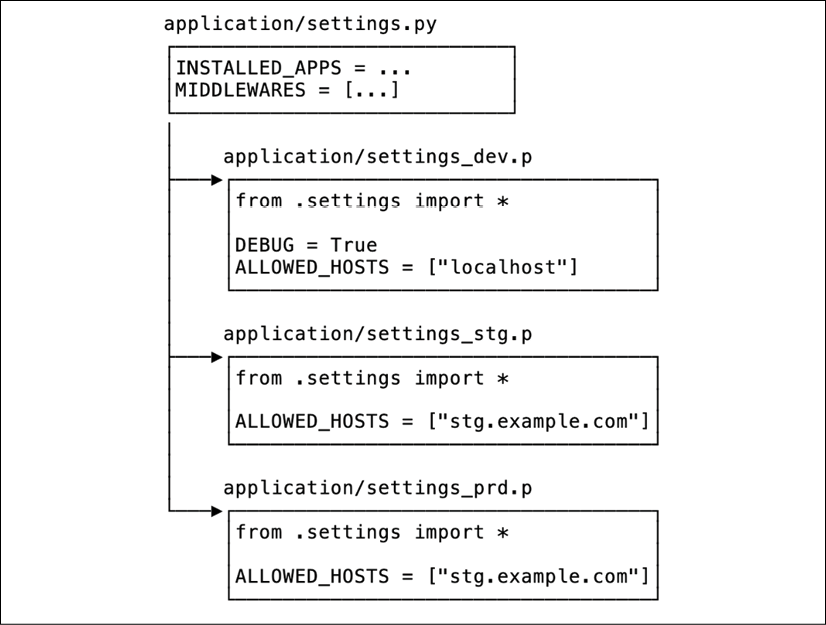

在本章中，我们将重点介绍打包和运送各种类型的 Python 包的方法。我们将考虑面向最终用户的完整应用程序以及通常仅供软件开发人员使用的库。

每个编写软件的人都这样做是有原因的。您可能是一个制作应用程序的爱好者，并希望与朋友分享以供他们娱乐。您可能是解决重要问题的科学家或研究人员，并希望与其他人共享代码以使他们的生活更轻松。或者，您可能是一名以编写代码为生的专业人士，并且希望将您的应用程序或服务提供给付费客户。

编写代码的每个理由都是好的，但每个理由通常都有其自己更喜欢的软件分发方式。在本章中，我们将讨论三个主要场景：

- 打包和分发库
- 为 Web 打包应用程序和服务
- 创建独立的可执行文件

首先，我们将专注于打包和分发库，因为这是可能支持其他打包和分发流程开发的场景。但在我们继续讨论这个主题之前，让我们首先考虑本章的技术要求。

## 技术要求

以下是本章提到的 Python 包，您可以从 PyPI 下载：

- twine
- wheel
- cx_Freeze
- py2exe
- pyinstaller

关于如何安装包的信息包含在第 2 章，现代 Python 开发环境中。

> 本章的代码文件可以在 https://github.com/PacktPublishing/Expert-Python-Programming-Fourth-Edition/tree/main/Chapter%2011 找到。

## 打包和分发库

软件库是一段可重用的代码，可用作较大应用程序或其他库的组件。图书馆通常专注于解决特定技术领域的有限问题集，但图书馆规模没有限制。出于本章的目的，我们也将框架视为库。这是因为框架也可以被理解为应用程序的组件，尽管规模更大、更通用。

Python 中的库以包（或模块）的形式分发。我们已经在整本书中使用了它们。我们在前面的章节中从 PyPI 获得的大多数包实际上都可以被视为库。大多数开源 Python 库都是通过 PyPI 分发的，这就是为什么我们将通过分发开源包的棱镜来讨论这个主题。

即使您对将代码作为开源分发不感兴趣，您也应该知道如何创建包。了解如何制作自己的包将使您更深入地了解打包生态系统，并将帮助您使用 PyPI 上可用的第三方代码（您可能已经在使用）。

Python 打包一开始可能有点让人不知所措。主要原因是对创建 Python 包的正确工具的混淆。无论如何，一旦你创建了你的第一个包，你就会发现这并不像看起来那么难。此外，了解适当的、最先进的包装工具也有很大帮助。

但在我们了解最先进的工具之前，让我们仔细看看 Python 包的剖析。

### Python 包的剖析

Python 代码的最小可分发部分是一个模块，它是一个以 .py 扩展名结尾的单个源文件。 模块的集合称为包。 虽然理论上您可以将您的 Python 包和模块作为原始源代码包分发，并让您的用户通过 Python 解释器使用它，但对于非技术人员来说这确实是个问题。 甚至开发人员也希望有一些最小的包装，这将使他们能够使用 Python 包装工具（如 pip 或 Poetry）安装您的应用程序或库。

必须在 PyPI 上分发的 Python 包的源代码树有几种可能的布局。 有一些重复的模式，几乎每个包都有一些公共文件。 很难说哪种布局最好，所以让我们简单地考虑以下布局，这是作者最喜欢的：

```
.
├── packagename/
│   └── __init__.py
├── tests/
│   ├── __init__.py
│   └── conftest.py
├── bin/
├── data/
├── docs/
├── README.md 
├── LICENSE
├── setup.py
├── setup.cfg
├── MANIFEST.in
└── CHANGELOG.md
```

项目源的主要结构由子目录布局决定。每个人都有自己的角色：

- packagename/：这是保存包的 Python 源代码的目录。这是 PyPI 上分发内容的核心。最好，这与包在 PyPI 上注册的名称完全相同，尽管许多开发人员在 PyPI 注册中使用破折号而不是下划线。通常，源代码树中只有一个顶级包。

- 测试/：这是测试包目录。它包含测试模块和（可选）测试子包。在上面的例子中，我们看到了 conftest 模块，它是 pytest 框架的一个特殊测试模块，通常包含测试装置和可选的 pytest 插件。这个目录通常不在 PyPI 上分发，因为测试名称很常见，并且您的测试包可能会在安装后与 site-packages 目录中的其他测试包发生冲突。如果你想用你的包分发测试，你应该通过将它嵌套在主包目录（这里是 packagename/ 目录）中来命名它。

    > 一些开发人员更喜欢将包源目录和测试包目录放在额外的顶级 src/ 目录中。这不会有太大变化，而是个人喜好问题。

- bin/：这是一个 shell 脚本和实用程序的目录，可能对包开发有帮助。例如，它可以包含用于构建文档、自定义 linter 或帮助包分发过程的实用程序的脚本。这些脚本不在 PyPI 上分发。

    > 如果一个包必须分发一些实际的 shell 脚本，通常的约定是将它们放在 scripts/ 目录中。

- data/：这是必须包含在包分发中的基本数据文件的目录。一个例子可以是预训练的机器学习模型、图像或翻译文件。

- docs/：这是一个包文档的目录。文档可以采用任何形式，但许多开发人员使用自动文档构建系统，如 Sphinx 或 MkDocs。在这种情况下， docs/ 目录包含这些系统的文档源和配置，但不包含呈现的文档文件。该目录通常不在 PyPI 上分发。

    > Sphinx 是一个文档生成器，用于构建官方 Python 文档。您可以在 https://www.sphinx-doc.org 上了解有关 Sphinx 的更多信息。
    > Sphinx很强大，但相当重量级。有时（特别是对于较小的包装）更轻量级的工具可能是更好的选择。 MkDocs 是一种流行的静态站点生成器，专为构建项目文档而设计。您可以在 https://www.mkdocs.org 上了解有关 MkDocs 的更多信息。

上述目录之外的文件通常提供配置工具或保存包的元数据。建议的布局列出了 6 个文件，它们是开源包最基本的文件：

- README.md：此文件包含包的最小描述和/或文档。 .md 扩展名表示 Markdown 标记语言，这是开发人员的流行选择。专用标记语言的使用是完全可选的，该文件的常用替代名称是 README 或 README.txt。将此文件包含在包分发中是一种很好的做法。

    > 另一个用于记录 Python 项目的流行标记选择是 reStructuredText（由 .rst 文件扩展名表示）。它是 Sphinx 引擎的默认标记语言。您可以在 https://docutils.sourceforge.io/rst.html 阅读有关 reStructuredText 的更多信息。

- 许可证：此文件包含软件包用户的软件许可证。它通常是一个没有任何特定标记语言的纯文本文件。包分发应包含此文件。
- setup.py：这是一个 Python 包分发脚本。它用于构建包分发并将它们上传到包注册表。除其他外，它包含包元数据和扩展定义（如果包提供）。它只包含在源代码分发中（我们将在包分发类型部分讨论它们）。
- setup.cfg：这是一个可选的 Python 包配置文件（INI 样式）。它可能包括包元数据和 setup.py 脚本子命令的默认选项。许多 Python 开发工具（测试框架、linter）也使用此文件中的专用部分作为它们自己的配置。
- MANIFEST.in：这是包文件清单的模板文件。它可用于告诉 setup.py 脚本哪些非源文件应包含在包分发中。
- CHANGELOG.md：这是一个可选文件，其中包含在当前版本之前对包所做的所有更改的日志。将它包含在包分发中是一个很好的做法。 README 文件中也可以包含简短的变更日志，但对于频繁发布的项目，通常最好有一个专门用于此目的的文件。

> 许多开发人员选择在源代码树之外以更方便的形式维护更改日志。一个流行的例子是 GitHub 上项目的 Releases 部分。尽管如此，在包分发中至少包含一个最小的更改日志也是一个很好的做法。

其中一些文件具有非常具体的语法或结构，我们将在稍后讨论。让我们仔细看看最重要的一个——setup.py 脚本。

#### setup.cfg

具有可分发 Python 包的项目的根目录包含 setup.py 脚本。 它提供基本的包元数据，如版本号、描述、作者、许可证类型或所需的依赖项。 包元数据表示为 setuptools.setup() 函数的参数。

Python 提供了内置的 distutils 模块用于代码打包，但实际上更推荐使用 setuptools。 setuptools 包提供了对标准 distutils 模块的多个增强层。 此外，从 Python 3.10 开始， distutils 包将被正式弃用，并且 setuptools 代码库现在独立于 distutils 模块。 这就是我们将在本章中讨论 setuptools 包行为的原因。

因此，setup.py 文件的最少内容如下：

```
[global]
quiet=1 
 
[sdist]
formats=tar,zip
[bdist_wheel]
universal=1
```

上述配置将确保源分发（sdist 部分）始终以两种格式（ZIP 和 TAR）创建，并且构建的轮子分发（bdist_wheel 部分）将创建为独立于 Python 版本的通用轮。此外，全局 --quiet 开关将抑制每个命令的大部分输出。

请注意，此处包含全局安静选项仅用于演示目的，默认情况下抑制每个命令的输出可能不是明智的选择。您还可以在您的主目录中提供一个名为 .pydistutils.cfg 的全局个人配置文件。

#### MANIFEST.in

使用 sdist 命令构建源分发时，setuptools 模块浏览包目录以查找要包含在存档中的文件。默认情况下，setuptools 将根据 setup() 函数的参数包含以下文件：

- py_modules 和 packages 参数隐含的所有 Python 源文件
- ext_modules 参数中列出的所有扩展源文件
- 由 scripts 参数指定的所有脚本
- package_data 和 data_files 参数指定的所有文件
- license_file 和 license_files 参数指定的许可证文件
- 匹配 glob 模式 test/test*.py 的文件
- 名为 setup.py、pyproject.toml、setup.cfg 和 MANIFEST.in 的文件
- 名为 README、README.txt、README.rst 和 README.md 的文件

除此之外，如果您的包使用版本控制系统（例如 Subversion、Mercurial 或 Git）进行版本控制，则可以使用其他 setuptools 扩展（例如 setuptools-svn、setuptools-hg 和设置工具-git。通过其他自定义扩展也可以与其他版本控制系统集成。

无论它是使用默认的内置文件收集策略还是由自定义扩展名定义的策略，sdist 都会创建一个清单文件，该文件列出所有文件并将其包含在最终存档中。

尽管 setup() 函数参数允许您列出要包含在包分发中的任何类型的文件，但一一列出它们可能不是最方便的选择。此外，使用特定版本控制系统的扩展可能会捕获一些您可能不想包含在包分发中的文件。在这两种情况下，您都可以使用 MANIFEST.in 模板提供额外的清单模板，以根据文件名模式自动包含或排除文件。

假设您没有使用任何额外的扩展，并且您需要在您的包分发中包含一些默认情况下未捕获的文件。您可以在包根目录（与 setup.py 文件相同的目录）中定义一个名为 MANIFEST.in 的模板。该模板指导 sdist 命令包含哪些文件。

MANIFEST.in 模板每行定义一个包含或排除规则。以下是 MANIFEST.in 模板的示例，该模板允许包含 LICENSE 文件、.txt 文件中的额外文本信息以及所有 Markdown 格式的文件：

```
include HISTORY.txt 
include README.txt 
include CHANGES.txt 
include CONTRIBUTORS.txt 
include LICENSE 
recursive-include *.md
```

> MANIFEST.in 命令的完整列表可以在 https://packaging.python.org/guides/using-manifest-in/#manifest-in-commands 提供的官方 distutils 文档中找到。

#### 基本包元数据

setup() 函数最重要的参数是名称。没有它，setuptools 包将采用 UNKNOWN 名称，这将无法让您轻松区分不同的包发行版。

仅使用 name 参数当然不足以为您的代码提供适当的功能性包装。 setup() 函数可以接收的最重要的参数如下：

- version：这是包的当前版本说明符。
- 描述：这包括对包的简短描述。通常用一句话来解释包的用途。
- long_description：这包括可以使用 reStructuredText（默认）或其他支持的标记语言的完整描述。
- long_description_content_type：定义了长描述的 MIME 类型；它用于告诉包存储库用于包描述的标记语言类型。
- 关键字：这是定义包并允许在包存储库中更好地索引的关键字列表。
- author：这是包作者或负责它的组织的名称。
- author_email：这是包作者的联系电子邮件地址。
- install_requires：这列出了您的软件包所需的依赖项的软件包及其版本。例如，如果您的软件包需要 PyPI 上可用的其他一些软件包才能工作，您可以将它们的名称（及其版本要求）放在这里。
- url：这是项目的 URL。它通常是托管项目源和/或文档的站点的 URL。
- 许可证：这是分发包所依据的许可证（GPL、LGPL 等）的名称。
- py_modules：要包含在发行版中的 Python 模块列表。它可用于仅具有不共享公共包命名空间的顶级模块的简单项目。
- 包：这是包分发中所有包名称的列表； setuptools() 提供了一个名为 find_packages() 的有用函数，它可以自动查找要包含的包名称。
- namespace_packages：这是包分发中的命名空间包列表。

上述参数是必不可少的元数据条目，它们将允许您正确构建包分发，但也将您的代码归因于您。请注意许可信息和所有地址（电子邮件和 URL），这些地址将允许用户获取有关您的软件包和使用条款的更多信息或联系您寻求帮助。

> setuptools 包提供了一些我们没有在此处列出的更多元数据条目。所有包元数据条目的详细描述在 https://www.python.org/dev/peps/pep-0345/ 上的 PEP 345 文档中进行了描述。

重要但非必要的论点之一是分类器。它允许您使用一组称为 trove 分类器的标准化软件类别对您的应用程序进行分类。如果您想在 PyPI 上发布您的应用程序，此功能特别有用。让我们仔细看看它。

#### 宝藏分类器
PyPI 提供了一种使用称为 trove 分类器的分类器集对应用程序进行分类的解决方案。所有的 trove 分类器形成一个树状结构。每个分类器字符串定义了一个嵌套命名空间列表，其中每个命名空间都由 :: 子字符串分隔。它们的列表作为 setup() 函数的分类器参数提供给包定义。

这是从 PyPI 上可用的 solrq 项目中获取的分类器示例列表：

```python
from setuptools import setup


setup( 
    name="solrq", 
    # (...) 
 
    classifiers=[ 
        'Development Status :: 4 - Beta', 
        'Intended Audience :: Developers', 
        'License :: OSI Approved :: BSD License', 
        'Operating System :: OS Independent', 
        'Programming Language :: Python', 
        'Programming Language :: Python :: 2', 
        'Programming Language :: Python :: 2.6', 
        'Programming Language :: Python :: 2.7', 
        'Programming Language :: Python :: 3', 
        'Programming Language :: Python :: 3.2', 
        'Programming Language :: Python :: 3.3', 
        'Programming Language :: Python :: 3.4', 
        'Programming Language :: Python :: Implementation :: PyPy', 
        'Topic :: Internet :: WWW/HTTP :: Indexing/Search', 
    ], 
)
```

Trove 分类器在包定义中是完全可选的，但为 setup() 接口中可用的基本元数据提供了有用的扩展。其中，trove 分类器可以提供有关支持的 Python 版本、支持的操作系统、项目的开发阶段或发布代码的许可证的信息。许多 PyPI 用户按类别搜索和浏览可用的包，因此适当的分类有助于包达到他们的目标。

Trove 分类器在整个包装生态系统中发挥着重要作用，不应被忽视。没有验证包裹分类的组织，因此您有责任为您的包裹提供适当的分类，而不是给整个包裹索引带来混乱。

在撰写本书时，PyPI 上有 756 个可用的分类器，它们分为以下主要类别：

- 发展状况
- 环境
- 框架
- 目标受众
- License
- 自然语言
- 操作系统
- 编程语言
- Topic
- Typing

该列表不断增长，并且不时添加新的分类器。因此，在您阅读本文时，它们的总数可能会有所不同。当前可用的 trove 分类器的完整列表可在 https://pypi.org/classifiers/ 上获得，并且可以通过 https://github.com/pypa/trove-classifiers 上的 trove-classifiers 包在 Python 代码中访问。

我们知道 Python 包的典型结构是什么。现在是时候讨论标准 Python 打包工具支持的各种类型的包分发了。

### 包分发的类型

包分发是一个打包工件，它将 Python 包源、元数据和任何附加文件包装到一个单文件存档中，该存档可以以原始形式或通过包存储库分发给其他开发人员。

Python 包通常有两种类型的发行版：

- 源分布
- 内置（二进制）分布

源代码分发是最简单和最独立于平台的。对于纯 Python 包，这很简单。这样的发行版仅包含 Python 源代码，并且这些源代码应该已经具有高度的可移植性。

更复杂的情况是当你的包引入了一些用 C 编写的扩展时。只要包用户在他们的环境中拥有合适的开发工具链，源代码发行版仍然可以工作。这主要由编译器和适当的 C 头文件组成。对于这种情况，构建的分发格式可能更适合，因为它可以为特定平台提供已经构建的扩展。

创建源代码分发由 setup.py 脚本的 sdist 命令处理。这就是为什么它们通常也被称为 sdist 分布。它们是最容易创建的，所以让我们先来看看它们。

#### sdist 分布

sdist 命令是最简单的 setup.py 脚本分发命令。它创建一个发布树并将运行包所需的所有内容复制到它。然后将这棵树存档在一个或多个存档文件中（通常，它只创建一个 tarball）。存档基本上是源树的副本。

此命令是分发独立于目标系统的包的最简单方法。它创建一个 dist/ 目录来存储要分发的档案。在创建第一个发行版之前，您必须提供一个带有版本号的 setup() 调用。如果不这样做，setuptools 模块将采用默认值 0.0.0。

要了解它是如何工作的，让我们考虑以下 setup.py 脚本示例：

```python
from setuptools import setup 
 
setup(name='acme.sql', version='0.1.1')
```

现在让我们为 0.1.1 版本的 acme.sql 包运行 sdist 命令：

```python
$ python setup.py sdist
```

您应该看到以下输出：

```python
running sdist
...
creating dist
tar -cf dist/acme.sql-0.1.1.tar acme.sql-0.1.1
gzip -f9 dist/acme.sql-0.1.1.tar
removing 'acme.sql-0.1.1' (and everything under it)
```

如果我们现在列出 dist/ 目录的内容，我们应该看到以下输出：

```python
$ ls dist/
acme.sql-0.1.1.tar.gz
```

> 在 Windows 上，默认存档类型将为 ZIP。

版本说明符用于存档名称。现在可以在任何具有 Python 的系统上分发和安装存档。在 sdist 发行版中，如果包中包含 C 库或扩展，则目标系统负责编译它们。这对于基于 Linux 的系统或 macOS 非常常见，因为它们通常提供编译器。但在 Windows 下开箱即用的情况并不常见。

如果打算在多个平台上使用带有扩展的包，则它也应始终以预先构建的分发格式进行分发。

预构建的发行版是使用一组不同的 setup.py 脚本命令创建的。让我们来看看它们。

#### bdist 和轮子分布

为了能够分发预构建的分发版，setuptools 提供了 build 命令。此命令通过以下四个步骤编译包：

- build_py：这通过字节编译它们并将它们复制到构建文件夹来构建纯 Python 模块。
- build_clib：这会构建 C 库，当包包含任何库时，使用 Python 编译器并在构建文件夹中创建一个静态库。
- build_ext：这会构建 C 扩展并将结果放在构建文件夹中，如 build_clib。
- build_scripts：这会构建标记为脚本的模块。它还在设置第一行时更改解释器路径（使用 !# 前缀）并修复文件模式以使其可执行。

这些步骤中的每一步都是一个命令，也可以独立调用。编译过程的结果是一个 build/ 文件夹，其中包含安装包所需的一切。 setuptools 包中没有交叉编译选项。这意味着命令的结果总是特定于它所构建的系统。

当必须创建某些 C 扩展时，构建过程使用默认系统编译器和 Python 头文件 (Python.h)。对于打包的 Python 发行版，您的系统发行版可能需要一个额外的系统包。至少在流行的 Linux 发行版中，它通常被命名为 python-dev 或 python3-dev。它包含构建 Python 扩展所需的所有头文件。

构建过程中使用的 C 编译器是操作系统的默认编译器。对于基于 Linux 的系统或 macOS，这将分别是 gcc 或 clang。对于 Windows，可以使用 Microsoft Visual C++（有可用的免费命令行版本）。也可以使用开源项目 MinGW。编译器选择也可以通过 setuptools 进行配置。

bdist 命令使用 build 命令来构建二进制分发版。它调用 build 和所有相关命令，然后以与 sdist 相同的方式创建存档。

让我们为 acme.sql 创建一个二进制发行版，如下所示：

```sh
$ python setup.py bdist
```

如果在 macOS 上运行，输出可能如下：

```sh
running bdist
running bdist_dumb
running build
...
running install_scripts
tar -cf dist/acme.sql-0.1.1.macosx-10.3-fat.tar .
gzip -f9 acme.sql-0.1.1.macosx-10.3-fat.tar
removing 'build/bdist.macosx-10.3-fat/dumb' (and everything under it)
```

如果我们现在列出 dist/ 目录的内容，我们应该看到以下输出：

```sh
$ ls dist/
acme.sql-0.1.1.macosx-10.3-fat.tar.gz    acme.sql-0.1.1.tar.gz
```

请注意，新创建的存档名称包含系统名称及其构建所在的发行版 (macOS 10.3)。在 Windows 上调用的相同命令将创建不同的特定于系统的分发存档：

```
C:\acme.sql> python.exe setup.py bdist
...
C:\acme.sql> dir dist
25/02/2008  08:18    <DIR>          .
25/02/2008  08:18    <DIR>          ..
25/02/2008  08:24            16 055 acme.sql-0.1.1.win32.zip
               1 File(s)         16 055 bytes
               2 Dir(s)  22   2222        2 D free
```

> 如果一个包包含 C 代码，除了源代码分发之外，尽可能多地发布不同的二进制分发是很重要的。至少，对于那些很可能没有安装 C 编译器的人来说，Windows 二进制发行版很重要。

二进制版本包含在预期系统上使用包所需的所有资源。它主要包含一个文件夹，复制到 Python 的 site-packages 文件夹中。它还可能包含缓存的字节码文件（\_\_pycache\_\_/*.pyc 文件）。

另一种构建发行版是由wheel包提供的轮子。安装后（例如，使用 pip），wheel 包会在 setup.py 脚本中添加一个新的 bdist_wheel 命令。它允许创建特定于平台的发行版（目前仅适用于 Windows、macOS 和 Linux），这些发行版是普通 bdist 发行版的更好替代品。它旨在取代之前由 setuptools 引入的另一种分发格式，称为eggs。鸡蛋现在已经过时了，所以不会出现在书中。使用轮子的优点列表很长。以下是 http://pythonwheels.com/ 上的 Python Wheels 页面上提到的那些：

- 更快地安装纯 Python 和本机 C 扩展包。
- 避免为安装执行任意代码（避免 setup.py）。
- 在 Windows、macOS 或 Linux 上安装 C 扩展不需要编译器。
- 为测试和持续集成提供更好的缓存。
- 创建 .pyc 文件作为安装的一部分，以确保它们与使用的 Python 解释器匹配。
- 跨平台和机器的更一致的安装。

根据 Python Packaging Authority (PyPA) 的建议，wheel 应该是您的默认分发格式。很长一段时间以来，Linux 的二进制轮子不受支持，但幸运的是，这种情况已经改变。 Linux 的二进制轮子称为 manylinux 轮子。

> PyPA 是一个社区，旨在为 Python 打包生态系统带来秩序和组织。由 PyPA 维护的 Python 打包用户指南 (https://packaging.python.org) 是有关最新打包工具和最佳实践的权威信息来源。

不幸的是，构建 manylinux 轮子的过程不像 Windows 和 macOS 二进制轮子那么简单。对于这种轮子，PyPA 维护了特殊的 Docker 镜像，用作现成的构建环境。您可以在 https://github.com/pypa/manylinux 上的项目 GitHub 页面上找到这些图像的来源以及有关如何使用它们的详细信息。

### 注册和发布包

如果没有一种有组织的方式来存储、上传和下载它们，包将毫无用处。 Python 包索引是 Python 社区中开源包的主要来源。任何人都可以自由上传新包，唯一的要求是在 PyPI 站点上注册 https://pypi.python.org/pypi。

> 包与用户绑定，因此，默认情况下，只有注册包名称的用户是其管理员，并且可以上传新的发行版。对于较大的项目，这可能是一个问题，因此可以选择将其他用户标记为包维护者，以便他们也能够上传新的发行版。

当然，您不仅限于此索引，所有 Python 打包工具都支持使用替代包存储库。这对于在内部组织之间分发封闭源代码或用于部署目的特别有用。在这里，我们主要关注 PyPI 的开源上传，仅简要提及如何指定替代存储库。

上传包的最简单方法是使用 setup.py 脚本的以下上传命令：

```sh
$ python setup.py <dist-commands> upload
```

这里，\<dist-commands\> 是创建要上传的分发的命令列表。只有在同一 setup.py 执行期间创建的发行版才会上传到存储库。所以，如果你想一次上传源分发、构建分发和轮子包，那么你需要发出以下命令：

```sh
$ python setup.py sdist bdist bdist_wheel upload
```


使用 setup.py 上传时，您不能重用在之前的分发命令执行期间已经构建的分发，而是被迫在每次上传时重新构建它们。这对于大型或复杂的项目来说可能不方便，因为实际分布的创建可能需要相当长的时间。值得注意的例子是利用 Python/C API 扩展的包（参见第 9 章，用 C 和 C++ 桥接 Python）。

setup.py 上传的另一个问题是，它可能会在某些较旧的 Python 版本上使用纯文本 HTTP 或未经验证的 HTTPS 连接，或者如果您的系统配置不正确。这就是为什么推荐 Twine 作为 setup.py 上传命令的安全替代品。

Twine 是与 PyPI 交互的实用程序，目前仅用于一个目的——将包安全地上传到存储库。它支持任何打包格式，并始终确保连接安全。它还允许您上传已经创建的文件，因此您可以在发布之前测试发行版。下面的 Twine 示例用法仍然需要调用 setup.py 脚本来构建发行版：

```sh
$ python setup.py sdist bdist_wheel
$ twine upload dist/*
```

Twine 当然不会猜测您的凭据，您需要在特殊的 .pypirc 文件中提供它们。 .pypirc 文件是一个配置文件，用于存储有关 Python 包存储库的信息。它应该位于您的主目录中。该文件的格式如下：

```ini
[distutils]
index-servers =
    pypi
    other
[pypi]
repository: <repository-url>
username: <username>
password: <password>
[other]
repository: https://example.com/pypi
username: <username>
password: <password>
```

distutils 部分应该有 index-servers 变量，该变量列出了描述所有可用存储库和凭据的所有部分。每个存储库部分只能修改以下三个变量：

- 存储库：这是包存储库的 URL（默认为 https://pypi.org/）。
- 用户名：这是给定存储库中用于身份验证的用户名。
- 密码：这是给定存储库中用于身份验证的用户密码（纯文本）。

请注意，以纯文本形式存储您的存储库密码可能不是最明智的安全选择。您可以随时将其留空。 Twine 会在需要时提示您输入凭据。

> 安全处理 PyPI 凭据的另一个选择是使用密钥环包。它将允许 Twine 与您的系统密钥环服务进行交互，例如 macOS 的 Keychain 或 Windows Credential Locker。您可以在 https://twine.readthedocs.io/en/latest/index.html#keyring-support 阅读有关此功能的更多信息。

每个为 Python 构建的打包工具都应该尊重 .pypirc 文件。虽然这可能不适用于所有与包装相关的实用程序，但最重要的实用程序都支持它，例如 pip、twine、distutils 和 setuptools。

将 .pypirc 文件与 Twine 一起使用的危险在于 Twine 默认设置为在 PyPI 上发布包。如果您正在使用封闭源代码并希望在私有包索引中发布您的包，这可能是一个问题。如果您忘记使用正确的注册表参数（-r 标志）并且实际上将您的 .pypirc 文件配置为与 PyPI 一起使用，您可能会不小心让公众可以访问您的封闭代码。

> Poetry 是解决打包 Python 代码的多个问题的工具之一。它不需要提供自定义分发脚本（setup.py scipts 替换为 pyproject.toml 配置文件），是完全交互的，并允许您指定专用的包注册表以及项目的源代码。通常，使用 Poetry 分发包就像运行两个命令一样简单：
>
> ```sh
> $ poetry build
> $ poetry publish
> ```
>
> 您可以在 https://python-poetry.org/docs/cli/#publish 上了解有关使用 Poetry 构建和发布包的更多信息。

### 包版本控制和依赖管理

如果您已将您的软件包发布到软件包注册表中，那么您可能希望在某个时候修改它并发布它的新版本。为了让开发人员决定是否要使用包的新版本，我们使用版本说明符来标记包的连续版本。

版本说明符通常采用由点分隔的数字组成的字符串形式（如 1.0、3.6.5 或 4.0.0）。这就是版本说明符通常也称为版本号的原因。这允许轻松地对版本说明符进行排序。按照惯例，更高的版本意味着更新的版本。几乎每个包版本控制工具都采用这种约定，并允许将过时的包直接更新到较新的版本。例如，使用 pip 您可以使用 -U 开关安装更新的软件包版本，如下例所示：

```sh
$ pip install -U pip
Collecting pip
  Using cached pip-21.0.1-py3-none-any.whl (1.5 MB)
Installing collected packages: pip
  Attempting uninstall: pip
    Found existing installation: pip 20.2.4
    Uninstalling pip-20.2.4:
      Successfully uninstalled pip-20.2.4
Successfully installed pip-21.0.1
```

在上面的例子中，我们使用 pip 来更新自身（它作为一个包分发）。输出显示当前安装的 pip 版本为 20.2.4。在运行此命令时，PyPI 上的最新 pip 版本是 21.0.1。 pip 比较了这两个版本说明符，并决定 PyPI 上可用的版本说明符是更高的版本号。它卸载了旧版本并在当前环境中安装了新版本。

尽管包版本通常仅由数字组成，但 Python 允许您在版本说明符中使用字母。例如，这允许您将特定版本标记为预发布、开发版本或发布后。这些额外的版本说明符组件通常包含在数字段之后的最后一个版本说明符段中。

PEP 440 文档（版本标识和依赖项规范）是版本控制包的官方标准，除其他外，它为这些特殊的发布标签指定了以下约定：

- {a|b|rc}N：指定预发布版本（alpha、beta 或发布候选）。这些标签指定处于不同开发阶段的版本。 Alpha 版本是最早的阶段，候选版本已接近最终版本。一个包在任何预发布阶段可以有多个版本，它们通过提高 N 数字来区分。预发布版本的示例进展可能是：1.0.0a1、1.0.0a2、1.0.0b1 和 1.0.0rc。没有预发布标签的版本被认为是最终版本，并且总是优先于具有相同数字前缀的预发布版本。

    > pip 默认不安装预发布和开发版本。如果要安装预发布版本，则需要使用 pip install 命令的 --pre 选项。

- postN：指定发布后版本。发布后通常用于发布不构成功能修复或增强的更新。示例可能是包元数据或文档的更新（如果它包含在包分发中）。相同的版本号可以有多个发布后版本，它们通过提高 N 号来区分。发布后也可以添加到预发布之上。示例发布后版本说明符可以是 1.0.0-post1、1.0.0a1.post1 和 1.0.0.a1.post2。

- devN：指定开发版本。一些包维护者选择发布包作为持续集成系统的一部分，这些开发版本可用于区分包的连续构建。相同的版本号可以有多个开发版本，通过提高 N 号来区分。开发版本也可以添加在预发布和发布后之上，尽管这种做法在通用公共包索引上是强烈反对的。

> 您可以在 https://www.python.org/dev/peps/pep-0440/ 访问完整版本的 PEP 440 文档。

Pre-releases、post-releases 和 dev-releases 给包版本增加了一些复杂性，因此很多包维护者不使用。无论如何，至少预发布可以是一个有用的工具，让开发人员能够在他们自己的环境中预览和评估包的未来版本。

最重要的是包的最终版本号。有两种流行的版本控制策略来决定分配给新软件包版本的编号：

- 语义版本控制：该策略假设每个数字组件都有一个语义值，允许包消费者推断两个版本之间的更改量和范围。
- 日历版本控制：此策略假定选定的数字组件源自制作（或应该制作）新版本的日期。这允许用户推断两个版本之间经过的开发时间。

为了让事情变得更容易，社区为这些版本控制策略提出了两个标准，以简化它们的采用。让我们仔细看看它们。

#### 语义版本控制的 SemVer 标准
SemVer 标准假设版本说明符最多包含三个数字段：

MAJOR 段：更改 MAJOR 段是向后不兼容更改的标志。在两个主要版本之间更新的用户应该预料到他们的代码可能不再正常工作。
MINOR 段：更改 MINOR 段是新的向后兼容功能升级的标志。在两个次要版本（在同一主要版本内）之间更新的用户不应期望他们的代码变得无效，但可能会收到新的功能增强。
PATCH 段：更改 PATCH 段是错误修复的标志。在两个补丁版本之间更新（在相同的主要和次要版本内）的用户应该期望修复一些问题，但不应该期望任何其他增强或新功能。
正确的 SemVer 版本始终按以下顺序包含所有三个部分：

```
MAJOR.MINOR.PATCH
```

例如，软件包的 20.2.4 版本意味着它正在进行第 20 次主要更新，有 2 个次要更新和 4 个补丁。根据 SemVer 版本控制原则，从 20.2.0 或 20.1.0 版本更新的用户不应期望任何制动变化。

完整的规范还涵盖了预发布版本和内部版本号的使用，并提供了有关交流 API 更改和处理功能弃用策略的指南。您可以在 https://semver.org 访问完整的规范文本。

#### CalVer 用于日历版本控制

CalVer 更像是一个版本控制蓝图，而不是一个成熟的标准（尤其是与 SemVer 相比时）。它假定版本说明符由与特定版本关联的日期元素对应的段组成。

解释 CalVer 约定的站点列出了以下常见的基于日期的段：

- YYYY: Full year: 2006, 2016, 2106
- YY: Short year: 6, 16, 106
- 0Y: Zero-padded year: 06, 16, 106
- MM: Short month: 1, 2 ... 11, 12
- 0M: Zero-padded month: 01, 02 ... 11, 12
- WW: Short week (since start of year): 1, 2, 33, 52
- 0W: Zero-padded week: 01, 02, 33, 52
- DD: Short day: 1, 2 ... 30, 31
- 0D: Zero-padded day: 01, 02 ... 30, 31

> 所有 CalVer 段均基于公历。

此约定最适合具有明确定义的发布时间表或以某种方式对时间敏感的项目。示例时间敏感项目是 certify（一组 Mozilla 策划的可信根证书列表，定期更改）和 tzdata（一组 IANA 时区数据库，请参阅第 3 章，Python 中的新事物）。

CalVer 版本没有通用格式，CalVer 用户必须自行决定使用哪个版本段。决定因素通常是项目的发布节奏。这种约定也可以在某种程度上与语义版本控制混合。例如，pip 项目使用了由 YY.MINOR.PATCH 段组成的版本控制方案。

CalVer 约定的官方站点不像 SemVer 规范那样详尽，但提供了一些有趣的案例研究和日历版本控制指南。您可以在 https://calver.org 上找到它。

### 安装自己的包

使用 setuptools 主要是关于构建和分发包。但是，您仍然需要使用 setuptools 直接从项目源安装包。原因很简单。在将您的包提交到 PyPI 之前测试我们的打包代码是否正常工作是一个好习惯。测试它的最简单方法是安装它。如果您将损坏的包发送到存储库，那么为了重新上传它，您需要增加版本号。

在最终分发之前测试您的代码是否正确打包可以使您免于不必要的版本号膨胀，并且显然不会浪费您的时间。

#### 直接从源安装包

当同时处理多个相关包时，使用 setuptools 直接从您自己的源安装可能是必不可少的：

```
setup.py install
```

install 命令在您当前的 Python 环境中安装包。如果之前没有构建过，它将尝试构建包，然后将结果注入 Python 正在寻找已安装包的文件系统目录中。如果您有一个包含某个包的源代码分发的存档，您可以将其解压缩到一个临时文件夹中，然后使用此命令安装它。 install 命令还将安装 install_requires 参数中定义的依赖项。依赖项将从 PyPI 安装。

安装包时，setup.py 脚本的替代方法是使用 pip。由于它是 PyPA 推荐的工具，因此即使在本地环境中仅出于开发目的安装包时也应该使用它。要从本地源安装软件包，请运行以下命令：

```
pip install <project-path>
```

如果要从分发存档安装软件包，则此命令变为：

```
pip install <path-to-archive>
```

令人惊讶的是，setup.py 脚本缺少卸载命令。幸运的是，可以使用 pip 卸载任何 Python 包，如下所示：

```
pip uninstall <package-name>
```

尝试对系统范围的软件包进行卸载时，卸载可能是一项危险的操作。这是为什么在任何开发中使用虚拟环境如此重要的另一个原因。

通过 setup.py 脚本或 pip install 命令安装包会将包的源（或分发的内容）复制到您的站点包目录。但有时我们想让包源在特定环境中可用，而无需复制它们。这种安装方法称为可编辑模式安装，在处理具有独立源代码树的多个相关包时特别有用。

#### 以可编辑模式安装包

使用 setup.py install 安装的软件包将复制到当前 Python 环境的 site-packages 目录中。这意味着每当您对该包的源进行更改时，都需要重新安装它。这在密集开发期间通常是一个问题，因为很容易忘记再次执行安装的需要。

这就是为什么 setuptools 提供了一个额外的 develop 命令，允许您在开发模式下安装软件包。此命令在部署目录 (site-packages) 中创建一个指向项目源的特殊链接，而不是将整个包复制到那里。包源无需重新安装即可编辑，并且在 sys.path 中可用，就像它们已正常安装一样。

pip 还允许您以这种模式安装软件包。此安装选项称为可编辑模式，可以使用安装命令中的 -e 参数启用，如下所示：

```
pip install -e <project-path>
```

在您的环境中以可编辑模式安装包后，您可以自由修改已安装的包，所有更改将立即可见，无需重新安装包。

当您需要使用多个相关包而无需连续重新安装它们时，使用可编辑模式会有所帮助。在由多个相关包组成的项目中，另一种有用的做法是使用命名空间包。

### 命名空间包

Python 之禅对命名空间的描述如下：

> 命名空间是一个很棒的想法——让我们做更多的事情！

这至少可以从两个方面来理解。第一个是语言上下文中的命名空间。我们都在不知不觉中使用以下命名空间：

- 模块的全局命名空间
- 函数或方法调用的本地命名空间
- 类命名空间

另一种命名空间可以在打包级别提供。这些是命名空间包。这通常是 Python 打包的一个被忽视的特性，它在构建组织或非常大的项目中的包生态系统时非常有用。

命名空间包可以理解为对相关包进行分组的一种方式，其中每个包都可以独立安装。

如果您的应用程序的组件是独立开发、打包和版本化的，但您仍然希望从同一个命名空间访问它们，那么命名空间包尤其有用。这也有助于明确每个包属于哪个组织或项目。例如，对于某个虚构的 Acme 公司，公共命名空间可能是 acme。因此，该组织可以创建通用的 acme 命名空间包，该包可以作为来自该组织的其他包的容器。例如，如果 Acme 的某个人想要为这个命名空间贡献，例如，一个与 SQL 相关的库，他们可以创建一个新的 acme.sql 包，在 acme 命名空间中注册自己。

了解普通包和命名空间包之间的区别以及它们解决的问题很重要。通常（没有命名空间包），您将创建一个名为 acme 的包和一个具有以下文件结构的 sql 子包：

```
acme/
├── acme
│   ├── __init__.py
│   └── sql
│       └── __init__.py
└── setup.py
```

每当你想添加一个新的子包时，比如说模板，你被迫将它包含在 acme 的源代码树中，如下所示：

```
acme/
├── acme
│   ├── __init__.py
│   ├── sql
│   │   └── __init__.py
│   └── templating
│       └── __init__.py
└── setup.py
```

这样的方式使得acme.sql和acme.template的独立开发几乎是不可能的。 setup.py 脚本还必须为每个子包指定所有依赖项。对某些 acme 组件进行可选安装是不可能的（或者至少很难）。此外，如果有足够多的子包，可能很难避免依赖冲突。

使用命名空间包，您可以独立存储每个子包的源代码树，如下所示：

```
acme.sql/
├── acme
│   └── sql
│       └── __init__.py
└── setup.py
acme.templating/
├── acme
│   └── templating
│       └── __init__.py
└── setup.py
```

您还可以在 PyPI 或您使用的任何包索引中独立注册它们。用户可以从 acme 命名空间中选择他们想要安装的子包，但他们从不安装通用的 acme 包（它甚至不必存在）。 pip 用法示例如下：

```sh
$ pip install acme.sql acme.templating
```

请注意， setuptools.find_packages() 函数找不到命名空间包。如果您希望 setup.py 脚本自动收集命名空间包而不是单独列出它们，则需要改用 setuptools.find_namespace_packages()。

此函数将自动发现目录结构中的命名空间包，如前一个示例所示。

包和命名空间包主要涉及在各种环境中运行的项目之间共享代码。如果您在给定的环境中安装这样的包，它将立即可用于导入。但这并不是 Python 打包的唯一目的。许多 Python 项目提供 shell 实用程序、命令，甚至是具有图形界面的应用程序。一个很好的例子是随 pip 包分发的 pip 命令。您可以使用 Python 打包基础架构，以与 pip 包相同的方式在目标安装环境中显示您的应用程序脚本和可执行模块。让我们看看如何做到这一点。

#### 打包脚本和入口点

每个 Python 模块都可以像使用 python -m 命令的程序一样执行。这包括标准库模块以及来自 pip 安装的包的模块。例如，以下是标准库中 json.tool 模块的调用，它允许您在 shell 中格式化 JSON 文本：

```sh
$ echo '{"name": "John Doe", "age": 42}' | python -m json.tool
{
    "name": "John Doe",
    "age": 42
}
```

这是从已安装的包中执行任何模块的一种简单方法，但不是最方便的方法。最重要的是，你的包的用户必须知道你的应用程序内部的模块结构是什么，并且知道哪些模块应该在 shell 中运行。此外，用户必须键入 python -m 命令，这会为其脚本添加一些冗余。这就是为什么在使用 pip 时，我们宁愿调用 pip 命令而不是 python -m pip。

在编写您自己的 Python 包时，您可以像 pip 包所做的一样，并提供您自己的自定义 shell 命令，该命令将与您的包一起安装。有两种方法可以做到这一点：

- 通过 setuptools.setup() 函数的 scripts 参数
- 通过 setuptools.setup() 函数的 entry_points 参数

脚本参数是通过包提供 shell 命令的最基本方法。 distutils 模块（setuptools 所基于的标准库模块）已经支持该参数，因此它非常简单。它接受将与您的包一起分发的脚本文件路径列表。安装包后，这些脚本在与您的 Python 环境关联的 PATH 目录之一中可用。

为了了解它是如何工作的，我们将重用在第 3 章 Python 中的新事物中的 Python 源代码中查找导入的脚本示例。完整代码和详细解释可以在该章节中找到。我们将首先创建具有以下内容的 findimports.py 文件：

```python
import os
import re
import sys


import_re = re.compile(r"^\s*import\s+\.{0,2}((\w+\.)*(\w+))\s*$")
import_from_re = re.compile(
    r"^\s*from\s+\.{0,2}((\w+\.)*(\w+))\s+import\s+(\w+|\*)+\s*$"
)


def main():
    if len(sys.argv) != 2:
        print(f"usage: {os.path.basename(__file__)} file-name")
        sys.exit(1)
    with open(sys.argv[1]) as file:
        for line in file:
            if match := import_re.match(line):
                print(match.groups()[0])
            if match := import_from_re.match(line):
                print(match.groups()[0])


if __name__ == "__main__":
    main()
```

从那里，我们将使用一些基本元数据和脚本参数创建以下 setup.py 脚本：

```python
from setuptools import setup


setup(
    name="findimports",
    version="0.0.0",
    py_modules=["findimports.py"],
    scripts=["findimports"],
)
```

现在，您可以使用以下命令之一以可编辑模式安装软件包：

```sh
$ pip install -e .
$ python setup.py develop
```

或者，如果您愿意，可以在正常模式下安装软件包：

```python
$ pip install .
$ python setup.py install
```

一旦我们安装了这个包，findimports 模块就可以作为一个 shell 命令使用了。在 macOS 或 Linux 上，我们可以使用 compgen 和 grep 搜索所有可发现的命令，并查看它现在确实在您的 shell 中可用：

```sh
$ compgen -c | grep findimports
findimports.py
```

如您所见，findimports.py 脚本现在可以使用与脚本文件名完全相同的名称。如果你真的想从 shell 命令中省略 .py 扩展名，你有两个选择之一：

- 从模块文件名中删除 .py 扩展名：您必须相应地更新 setup.py 脚本。这种方法的缺点是您将无法再将 findimports 模块作为可导入的 Python 模块（py_modules 参数）进行分发。它还会使脚本模块的单元测试更加困难。
- 为 findimports.py 创建包装脚本：scripts 参数允许您分发任何类型的脚本，包括 shell 脚本。在这里，我们可以创建一个名称不带扩展名的包装 shell 脚本（例如，scripts/findimports），并将其指定为脚本参数的目标。该文件可以像以下一样简单：
    ```python
    #!/usr/bin/env sh
    python -m findimports
    ```

由于 setuptools 模块提供的 entry_points 扩展，可以避免 distutils 中的脚本文件扩展和包装脚本的问题。这是通过 setup.py 分发脚本中的配置提供应用程序入口点（如 shell 脚本）的标准化方法。它允许您将包源中的任何函数作为 shell 脚本分发。这极大地简化了应用程序入口点的管理，因为您不需要创建专用的可运行模块。

可能有多种类型的入口点，但最常见的是 console_scripts，它允许您将模块或函数注册为自动生成的脚本命令的目标。以下是我们可以为 findimports 脚本提供的控制台入口点的示例：

```python
from setuptools import setup
setup(
    name="findimports",
    version="0.0.0",
    py_modules=["findimports"],
    entry_points={
        "console_scripts": ["findimports=findimports:main"]
    }
)
```

当涉及到命令的命名以及在调用命令时选择确切运行的内容时，控制台入口点的使用更加灵活。在 = 符号的左侧，我们有所需的命令名称。在我们的例子中，它只是 findimports。在右侧，我们有一个模块导入路径（再次 findimports）以及要执行的函数名称（main() 函数）。

entry_points 参数允许更好地命名命令以及将多个命令打包到单个 Python 模块中。但这并不意味着脚本参数变得无用。例如，您不能使用 entry_points 打包 shell 脚本（如 Bash），但您可以使用 scripts 参数来做到这一点。

> setuptools 包中入口点的特性实际上是一种在包之间广告钩子的通用方法。每个包都可以查询其他包的现有入口点。例如，此功能可用于创建插件机制。 pytest 单元测试框架是一个示例包，它使用其插件系统的入口点机制。您可以在 https://docs.pytest.org/en/stable/writing_plugins.html 了解有关编写 pytest 插件的更多信息。

由于二进制轮子和允许打包脚本的功能，Python 打包可以成为分发完整应用程序的一种方法。如果您使用虚拟环境，您可以确保在各种应用程序之间进行合理数量的依赖隔离。

不幸的是，Python 打包和虚拟环境并不能解决所有的环境隔离问题。例如，您不能通过虚拟 Python 环境保护您的应用程序免受共享系统库更改的影响。此外，并非您使用的每个 Python 依赖项都以二进制轮格式分发。用 C、C++ 或 Cython 编写的 Python 扩展非常受欢迎，这意味着对于复杂的应用程序，可能经常需要现场编译。缺乏纯粹的依赖隔离和对现场编译的普遍需求是 Python 包通常不是特定用例的可靠分发工件的主要原因。其中一个用例是为 Web 打包应用程序和服务。

## 为 Web 打包应用程序和服务

软件的分发是一个传统上需要两方的过程。有人（分销商）必须使软件版本可供使用。过去，它需要软盘或CD等物理介质，但现在通常通过互联网完成。其他人（消费者）需要有意识地获取该软件并将其安装在自己的计算机上。软件更新并不总是相同的，因为许多应用程序都提供自动更新。尽管如此，这些更新通常需要用户同意才能安装。

随着软件即服务 (SaaS) 的出现，以允许将其安装在用户自己的计算机上的形式分发的软件越来越少。我们看到经典程序正逐渐被 SaaS 对应程序所取代：

传统的桌面应用程序正在被基于网络的软件所取代
传统的软件库正在被 Web API 取代
基于 Web 的软件不会像传统的 Web 桌面应用程序那样分发给用户。基于 Web 的应用程序的用户通常通过标准的 Web 浏览器或专用客户端与他们进行交互，该客户端仅充当位于某些服务器或服务器集群上的代码的外壳。无论如何，它确实必须分发到这些服务器，但整个过程通常对最终用户来说是不透明的，他们很少知道这个过程。

这就是为什么在基于 Web 的应用程序的上下文中，许多开发人员通常更喜欢“运输”一词的原因：消费者有意识地注册为软件的用户，但对其交付方式和时间的控制非常有限。此外，潜在的更新只是被推到门口，不能轻易拒绝或丢弃。

基于 Web 的应用程序越来越流行。即使主要用于桌面使用的应用程序也经常提供基于 Web 的功能，例如自动更新、云同步或在线协作。这意味着即使 Web 不是您的菜，也值得了解发布这些 Web 应用程序的基础知识。

在本节中，我们将讨论构建和分发 Web 应用程序的良好实践和工具，以及一些特定于 Python 的技巧和窍门。

### 十二要素应用宣言

能够仅将软件分发到您自己的服务器消除了分发过程中的一个重要因素：用户。您无需关心他们是否能够下载您的应用程序并处理安装过程。您不必关心他们的操作系统（尽管您可能需要关心他们的浏览器）。而且，大多数情况下，您无需请求许可即可执行更新。你想做什么，就可以做什么。但你应该吗？

基于 Web 的软件具有许多优点。您可以完全控制它。您可以根据需要随时进行任意数量的更新。但这是一把双刃剑。 Web 应用程序的用户将期望对其提交的问题进行频繁的更新和几乎立即修复。此外，如果您的软件取得成功，您将不得不依赖大量服务器来支持不断增长的用户群规模。庞大的用户群通常是基于 Web 的应用程序的目标。

这就是为什么以一种能够以可持续的速度增长的方式构建您的软件是极其重要的。您的应用程序应该易于配置并与其依赖项（如外部服务和操作系统）解耦，以确保易于维护和新版本的直接、可重复部署。在生产环境中部署也应该像在本地运行进行开发一样容易（反之亦然）。

如果没有一些操作知识，这当然是不容易做到的。如果您没有大量使用软件的经验，您肯定会犯很多错误，这将花费您大量的时间、资源和金钱（例如服务器成本）。这就是为什么遵循一组良好的、经过验证的实践是一个好主意。

十二因素应用程序宣言是一套很好的此类实践。它是用于构建 SaaS 应用程序的通用语言不可知方法。其目的之一是使应用程序更易于部署，但它还强调了其他主题，例如可维护性或使应用程序更易于扩展。

顾名思义，十二要素应用程序包含 12 条规则：

- 代码库：在修订控制系统中跟踪的一个代码库和许多部署
- 依赖：显式声明和隔离依赖
- Config：在环境中存储配置
- 后备服务：将后备服务视为附加资源
- 构建、发布、运行：严格分离构建和运行阶段
- 进程：将应用作为一个或多个无状态进程执行
- 端口绑定：通过端口绑定导出服务
- 并发：通过流程模型向外扩展
- 一次性：通过快速启动和正常关闭最大限度地提高鲁棒性
- 开发/生产对等：尽可能保持开发、登台和生产相似
- 日志：将日志视为事件流
- 管理流程：将管理/管理任务作为一次性流程运行

> 您可以在 https://12factor.net 上访问十二因素应用程序宣言的全文。

我们不会详细讨论每个因素，因为十二因素应用程序网站为所有因素提供了很好的解释和基本原理。我们无论如何都会放大特定规则，因为其中一些规则可以使用 Python 生态系统中流行的流行工具、技术或库来使用。

### 利用 Docker

我们已经在第 2 章现代 Python 开发环境中介绍了 Docker，它是一种轻量级虚拟化工具，可以提供出色的开发环境隔离。

它只是将您的所有代码及其运行时依赖项（模块、包、共享库）打包到容器镜像中，这些镜像可以在给定环境中作为独立容器执行。

此外，Docker 容器是无状态的。这意味着从同一映像启动的两个容器将具有相同的初始状态。在容器内完成的每个文件系统修改都保留在容器内。容器内的部分文件系统当然可以通过安装专用卷导出到外部，但这始终是明确的，绝不会偶然发生。已完成其工作（主进程退出，无论是优雅地还是由于突然终止）的容器已不再使用，与其内部状态相同。

> 事实上，Docker 容器在退出后默认不会消失。 docker run 命令的 --rm 标志确保自动删除已退出的容器。容器完成后可以继续使用它，尽管这应该仅用于检查而不是作为默认操作方式。

Docker 容器及其映像的定义、运行和管理方式已经勾选了十二因素应用程序宣言的多个复选框：

- 依赖：创建一个新的Docker镜像，需要定义一个Dockerfile，它是所有准备步骤的声明性语句。这包括所有共享库、包和您自己的代码。此外，多阶段 Docker 构建允许您将构建时依赖项与运行时构建分开。依赖项是孤立的。您可以在同一主机系统上运行来自不同 Docker 镜像的多个容器，并且它们的依赖项永远不会发生冲突。
- 构建、发布、运行：Docker 镜像通常在其专用运行时环境之外构建。它可以是专用的构建服务器，甚至可以是您自己的用于开发的计算机。图像通常存储在专用的图像存储库中。从那里，在目标环境中运行的 Docker 守护进程可以拉取最新的镜像版本。此外，使用描述性标签标记图像使您可以轻松跟踪它们的版本，甚至是特定环境的名称。
- 进程：Docker 容器是无状态的。此外，从承载它的操作系统的角度来看，容器看起来像一个单一的进程。它将可能在容器中运行的所有线程或子进程以及它可能使用的所有资源（例如内存）沙箱化。
- 开发/生产对等：将软件打包到容器中可以减少生产环境和开发环境之间的差距，因为它将许多依赖项与操作系统隔离开来。此外，Docker Compose 允许您从多个容器组合整个应用程序，并使用与生产环境中使用的相同版本的支持服务（数据库、缓存、反向代理等）。

Docker 的伟大之处在于应用程序的可移植性。只要您的目标系统可以运行 Docker 守护程序，它就可以运行您的容器。

如果您操作自己的服务器集群（物理或虚拟），则必须使用 Docker 守护程序来配置它们，并提供一些配置和/或脚本，以确保您的容器始终启动并运行。但无论如何，使用任何类型的软件都必须这样做。 Docker 可能会让您的生活更轻松，因为每个应用程序都将具有相同类型的交付物 — 容器映像 — 并且不需要复杂的安装过程。例如，可以单独管理容器，例如使用 systemd，这是大多数 Linux 发行版中常见的系统和服务管理器。

> 我们已经在第 2 章现代 Python 开发环境中讨论了使用 Dockerfiles 创建 Docker 镜像的主题。您可以在 https://docs.docker.com/develop/develop-images/dockerfile_best-practices/ 了解有关编写 Dockerfile 的最佳实践的更多信息。

但并非所有组织都愿意支持自己的基础架构。幸运的是，许多云提供商提供的各种服务可以减轻 Docker 用户的大量操作负担。对于更大的规模，您可以使用专用的容器编排系统，如 Kubernetes (k8s)。 Kubernetes 是谷歌设计的容器编排系统。它将应该在同一集群节点上运行的应用程序容器集合组织成称为 Pod 的组。 Kubernetes 可以管理容器卷、配置映射、控制服务的自动扩展以及管理集群内的通信以及传入流量。

> 您可以在 https://kubernetes.io 上了解有关 Kubernetes 的更多信息。

Kubernetes 可以处理一系列容器编排需求，从托管的 Kubernetes 集群，您可以决定需要多少工作节点以及如何配置它们，到完全无服务器的产品，您只需提供 Docker 映像及其配置，云提供商就会负责为您扩展基础架构。灵活的按需定价通常意味着您只需为分配的资源付费。这使您可以避免大量的前期基础设施成本并“随着您的增长而扩展”。

Docker 当然不是应用程序在主机或服务提供商之间可移植的唯一方式。但是无论打包格式如何，如果您的应用程序不能以与系统和应用程序无关的方式进行配置，那么它就不会是可移植的。让我们来看看应用程序的典型配置选项。

### 处理环境变量

每个应用程序都需要不同环境的配置值。示例可以是：

- 缓存、数据库、代理服务器或 Web API 等支持服务的连接字符串 (URL)、主机名和端口
- 这些服务的凭据
- 其他秘密，如加密密钥和客户端证书
- 每个环境的值，如功能切换或资源限制

这些配置值应该始终与应用程序代码分开，绝对不应该作为常量存储在模块中。这对于必须保密的值尤其重要。这有多种原因：

- 第一个是安全性。如果代码包含有关机密和凭据的信息，则可以访问代码的人都会知道所有这些信息。如果有人可以访问代码存储库，他们将知道所有以及过去的秘密。这带来了真正的安全风险。
- 将配置与应用程序分离的另一个原因是环境的易变性——它们来来去去。有一天，您可能只使用几个环境，但在另一天，您可能想要创建更多环境。如果您想为您工作的每个功能分支创建一个新的短期环境怎么办？如果您想为项目中的每个团队成员做同样的事情，该怎么办？您真的想将所有这些配置保存在同一个项目存储库中吗？
- 最后但并非最不重要的一点是，配置应该与语言和框架无关。您最终将使用不同的技术来运行您的软件。你可能会改变你的框架，甚至可能从 Python 转移到一种完全不同的语言。您可能还想在某个时间点从一个基础架构迁移到另一个基础架构。今天，它可能是在一台主机上的虚拟环境中运行的简单应用程序，但明天它可能是 Kubernetes 集群中的 Docker 容器。甚至一些由您的云提供商管理的无服务器功能。您永远不知道您的应用程序将如何发展，因此您需要确保为应用程序提供配置的方式尽可能通用。

为应用程序提供配置的最通用方法是通过环境变量。这是一种简单的键值映射，每个操作系统和每种编程语言都应该支持。无需任何代码或文件修改即可轻松更改它们。它们仅存储在正在运行的进程环境中（这是短暂的），因此也更适合为您的应用程序提供秘密值。

使用环境变量进行配置的最大优点是可以与应用程序源代码完全解耦。多亏了这一点，您将能够在各种环境中使用相同的可部署工件（如 Docker 容器映像或 Python 包），并且只需在应用程序启动时提供新的环境变量值即可对其进行调整。这种方法减少了环境之间的版本漂移，并允许您避免在应用程序包中捆绑秘密变量。此外，您可能最终决定使用以各种框架甚至语言编写的代码。环境变量允许跨不同技术的相同配置介质（与专用配置文件或模块相反）。

使用环境变量很容易。如果您在 Linux、macOS 或其他兼容 POSIX 的系统上工作，您可以使用 export 命令设置新的环境变量值，如下例所示：

```sh
$ export MY_VARIABLE="my-value"
```

在这些系统中，您还可以仅为一个命令调用的范围设置特定变量。您可以通过在命令中添加一系列变量来实现：

```sh
$ VARIABLE_1="value-1" command
```

在 Windows 上，如果您使用 PowerShell，则可以通过特殊的 $env 变量设置环境变量值：

```sh
$ $env:TEAMS="my-value"
```

如果你在 Windows 上使用 CMD，你也可以使用 set 命令：

```sh
$ set MY_VARIABLE="my-value"
```

> Linux 和 macOS 上的环境变量名称区分大小写，但在 Windows 上不区分大小写。这就是为什么一个好的约定是对环境变量使用大写命名约定的原因，就像您对代码中的常量所做的一样。

如您所见，根据环境的不同，设置环境变量的方法也不同。此外，对于 Kubernetes 等容器编排系统或特定于提供商的云服务，您不会直接与系统外壳交互。您通常会通过专用服务清单文件或提供程序 API 设置所需的环境值。

在这些环境之间不变的是您读取这些变量的方式。 Python 中的环境变量暴露在内置 os 模块的环境变量中。它是一个类似 dict 的对象，允许访问和修改环境变量。

os.environ 可以随时访问，但常见的约定是在您的应用程序中创建一个访问所有环境变量的模块。因此，您可以很好地了解应用程序支持的所有配置选项，并控制所有值处理和验证。

小型应用程序的示例配置如下：

```python
import os


DATABASE_URI = os.environ["DATABASE_URI"]
ENCRYPTION_KEY = os.environ["ENCRYPTION_KEY"]
BIND_HOST = os.environ.get("BIND_HOST", "localhost")
BIND_PORT = int(os.environ.get("BIND_PORT", "80"))
SCHEDULE_INTERVAL = timedelta(
    seconds=int(os.environ.get("SHEDULE_INTERVAL_SECONDS", 50))
)
```

如你所见，os.environ 有一个通用的字典协议。如果给定的变量不存在，通过 [key] 语法的项目访问将引发 KeyError 异常。这是指定所需环境变量的常用方法，如果没有这些环境变量，应用程序将无法运行。

类似地， os.environ.get() 方法允许您指定可选的或可以具有默认值的环境变量。使用默认值是一种减少单个环境所需配置量的便捷方法。默认值的良好目标是在大多数环境中通常保持不变但在特定用例（例如测试环境）中需要覆盖的配置值。从安全的角度来看，默认值应该反映生产价值而不是开发价值。这可以防止在最关键的环境中意外配置错误。默认值当然不应该存储秘密值。

最后但并非最不重要的一点是，某些值可能需要转换为特定的数据类型。这是因为 os.environ 对象中的环境变量值始终是字符串。如果需要在代码中更有用的特定数据类型，则需要解析和转换字符串值。在前面的示例中，我们看到 BIND_PORT 值解析为整数格式，并且 SHEDULE_INTERVAL_SECONDS 转换为 timedelta 对象。

如果环境变量的数量增加，将它们打包成一个通用的配置对象可能是明智的，该对象可以自动解析值并为配置带来更多结构。 Python 标准库缺乏这样的功能，但 PyPI 上有很多实用程序可以帮助处理环境变量。

一种这样的实用程序是environ-config 包。它允许自动为环境变量添加前缀并将它们分组在描述性部分中。它提供了简单的值验证和转换。环境配置包的核心是environ.config() 类装饰器和environ.var() 描述符。它们用于定义可以直接从 os.environ 对象读取值的配置类。以下是使用environ-config包重新实现之前的配置模块：

```python
from datetime import timedelta
import environ


@environ.config(prefix="")
class Config:
    @environ.config()
    class Bind:
        host = environ.var(default="localhost")
        port = environ.var(default="80", converter=int)
    bind = environ.group(Bind)
    database_uri = environ.var()
    encryption_key = environ.var()
    schedule_interval = environ.var(
        name="SCHEDULE_INTERVAL_SECONDS",
        converter=lambda value: timedelta(seconds=int(value)),
        default=50
    )
```

为了实际创建配置对象，您可以使用 Config.from_environ() ，如下例所示：

```python
>>> config = Config.from_environ()
>>> config.bind
Config.Bind(host='localhost', port=80)
>>> config.bind.host
'localhost'
>>> config.schedule_interval
datetime.timedelta(seconds=50)
```

用environ.config() 装饰器装饰的配置类将通过将它们的属性名称转换为大写来自动查找环境变量。因此 config.database_uri 属性与 DATABASE_URI 环境变量直接相关。但有时您可能想要使用特定名称而不是自动生成的名称。您可以通过向environ.var() 描述符提供name 关键字参数来轻松做到这一点。我们在 schedule_interval 属性的定义中看到了这种用法的示例。

Config.Bind 类的定义和environ.group() 描述符的使用说明了配置是如何嵌套的。环境配置包足够智能，可以使用组属性的名称作为请求的环境变量名称的前缀。这意味着 Config.bind.host 属性与 BIND_HOST 环境变量相关，Config.bind.port 属性与 BIND_PORT 环境变量相关。

但是 environment-config 模块最有用的特性是能够方便地处理环境变量的转换和验证。这可以通过转换器关键字参数来完成。它可以是 Config.bind.port 示例中的类型构造函数，也可以是采用一个位置字符串参数的自定义函数。

常见的技术是使用一次性 lambda 函数，如 Config.schedule_interval 示例中所示。通常，转换器参数足以确保变量具有正确的类型和值。如果这还不够，您可以提供额外的验证器关键字参数。它应该是一个可调用的，它接收转换器函数的输出并返回最终结果。

### 环境变量在应用框架中的作用

环境变量在具有专用配置文件或模块布局的应用程序框架中的作用可能不清楚。此类框架的一个主要示例是 Django 框架，它带有流行的 settings.py 模块。 Django 中的 settings.py 模块是每个应用程序的一个模块，它包含各种运行时配置变量的集合。它有两个目的：

- 框架内的应用程序结构声明：Django 应用程序是各种组件的组合：应用程序、视图、中间件、模板、上下文处理器等。 settings.py 文件是所有已安装应用程序、使用的组件及其配置声明的清单。大多数这种配置独立于应用程序运行的环境。换句话说，它是应用程序的一个组成部分。
- 运行时配置的定义： settings.py 模块是一种方便的方式，用于提供应用程序组件在应用程序运行时需要访问的特定于环境的值。因此，它是应用程序配置的通用介质。

在应用程序代码的代码存储库中包含特定于框架的应用程序结构声明是很正常的。它确实是应用程序代码的一部分。当这个 settings.py 文件包含应用程序应该部署的实际环境的显式值时，就会出现问题。

一些 Django 开发人员之间的共同约定是定义多个设置模块来存储项目配置。这些设置模块可能非常大，因此通常有一个基本 settings.py 文件保存通用配置和多个覆盖特定值的环境模块（参见图 11.1）。



这种设计非常简单，Django 实际上开箱即用地支持它。 Django 应用程序将在启动时读取 DJANGO_SETTINGS_MODULE 环境变量的值来决定导入哪个设置模块。这就是为什么这种模式如此受欢迎。

虽然使用多个环境设置模块既简单又流行，但它有多个缺点：

- 配置间接：每个设置模块都必须保留通用值的副本或从共享的通用文件中导入值。通常是后者。那么如果你想检查一个特定环境的实际配置是什么，你必须阅读这两个模块。
    在极少数情况下，开发人员决定在特定环境之间导入部分配置。在这种情况下，检查配置就变成了一场噩梦。
- 添加新环境需要更改代码：设置模块是 Python 代码，因此将绑定到应用程序代码。每当您需要创建一个全新的环境时，您都必须修改代码。
- 修改配置需要重新打包应用程序：每当您修改配置更改的代码时，您都需要创建一个新的可部署工件。部署方法的常见做法是通过多个环境推广应用程序的每个新版本。常见的进展是：
    开发→测试→分期→生产
    对于多个设置模块，对一个环境配置的一次更改可能需要在未受影响的环境中重新部署。这会产生操作开销。
- 单个应用程序保存所有环境的配置：如果一个环境不如其他环境安全，这可能会带来安全风险。例如，获得对开发环境的访问权限的攻击者可能会获得有关生产环境中可能的攻击面的更多信息。如果秘密值存储在配置中，这将变得更加成问题。
- 秘密值的问题：秘密不应该存储在文件系统中，绝对不应该放入代码中。使用每个环境设置模块的 Django 应用程序通常从环境变量中读取机密（或与专用密码管理器通信）。

我们使用 Django 作为应用程序框架的示例，因为它非常流行。但它不是唯一具有设置模块概念的框架，也不是唯一出现多个环境设置模块模式的框架。

没有设置模块，这些框架通常无法运行。这是因为设置模块不仅与环境特定的配置有关，而且与应用程序的组成有关。这意味着您不能轻易地用一组环境变量替换它们。这也会非常不方便，因为许多定义应用程序的值通常必须以列表、字典或专用数据类型的形式提供。

但是有一些中间立场。您可以拥有一个具有专用设置模块的应用程序，但仍然能够满足有关在环境中存储配置的十二因素规则。这可以通过以下几个基本原则来实现：

- 仅使用一个设置模块：设置模块应该是完全独立于环境的应用程序结构和默认行为（例如超时值）的声明。换句话说，如果特定值在环境之间永远不会改变，您可以将其安全地放在设置模块中。
- 将环境变量用于特定于环境的值：如果一个值在环境之间发生变化，它可以作为设置模块中的变量公开，但应始终从环境变量中读取。在仅在非常特定的情况下需要覆盖值的情况下，您仍然可以务实并使用默认值。例如，调试标志通常在开发环境中启用，但在其他环境中很少启用。
- 使用生产默认值：如果配置变量有默认值，在配置特定环境时很容易遗漏它。如果您决定对特定配置变量使用默认值，请始终确保默认值是可以在生产环境中安全使用的值。应谨慎考虑的值示例是身份验证/授权设置或启用/禁用实验性功能的功能切换。通过使用生产默认值，您可以保护您的环境免受意外配置错误的影响。
- 永远不要将秘密放入设置模块：秘密可以通过设置模块作为变量公开（例如，通过从环境变量中读取它们），但永远不应以纯文本格式放在那里。
- 不要将环境标签暴露给应用程序：应用程序应该只通过它可以体验的质量——特定的配置变量——来了解它的环境。它永远不应该根据您附加到环境的特定标签（开发、暂存、生产等）来决定如何行为。为应用程序提供环境标签的唯一可接受的用例是为日志记录和遥测实用程序提供上下文。
我们将在第 12 章观察应用程序行为和性能中更多地讨论日志记录和遥测（包括环境标记）。
- 避免在您的存储库中使用每个环境的 .env 文件：将环境变量写入所谓的 .env 文件是一种常见的做法。这些变量可以稍后通过 shell 脚本导出或直接在设置模块内部读取。只需避免遵循在代码存储库中提供每个环境 .env 文件的做法的冲动。它具有每个环境设置模块的所有缺点，并且只会增加配置间接的数量。

> .env 文件有一个可接受的用例。它提供了一个用于本地开发目的的配置模板，开发人员可以使用它来快速设置自己独特的本地开发环境。 Docker Compose 等本地开发工具可以理解 .env 文件并将它们的值导出到应用程序容器。尽管如此，这种做法永远不应该扩展到其他环境。此外，最好使用脚本层（或 Docker Compose 支持）并将 .env 文件导出为真实的环境变量，而不是使用可以直接从文件系统读取这些文件的专用库。

上面这组原则是纯基于环境的配置和经典设置模块之间的实用权衡。可以通过 os.environ 对象、environ-config 包或任何其他专用实用程序方便地读取环境变量。

这种方法当然需要一些经验来决定哪些值是特定于环境的。因此，它不能保证您永远不必为了重新配置特定环境而修改代码。如果您决定严重依赖默认值，那么为了配置更改而修改代码的需求肯定会更频繁地发生。这就是为什么如果特定变量的值在至少一个环境中可能不同，通常最好避免使用默认值。

需要在远程服务器上运行的打包应用程序专注于隔离性、可配置性和可重复性。通常，我们可以完全控制代码运行所在的服务器和基础设施，并且可以构建专用架构，例如容器编排系统，以支持和简化整个打包过程。但是，当您不是目标环境的所有者或管理员并且需要您的用户自己安装或运行您的应用程序时，情况会发生巨大变化。这是安装在用户个人计算机上的桌面应用程序的常见情况。在这种情况下，我们通常会构建像任何其他独立应用程序一样运行的独立可执行文件。让我们看看如何为 Python 构建这样的可执行文件。

## 创建独立的可执行文件

在涵盖 Python 代码打包的材料中，创建独立的可执行文件是一个普遍被忽视的主题。这主要是因为 Python 在其标准库中缺乏合适的工具，这些工具可以让程序员创建简单的可执行文件，用户无需安装 Python 解释器即可运行这些可执行文件。

编译语言与 Python 相比具有很大的优势，因为它们允许您为给定的系统架构创建可执行应用程序，该应用程序可以由用户以不需要他们具有任何底层技术知识的方式运行。 Python 代码作为包分发时，需要 Python 解释器才能运行。这给没有足够技术熟练度的用户带来了很大的不便。

对开发人员友好的操作系统，例如 macOS 或大多数 Linux 发行版，都预装了 Python 解释器。因此，对于他们的用户，基于 Python 的应用程序仍然可以作为源包分发，该包依赖于主脚本文件中的特定解释器指令，通常称为 shebang。对于大多数 Python 应用程序，这采用以下形式：

```sh
#!/usr/bin/env python
```

这样的指令当用作脚本的第一行时，会将其标记为在给定环境的默认 Python 版本中进行解释。这当然可以采取更详细的形式，需要特定的 Python 版本，例如 python3.9、python3、python2 等。请注意，这将适用于大多数流行的 POSIX 系统，但根本不可移植。此解决方案依赖于特定 Python 版本的存在以及位于 /usr/bin/env 的 env 可执行文件的可用性。这两种假设在某些操作系统上都可能失败。此外，shebang 根本无法在 Windows 上运行。此外，即使对开发人员来说，在 Windows 上引导 Python 环境也可能是一个挑战，因此您不能指望非技术用户能够自己完成。

要考虑的另一件事是桌面环境中的简单用户体验。用户通常希望通过简单地双击可执行文件或应用程序的快捷方式从桌面运行应用程序。并非每个桌面环境都支持以源代码形式分发的 Python 应用程序。

因此，如果我们能够创建一个可以像任何其他编译的可执行文件一样工作的二进制分发版，那将是最好的。幸运的是，可以创建一个同时嵌入 Python 解释器和我们的项目的可执行文件。这允许用户打开我们的应用程序而无需关心 Python 或任何其他依赖项。

让我们看看独立可执行文件的一些特定用例。

### 当独立的可执行文件有用时

在用户体验的简单性比用户干扰应用程序代码的能力更重要的情况下，独立可执行文件很有用。

请注意，将应用程序作为可执行文件分发的事实只会使代码阅读或修改变得更加困难，并非不可能。它不是保护应用程序代码的一种方式，而只能用作简化与应用程序交互的一种方式。

独立的可执行文件应该是为非技术最终用户分发应用程序的首选方式，而且似乎也是为 Windows 分发任何 Python 应用程序的唯一合理方式。

独立可执行文件通常是以下情况的不错选择：

- 依赖于特定 Python 版本的应用程序在目标操作系统上可能不容易获得
- 依赖于经过修改的预编译 CPython 源的应用程序
- 具有图形界面的应用程序
- 具有许多用不同语言编写的二进制扩展的项目
- 游戏

创建 Python 可执行文件可能并不简单，但有一些工具可以简化这个过程。让我们来看看一些流行的选择。

### 流行工具

Python 没有任何内置支持来构建独立的可执行文件。幸运的是，有一些社区项目解决了这个问题，并取得了不同程度的成功。以下四个是最值得注意的：

- PyInstaller
- cx_Freeze
- py2exe
- py2app

它们中的每一个在使用上都略有不同，并且都具有略有不同的限制。在选择您的工具之前，您需要决定要针对哪个平台，因为每个打包工具只能支持一组特定的操作系统。

最好在项目生命周期的一开始就做出这样的决定。尽管这些工具都不需要在您的代码中进行复杂的集成，但如果您尽早开始构建独立的包，您可以自动化整个过程并肯定会节省一些未来的开发时间。如果您将其留待以后使用，您可能会发现自己处于这样一种情况，即项目是以复杂的方式构建的，所有可用的工具都无法开箱即用。为这样的项目提供独立的可执行文件将是有问题的，需要付出很多努力。

下一节我们来看看 PyInstaller。

#### PyInstaller

PyInstaller 是迄今为止最先进的将 Python 包冻结为独立可执行文件的程序。它提供了目前所有可用解决方案中最广泛的多平台兼容性，因此是最值得推荐的。 PyInstaller 支持以下平台：

- Windows（32 位和 64 位）
- Linux（32 位和 64 位）
- macOS（32 位和 64 位）
- FreeBSD、Solaris 和 AIX

> PyInstaller 的文档可以在 http://www.pyinstaller.org/ 找到。

在撰写本文时，最新版本的 PyInstaller 支持从 3.5 到 3.9 的所有 Python 版本。它在 PyPI 上可用，因此可以使用 pip 将其安装在您的工作环境中。如果以这种方式安装时遇到问题，您可以随时从项目页面下载安装程序。

不幸的是，不支持跨平台构建（cross-compilation），因此如果您想为特定平台构建独立的可执行文件，则需要在该平台上执行构建。随着许多虚拟化工具的出现，这在今天并不是一个大问题。如果您的计算机上没有安装特定的系统，您可以随时使用 VirtualBox 或类似的系统虚拟化工具，它将为您提供所需的操作系统作为虚拟机。

简单应用程序的使用非常简单。假设我们的应用程序包含在名为 myscript.py 的脚本中。这是一个简单的 hello world 应用程序。我们想为 Windows 用户创建一个独立的可执行文件，我们的源代码位于文件系统中的 D://dev/app 下。我们的应用程序可以与以下短命令捆绑在一起：

```sh
$ pyinstaller myscript.py
```

您将看到的输出可能如下所示：

```sh
2121 INFO: PyInstaller: 3.1
2121 INFO: Python: 3.9.2
2121 INFO: Platform: Windows-7-6.1.7601-SP1
2121 INFO: wrote D:\dev\app\myscript.spec
2137 INFO: UPX is not available.
2138 INFO: Extending PYTHONPATH with paths ['D:\\dev\\app', 'D:\\dev\\app']
2138 INFO: checking Analysis
2138 INFO: Building Analysis because out00-Analysis.toc is non existent
2138 INFO: Initializing module dependency graph...
2154 INFO: Initializing module graph hooks...
2325 INFO: running Analysis out00-Analysis.toc
(...)
25884 INFO: Updating resource type 24 name 2 language 1033
```

PyInstaller 的标准输出很长，即使对于简单的应用程序也是如此，所以为了简洁起见，在前面的例子中它被截断了。在 Windows 上，由 PyInstaller 创建的目录和文件的结果结构可能如下所示：

```
project/
├── myscript.py
├── myscript.spec
├───build/
│   └───myscript/
│       ├── myscript.exe
│       ├── myscript.exe.manifest
│       ├── out00-Analysis.toc
│       ├── out00-COLLECT.toc
│       ├── out00-EXE.toc
│       ├── out00-PKG.pkg
│       ├── out00-PKG.toc
│       ├── out00-PYZ.pyz
│       ├── out00-PYZ.toc
│       └── warnmyscript.txt
└───dist/
    └───myscript/
        ├── bz2.pyd
        ├── Microsoft.VC90.CRT.manifest
        ├── msvcm90.dll
        ├── msvcp90.dll
        ├── msvcr90.dll
        ├── myscript.exe
        ├── myscript.exe.manifest
        ├── python39.dll
        ├── select.pyd
        ├── unicodedata.pyd
        └── _hashlib.pyd
```

dist/myscript 目录包含构建的应用程序，现在可以分发给用户。请注意，必须分发整个目录。它包含运行我们的应用程序所需的所有附加文件（DLL、编译的扩展库等）。使用 pyinstaller 命令的 --onefile 开关可以获得更紧凑的发行版，如下所示：

```
$ pyinstaller --onefile myscript.py
```

生成的文件结构将如下所示：

```
project/
├── myscript.py
├── myscript.spec
├───build
│   └───myscript
│       ├── myscript.exe
│       ├── myscript.exe.manifest
│       ├── out00-Analysis.toc
│       ├── out00-COLLECT.toc
│       ├── out00-EXE.toc
│       ├── out00-PKG.pkg
│       ├── out00-PKG.toc
│       ├── out00-PYZ.pyz
│       ├── out00-PYZ.toc
│       └── warnmyscript.txt
└───dist/
    └── myscript.exe
```

使用 --onefile 选项构建时，您需要分发给其他用户的唯一文件是 dist 目录中的单个可执行文件（此处为 myscript.exe）。对于小型应用程序，这可能是首选选项。

运行 pyinstaller 命令的副作用之一是创建 *.spec 文件。这是一个自动生成的 Python 模块，其中包含有关如何从源创建可执行文件的规范。这是为 myscript.py 代码自动创建的示例规范文件：

```python
# -*- mode: python -*- 
 
block_cipher = None 
 
 
a = Analysis(['myscript.py'], 
             pathex=['D:\\dev\\app'], 
             binaries=None, 
             datas=None, 
             hiddenimports=[], 
             hookspath=[], 
             runtime_hooks=[], 
             excludes=[], 
             win_no_prefer_redirects=False, 
             win_private_assemblies=False, 
             cipher=block_cipher) 
pyz = PYZ(a.pure, a.zipped_data, 
             cipher=block_cipher) 
exe = EXE(pyz, 
          a.scripts, 
          a.binaries, 
          a.zipfiles, 
          a.datas, 
          name='myscript', 
          debug=False, 
          strip=False, 
          upx=True, 
          console=True )
```

此 .spec 文件包含之前指定的所有 pyinstaller 参数。如果您对构建执行了大量自定义，这将非常有用。创建后，您可以将其用作 pyinstaller 命令的参数，而不是 Python 脚本，如下所示：

```sh
$ pyinstaller.exe myscript.spec
```

请注意，这是一个真正的 Python 模块，因此您可以扩展它并对构建过程执行更复杂的自定义。当您针对许多不同的平台时，自定义 .spec 文件特别有用。此外，并非所有 pyinstaller 选项都可通过命令行界面使用。 .spec 文件允许您使用所有可能的 PyInstaller 功能。

PyInstaller 是一个扩展工具，适用于绝大多数程序。无论如何，如果您有兴趣将其用作分发应用程序的工具，建议您彻底阅读其文档。

下一节我们来看看cx_Freeze。

#### cx_Freeze
cx_Freeze 是另一种用于创建独立可执行文件的工具。它是比 PyInstaller 更简单的解决方案，但也支持以下三大平台：

- Windows
- Linux
- macOS

> cx_Freeze 的文档可以在 https://cx-freeze.readthedocs.io 找到。

在撰写本文时，最新版本的 cx_Freeze 支持从 3.6 到 3.9 的所有 Python 版本。它在 PyPI 上可用，因此可以使用 pip 将其安装在您的工作环境中。

与 PyInstaller 类似，cx_Freeze 不允许您执行跨平台构建，因此您需要在分发到的同一操作系统上创建可执行文件。 cx_Freeze 的主要缺点是它不允许您创建真正的单文件可执行文件。使用它构建的应用程序需要与相关的 DLL 文件和库一起分发。

假设我们要使用 cx_Freeze 为 Windows 打包 Python 应用程序。最小的示例用法非常简单，只需要一个命令：

```sh
$ cxfreeze myscript.py
```

您将看到的输出可能如下所示：

```
copying C:\Python39\lib\site-packages\cx_Freeze\bases\Console.exe -> D:\dev\app\dist\myscript.exe
copying C:\Windows\system32\python39.dll ->
D:\dev\app\dist\python39.dll
writing zip file D:\dev\app\dist\myscript.exe
(...)
copying C:\Python39\DLLs\bz2.pyd -> D:\dev\app\dist\bz2.pyd
copying C:\Python39\DLLs\unicodedata.pyd -> D:\dev\app\dist\unicodedata.pyd
```

生成的文件结构可能如下所示：

```
project/
├── myscript.py
└── dist/
    ├── bz2.pyd
    ├── myscript.exe
    ├── python39.dll
    └── unicodedata.pyd
```

cx_Freeze 没有为构建规范提供自己的格式（就像 PyInstaller 那样），而是扩展了 distutils 包。这意味着您可以使用熟悉的 setup.py 脚本配置独立可执行文件的构建方式。如果您已经使用 setuptools 或 distutils 分发您的包，这将使 cx_Freeze 非常方便，因为额外的集成只需要对 setup.py 脚本进行少量更改。这是使用 cx_Freeze.setup() 在 Windows 上创建独立可执行文件的此类 setup.py 脚本的示例：

```python
import sys
from cx_Freeze import setup, Executable
# Dependencies are automatically detected, 
# but it might need fine tuning.
build_exe_options = {"packages": ["os"], "excludes": ["tkinter"]}
setup(
    name="myscript",
    version="0.0.1",
    description="My Hello World application!",
    options={
        "build_exe": build_exe_options
    },
    executables=[Executable("myscript.py")]
)
```

有了这样的文件，可以使用添加到 setup.py 脚本的新 build_exe 命令来创建新的可执行文件，如下所示：

```sh
$ python setup.py build_exe
```

由于 distutils 集成，cx_Freeze 的使用似乎比 PyInstaller 更 Pythonic。不幸的是，由于以下原因，该项目可能会给缺乏经验的开发人员带来一些麻烦：

- Windows下使用pip安装可能有问题
- 官方文档很简短，有些地方缺乏

cx_Freeze 不是创建与 distutils 集成的 Python 可执行文件的唯一工具。两个值得注意的示例是 py2exe 和 py2app，它们将在下一节中介绍。

#### py2exe 和 py2app
py2exe (http://www.py2exe.org/) 和 py2app (https://py2app.readthedocs.io/en/latest/) 是两个互补的程序，它们通过 distutils 或 setuptools 与 Python 打包集成以创建独立的可执行文件。此处将它们放在一起提及，因为它们在用法和局限性方面都非常相似。 py2exe 和 py2app 的主要缺点是它们只针对一个平台：

- py2exe 允许构建 Windows 可执行文件。
- py2app 允许构建 macOS 应用程序。

> py2exe 的文档可以在 https://www.py2exe.org 找到，py2app 的文档可以在 https://py2app.readthedocs.io 找到。

因为用法很相似，只需要修改setup.py脚本，所以这些包相互补充。 py2app 项目的文档提供了 setup.py 脚本的以下示例，它允许您根据所使用的平台使用正确的工具（py2exe 或 py2app）构建独立的可执行文件：

```python
import sys 
from setuptools import setup 
 
mainscript = 'MyApplication.py' 
 
if sys.platform == 'darwin': 
    extra_options = dict( 
        setup_requires=['py2app'], 
        app=[mainscript], 
        # Cross-platform applications generally expect sys.argv to 
        # be used for opening files. 
        options=dict(py2app=dict(argv_emulation=True)), 
    ) 
elif sys.platform == 'win32': 
    extra_options = dict( 
        setup_requires=['py2exe'], 
        app=[mainscript], 
    ) 
else: 
    extra_options = dict( 
        # Normally unix-like platforms will use "setup.py install" 
        # and install the main script as such 
        scripts=[mainscript], 
    ) 
 
setup( 
    name="MyApplication", 
    **extra_options 
)
```

使用这样的脚本，您可以使用 python setup.py py2exe 命令构建 Windows 可执行文件，使用 python setup.py py2app 命令构建 macOS 应用程序。当然，交叉编译是不可能的。

尽管 py2app 和 py2exe 具有明显的局限性并且比 PyInstaller 或 cx_Freeze 提供的弹性更小，但熟悉它们总是好的。在某些情况下，PyInstaller 或 cx_Freeze 可能无法正确构建项目的可执行文件。在这种情况下，检查其他解决方案是否可以处理您的代码总是值得的。

### 可执行包中 Python 代码的安全性

重要的是要知道独立的可执行文件不会以任何方式使应用程序代码安全。事实上，目前还没有可靠的方法来保护应用程序免于使用当今可用的工具进行反编译，虽然从可执行文件中反编译嵌入式代码并非易事，但绝对是可行的。更重要的是，这种反编译的结果（如果使用适当的工具完成）可能看起来与原始来源惊人地相似。

尽管如此，还是有一些方法可以使反编译过程更加困难。

> 重要的是要注意，更难并不意味着可能性更小。对于一些程序员来说，最难的挑战也是最诱人的。而这次挑战的最终奖励非常高——你试图保密的代码。

通常，反编译的过程包括以下步骤：

1. 从独立的可执行文件中提取项目的二进制字节码表示
2. 将二进制表示映射到特定 Python 版本的字节码
3. 将字节码转换为 AST
4. 直接从 AST 重新创建源

提供确切的解决方案来阻止开发人员对独立可执行文件进行这种逆向工程是毫无意义的，原因很明显——他们无论如何都会这样做。所以这里只是一些阻碍反编译过程或贬低其结果的想法：

- 删除运行时可用的任何代码元数据（文档字符串），因此最终结果的可读性会降低一些。
- 修改 CPython 解释器使用的字节码值，因此从二进制转换为字节码，然后再转换为 AST，需要更多的努力。
- 使用以如此复杂的方式修改的 CPython 源版本，即使应用程序的反编译源可用，如果不反编译修改后的 CPython 二进制文件，它们也毫无用处。
- 在将源代码捆绑成可执行文件之前在源代码上使用混淆脚本，这会降低反编译后的源代码的价值。

这样的解决方案使开发过程变得更加困难。前面的一些想法需要对 Python 运行时有非常深入的了解，并且每个想法都充满了许多陷阱和缺点。大多数情况下，他们只会延迟不可避免的事情。一旦你的伎俩被打破，它会使你所有的额外努力浪费时间和精力。这一事实意味着独立的 Python 可执行文件不是封闭源项目的可行解决方案，因为应用程序代码的泄漏可能会损害组织。

不允许封闭代码泄漏到应用程序之外的唯一可靠方法是不要以任何形式将其直接发送给用户。这只有在组织安全的其他方面保持无懈可击的情况下才有可能（首先使用强大的多因素身份验证、加密流量和 VPN）。所以，如果你的整个业务可以简单地通过复制你的应用程序的源代码来复制，那么你应该考虑其他方式来分发应用程序。也许提供软件即服务对您来说是更好的选择。

## 概括

在本章中，我们讨论了打包 Python 库和应用程序的各种方法，包括适用于 SaaS/云环境的应用程序以及桌面应用程序。现在您应该对可能的打包工具和分发项目的策略有一个大致的了解。您还应该了解常见问题的流行技术以及如何为您的项目提供有用的元数据。

在此过程中，我们了解了打包生态系统的重要性以及在包索引上发布 Python 包分发的详细信息。我们已经看到，即使没有将代码直接发布到 PyPI，标准分发脚本（setup.py 文件）也很有用。

当您的代码可供用户使用时，真正的乐趣就开始了。无论它经过怎样的测试和设计得有多好，您都会发现您的应用程序并不总是按预期运行。人们会报告问题。您将遇到性能问题。有些事情不可避免地会出错。

要解决这些问题，您将需要大量信息来复制用户错误并了解实际发生的情况。明智的开发人员总是为意外做好准备，并且知道如何主动收集有助于诊断问题的数据，并让您能够预测未来的故障。这将是下一章的主题。
