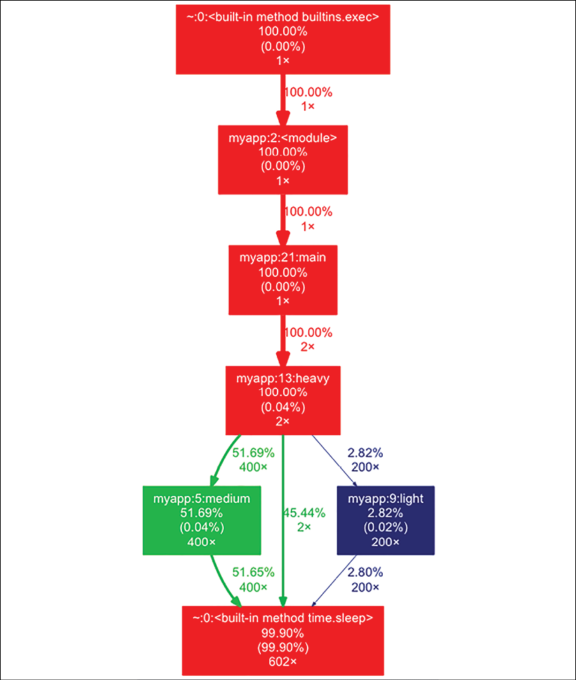
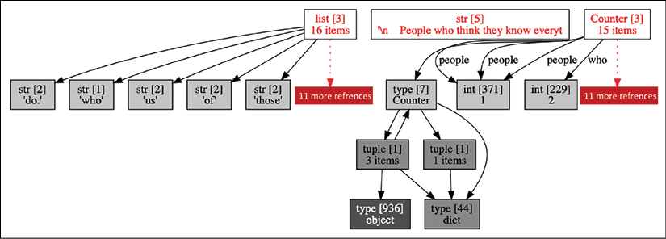
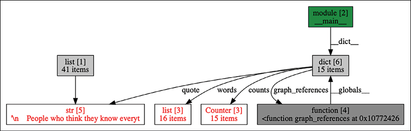
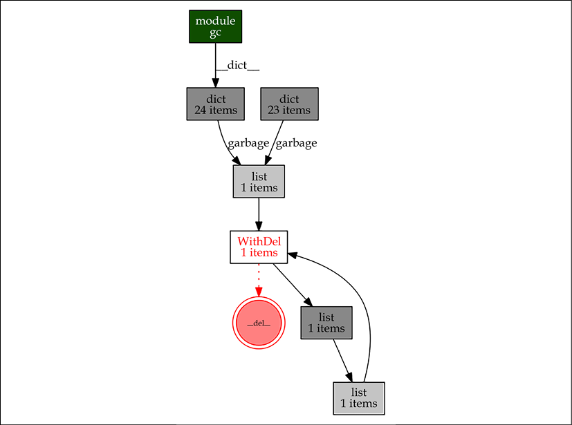
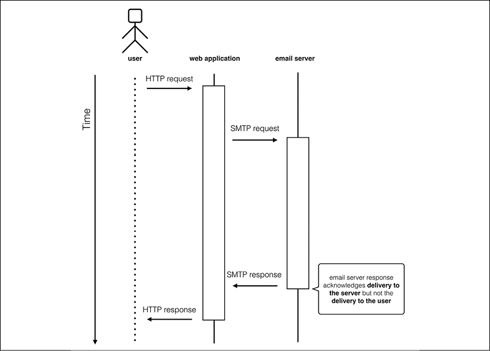
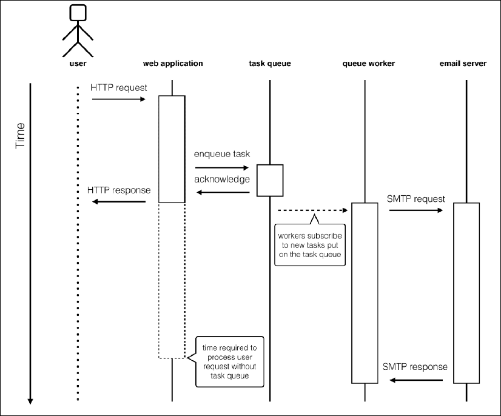
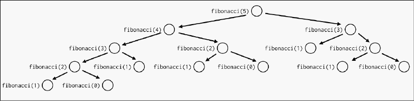
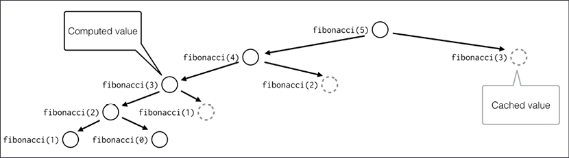

代码优化是使应用程序更有效地工作的过程，通常不会修改其功能和准确性。代码优化通常与处理速度（CPU 时间优化）有关，但也可用于最小化不同资源的使用，例如内存、磁盘空间或网络带宽。

在前一章中，我们了解了可用于识别应用程序中性能热点的各种可观察性技术。日志记录、指标监控和跟踪可用于创建一般性能概览并确定优化工作的优先级。此外，运营团队经常使用性能和资源使用指标的自定义警报或与操作超时相关的日志消息来确定需要立即采取行动的组件。

但即使是最好的日志记录、指标和跟踪系统也只能让你大致了解性能问题。如果你决定修复它，则必须执行仔细的分析过程，以揭示详细的资源使用模式。

有很多优化技术。一些专注于算法复杂性和优化数据结构的使用。其他人可以用结果的准确性或一致性来换取快速简便的性能提升。只有当你知道你的应用程序如何工作以及它如何使用资源时，你才能应用正确的优化技术。

在本章中，我们将讨论以下主题：

- 性能不佳的常见罪魁祸首
- 代码分析
- 通过选择合适的数据结构来降低复杂性
- 利用架构权衡

Python 带有内置的分析功能和有用的优化实用程序，因此理论上，我们只能使用 Python 及其标准库。但是额外的工具就像元优化——它们可以提高你自己发现和解决性能问题的效率。这就是为什么我们将严重依赖一些额外的实用程序。让我们考虑一下。

## 技术要求

以下是本章提到的 Python 包，可以从 PyPI 下载：

- gprof2dot
- objgraph
- pymemcache

关于如何安装包的信息包含在第 2 章，现代 Python 开发环境中。

以下是你可能需要安装的一些额外应用程序：

- Graphviz：https://graphviz.org 提供的开源图表可视化解决方案
- Memcached：https://memcached.org 提供的开源缓存服务

> 本章的代码文件可以在 https://github.com/PacktPublishing/Expert-Python-Programming-Fourth-Edition/tree/main/Chapter%2013 找到。

## 性能不佳的常见罪魁祸首

在我们进入分析的细节之前，让我们首先讨论应用程序性能不佳的典型原因。

在实践中，许多性能问题非常普遍并且反复出现。了解潜在的罪魁祸首对于选择正确的分析策略至关重要。此外，一些特定的罪魁祸首可能会以可识别的模式出现。如果你知道要查找什么，你将能够在不进行详细分析的情况下修复明显的性能问题，并为进一步优化尝试节省大量时间。

遇到应用程序性能不佳的最常见原因如下：

- 过于复杂
- 过度的资源分配和资源泄漏
- 过多的 I/O 和阻塞操作

应用程序效率低下最可怕的罪魁祸首是过于复杂，因此我们将首先讨论这个问题。

### 代码复杂度

在尝试提高应用程序性能时，首先要寻找的也是最明显的事情是复杂性。关于使程序复杂的原因有多种定义，并且有多种表达方式。一些可测量的复杂性指标可以提供有关代码行为方式的客观信息，这些信息通常可以推断为性能预期。有经验的程序员甚至可以可靠地猜测两种不同的实现在实践中的表现，只要他们了解它们的复杂性和执行上下文。

定义应用程序复杂性的两种最流行的方法如下：

- 圈复杂度，通常与应用程序性能相关。
- Landau表示法，又称大O表示法，是一种有助于客观判断代码性能的算法分类方法。

因此，优化过程有时可以理解为降低复杂性的过程。在接下来的部分中，我们将仔细研究这两种代码复杂度的定义。

#### 圈复杂度
圈复杂度是由 Thomas J. McCabe 在 1976 年开发的一个度量；由于它的作者，它也被称为 McCabe 的复杂性。圈复杂度测量通过一段代码的线性路径的数量。简而言之，所有分支点（if 语句）和循环（for 和 while 语句）都会增加代码的复杂性。

根据测量的圈复杂度的值，代码可以分为各种复杂度类别。下面是常用的 McCabe 复杂度类的表格：

| 圈复杂度值 | 复杂度等级 |
| ---------- | ---------- |
| 1 到 10    | 不复杂     |
| 11 到 20   | 中等复杂   |
| 21 到 50   | 真的很复杂 |
| 50以上     | 太复杂     |

圈复杂度通常与应用程序性能成反比（复杂度越高 = 性能越低）。尽管如此，它更像是一个代码质量分数，而不是一个性能指标。在查看性能瓶颈时，它不会取代代码分析的需要。具有高圈复杂度的代码通常倾向于使用相当复杂的算法，这些算法在较大的输入下可能表现不佳。

虽然圈复杂度不是判断应用程序性能的可靠方法，但它有一个重要的优势：它是一个源代码度量标准，可以用适当的工具来衡量。不能说其他表达复杂性的规范方式，包括大 O 符号。由于其可测量性，圈复杂度可能是分析的有用补充，因为它可以为你提供有关软件有问题部分的更多信息。在考虑彻底的代码架构重新设计时，代码的复杂部分是你应该首先审查的内容。

在 Python 中测量 McCabe 的复杂性相对简单，因为它可以从其抽象语法树中推导出来。当然，你不需要自己这样做。 mccabe 是来自 PyPI 的流行 Python 包，可以对 Python 源执行自动复杂性分析。它也可用作名为 pytest-mccabe 的 Pytest 插件，因此它很容易包含在你的自动化质量和测试过程中（请参阅第 10 章，测试和质量自动化）。

> 你可以在 https://pypi.org/project/mccabe/ 了解有关 mccabe 包的更多信息。
>
> pytest-mccabe 包可在 https://pypi.org/project/pytest-mccabe/ 获得。

#### 大 O 符号
定义函数复杂性的规范方法是大 O 符号。该指标定义了算法如何受输入大小的影响。例如，算法的复杂度是与输入的大小成线性关系还是平方关系？

当试图大致了解其性能与输入大小的关系时，手动评估算法的大 O 符号是最好的方法。了解应用程序组件的复杂性使你能够检测和关注会显着降低代码速度的方面。

为了衡量大 O 符号，所有常数和低阶项都被删除，以便在输入数据的大小变得非常大时专注于真正重要的部分。这个想法是将算法归入已知复杂度类别之一（即使它是近似值）。以下是最常见的复杂性类别，其中 n 等于问题的输入元素的数量：

| 符号       | 类型                     |
| ---------- | ------------------------ |
| O(1)       | 持续的; 不依赖于输入大小 |
| O(n)       | 线性                     |
| O(n log n) | 准线性                   |
| O(n^2)     | 平方                     |
| O(n^3)     | 立方                     |
| O(n!)      | 阶乘                     |

通过比较一些 Python 标准数据类型中的基本查找操作，我们可以很容易地理解复杂性类：

- Python 列表按索引查找的复杂度为 O(1)：Python 列表是预先分配的可调整大小的数组，类似于 C++ 标准库中的 Vector 容器。给定索引的列表项在内存中的位置是预先知道的，因此访问它是一个恒定时间的操作。
- 按值查找列表中的元素索引的复杂度为 O(n)：如果你使用 list.index(value) 方法，Python 将必须遍历项目，直到找到与值表达式匹配的元素。在最坏的情况下，它将不得不遍历列表的所有元素，因此它将执行 n 次操作，其中 n 是列表长度。然而，平均而言，查找随机元素需要 n/2 次操作，因此复杂度为 O(n)。
- 字典中的键查找的复杂度为 O(1)：在 Python 中，你可以使用任何不可变值作为字典中的键。键值不会直接转换为内存中的确切位置，但 Python 使用高级散列技术确保键查找操作的平均复杂度是恒定的。

要了解如何确定函数复杂度，让我们看一下以下示例：

```python
def function(n):
    for i in range(n):
        print(i)
```

在前面的函数中，print() 函数将被执行 n 次。循环长度与 n 呈线性关系，因此整个函数的复杂度为 O(n)。

如果函数有条件，则正确的表示法是最坏情况的表示法。考虑以下示例：

```python
def function(n, print_count=False):
    if print_count:
        print(f'count: {n}')
    else:
        for i in range(n):
            print(i)
```

在此示例中，函数可能是 O(1) 或 O(n)，具体取决于 print_count 参数的值。最坏的情况是 O(n)，所以整个函数的复杂度是 O(n)。

在确定复杂性时，我们不必总是考虑最坏的情况。许多算法会根据输入数据的统计特征改变运行时性能，或者通过执行巧妙的技巧来分摊最坏情况下的操作成本。这就是为什么在许多情况下，最好根据平均复杂度或摊销复杂度来审查你的实施。

例如，看一下将单个元素附加到 Python 的列表类型实例的操作。我们知道 CPython 中的列表使用内部存储过度分配的数组而不是链表。如果数组已满，则追加新元素需要分配新数组并将所有现有元素（引用）复制到内存中的新区域。如果我们从最坏情况复杂度的角度来看这一点，很明显 list.append() 方法具有 O(n) 复杂度，与链表结构的典型实现相比，这有点昂贵。然而，我们也知道，CPython 列表类型实现使用过度分配机制（它分配的空间比给定时间所需的空间多）来减轻偶尔重新分配的复杂性。如果我们评估一系列操作的复杂度，我们会注意到 list.append() 的平均复杂度是 O(1)，这实际上是一个很好的结果。

始终注意大 O 符号，但不要过于教条化。 Big O 表示法是渐近表示法，这意味着它旨在分析当输入的大小趋向于无穷大时函数的极限行为。因此，它可能无法为现实生活中的数据提供可靠的性能近似值。渐近符号是定义函数增长率的一个很好的工具，但它不会直接回答“哪个实现花费的时间最少？”这个简单的问题。最坏情况的复杂性会忽略有关单个操作的时间的所有细节，以向你展示你的程序将如何渐进地运行。它适用于你可能并不总是考虑的任意大的输入。

例如，假设你有一个需要处理 n 个独立元素的问题。假设我们有程序 A 和程序 B。你知道程序 A 需要 100n2 次操作才能完成任务，而程序 B 需要 5n3 次操作才能提供解决方案。你会选哪一个？

当谈到非常大的输入时，程序 A 是更好的选择，因为它的渐近行为更好。与程序 B 的 O(n3) 复杂度相比，它的复杂度为 O(n2)。然而，通过解决一个简单的 100n2 > 5n3 不等式，我们可以发现当 n 小于 20 时，程序 B 将执行更少的操作。因此，如果我们对我们的输入边界了解得更多，我们可以做出更好的决策。此外，我们不能假设两个程序中的单个操作花费相同的时间。如果我们想知道对于给定的输入大小，哪个运行得更快，我们将不得不分析这两个应用程序。

### 过度的资源分配和泄漏

随着复杂性的增加，经常会出现资源分配过多的问题。复杂的代码（无论是算法上还是渐近上）更有可能包含低效的数据结构或分配过多的资源而没有在之后释放它们。

尽管资源使用效率低下通常与复杂性密切相关，但过度的资源使用需要被视为单独的性能问题。这是出于两个原因：

- 分配（和释放）资源需要时间：这包括 RAM，它应该是快速内存（与磁盘相比）。有时，最好维护一个资源池，而不是不断地分配和释放它们。
- 你的应用程序不太可能在同一台主机上单独运行：如果它分配了太多资源，它可能会使其他程序饿死。在极端情况下，单个应用程序过度使用资源可能导致整个系统不可用或导致程序突然终止。

无论是网络带宽、磁盘空间、内存还是任何其他资源，如果应用程序将所有可用资源分配给自己，这将对在同一环境中运行的其他程序产生不利影响。

此外，许多操作系统或环境允许请求比技术上可用的资源更多的资源。一个常见的情况是内存过度使用，它允许操作系统为进程分配比主机物理可用更多的内存。它通过分配进程虚拟内存来工作。在物理内存不足的情况下，操作系统通常会将未使用的内存页面临时交换到磁盘以创建更多可用空间。

这种交换在健康的使用水平上可能会被忽视。但是，如果虚拟内存被过度使用，正常的交换会转变为“颠簸”，即操作系统不断地将页面交换进出磁盘。这可能会导致性能急剧下降。

过度的资源使用可能源于无效的数据结构、过大的资源池分配，或者是由无意的资源泄漏引起的。当应用程序分配了某些特定资源但从未释放它们时，即使不再需要这些资源，也会发生资源泄漏。资源泄漏最常见于内存分配，但其他资源（例如文件描述符或打开的连接）也可能发生。

### 过多的 I/O 和阻塞操作

在编写应用程序时，我们经常忘记每个操作都需要从磁盘或通过网络连接写入和读取，这需要时间。这些输入/输出 (I/O) 操作总是对应用程序产生明显的性能影响，而这正是许多软件架构师在设计复杂的网络系统时所忽略的。

随着快速 SSD（固态硬盘）的出现，磁盘 I/O 比以往任何时候都快，但仍然不如 RAM 快（而且 RAM 不如 CPU 缓存快）。此外，某些驱动器对大文件的吞吐量很快，但在随机访问模式下的表现却出奇地差。

网络连接也是如此。它的速度不可能超过光速。如果进程在相距很远的两台主机上运行，则每次通信交换都会增加明显的往返开销。这在分布式系统中是一个很大的问题，这些系统通常以许多网络服务的细粒度为特征。

过多的 I/O 操作也会影响并发服务于多个用户的能力。我们已经在第 6 章，并发中了解了各种并发模型。即使使用理论上应该最好处理 I/O 的异步并发模型，也可能会意外包含同步 I/O 操作，这可能会破坏并发的好处。在这种情况下，性能下降可能会被视为应用程序最大处理吞吐量的下降。

如你所见，性能问题有很多可能的原因。为了修复它们，你需要确定它们的罪魁祸首。我们通常通过称为分析的过程来做到这一点。

## 代码分析

了解可能出错的地方可以让你假设和押注性能问题的罪魁祸首是什么以及如何解决它们。但是分析是验证这些假设的唯一方法。你通常应该在没有首先分析你的应用程序的情况下避免优化尝试。

经验有帮助，所以在分析之前做一个小的代码概述和实验当然没有错。此外，一些分析技术需要结合额外的代码检测或编写性能测试。这意味着无论如何，你通常都必须通读一遍。如果你在此过程中执行一些小实验（例如，以调试会话的形式），你可能会发现一些明显的东西。

唾手可得的果实发生了，但不要依赖它。自由形式实验和经典分析之间的良好比例约为 1:9。我最喜欢的分析和优化过程的组织方式如下：

1. 决定你可以花费多少时间：并非所有优化都是可能的，你也不会总是能够修复它。接受第一次尝试不会成功的可能性。提前决定何时停止。与其输掉一场旷日持久的战斗，不如退出并成功重试。
2. 将这段时间分成几个会话：优化就像调试。它需要专注、有条理和清晰的头脑。选择一段可以让你完成整个循环的会话长度，包括提出假设、分析和实验。这应该不超过几个小时。
3. 制定时间表：在你最不可能被打扰并且最有效的时候实施你的课程。如果问题很大，通常最好提前几天计划，这样你就可以用新的想法开始每一天。
4. 不要制定其他发展计划：如果你在第一次会议中没有成功，你可能会不断思考你的问题。很难专注于其他更大的任务。如果你在团队中工作，请使其透明，因为在关闭主题之前你不会做出完全贡献。有一些小的任务，让你在会话之间分心。

> 优化可能需要更改应用程序中的代码。为了降低破坏的风险，确保代码在测试中得到很好的覆盖是一个很好的做法。我们在第 10 章，测试和质量自动化中讨论了常见的测试技术。

每个分析会话的关键是关于可能出错的假设。它允许你决定使用哪种分析技术以及哪种工具最有效。假设的一个重要来源是指标收集和分布式跟踪系统，我们在第 12 章观察应用程序行为和性能中详细讨论了它们。

如果你不知道哪里出了问题，最好的方法是开始传统的 CPU 分析，因为这最有可能引导你得出下一个可行的假设。这是因为许多常见的资源和网络使用反模式也可以在 CPU 配置文件中表现出来。

### 分析 CPU 使用率

通常，性能问题出现在对整个应用程序性能有重大影响的一小部分代码中。我们称这些地方为瓶颈。优化是识别和修复这些瓶颈的过程。

瓶颈的第一个来源是你的代码。标准库提供了执行代码分析所需的所有工具。它们基于确定性方法。确定性分析器通过在最低级别添加计时器来测量在每个函数中花费的时间。这引入了明显的开销，但提供了时间消耗的好主意。另一方面，统计分析器对指令指针的使用进行采样，并且不对代码进行检测。后者不太准确，但允许你全速运行目标程序。

有两种方法可以分析代码：

- 宏观分析：在整个程序使用时对其进行分析并生成统计信息。
- 微观分析：这通过手动检测程序来测量程序的精确部分。

在我们不知道运行缓慢的代码的确切片段的情况下，我们通常从整个应用程序的宏观分析开始，以获得一般的性能分析并确定充当性能瓶颈的组件。

#### 宏观分析

宏分析是通过在特殊模式下运行应用程序来完成的，在这种模式下，解释器被用来收集有关代码使用的统计信息。 Python 标准库为此提供了多种工具，包括：

- profile：这是一个纯 Python 实现。
- cProfile：这是一个 C 实现，提供与配置文件工具相同的接口，但开销较少。

大多数 Python 程序员的推荐选择是 cProfile，因为它减少了开销。在任何情况下，如果你需要以某种方式扩展分析器，那么 profile 将是更好的选择，因为它不使用 C 扩展，因此更容易扩展。

两个工具的界面和用法都一样，这里我们只用其中的一个。下面是一个 myapp.py 模块，我们将使用 cProfile 模块对其进行分析：

```python
import time 
 
def medium(): 
    time.sleep(0.01) 
 
def light(): 
    time.sleep(0.001) 
 
def heavy(): 
    for i in range(100): 
        light() 
        medium() 
        medium() 
    time.sleep(2) 
 
def main(): 
    for i in range(2): 
        heavy() 
 
if __name__ == '__main__': 
    main()
```

这个模块可以直接从提示中调用，结果总结如下：

```sh
$ python3 -m cProfile myapp.py
```

我们的 myapp.py 脚本的分析输出示例如下：

```sh
    1208 function calls in 8.243 seconds
   Ordered by: standard name
   ncalls  tottime  percall  cumtime  percall filename:lineno(function)
        2    0.001    0.000    8.243    4.121 myapp.py:13(heavy)
        1    0.000    0.000    8.243    8.243 myapp.py:2(<module>)
        1    0.000    0.000    8.243    8.243 myapp.py:21(main)
      400    0.001    0.000    4.026    0.010 myapp.py:5(medium)
      200    0.000    0.000    0.212    0.001 myapp.py:9(light)
        1    0.000    0.000    8.243    8.243 {built-in method exec}
      602    8.241    0.014    8.241    0.014 {built-in method sleep}
```

每一列的含义如下：

- ncalls：总调用次数
- tottime：函数花费的总时间，不包括子函数调用花费的时间
- cumtime：函数花费的总时间，包括调用子函数所花费的时间

tottime 左侧的 percall 列等于 tottime / ncalls，cumtime 左侧的 percall 列等于 cumtime / ncalls。

这些统计信息是分析器创建的统计信息对象的打印视图。你还可以在交互式 Python 会话中创建和查看此对象，如下所示：

```python
>>> import cProfile
>>> from myapp import main
>>> profiler = cProfile.Profile()
>>> profiler.runcall(main)
>>> profiler.print_stats()
         1206 function calls in 8.243 seconds
   Ordered by: standard name
   ncalls  tottime  percall  cumtime  percall file:lineno(function)
        2    0.001    0.000    8.243    4.121 myapp.py:13(heavy)
        1    0.000    0.000    8.243    8.243 myapp.py:21(main)
      400    0.001    0.000    4.026    0.010 myapp.py:5(medium)
      200    0.000    0.000    0.212    0.001 myapp.py:9(light)
      602    8.241    0.014    8.241    0.014 {built-in method sleep}
```

统计信息也可以保存在文件中，然后由 pstats 模块读取。该模块提供了一个知道如何处理配置文件的类，并提供了一些帮助程序来更轻松地查看配置文件的结果。以下脚本显示了如何访问呼叫总数以及如何显示按时间指标排序的前三个呼叫：

```python
>>> import pstats
>>> import cProfile
>>> from myapp import main
>>> cProfile.run('main()', 'myapp.stats')
>>> stats = pstats.Stats('myapp.stats')
>>> stats.total_calls
1208
>>> stats.sort_stats('time').print_stats(3)
Mon Apr  4 21:44:36 2016    myapp.stats
         1208 function calls in 8.243 seconds
 
   Ordered by: internal time
   List reduced from 8 to 3 due to restriction <3>
   ncalls  tottime  percall  cumtime  percall file:lineno(function)
      602    8.241    0.014    8.241    0.014 {built-in method sleep}
      400    0.001    0.000    4.025    0.010 myapp.py:5(medium)
        2    0.001    0.000    8.243    4.121 myapp.py:13(heavy)
```

从那里，你可以通过打印出每个函数的调用者和被调用者来浏览代码，如下所示：

```python
>>> stats.print_callees('medium')
   Ordered by: internal time
   List reduced from 8 to 1 due to restriction <'medium'>
Function           called...
                   ncalls  tottime  cumtime
myapp.py:5(medium) ->  400    4.025    4.025  {built-in method sleep}
>>> stats.print_callees('light')
   Ordered by: internal time
   List reduced from 8 to 1 due to restriction <'light'>
Function           called...
                    ncalls  tottime  cumtime
myapp.py:9(light)  ->  200    0.212    0.212  {built-in method sleep}
```

能够对输出进行排序允许你在不同的视图上工作以找到瓶颈。例如，请考虑以下场景：

- 当小调用的数量（tottime 列的 percall 值较低）非常高（ncalls 的值较高）并占用了大部分全局时间时，该函数或方法很可能在一个很长的循环中运行。通常，可以通过将此调用移动到不同的范围以减少操作数量来完成优化。
- 当单个函数调用需要很长时间时，如果可能，缓存可能是一个不错的选择。

从分析数据中可视化瓶颈的另一个好方法是将它们转换为图表（见图 13.1）。 gprof2dot.py 脚本可用于将分析器数据转换为点图：

```python
$ gprof2dot.py -f pstats myapp.stats | dot -Tpng -o output.png
```

> gprof2dot.py 脚本是 PyPI 上可用的 gprof2dot 包的一部分。你可以使用pip下载它。使用它需要安装 Graphviz 软件。你可以从 http://www.graphviz.org/ 免费下载。

以下是将 myapp.stats 配置文件转换为 PNG 图表的 Linux shell 中上述 gprof2dot.py 调用的示例输出：

示例图显示了程序执行的不同代码路径以及在每个路径中花费的相对时间。每个框代表一个功能。链接函数，你可以获得给定代码路径的执行次数以及在这些路径上花费的总执行时间的百分比。使用图表是探索大型应用程序性能模式的好方法。

gprof2dot 的优点是它试图与语言无关。它不限于 Python 配置文件或 cProfile 输出，并且可以从多个其他配置文件中读取，例如 Linux perf、xperf、gprof、Java HPROF 等。

宏分析是检测有问题的函数或至少是其邻域的好方法。找到它后，你可以继续进行微观分析。

#### 微观分析

当发现慢函数时，我们通常会继续进行微分析以生成一个专注于尽可能少的代码的配置文件。这是通过在专门创建的速度测试中手动检测部分代码来完成的。

例如，可以以装饰器的形式使用 cProfile 模块，如下例所示：

```python
import time
import tempfile
import cProfile
import pstats
def profile(column='time', list=3):
    def parametrized_decorator(function):
        def decorated(*args, **kw):
            s = tempfile.mktemp()
            profiler = cProfile.Profile()
            profiler.runcall(function, *args, **kw)
            profiler.dump_stats(s)
            p = pstats.Stats(s)
            print("=" * 5, f"{function.__name__}() profile", "=" * 5)
            p.sort_stats(column).print_stats(list)
        return decorated
    return parametrized_decorator
def medium():
    time.sleep(0.01)
@profile('time')
def heavy():
    for i in range(100):
        medium()
        medium()
    time.sleep(2)
def main():
    for i in range(2):
        heavy()
if __name__ == '__main__':
    main()
```

这种方法允许只测试应用程序的选定部分（这里是重（）函数）并锐化统计的输出。这样，你可以在单个应用程序运行中收集许多隔离且精确定位的配置文件，如下所示。以下是在 Python 解释器中运行上述代码的示例输出：

```sh
===== heavy() profile =====
Wed Apr 10 03:11:53 2019 /var/folders/jy/wy13kx0s7sb1dx2rfsqdvzdw0000gq/T/tmpyi2wejm5
         403 function calls in 4.330 seconds
 Ordered by: internal time
 List reduced from 4 to 3 due to restriction <3>
 ncalls tottime percall cumtime percall filename:lineno(function)
    201 4.327   0.022   4.327   0.022   {built-in method time.sleep}
    200 0.002   0.000   2.326   0.012   cprofile_decorator.py:24(medium)
      1 0.001   0.001   4.330   4.330   cprofile_decorator.py:28(heavy)
===== heavy() profile =====
Wed Apr 10 03:11:57 2019 /var/folders/jy/wy13kx0s7sb1dx2rfsqdvzdw0000gq/T/tmp8mubgwjw
         403 function calls in 4.328 seconds
 Ordered by: internal time
 List reduced from 4 to 3 due to restriction <3>
 ncalls tottime percall cumtime percall filename:lineno(function)
    201 4.324   0.022   4.324   0.022   {built-in method time.sleep}
    200 0.002   0.000   2.325   0.012   cprofile_decorator.py:24(medium)
      1 0.001   0.001   4.328   4.328.  cprofile_decorator.py:28(heavy)
```

在前面的输出中，我们看到 Heavy() 函数被调用了两次，并且两次的配置文件都非常相似。在调用列表中，我们对 time.sleep() 函数进行了 201 次调用，累计执行时间约为 4.3 秒。

有时在这个阶段，只有一个包含被调用者列表的配置文件还不足以理解问题。一种常见的做法是创建代码特定部分的替代实现，并测量执行它们所需的时间。如果heavy() 函数要做任何有用的事情，例如，我们可以尝试用较低复杂度的代码解决同样的问题。

timeit 是一个有用的模块，它提供了一种简单的方法来测量小代码片段的执行时间，使用主机系统提供的最佳底层计时器（time.perf_counter() 对象），如下例所示：

```python
>>> from myapp import medium
>>> import timeit
>>> timeit.timeit(light, number=1000)
1.2880568829999675
```

timeit.timeit() 函数将运行指定函数 1,000 次（由 number 参数指定）并返回所有执行过程中花费的总时间。如果你期望结果有更大的差异，你可以使用 timeit.repeat() 将整个测试重复指定的次数：

```python
>>> timeit.repeat(light, repeat=5, number=1000)
[1.283251813999982, 1.2764048459999913, 1.2787090969999326, 1.279601415000002, 1.2796783549999873]
```

timeit 模块允许你多次重复调用，并且可以轻松地用于尝试隔离的代码片段。这在应用程序上下文之外非常有用，例如在提示中，但对于在现有应用程序中使用来说并不理想。
timeit 模块可用于在你的自动化测试框架中创建速度测试，但应谨慎使用该方法。计时结果可能每次都不同。多次重复相同的测试并取平均值可提供更准确的结果。此外，某些计算机具有特殊的 CPU 功能，可能会根据负载或温度更改处理器时钟时间。因此，你可以在计算机空闲和真正忙碌时看到不同的时间结果。其他同时运行的程序也很可能会影响整体时间。因此，对于小代码片段，不断重复测试是一种很好的做法。这就是为什么在自动化测试流程中测量时间时，我们通常尝试观察模式而不是将具体的时间阈值作为断言。

在进行 CPU 分析时，我们经常发现与获取和释放资源相关的各种模式，因为这些通常通过函数调用发生。使用 profile 和 cProfile 模块的传统 Python 分析可以提供资源使用模式的一般概述，但在内存使用方面，我们更喜欢专用的内存分析解决方案。

### 分析内存使用情况

在我们开始寻找 Python 中的内存问题之前，你应该知道 Python 中内存泄漏的性质非常特殊。在一些编译语言（如 C 和 C++）中，内存泄漏几乎完全是由不再被任何指针引用的已分配内存块引起的。如果你没有对内存的引用，则无法释放它。这种情况称为内存泄漏。

在 Python 中，没有可供用户使用的低级内存管理，因此我们改为处理泄漏引用——对不再需要但未删除的对象的引用。这会阻止解释器释放资源，但与 C 中的经典内存泄漏情况不同。

> 在 Python C 扩展中总是存在通过指针泄漏内存的例外情况，但它们是一种不同的野兽，需要完全不同的工具来诊断。这些无法从 Python 代码中轻松检查。在 C 中检查内存泄漏的常用工具是 Valgrind。你可以在 https://valgrind.org/ 上了解有关 Valgrind 的更多信息。

因此，Python 中的内存问题主要是由意外或计划外的资源获取模式引起的。这是由内存分配和释放例程处理不当引起的实际错误的影响，这种情况很少发生。在使用 Python/C API 编写 C 扩展时，此类例程仅对 CPython 中的开发人员可用。如果有的话，你很少会处理这些问题。因此，Python 中的大多数内存泄漏主要是由软件过于复杂以及其组件之间难以跟踪的微妙交互引起的。要发现并定位软件中的此类缺陷，你需要了解程序中实际内存使用情况。

获取有关 Python 解释器控制多少对象的信息并检查它们的实际大小有点棘手。例如，要知道给定对象以字节为单位占用多少内存将涉及爬取其所有属性、处理交叉引用，然后总结所有内容。如果你考虑对象倾向于相互引用的方式，这是一个非常复杂的问题。内置的 gc 模块是 Python 垃圾收集器的接口，并没有为此提供高级功能，并且需要在调试模式下编译 Python 才能拥有完整的信息集。

通常，程序员只是询问系统在执行给定操作之前和之后他们的应用程序的内存使用情况。但是这个度量是一个近似值，在很大程度上取决于系统级别的内存管理方式。例如，在 Linux 下使用 top 命令，或在 Windows 下使用任务管理器，可以在内存问题很明显时检测到它们。然而，这种方法很费力，而且很难追踪到错误的代码块。

幸运的是，有一些工具可用于制作内存快照并计算加载对象的数量和大小。但是让我们记住，Python 不会轻易释放内存，而是更愿意保留它以备再次需要时使用。

一段时间以来，在 Python 中调试内存问题和使用情况时最常用的工具之一是 Guppy-PE 及其 Heapy 组件。不幸的是，它似乎不再被维护并且它缺乏 Python 3 支持。幸运的是，以下是在某种程度上与 Python 3 兼容的其他一些替代方案：

- Memprof (http://jmdana.github.io/memprof/)：这被声明为适用于一些符合 POSIX 的系统（macOS 和 Linux）。最后更新于 2019 年 12 月。
- memory_profiler (https://pypi.org/project/memory-profiler)：声明为独立于操作系统。积极维护。
- Pympler (https://pypi.org/project/Pympler/)：宣布独立于操作系统。积极维护。
- objgraph (https://mg.pov.lt/objgraph/)：宣布独立于操作系统。积极维护。

请注意，上述有关兼容性的信息完全基于最新发布的特色包所使用的 trove 分类器、文档中的声明以及在撰写本书时对项目构建管道定义的检查。在你阅读本文时，这些值可能有所不同。

如你所见，Python 开发人员可以使用许多内存分析工具。每一个都有一些限制和限制。在本章中，我们将重点介绍一种已知可以在不同操作系统上与最新版本的 Python（即 Python 3.9）配合使用的分析器。这个工具是objgraph。

objgraph 的 API 可能看起来有点笨拙，而且它的功能非常有限。但是它可以工作，可以很好地完成它需要做的事情，并且使用起来非常简单。内存检测不是永久添加到生产代码中的东西，所以这个工具不需要很漂亮。

#### 使用 objgraph 模块

objgraph 是一个简单的模块，用于在应用程序中创建对象引用的图表。在 Python 中寻找内存泄漏时，这些非常有用。

objgraph 在 PyPI 上可用，但它不是一个完全独立的工具，需要安装在宏分析部分的 Graphviz 才能创建内存使用图。

objgraph 提供了多个实用程序，允许你列出和打印有关内存使用和对象计数的各种统计信息。使用中的此类实用程序的示例显示在以下解释器会话的记录中：

```python
>>> import objgraph
>>> objgraph.show_most_common_types()
function                   1910
dict                       1003
wrapper_descriptor         989
tuple                      837
weakref                    742
method_descriptor          683
builtin_function_or_method 666
getset_descriptor          338
set                        323
member_descriptor          305
>>> objgraph.count('list')
266
>>> objgraph.typestats(objgraph.get_leaking_objects())
{'Gt': 1, 'AugLoad': 1, 'GtE': 1, 'Pow': 1, 'tuple': 2, 'AugStore': 1, 'Store': 1, 'Or': 1, 'IsNot': 1, 'RecursionError': 1, 'Div': 1, 'LShift': 1, 'Mod': 1, 'Add': 1, 'Invert': 1, 'weakref': 1, 'Not': 1, 'Sub': 1, 'In': 1, 'NotIn': 1, 'Load': 1, 'NotEq': 1, 'BitAnd': 1, 'FloorDiv': 1, 'Is': 1, 'RShift': 1, 'MatMult': 1, 'Eq': 1, 'Lt': 1, 'dict': 341, 'list': 7, 'Param': 1, 'USub': 1, 'BitOr': 1, 'BitXor': 1, 'And': 1, 'Del': 1, 'UAdd': 1, 'Mult': 1, 'LtE': 1}
```

请注意，由于很多 Python 内置函数和类型是位于同一进程内存中的普通 Python 对象，因此 objgraph 显示的上述分配对象数量已经很高。此外，objgraph 本身会创建一些包含在此摘要中的对象。

如前所述，objgraph 允许你创建链接给定命名空间中所有对象的内存使用模式和交叉引用的图表。 objgraph 模块最有用的函数是 objgraph.show_refs() 和 objgraph.show_backrefs()。它们都接受对被检查对象的引用，并使用 Graphviz 包将图表图像保存到文件中。图 13.2 和图 13.3 展示了此类图表的示例。这是用于创建这些图表的代码：

```python
from collections import Counter
import objgraph
def graph_references(*objects):
    objgraph.show_refs(
        objects,
        filename='show_refs.png',
        refcounts=True,
        # additional filtering for the sake of brevity
        too_many=5,
        filter=lambda x: not isinstance(x, dict),
    )
    objgraph.show_backrefs(
        objects,
        filename='show_backrefs.png',
        refcounts=True
    )
if __name__ == "__main__":
    quote = """
    People who think they know everything are a
    great annoyance to those of us who do.
    """
    words = quote.lower().strip().split()
    counts = Counter(words)
    graph_references(words, quote, counts)
```

在没有安装Graphviz的情况下，objgraph会输出DOT格式的图，这是一种特殊的图描述语言。

下图显示了 words、quote 和 counts 对象持有的所有引用的图表：



如你所见，单词 object（表示为列表 [3]）包含对 16 个对象的引用。 counts 对象（表示为 Counter [3]）保存对 15 个对象的引用。它比单词 object 少一个对象，因为“who”这个词出现了两次。引用对象（表示为 str [5]）是一个普通字符串，因此它不包含任何额外的引用。

下图显示了导致 words、quote 和 counts 对象的反向引用：



在上图中，我们看到引用、单词和计数对象是名为 \_\_globals\_\_ 的 \_\_main\_\_ 模块的全局变量的字典（表示为 dict[6]）中的引用。此外，由于 CPython 的字符串实习机制，引用对象在特殊列表对象（表示为列表 [1]）中被引用。

> 字符串实习是 CPython 的内存优化机制。大多数字符串文字是在加载模块时由 CPython 预先分配的。 Python 中的字符串是不可变的，因此相同字符串文字的重复出现将引用内存中的相同地址。

为了展示如何在实践中使用 objgraph，让我们回顾一个在某些 Python 版本下可能会产生内存问题的代码示例。正如我们在第 9 章，桥接 Python 与 C 和 C++ 中已经提到的，CPython 有自己的垃圾收集器，它独立于其引用计数机制而存在。它不用于通用内存管理，其唯一目的是解决循环引用问题。在许多情况下，对象可能以某种方式相互引用，以至于无法使用基于引用计数的简单技术来删除它们。这是最简单的例子：

```python
x = [] 
y = [x] 
x.append(y)
```

这种情况如图 13.4 所示：


在前面的例子中，即使所有对 x 和 y 对象的外部引用都被删除了（例如，通过从函数的局部范围返回），这两个对象也不能通过引用计数删除，因为总会有两个交叉引用归这两个对象所有。这是 Python 垃圾收集器介入的一种情况。它可以检测对对象的循环引用，并在循环之外没有对这些对象的其他有效引用时触发它们的释放。

当这样一个循环中的至少一个对象定义了自定义 \_\_del\_\_() 方法时，真正的问题就开始了。这是一个自定义的释放处理程序，将在对象的引用计数最终变为零时调用。它可以执行任意 Python 代码，因此还可以创建对特色对象的新引用。这就是如果至少有一个对象提供自定义 \_\_del\_\_() 方法实现，则 Python 3.4 之前的垃圾收集器无法中断引用循环的原因。 PEP 442 为 Python 引入了安全对象终结，并成为语言标准的一部分，从 Python 3.4 开始。无论如何，对于担心向后兼容性并针对广泛的 Python 解释器版本的包来说，这可能仍然是一个问题。以下代码片段可让你展示不同 Python 版本中循环垃圾收集器之间的行为差异：

```python
import gc 
import platform 
import objgraph 
 
 
class WithDel(list): 
    """ list subclass with custom __del__ implementation """ 
    def __del__(self): 
        pass 
 
 
def main(): 
    x = WithDel() 
    y = [] 
    z = [] 
 
    x.append(y) 
    y.append(z) 
    z.append(x) 
 
    del x, y, z 
 
    print("unreachable prior collection: %s" % gc.collect()) 
    print("unreachable after collection: %s" % len(gc.garbage)) 
    print("WithDel objects count:        %s" % 
          objgraph.count('WithDel')) 
 
 
if __name__ == "__main__": 
    print("Python version: %s" % platform.python_version()) 
    print() 
    main()
```

上述代码在 Python 3.3 下执行时的以下输出表明，旧版本 Python 中的循环垃圾收集器无法收集定义了 \_\_del\_\_() 方法的对象：

```sh
$ python3.3 with_del.py 
Python version: 3.3.5
    
unreachable prior collection: 3
unreachable after collection: 1
WithDel objects count:        1
```

使用较新版本的 Python，垃圾收集器可以安全地处理对象的终结，即使它们定义了 \_\_del\_\_() 方法，如下所示：

```python
$ python3.5 with_del.py 
Python version: 3.5.1
unreachable prior collection: 3
unreachable after collection: 0
WithDel objects count:        0
```

尽管在最新的 Python 版本中自定义终结不再是内存威胁，但它仍然给需要在不同环境中工作的应用程序带来了问题。正如我们之前提到的，objgraph.show_refs() 和 objgraph.show_backrefs() 函数允许你轻松发现参与牢不可破的引用循环的有问题的对象。例如，我们可以轻松地修改 main() 函数以显示对 WithDel 实例的所有反向引用，以查看是否存在泄漏资源，如下所示：

```python
def main(): 
    x = WithDel() 
    y = [] 
    z = [] 
 
    x.append(y) 
    y.append(z) 
    z.append(x) 
 
    del x, y, z 
 
    print("unreachable prior collection: %s" % gc.collect()) 
    print("unreachable after collection: %s" % len(gc.garbage)) 
    print("WithDel objects count:        %s" % 
          objgraph.count('WithDel')) 
 
    objgraph.show_backrefs( 
        objgraph.by_type('WithDel'), 
        filename='after-gc.png' 
    )
```

在 Python 3.3 下运行前面的示例将产生图 13.5 所示的图表。它表明 gc.collect() 无法成功删除 x、y 和 z 对象实例。此外，objgraph 以红色突出显示具有自定义 __del__() 方法的所有对象，以便更容易地发现此类问题：



当 C 扩展中发生内存泄漏时（例如，在 Python/C 扩展中），通常很难诊断和分析它们。然而，更难并不意味着不可能，我们将在下一节中发现。

#### C 代码内存泄漏

如果 Python 代码看起来非常好，并且在循环访问隔离函数时内存仍然增加，则泄漏可能位于 C 端。例如，当导入的 C 扩展的关键部分中缺少 Py_DECREF 宏时，就会发生这种情况。

CPython 解释器的 C 代码非常健壮，并测试了内存泄漏的存在，因此它是查找内存问题的最后一个地方。但是，如果你使用具有自定义 C 扩展的包，它们可能是首先查看的好地方。因为你将处理在比 Python 低得多的抽象级别上运行的代码，所以你需要使用完全不同的工具来解决此类内存问题。

内存调试在 C 中并不容易，因此在深入研究扩展内部之前，请确保正确诊断问题的根源。这是一种非常流行的方法，可以用本质上类似于单元测试的代码来隔离可疑包。要诊断问题的根源，你应该考虑以下操作：

- 为你怀疑内存泄漏的每个 API 单元或扩展的功能编写单独的测试。
- 在循环中独立执行任意长时间的测试（每次运行一个测试函数）。
- 从外部观察哪些测试功能会随着时间的推移增加内存使用量。

通过使用这种方法，你最终将隔离扩展的错误部分，这将减少以后检查和修复其代码所需的时间。这个过程可能看起来很繁重，因为它需要大量额外的时间和编码，但从长远来看确实是有回报的。通过重用在第 10 章，测试和质量自动化中介绍的一些测试工具，你总是可以使你的工作更轻松。 Pytest 等实用程序可能不是专门为这种情况设计的，但至少可以减少在隔离环境中运行多个测试所需的时间。

如果你已经成功隔离了泄漏内存的扩展部分，你最终可以开始实际调试。如果幸运的话，对隔离的源代码部分进行简单的手动检查可能会提供所需的结果。在许多情况下，问题就像添加缺少的 Py_DECREF 调用一样简单。然而，在大多数情况下，你的工作不会那么简单。在这种情况下，你需要拿出一些更大的枪。 Valgrind 是应该在每个程序员的工具带中的用于对抗编译代码中的内存泄漏的著名通用工具之一。这是用于构建动态分析工具的完整仪器框架。正因为如此，它可能不容易学习和掌握，但你绝对应该熟悉它的使用基础。

> 你可以在 https://valgrind.org 上了解有关 Valgrind 的更多信息。

在分析之后，当你知道代码性能有什么问题时，就可以应用实际的代码优化了。性能不佳的最常见原因是代码复杂性。很多时候，代码复杂度可以通过应用适当的数据结构来降低。现在让我们看一些使用内置 Python 数据类型进行优化的示例。

## 通过选择合适的数据结构来降低复杂性

为了降低代码复杂性，重要的是要考虑数据的存储方式。你应该仔细选择你的数据结构。以下部分将为你提供几个示例，说明如何通过正确的数据类型提高简单代码片段的性能。

### 在列表中搜索

由于 Python 中列表类型的实现细节，在列表中搜索特定值并不是一个廉价的操作。 list.index() 方法的复杂度是 O(n)，其中 n 是列表元素的数量。如果你只需要执行一些元素索引查找，这种线性复杂性不会成为问题，但它可能会对某些关键代码部分的性能产生负面影响，尤其是在非常大的列表上进行时。

如果你需要快速且频繁地搜索列表，你可以尝试使用 Python 标准库中的 bisect 模块。该模块中的函数主要用于插入或查找给定值的插入索引，以保留已排序序列的顺序。该模块用于使用二分算法有效地找到元素索引。以下配方来自该函数的官方文档，使用二进制搜索查找元素索引：

```python
def index(a, x): 
    'Locate the leftmost value exactly equal to x' 
    i = bisect_left(a, x) 
    if i != len(a) and a[i] == x: 
        return i 
    raise ValueError
```

请注意，bisect 模块中的每个函数都需要一个排序的序列才能工作。如果你的列表顺序不正确，则对其进行排序是一项最坏情况复杂度为 O(n log n) 的任务。这是一个比 O(n) 更糟糕的类，因此对整个列表进行排序然后只执行一次搜索将不会有回报。但是，如果你需要在一个很少更改的大型列表中执行多次索引搜索，那么对 bisect 使用单个 sort() 操作可能被证明是最好的权衡。

如果你已经有一个排序列表，你还可以使用 bisect 将新项目插入到该列表中，而无需重新排序。 bisect_left() 和 bisect_right() 函数已经相应地在从左到右或从右到左排序的列表中返回插入点。以下是使用 bisect_left() 函数在从左到右排序的列表中插入新值的示例：

```python
>>> from bisect import bisect_left
>>> items = [1, 5, 6, 19, 20]
>>> items.insert(bisect_left(items, 15), 15)
>>> items
[1, 5, 6, 15, 19, 20]
```

还有 insort_left() 和 insort_right() 函数是在排序列表中插入元素的简写：

```python
>>> from bisect import insort_left
>>> items = [1, 5, 6, 19, 20]
>>> insort_left(items, 15)
>>> items
[1, 5, 6, 15, 19, 20]
```

在下一节中，我们将看到在需要元素唯一性时如何使用集合而不是列表。

### 使用集合

当你需要从给定序列构建不同值的序列时，你可能想到的第一个算法如下：

```python
>>> sequence = ['a', 'a', 'b', 'c', 'c', 'd']
>>> result = []
>>> for element in sequence:
...     if element not in result:
...         result.append(element)
... 
>>> result
['a', 'b', 'c', 'd']
```

在前面的示例中，复杂性是由结果列表中的查找引入的。 in 运算符的时间复杂度为 O(n)。然后在循环中使用它，成本为 O(n)。所以，整体复杂度是二次的，即 O(n2)。

对相同的工作使用 set 类型会更快，因为使用哈希查找存储的值（与 dict 类型相同）。 set 类型也保证了元素的唯一性，所以除了从序列对象创建一个新的 set 之外，我们不需要做任何事情。换句话说，对于序列中的每个值，查看它是否已经在集合中所花费的时间将是恒定的，如下所示：

```python
>>> sequence = ['a', 'a', 'b', 'c', 'c', 'd']
>>> unique = set(sequence)
>>> unique
set(['a', 'c', 'b', 'd'])
```

这将复杂度降低到 O(n)，即集合对象创建的复杂度。将集合类型用于元素唯一性的另一个优点是代码更短且更明确。

有时内置的数据类型不足以有效地处理你的数据结构。 Python 在 collections 模块中附带了一组很棒的附加高性能数据类型。

### 使用 collections 模块

collections 模块为通用的内置容器类型提供了专门的替代方案。我们将在本章中关注的该模块的主要类型如下：

- deque：具有额外功能的类列表类型
- defaultdict：具有内置默认工厂功能的类似 dict 的类型
- namedtuple：为成员分配键的类似元组的类型

> 我们已经在其他章节中讨论了集合模块中的其他类型： 第 3 章中的 ChainMap，Python 中的新事物；第 4 章中的 UserList 和 UserDict，Python 与其他语言的比较；第 5 章，接口、模式和模块化中的计数器和计数器。

我们将在以下部分讨论这些类型。

#### deque

双端队列是列表的替代实现。内置列表类型基于普通数组，而双端队列基于双向链表。因此，当你需要在它的尾部或头部插入一些东西时，双端队列要快得多，但当你需要访问任意索引时，速度要慢得多。

当然，得益于 Python 列表类型内部数组的过度分配，并不是每个 list.append() 调用都需要重新分配内存，该方法的平均复杂度为 O(1)。当需要在列表的第一个索引处添加元素时，情况会发生巨大变化。因为新元素右边的所有元素都需要在数组中移动，所以 list.insert() 的复杂度是 O(n)。如果你需要执行大量的弹出、追加和插入操作，用双端队列代替列表可能会显着提高性能。

> 记住在从列表切换到双端队列之前总是分析你的代码，因为在数组中一些快速的事情（例如访问任意索引）在链表中效率极低。

例如，如果我们使用 timeit 测量添加一个元素并将其从序列中删除所需的时间，则列表和双端队列之间的差异甚至可能不明显。

以下是为列表类型运行的示例时间：

```sh
$ python3 -m timeit \
  -s 'sequence=list(range(10))' \
  'sequence.append(0); sequence.pop();'
1000000 loops, best of 3: 0.168 usec per loop
```

以下是为 deque 类型运行的示例 timeit：

```sh
$ python3 -m timeit \ 
  -s 'from collections import deque; sequence=deque(range(10))' \
  'sequence.append(0); sequence.pop();'
1000000 loops, best of 3: 0.168 usec per loop
```

但是，如果我们对要添加和删除序列的第一个元素的情况进行类似的比较，则性能差异令人印象深刻。

以下是为列表类型运行的示例时间：

```sh
$ python3 -m timeit \
  -s 'sequence=list(range(10))' \
  'sequence.insert(0, 0); sequence.pop(0)'  
1000000 loops, best of 3: 0.392 usec per loop
```

以下是为 deque 类型运行的类似 timeit：

```sh
$ python3 -m timeit \
  -s 'from collections import deque; sequence=deque(range(10))' \
  'sequence.appendleft(0); sequence.popleft()'
10000000 loops, best of 3: 0.172 usec per loop
```

正如你所料，随着序列大小的增加，差异会变得更大。以下是使用 timeit 对包含 10,000 个元素的列表运行相同测试的示例：

```sh
$ python3 -m timeit \
  -s 'sequence=list(range(10000))' \
  'sequence.insert(0, 0); sequence.pop(0)'
100000 loops, best of 3: 14 usec per loop
```

如果我们对 deque 做同样的事情，我们会看到操作的时序没有改变：

```sh
$ python3 -m timeit \
  -s 'from collections import deque; sequence=deque(range(10000))' \ 
  'sequence.appendleft(0); sequence.popleft()'
10000000 loops, best of 3: 0.168 usec per loop
```

多亏了高效的 append() 和 pop() 方法，它们在序列的两端以相同的速度工作，deque 成为实现队列的完美例子。例如，如果使用 deque 而不是 list 来实现先进先出 (FIFO) 队列会更加高效。

deque 在实现队列时运行良好，但 Python 的标准库中还有一个单独的队列模块，它提供了 FIFO、后进先出 (LIFO) 和优先级队列的基本实现。如果你想利用队列作为线程间通信的机制，你应该使用队列模块中的类而不是 collections.deque。这是因为这些类提供了所有必要的锁定语义。如果你不使用线程并且选择不使用队列作为通信机制，则 deque 应该足以提供队列实现基础知识。

#### defaultdict

defaultdict 类型类似于 dict 类型，只是它为新键添加了一个默认工厂。这避免了需要编写额外的测试来初始化映射条目，并且也比 dict.setdefault 方法更有效。

defaultdict 看起来像是 dict 上的简单语法糖，它允许我们编写更短的代码。但是，在失败的键查找时回退到预定义值比 dict.setdefault() 方法稍快。

以下是 dict.setdefault() 方法的运行时间：

```sh
$ python3 -m timeit \
  -s 'd = {}' \
  'd.setdefault("x", None)'
10000000 loops, best of 3: 0.153 usec per loop
```

以下是针对等效 defaultdict 用法运行的 timeit：

```sh
$ python3 -m timeit \
-s 'from collections import defaultdict; d = defaultdict(lambda: None)' \
'd["x"]'
10000000 loops, best of 3: 0.0447 usec per loop
```

前面示例中的差异可能看起来更大，但计算复杂度并没有改变。 dict.setdefault() 方法包含两个步骤（key 查找和 key set），这两个步骤的复杂度都是 O(1)。没有办法让复杂度类低于 O(1)，但有时在同一个 O(1) 类中寻找更快的替代方案是值得的。在优化关键代码部分时，每一个小的速度改进都很重要。

defaultdict 类型将工厂作为参数，因此可以与内置类型或构造函数不带参数的类一起使用。以下代码片段是官方文档中的示例，演示了如何使用 defaultdict 进行计数：

```sh
>>> from collections import defaultdict 
>>> s = 'mississippi'
>>> d = defaultdict(int)
>>> for k in s:
...     d[k] += 1
...
>>> list(d.items())
[('i', 4), ('p', 2), ('s', 4), ('m', 1)]
```

对于这个特定示例（计算唯一元素），collections 模块还提供了一个特殊的 Counter 类。它可用于高效查询多个顶级元素。

#### namedtuple

namedtuple 是一个类工厂，它采用带有属性列表的类型名称并从中创建一个类。然后可以使用新类来实例化类似元组的对象，并为其元素提供访问器，如下所示：

```python
>>> from collections import namedtuple 
>>> Customer = namedtuple(
...     'Customer',
...     'firstname lastname'
... )
>>> c = Customer('Tarek', 'Ziadé')
>>> c.firstname
'Tarek'
```

如前面的示例所示，与可能需要样板代码来初始化值的自定义类相比，它可用于创建更易于编写的记录。另一方面，它基于元组，因此通过索引访问其元素是一个快速的过程。还可以对生成的类进行子类化以添加更多操作。

乍一看，使用namedtuple 相对于其他数据类型的优势可能并不明显。主要优点是它比普通元组更易于使用、理解和解释。元组索引不携带任何语义，因此能够通过属性访问元组元素非常好。请注意，你还可以从具有 O(1) 平均复杂度的 get 和 set 操作的字典中获得相同的好处。

在性能方面的主要优势是 namedtuple 仍然是元组的一种。这意味着它是不可变的，因此底层数组存储被分配为必要的大小。另一方面，字典需要在内部哈希表中使用过度分配来确保获取/设置操作的低平均复杂度。因此，namedtuple 在内存效率方面胜过 dict。

> 可以使用slots对用户定义的类进行类似的微内存优化。插槽在第 4 章，Python 与其他语言的比较中讨论过。

namedtuple 基于元组的事实也可能对性能有益。它的元素可以通过整数索引访问，就像在其他简单的序列对象——列表和元组中一样。此操作既简单又快速。在字典或自定义类实例（使用字典存储属性）的情况下，元素访问需要哈希表查找。字典经过高度优化以确保独立于集合大小的良好性能，但如前所述，O(1) 复杂度实际上仅被视为平均复杂度。 dict 中设置/获取操作的实际摊销最坏情况复杂度为 O(n)。执行此类操作所需的实际工作量取决于集合大小和历史记录。在对性能至关重要的代码部分中，在字典上使用列表或元组可能是明智的，因为它们更可预测。在这种情况下，namedtuple 是一个很好的类型，它结合了字典和元组的以下优点：

- 在可读性更重要的部分，属性访问可能是首选。
- 在性能关键部分，元素可以通过它们的索引来访问。

namedtuple可能是一个有用的优化工具，但当可读性很重要时，通常，数据类是存储类结构数据的更好选择。我们在第 4 章 Python 与其他语言的比较中讨论了数据类及其优势。

通过将数据存储在与算法将使用它的方式很好地工作的有效数据结构中，可以实现降低的复杂性。也就是说，当解决方案不明显时，你应该考虑删除和重写代码的有罪部分，而不是为了性能而牺牲可读性。通常，Python 代码既可读又快速，因此请尝试找到执行工作的好方法，而不是试图解决有缺陷的设计。

但有时，我们试图解决的问题没有有效的解决方案，或者我们手头没有良好的高性能结构。在这种情况下，值得考虑一些架构上的权衡。我们将在下一节讨论这种权衡的例子。

## 利用架构权衡

当你的代码不能再通过降低复杂性或选择合适的数据结构来改进时，一个好的方法可能是考虑权衡。如果我们审查用户的问题并定义对他们来说真正重要的内容，我们通常可以放宽一些应用程序的要求。通常可以通过执行以下操作来提高性能：

- 用启发式和近似算法代替精确解算法
- 将一些工作推迟到延迟的任务队列
- 使用概率数据结构

让我们继续，看看这些改进方法。

### 使用启发式和近似算法

一些算法问题根本没有可以在用户可接受的时间跨度内运行的最佳解决方案。

例如，考虑一个处理复杂优化问题的程序，例如旅行商问题 (TSP) 或车辆路线问题 (VRP)。这两个问题都是组合优化中的 NP-hard 问题。这些问题的精确低复杂度算法尚不清楚；这意味着可以实际解决的问题的规模是非常有限的。对于较大的输入，你不太可能及时提供正确的解决方案。

幸运的是，用户可能对最好的解决方案不感兴趣，而是对一个足够好并且可以及时获得的解决方案感兴趣。在这些情况下，只要能提供可接受的结果，就可以使用启发式算法或近似算法：

- 启发式算法通过用最优性、完整性、准确性或精度换取速度来解决给定的问题。因此，与精确算法的结果相比，可能很难证明他们的解决方案的质量。
- 近似算法在思想上类似于启发式算法，但与启发式算法不同的是，近似算法具有可证明的解决方案质量和运行时界限。

有许多已知的良好启发式和近似算法可以在合理的时间内解决极大的 TSP 或 VRP 问题。它们也很有可能产生良好的结果，仅比最佳解决方案低 2-5%。

启发式的另一个好处是，它们并不总是需要针对出现的每个新问题从头开始构建。它们的高级版本称为元启发式，提供了解决数学优化问题的策略，这些问题不是特定于问题的，因此可以应用于许多情况。流行的元启发式算法包括：

- 模拟退火，模拟冶金退火过程中发生的物理过程（材料的受控加热和冷却）
- 进化计算，受生物进化的启发，利用变异、繁殖、重组、选择等进化机制，在复杂问题中高效搜索大面积解
- 遗传算法，这是一种特殊的进化计算形式，将可能的问题解决方案表示为一组基因型，并执行遗传转换，例如交叉和突变，以产生更好的结果
- 禁忌搜索，这是一种通用的问题搜索技术，它引入了禁止的搜索路径（禁忌）来降低算法在局部最优解的概率
- 蚁群优化，模仿蚁群中蚂蚁在搜索问题解的可能空间时的行为

当大部分性能发生在应用程序的单个算法任务中时，启发式和近似算法是可行的优化技术。但通常，性能问题是由通用系统架构和不同系统组件之间的通信链接引起的。

提高复杂应用程序感知性能的常见架构权衡涉及使用任务队列和延迟处理。

### 使用任务队列和延迟处理

有时候，不是做太多，而是在正确的时间做事。文献中经常提到的一个常见示例是在 Web 应用程序中发送电子邮件。在这种情况下，增加的 HTTP 请求响应时间可能不一定会转化为你的代码实现。相反，响应时间可能由第三方服务主导，例如远程电子邮件服务器。那么，如果你的应用程序大部分时间都在等待其他服务的回复，那么你能成功优化你的应用程序吗？

答案是肯定的和否定的。如果你无法控制影响处理时间的主要服务，并且没有更快的解决方案可以使用，则你无法进一步加快服务速度。图 13.6 显示了一个处理 HTTP 请求并发送电子邮件的简单示例：



如果你的代码依赖于第三方服务，你通常无法减少等待时间。但是你可以改变用户感知它的方式。

这种问题的通常解决方案是使用消息或任务队列（见图 13.7）。当你需要做一些可能需要无限时间的事情时，请将其添加到需要完成的工作队列中，并立即告诉用户他们的请求已被接受。这就是为什么发送电子邮件是一个很好的例子：电子邮件已经是任务队列！如果你使用 SMTP 协议向电子邮件服务器提交新邮件，成功响应并不意味着你的电子邮件已发送至收件人，而是意味着电子邮件已发送至电子邮件服务器。如果来自服务器的响应不能保证电子邮件已送达，则你无需等待即可为用户生成 HTTP 响应：



即使你的电子邮件服务器以极快的速度响应，你也可能需要更多时间来生成需要发送的消息。你是否以 XLS 格式生成年度报告？或者你是否通过 PDF 文件交付发票？如果你使用已经是异步的电子邮件传输系统，那么你可以将整个消息生成任务交给消息处理系统。如果你不能保证准确的交付时间，那么你不应该费心同步生成你的可交付成果。

在应用程序的关键部分正确使用任务和消息队列还可以为你带来其他好处，包括：

- 为 HTTP 请求提供服务的 Web Worker 将从额外的工作中解脱出来，并且能够更快地处理请求。这意味着你将能够使用相同的资源处理更多的请求，从而处理更大的负载。
- 消息队列通常更容易受到外部服务的瞬时故障的影响。例如，如果你的数据库或电子邮件服务器不时超时，你始终可以将当前处理的任务重新排队并稍后重试。
- 通过良好的消息队列实现，你可以轻松地在多台机器上分配工作。这种方法可能会提高你的某些应用程序组件的可扩展性。

正如你在图 13.7 中所见，向你的应用程序添加异步任务进程不可避免地会增加整个系统架构的复杂性。你将需要设置一些新的后备服务（消息队列，例如 RabbitMQ）并创建能够处理异步作业的工作程序。幸运的是，有一些流行的工具可用于构建分布式任务队列。

> 用于异步作业处理的流行 Python 工具是 Celery。 Celery 是一个完全成熟的任务队列框架，支持多个消息代理，还允许按计划执行任务。它甚至可以取代你的 cron 作业。你可以在 http://www.celeryproject.org/ 阅读有关 Celery 的更多信息。
>
> 如果你需要更简单的东西，那么 RQ 可能是一个不错的选择。 RQ 比 Celery 简单得多，并且使用 Redis 键值存储作为其消息代理 Redis 队列 (RQ)。你可以在 http://python-rq.org/ 阅读有关 RQ 的更多信息。

尽管有一些优秀且久经沙场的工具可用，但你应该始终仔细考虑你处理任务队列的方法。并不是每一种任务都应该在队列中处理。虽然队列擅长解决许多问题，但它们也会带来以下问题：

- 系统架构的复杂性增加
- 多次处理单个消息的可能性
- 维护和监控更多服务
- 更大的处理延迟
- 更困难的日志记录

一种完全不同的架构权衡方法涉及使用非确定性/概率数据结构。

### 使用概率数据结构

概率数据结构是旨在以某种方式存储值集合的结构，允许你在时间或资源限制内回答特定问题，否则这些问题是不可能的。一个常见的例子是在拥有数十亿视频和数十亿用户的大型视频流平台（例如 YouTube）中有效地存储唯一观看次数。有一个简单的实现来存储关于谁观看了什么的确切信息将占用大量内存并且可能难以有效操作。当问题那么大时，可能需要考虑使用概率数据结构。

概率数据结构最重要的特点是它们给出的答案很可能是真的；换句话说，它们只是真实值的近似值。然而，正确答案的概率很容易估计。尽管并不总是给出正确的答案，但如果存在一些潜在错误的空间，概率数据结构仍然很有用。

有很多具有这种概率特性的数据结构。它们中的每一个都解决了特定的问题，但由于它们的随机性，它们不能在所有情况下使用。作为一个实际的例子，我们将讨论一种更流行的结构，HLL（HyperLogLog）。

HLL 是一种近似多集中不同元素数量的算法。对于普通集合，如果你想知道唯一元素的数量，则需要存储所有元素。这对于非常大的数据集显然是不切实际的。 HLL 不同于将集合实现为编程数据结构的经典方式。

在不深入研究实现细节的情况下，假设它只专注于提供集合基数的近似值；永远不会存储实际值。它们不能被检索、迭代或测试成员资格。 HLL 用准确性和正确性换取内存中的时间复杂度和大小。例如，HLL 的 Redis 实现仅占用 12k 字节，标准误差为 0.81%，对集合大小没有实际限制。

使用概率数据结构是解决性能问题的一种有趣方式。在大多数情况下，它是为了更快的处理或更有效的资源使用而牺牲一些准确性。然而，它并不总是需要这样做。概率数据结构通常用于键/值存储系统以加快键查找。此类系统中使用的最流行的技术之一称为近似成员查询 (AMQ)。一个经常用于此目的的有趣的概率数据结构是布隆过滤器。

在下一节中，我们将看看缓存。

### 缓存

当你的某些应用程序函数计算时间过长时，可以考虑使用缓存技术。缓存保存了函数调用、数据库查询、HTTP 请求等的返回值以备将来参考。只要满足以下条件之一，就可以缓存运行成本高的函数或方法的结果：

- 该函数是确定性的，给定相同的输入，结果每次都具有相同的值。
- 函数的返回值是不确定的，但在某些时间段内继续有用和有效。

换句话说，确定性函数对于相同的参数集总是返回相同的结果，而非确定性函数返回的结果可能随时间而变化。这两种结果的缓存通常会大大减少计算时间，让你节省大量计算资源。

任何缓存解决方案最重要的要求是一个存储系统，它允许你以比计算它们更快的速度检索保存的值。缓存的良好候选者通常如下：

- 查询数据库的可调用对象的结果
- 呈现静态值的可调用对象的结果，例如文件内容、Web 请求或 PDF 呈现
- 执行复杂计算的确定性可调用对象的结果
- 跟踪具有到期时间的值的全局映射，例如 Web 会话对象
- 需要经常快速访问的结果

缓存的另一个重要用例是保存来自通过 Web 提供的第三方 API 的结果。这可以通过切断网络延迟来极大地提高应用程序性能，但如果你为 API 的每个请求付费，它也可以让你节省资金。

根据你的应用程序架构，缓存可以通过多种方式实现，并且具有不同的复杂程度。提供缓存的方法有很多种，复杂的应用程序可以在应用程序架构堆栈的不同级别上使用不同的方法。有时，缓存可能就像保存在进程内存中的单个全局数据结构（通常是字典）一样简单。在其他情况下，你可能希望设置将在精心定制的硬件上运行的专用缓存服务。以下部分将为你提供有关最流行的缓存方法的基本信息，指导你完成一些常见用例以及常见陷阱。

所以，让我们继续看看什么是确定性缓存。

#### 确定性缓存
确定性函数是最简单和最安全的缓存用例。如果给定相同的输入，确定性函数总是返回相同的值，因此缓存通常可以无限期地存储它们的结果。这种方法的唯一限制是存储容量。缓存结果的最简单方法是将它们放入进程内存中，因为这通常是检索数据的最快位置。这种技术通常称为记忆。

在优化可能需要多次评估相同输入的递归函数时，记忆化非常有用。我们已经在第 9 章“用 C 和 C++ 桥接 Python”中讨论了斐波那契数列的递归实现。在本书的前面部分，我们尝试使用 C 和 Cython 来提高我们程序的性能。现在，我们将尝试通过更简单的方式——通过缓存——来实现相同的目标。在此之前，让我们先回忆一下 fibonacci() 函数的代码，如下所示：

```python
def fibonacci(n): 
    if n < 2: 
        return 1 
    else: 
        return fibonacci(n - 1) + fibonacci(n - 2)
```

正如我们所见，fibonacci() 是一个递归函数，如果输入值大于二，它会调用自己两次。这使得它非常低效。运行时复杂度是 O(2n) 并且它的执行创建了一个非常深和巨大的调用树。对于较大的输入值，此功能将需要很长时间才能执行。它也很有可能会超过 Python 解释器的最大递归限制。

如果你仔细查看下图 13.8，其中展示了 fibonacci() 函数的示例调用树，你将看到它多次评估许多中间结果。如果我们重用其中一些值，可以节省大量时间和资源：



一个简单的记忆尝试的例子是将先前运行的结果存储在字典中，并在它们可用时检索它们。

fibonacci() 函数中的两个递归调用都包含在一行代码中，如下所示：

```python
return fibonacci(n - 1) + fibonacci(n - 2)
```

我们知道 Python 从左到右评估指令。这意味着，在这种情况下，对具有较高参数值的函数的调用将在对具有较低参数值的函数的调用之前执行。因此，我们可以通过构建一个非常简单的装饰器来提供记忆，如下所示：

```python
def memoize(function): 
    call_cache = {} 
 
    def memoized(argument): 
        try: 
            return call_cache[argument] 
        except KeyError: 
            return call_cache.setdefault(
                argument, function(argument)
            ) 
 
    return memoized
```

然后我们可以将它应用到 fibonacci() 函数，如下所示：

```python
@memoize 
def fibonacci(n): 
    if n < 2: 
        return 1 
    else: 
        return fibonacci(n - 1) + fibonacci(n - 2)
```

我们在 memoize() 装饰器的闭包上使用字典作为缓存值的简单存储解决方案。在上述数据结构中保存和检索值的平均复杂度为 O(1)。这应该会大大降低记忆功能的整体复杂性。每个唯一的函数调用只会被评估一次。这种更新函数的调用树如图 13.9 所示。即使没有数学证明，我们也可以直观地推断出我们已经将 fibonacci() 函数的复杂度从非常昂贵的 O(2n) 降低到线性 O(n)：



我们的 memoize() 装饰器的实现当然并不完美。它适用于前面的示例，但它不是可重用的软件。如果你需要记忆具有多个参数的函数，或者想要控制缓存的大小，你将需要更通用的东西。

幸运的是，Python 标准库提供了一个非常简单且可重用的实用程序，可用于大多数确定性缓存的情况。此实用程序是来自 functools 模块的 lru_cache() 装饰器。该名称来自 LRU（最近使用的）算法。以下附加参数允许更好地控制记忆行为：

- maxsize：设置缓存的最大大小。 None 值意味着完全没有限制。
- typed：这定义了比较为相等的不同类型的值是否应该映射到相同的结果。

在我们的斐波那契数列示例中 lru_cache() 的用法如下：

```python
from functools import lru_cache
@lru_cache(None) 
def fibonacci(n): 
    if n < 2: 
        return 1 
    else: 
        return fibonacci(n - 1) + fibonacci(n - 2)
```

在下一节中，我们将看看非确定性缓存。

#### 非确定性缓存

缓存非确定性函数比记忆化更棘手。由于此类函数的每次执行可能会提供不同的结果，因此通常不可能在任意长的时间内使用先前的值。你需要做的是决定可以将缓存的值视为有效的时间。在定义的时间段过去后，存储的结果被认为是陈旧的，并且需要用新值刷新缓存。

因此，换句话说，在临时使用预先计算的结果的任何情况下都会执行非确定性缓存。缓存的非确定性函数通常依赖于一些难以在应用程序代码中跟踪的外部状态。组件的典型示例包括以下内容：

- 关系数据库，或一般任何类型的结构化数据存储引擎
- 可通过网络连接（Web API）访问的第三方服务
- 文件系统

请注意，这样的实现是一种权衡。如果你在必要时退出运行部分代码，而是使用历史结果，那么你就有使用过时或代表系统状态不一致的数据的风险。在这种情况下，你是在用准确性和/或完整性来换取速度和性能。

当然，这种缓存只有在与缓存交互所花费的时间少于执行缓存函数所花费的时间时才是有效的。如果简单地重新计算值更快，一定要这样做！这就是为什么只有在值得时才必须设置缓存的原因；正确设置它是有代价的。

实际上可以缓存的东西通常是与系统其他组件交互的结果。例如，如果你想在与数据库通信时节省时间和资源，那么缓存频繁且昂贵的查询是值得的。如果你想减少 I/O 操作的数量，你可能需要缓存最常访问的文件内容或来自外部 API 的响应。

缓存非确定性函数的技术实际上与缓存确定性函数中使用的技术非常相似。最显着的区别是它们通常需要根据它们的年龄使缓存值无效的选项。这意味着来自 functools 模块的 lru_cache() 装饰器的用途有限；但是，扩展此功能以提供到期功能应该不会太困难。由于这是一个非常常见的问题，已被许多开发人员多次解决，因此你应该能够在 PyPI 上找到多个专为缓存非确定性值而设计的库。

使用本地进程内存是一种快速缓存值的方法，但每个进程都维护自己的缓存。如果你有很多进程，独立缓存可能会占用大量内存。在分布式系统中，通常使用专用缓存服务。

##### 缓存服务

尽管可以使用本地进程内存来实现非确定性缓存，但在分布式系统中实际上很少这样做。这是因为每个服务都需要复制缓存，这通常会浪费资源。而且，多个流程实例可以有不同的缓存值，这可能会导致数据不一致。

如果你遇到的情况是非确定性缓存是你首选的性能问题解决方案，你可能需要更多的东西。通常，当你需要同时向多个用户提供数据或服务时，非确定性缓存是你必备的解决方案。

迟早，你可能还需要确保可以同时为用户提供服务。虽然本地内存提供了一种在多个线程之间共享数据的方法，但线程可能不是每个应用程序的最佳并发模型。它不能很好地扩展，因此你最终需要将应用程序作为多个进程运行。

如果你足够幸运，你可能能够在数百或数千台机器上运行你的应用程序。在这种情况下，如果你想将缓存值存储在本地内存中，则需要在每个需要它的进程上复制缓存。这不仅仅是对资源的完全浪费——如果每个进程都有自己的缓存，这已经是速度和一致性之间的权衡，你怎么能保证所有的缓存都是一致的？

后续请求的一致性是一个严重的问题，尤其是对于具有分布式后端的 Web 应用程序。在复杂的分布式系统中，要确保用户始终由托管在同一台机器上的同一个进程提供服务是极其困难的。当然，这在某种程度上是可行的，但是一旦你解决了这个问题，就会出现另外 10 个。

如果你正在制作需要为多个并发用户提供服务的应用程序，则处理非确定性缓存的最佳方法是使用专用服务。借助 Redis 或 Memcached 等工具，你可以让所有应用程序进程共享相同的缓存结果。这既减少了宝贵的计算资源的使用，又使你免于因拥有过多独立和不一致的缓存而导致的任何问题。

Memcached 等缓存服务可用于实现类似记忆的缓存，其状态可以在多个进程甚至多个服务器之间轻松共享。还有另一种缓存方式可以在系统架构级别上实现，这种方式在通过 HTTP 协议工作的应用程序中极为常见。典型 HTTP 应用程序堆栈的许多元素提供弹性缓存功能，这些功能通常使用由 HTTP 协议很好地标准化的机制。例如，这种缓存可以采用以下形式：

- 缓存反向代理（例如，nginx 或 Apache）：代理缓存来自在同一主机上工作的多个网络工作者的完整响应
- 缓存负载均衡器（例如，HAProxy）：负载均衡器不仅在多个主机上分配负载，而且还缓存它们的响应
- 内容分发网络：来自服务器的资源由一个系统缓存，该系统也试图使它们在地理上靠近用户，从而减少网络往返时间

在下一节中，我们将了解 Memcached。

##### 使用内存缓存

如果你想认真对待缓存，Memcached 是一种非常流行且久经沙场的解决方案。大型应用程序（包括 Facebook 和 Wikipedia）使用此缓存服务器来扩展其网站。在简单的缓存功能中，它具有集群功能，可以让你立即建立一个高效的分布式缓存系统。

Memcached 是一种多平台服务，并且有一些库可用于与它通信的多种编程语言。许多 Python 客户端彼此略有不同，但基本用法通常相同。与 Memcached 的最简单交互几乎总是由以下三种方法组成：

- set(key, value)：保存给定键的值。
- get(key)：如果存在，则获取给定键的值。
- delete(key)：如果存在，则删除给定键下的值。

以下代码片段是使用 PyPI 上可用的一个流行 Python 包 pymemcache 与 Memcached 集成的示例：

```python
from pymemcache.client.base import Client 
 
# setup Memcached client running under 11211 port on localhost 
client = Client(('localhost', 11211)) 
 
# cache some value under some key and expire it after 10 seconds 
client.set('some_key', 'some_value', expire=10) 
 
# retrieve value for the same key 
result = client.get('some_key')
```

Memcached 的缺点之一是它旨在将值存储为二进制 blob。这意味着需要序列化更复杂的类型才能成功存储在 Memcached 中。简单数据结构的常见序列化选择是 JSON。如何将 JSON 序列化与 pymemcached 一起使用的示例如下：

```python
import json
from pymemcache.client.base import Client


def json_serializer(key, value):
     if type(value) == str:
         return value, 1
     return json.dumps(value), 2


def json_deserializer(key, value, flags):
    if flags == 1:
        return value
    if flags == 2:
        return json.loads(value)
    raise Exception("Unknown serialization format")


client = Client(('localhost', 11211), serializer=json_serializer,
                deserializer=json_deserializer) 
client.set('key', {'a':'b', 'c':'d'}) 
result = client.get('key')
```

在使用基于键/值存储原则的缓存服务时，另一个非常常见的问题是如何选择键名。

对于缓存具有基本参数的简单函数调用的情况，解决方案通常很简单。在这里，你可以将函数名称及其参数转换为字符串，然后将它们连接在一起。如果你在应用程序中的不同位置缓存，你唯一需要担心的是确保为不同功能创建的键之间没有冲突。

一个更有问题的情况是当缓存函数具有由字典或自定义类组成的复杂参数时。在这种情况下，你需要找到一种方法以一致的方式将调用签名转换为缓存键。

许多缓存服务（包括 Memcached）将它们的缓存存储在 RAM 中，以提供最佳的缓存查找性能。通常，当工作数据集变得太大时，可以删除旧的缓存键。当服务重新启动时，也可以清除整个缓存。重要的是要考虑到这一点并使用缓存服务来存储应该保持持久性的数据。有时，可能还需要提供适当的缓存预热过程，以使用最常见的缓存条目填充缓存（例如，在服务升级或新应用程序发布的情况下）。

最后一个问题是，与许多其他缓存服务一样，Memcached 不能很好地响应非常长的键字符串，这可能会降低性能或根本不符合硬编码服务限制。例如，如果你缓存整个 SQL 查询，则查询字符串本身通常是合适的唯一标识符，可以用作键。另一方面，复杂的查询通常太长，无法存储在 Memcached 等缓存服务中。通常的做法是计算 MD5、SHA 或任何其他哈希函数，并将其用作缓存键。 Python 标准库有一个 hashlib 模块，它为一些流行的哈希算法提供实现。使用散列函数时要注意的一件重要事情是散列冲突。没有哈希函数可以保证永远不会发生冲突，因此请务必了解并减轻任何潜在风险。

## 概括

在本章中，我们学习了优化过程，从识别可能的瓶颈到常见的分析技术，再到可应用于各种性能问题的有用优化技术。

本章结束本书，就像优化通常结束应用程序开发周期的方式一样。我们对已知运行良好的应用程序执行优化过程。这就是为什么设置适当的方法和流程以确保我们的应用程序继续正常工作很重要的原因。

虽然优化通常专注于降低算法和计算复杂性，但它可以增加不同类型的复杂性。优化后的应用程序通常更难阅读和理解，因此在可读性和可维护性方面更加复杂。架构权衡通常依赖于引入专用服务或使用牺牲部分应用程序正确性或准确性的解决方案。利用这种架构权衡的应用程序几乎总是具有更复杂的架构。

代码优化与其他所有开发实践一样，需要技能和专业知识。该专业知识的一部分是了解各种开发流程和活动之间的平衡。有时，小的优化根本不值得做。有时，打破一些规则以满足业务需求是值得的。这就是为什么在本书中，我们试图捕捉应用程序整个开发过程的整体视图。你可能并不总是自己做所有的事情，但是了解应用程序是如何构建、维护、测试、发布、观察和优化的，将使你了解每个活动之间的正确平衡。

> 分享你的经验
>
> 感谢你花时间阅读本书。如果你喜欢这本书，请帮助其他人找到它。在 https://www.amazon.com/dp/1801071101 留下评论。
