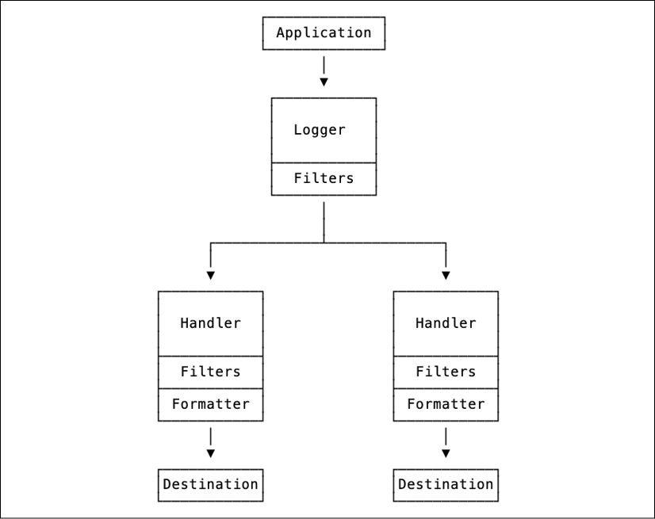
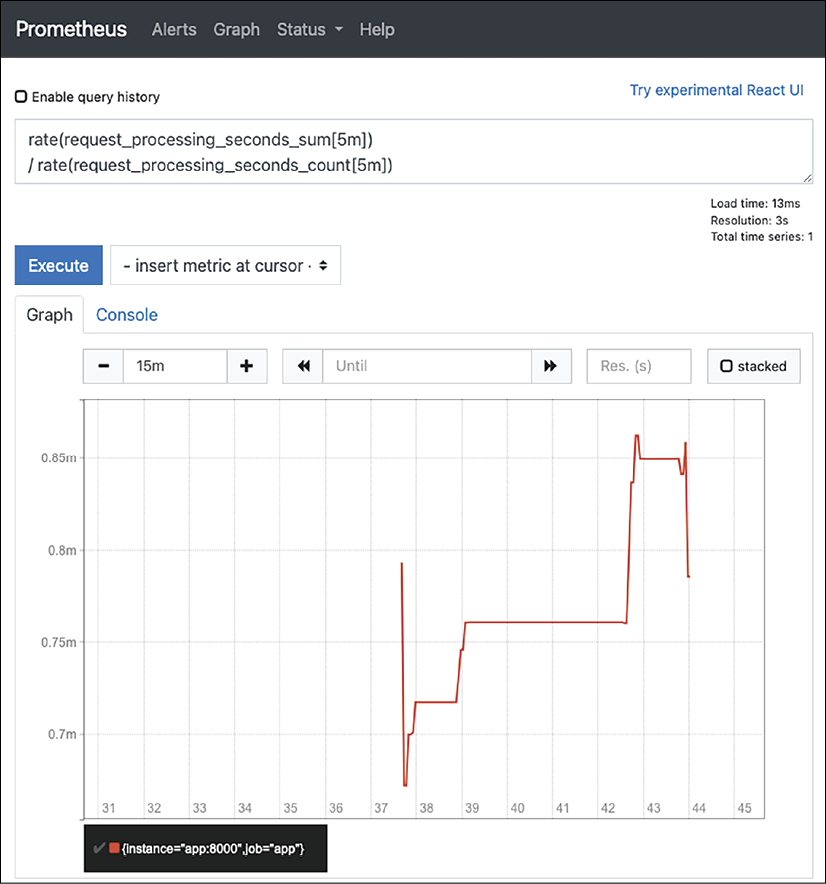
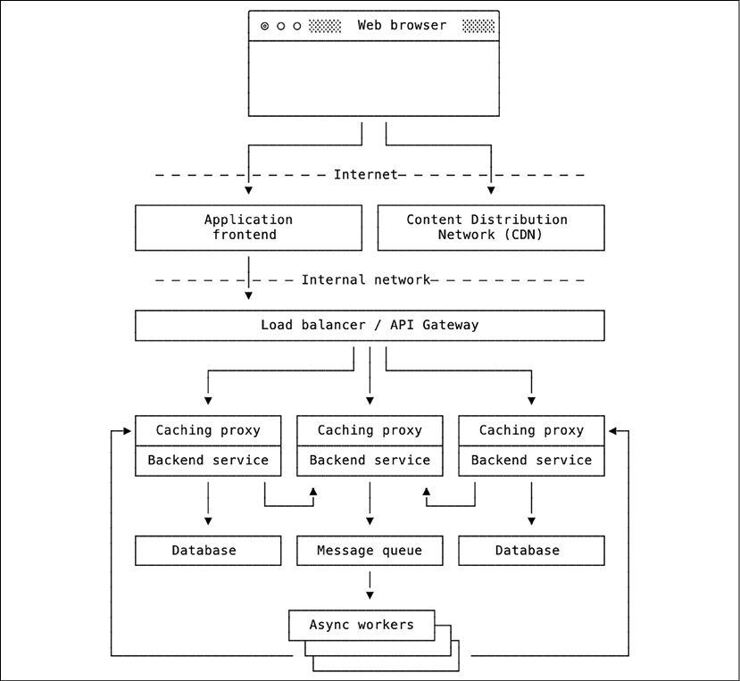
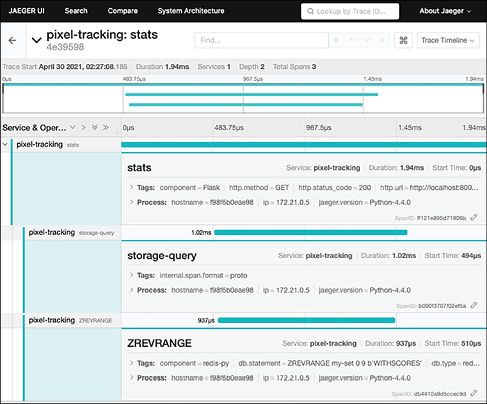

随着我们软件的每一个新版本，我们都能感受到发布的快感。我们是否设法最终解决了我们最近一直在处理的所有讨厌的问题？它会起作用还是会破裂？用户会满意，还是会抱怨新的错误或性能问题？

我们通常采用各种质量保证技术和自动化测试方法来增加我们对软件质量和有效性的信心。但是这些技术和方法只会增加我们的期望，即每个新版本都会顺利运行。但是，你如何确保应用程序为你的用户顺利运行？或者反过来说，你怎么知道是否出了问题？

在本章中，我们将讨论应用程序可观察性的主题。可观察性是软件系统的一个属性，它允许你根据其输出解释和理解应用程序的状态。如果你知道系统的状态并了解它是如何到达那里的，你就会知道该状态是否正确。通过采用各种可观察性技术，我们将了解：

- 捕获错误和日志
- 使用自定义指标检测代码
- 分布式应用程序跟踪

大多数可观察性技术既可以应用于安装在用户自己计算机上的桌面应用程序，也可以应用于运行在远程服务器或云服务上的分布式系统。但是，在桌面应用程序的情况下，由于隐私问题，可观察性选项通常受到限制。这就是为什么我们将主要关注观察在你自己的基础架构上运行的代码的行为和性能。

如果没有合适的工具，就无法实现出色的可观察性，因此让我们首先考虑本章的技术要求。

## 技术要求

以下是本章提到的 Python 包，可以从 PyPI 下载：

- freezegun
- sentry-sdk
- prometheus-client
- jaeger-client
- Flask-OpenTracing
- redis_opentracing

关于如何安装包的信息包含在第 2 章，现代 Python 开发环境中。

> 本章的代码文件可以在 https://github.com/PacktPublishing/Expert-Python-Programming-Fourth-Edition/tree/main/Chapter%2012 找到。

## 捕获错误和日志

标准输出是可观察性的基石。这是因为每个应用程序可以做的最简单的事情之一就是从标准输入读取信息并将信息打印到标准输出。这就是为什么每个程序员学习的第一件事通常是如何打印“Hello world！”

尽管标准输入和输出如此重要，但现代软件的用户很少知道它们的存在。桌面应用程序通常不是从终端调用的，用户通常使用图形界面与它们交互。

基于 Web 的软件通常在远程服务器上运行，用户使用 Web 浏览器或自定义客户端软件与之交互。在这两种情况下，标准输入和输出对用户都是隐藏的。

但是，尽管用户看不到标准输出，但这并不意味着它不存在。标准输出通常用于记录有关内部应用程序状态、警告和程序执行期间发生的错误的详细信息。此外，标准输出可以轻松定向到文件系统，以便于存储和后续处理。标准输出的简单性和多功能性使其成为最灵活的可观察性使能器之一。它还提供了捕获和检查有关错误详细信息的最基本方法。

尽管你可以使用裸 print() 函数调用来处理应用程序输出，但良好的日志记录需要一些一致的结构和格式。 Python 带有一个内置的日志模块，它提供了一个基本但功能强大的日志系统。在我们深入研究捕获日志和错误的良好实践之前，让我们先了解一下 Python 日志系统的一些基础知识。

### Python 日志记录要点

日志模块的使用非常简单。首先要做的是创建一个命名的记录器实例并配置日志记录系统：

```python
import logging
logger = logging.getLogger("my_logger")
logging.basicConfig()
```

> 定义记录器时的一个常见习惯用法是使用模块名称作为记录器的名称：
>
> ```python
> logger = logging.getLogger(__name__)
> ```
>
> 此模式有助于以分层方式管理记录器配置。有关配置记录器的更多详细信息，请参阅日志配置部分。

每个记录器都被命名。如果你不提供 name 参数，logging.getLogger() 将返回一个特殊的“root”记录器，作为其他记录器的基础。 logging.basicConfig() 允许指定其他日志记录选项，例如日志记录捕获级别、消息格式化程序和日志处理程序。

使用你的记录器实例，你现在可以使用 log() 方法在指定的日志级别记录日志消息：

```python
logger.log(logging.CRITICAL, "this is critical message")
```

或与特定日志级别相关的各种便捷方法：

```python
logger.error("This is info message")
logger.warning("This is warning message")
```

日志级别是一个正整数值，其中较大的值对应于较高重要性的消息。如果 logger 配置了特定级别，它将忽略较低值的消息。 Python 日志记录提供以下预配置级别及其各自的整数值：

- CRITICAL 和 FATAL (50)：保留用于指示错误的消息，由于程序不太可能继续其操作。一个实际的例子是资源（如磁盘空间）耗尽或无法与关键的后备服务（例如数据库）连接。
- ERROR (40)：保留用于指示导致程序无法执行特定任务或功能的严重错误的消息。一个实际的例子是无法解析用户输入或中间网络超时。
- WARNING 或 WARN (30)：保留用于指示程序已从中恢复的异常情况或在不久的将来可能导致更严重问题的情况的消息。一个实际的例子是使用回退值或磁盘空间不足的指示来修复格式错误的用户输入。
- INFO (20)：保留用于确认程序按预期工作的消息。例如，它可用于输出有关在程序执行期间执行的成功操作的详细信息。
- DEBUG (10)：保留用于非常详细的调试消息，允许我们在调试会话期间跟踪应用程序行为。
- NOTSET (0)：捕获所有可能的日志级别的伪级别。

如你所见，默认日志记录级别值以 10 为间隔定义。如果需要更细粒度，这允许你在现有级别之间定义自定义级别。

除了 NOTSET 之外，每个预定义的日志级别在 logger 实例中都有一个专用的便捷方法：

- critical() 用于 CRITICAL 和 FATAL 级别
- error() 或 exception() 用于 ERROR 级别（后者自动打印当前捕获的异常的回溯）
- WARNING 和 WARN 级别的 warning()
- info() 用于 INFO 级别
- debug() 用于调试级别

默认配置将消息捕获到 logging.WARNING 级别并将它们输出到标准输出。默认格式包括错误级别的文本表示、记录器名称和消息，如下例所示：

```sh
ERROR:my_logger:This is error message
WARNING:my_logger:This is warning message
CRITICAL:my_logger:This is critical message
```

可以通过指定两种类型的日志组件来修改记录器的格式和输出：日志处理程序和格式化程序。

#### 日志系统组件

Python 日志系统由四个主要组件组成：

- 记录器：这些是记录系统的入口点。应用程序代码使用记录器为记录系统生成消息。
- 处理程序：这些是日志系统的接收器。处理程序附加到记录器，并应该将信息发送到所需的目的地（通常在应用程序之外）。一个记录器可以有多个处理程序。
- 过滤器：这些允许记录器或处理程序根据其内容拒绝特定消息。过滤器可以附加到记录器或处理程序。
- 格式化程序：这些将原始日志消息转换为所需的格式。格式化程序可以生成人类或机器可读的消息。格式化程序附加到消息处理程序。

从本质上讲，Python 日志消息是一个方向——从应用程序到所需的目的地，通过记录器和处理程序（见图 12.1）。记录器和过滤器都可以通过过滤器机制或通过指定 enabled=False 标志来终止消息传播。



使用空的 logging.basicConfig() 启用的日志系统的基本配置设置了以下组件层次结构：

- 具有 logging.WARNING 级别的根记录器：默认情况下将忽略严重性级别低于 logging.WARNING 的所有消息。
- 附加到根记录器的单个控制台处理程序：这会将日志消息发送到标准错误流。
- 带有“%(levelname)s:%(name)s:%(message)s”样式的简单格式化程序：发送到给定输出的每条消息都将包含严重性级别名称、记录器名称和一些纯消息文本用冒号分隔。

这些默认设置是一个很好的起点。简单的格式允许轻松解析，标准控制台处理程序将适用于每个控制台应用程序。但是，某些应用程序需要更结构化的消息表示和/或自定义消息目标的处理。这种定制可以通过覆盖日志处理程序和格式化程序来实现。

标准日志库带有三个内置的日志处理程序：

- NullHandler：这个处理程序什么都不做。它可以类似地用作 POSIX 系统上的 /dev/null 设备来丢弃来自记录器的所有消息。它通常用作使用 Python 日志记录系统的库中的默认处理程序。在这种情况下，库用户负责使用他们自己的日志配置覆盖默认的 NullHandler。
- StreamHandler：此处理程序向给定的流（类似文件的对象）发出消息。如果没有提供流，StreamHandler 将默认向 sys.stderr 流发送消息。在每条消息之后，如果流对象支持 flush() 方法，它将被刷新。
- FileHandler：此处理程序是 StreamHandler 的子类，它将消息发送到由 filename 参数指定的文件。它将负责打开和关闭文件。默认情况下，它使用文件的附加模式和默认系统编码。

这是一组非常普通的日志处理程序，但是有一个 logging.handlers 模块提供了十几个更高级的处理程序。以下是最重要的：

- RotatingFileHandler：这是一个文件处理程序，可以在当前日志文件超过特定大小限制时轮换日志文件。这是基本 FileHandler 的一个很好的扩展，对于可以在短时间内生成大量日志消息的详细应用程序特别有用。 RotatingFileHandler 可以配置为仅保留指定数量的过去日志备份文件，从而降低日志文件溢出磁盘的风险。
- TimedRotatingFileHandler：这类似于 RotatingFileHandler，但在指定的时间间隔执行日志文件翻转而不是监视日志文件大小。对于以相当稳定和可预测的速度生成日志消息的应用程序，它可用于避免磁盘溢出。 TimedRotatingFileHandler 的优点是可以通过创建日期轻松浏览过去的日志文件。 TimedRotatingFileHandler 的默认间隔为一小时。
- SysLogHandler：此处理程序将日志发送到 syslog 服务器。 Syslog 是一种流行的日志记录标准，默认情况下，许多 Linux 发行版都带有在本地运行的 syslog 服务器。许多应用程序和服务都支持将日志记录到 syslog 服务器，因此 SysLogHandler 可用于在同一主机上运行的多个程序之间统一日志收集。此外，使用 syslog 允许你将日志文件轮换和压缩的责任卸载到单个系统日志记录工具。
- SMTPHandler：此日志处理程序为每条日志消息发出单个 SMTP 电子邮件。它通常与 logging.ERROR 严重性级别一起使用，以将有关错误和异常的信息传送到指定的电子邮件地址。以后可以随时在收件人的收件箱中查看此类错误。使用 SMTPHandler 是最简单的错误监控方法之一，即使程序员无法直接访问应用程序运行时环境，也可以将问题通知给他们。
- SocketHandler、DatagramHandler 和 HTTPHandler：这些是允许你通过网络传递日志消息的简单网络处理程序。 SocketHandler 通过套接字连接发出日志消息，DatagramHandler 以 UDP 数据报的形式发出日志消息，而 HTTPHandler 以 HTTP 请求的形式发出日志消息。这些处理程序可用于构建你自己的自定义分布式日志交付机制，尽管它仅适用于不需要良好交付保证的少量日志。对于较大的日志量，建议使用专门的日志传送机制，例如 syslog 或其他现代分布式日志系统。

> 我们将在分布式日志部分讨论现代分布式日志系统的一个例子。

为了了解其中一个专门的日志处理程序是如何工作的，让我们假设我们正在构建一个小型桌面应用程序。让我们假设我们的程序以图形用户界面运行，而用户通常不会从 shell 运行它。我们将记录有关程序执行期间发现的警告和错误的信息。如果出现问题，用户将能够找到日志文件并向我们发送对它的引用。

我们不知道我们的应用程序会产生多少消息。为了避免磁盘溢出，我们将提供一个旋转文件处理程序。文件将每天轮换，我们将保留过去 30 天的历史记录。我们的日志处理程序配置可以像这样简单：

```python
import logging.handlers
from datetime import timedelta, datetime
root_logger = logging.getLogger()
root_logger.setLevel(logging.INFO)
root_logger.addHandler(
    logging.handlers.TimedRotatingFileHandler(
        filename="application.log",
        when="D",
        backupCount=30,
    )
)
```

logging.getLogger() 调用（没有特定的记录器名称）允许我们获得一个特殊的根记录器。此记录器的目的是为没有附加特定处理程序的其他记录器提供默认配置和处理程序。如果记录器没有自己的处理程序，它的消息将自动传播到父记录器。

> 我们将在 Logging 配置部分了解有关记录器层次结构和日志消息传播的更多信息。

一旦我们可以访问根记录器，我们就可以提供默认配置。 root_logger.setLevel(logging.INFO) 调用确保记录器只发出严重性级别大于或等于 logging.INFO 的消息。这是一个相当冗长的设置。如果你不使用自定义日志级别，唯一更详细的设置将是 logging.DEBUG。

我们没有使用 logging.basicConfig() 函数配置日志系统，因此我们的根记录器没有默认处理程序。我们使用 addHandler() 方法将 TimedRotatingFileHandler() 实例添加到根记录器。 when="D" 参数指定每日翻转策略，backupCount 指定我们希望保留在磁盘上的日志文件备份文件的数量。

你可能没有整整一个月的时间来运行应用程序，只是为了查看轮换的日志文件是如何堆积在磁盘上的。为了加快这个过程，我们将使用一个巧妙的技巧并使用 freezegun 包来诱使 Python 认为时间正在以更快的速度流逝。

> 我们之前在第 10 章，测试和质量自动化中使用了 freezegun 包来测试与时间相关的代码。

以下代码模拟了一个应用程序，该应用程序每小时生成一条消息，但将处理速度提高 36,000：

```python
from datetime import timedelta, datetime
import time
import logging
import freezegun


logger = logging.getLogger()


def main():
    with freezegun.freeze_time() as frozen:
        while True:
            frozen.tick(timedelta(hours=1))
            time.sleep(0.1)
            logger.info(f"Something has happened at {datetime.now()}")


if __name__ == "__main__":
    main()
```

如果你在 shell 中运行该应用程序，你将看不到任何输出。但是如果你列出当前目录中的所有文件，你会看到几秒钟后，新的日志文件开始出现：

```sh
$ ls -al
total 264
drwxr-xr-x  35 swistakm  staff  1120  8 kwi 00:22 .
drwxr-xr-x   4 swistakm  staff   128  7 kwi 23:00 ..
-rw-r--r--   1 swistakm  staff   583  8 kwi 00:22 application.log
-rw-r--r--   1 swistakm  staff  2491  8 kwi 00:21 application.log.2021-04-07
-rw-r--r--   1 swistakm  staff  1272  7 kwi 23:59 application.log.2021-04-08
```

application.log 文件是当前日志文件，以日期结尾的文件是历史备份文件。如果你让你的程序旋转一段时间，你会看到历史备份文件的数量永远不会超过 30。一段时间后，TimedRotatingFileHandler 将开始用新备份替换旧备份。

在我们的示例中，我们配置了没有任何格式化程序的日志。在这种情况下，处理程序将按原样发出消息，没有任何额外信息。这是从最近的日志文件中提取的示例：

```sh
Something has happened at 2021-04-08 17:31:54.085117
Something has happened at 2021-04-07 23:32:04.347385
Something has happened at 2021-04-08 00:32:04.347385
Something has happened at 2021-04-08 01:32:04.347385
```


它缺少一些重要的上下文。我们看到消息的日期只是因为我们将其包含在日志消息中，但我们缺少有关消息来源的记录器的信息以及有关消息严重性的信息。我们可以通过附加自定义消息格式化程序来自定义特定日志处理程序的输出。

格式化程序使用处理程序对象的 setFormatter() 方法附加到日志处理程序。格式化程序应该是一个 logging.Formatter() 实例，它接受四个初始化参数：

- fmt：这是输出消息的字符串格式模式。字符串格式化模式可以引用 logging.LogRecord 类的任何属性。它默认为 None，这是一个没有任何格式的纯文本日志消息。
- datefmt：这是用于表示消息时间戳的日期格式模式。它接受与 time.strftime() 函数相同的格式化指令。它默认为 None，转换为类似 ISO8601 的格式。
- style：这指定用于 fmt 参数的字符串格式样式。它可以是“%”（百分比格式）、“{”（str.format() 格式）或“$”（string.Template 格式）。它默认为“%”。
- validate：这指定是否根据样式参数验证 fmt 格式参数。它默认为 True。

例如，我们可以提供一个自定义格式化程序，其中包括严重性消息时间、级别名称、记录器名称和日志调用的确切行以及发出的消息。我们的日志设置将如下所示：

```python
root_logger = logging.getLogger()
root_logger.setLevel(logging.INFO)
formatter = logging.Formatter(
    fmt=(
        "%(asctime)s | %(levelname)s | "
        "%(name)s | %(filename)s:%(lineno)d | "
        "%(message)s"
    )
)
handler = logging.handlers.TimedRotatingFileHandler(
    filename="application.log",
    when="D",
    backupCount=30,
)
handler.setFormatter(formatter)
root_logger.addHandler(handler)
```

> 你可以在 https://docs.python.org/3/library/logging.html#logrecord-attributes 中了解有关可以使用自定义格式化程序引用的可用 LogRecord 属性的更多信息。

使用这样的配置，我们的日志文件中的消息将如下所示：

```python
2021-04-08 02:03:50,780 | INFO | __main__ | logging_handlers.py:34 | Something has happened at 2021-04-08 00:03:50.780432
```

是否使用专门的日志处理程序的选择通常取决于多种因素，例如目标操作系统、组织中现有的系统日志记录基础架构、预期的日志量和部署方法。独立应用程序、系统服务或 Docker 容器的日志记录通常不同，你需要考虑到这一点。例如，让历史日志文件易于访问绝对是一件实用的事情，但在由数十或数百台主机组成的大型分布式系统中管理数千个日志文件的集合可能是一个真正的障碍。另一方面，你不能期望独立应用程序的最终用户在他们自己的个人计算机上运行分布式日志系统，只是为了使用你的应用程序。

这同样适用于日志消息格式。一些日志收集和处理系统可以利用结构化消息格式，例如 JSON、msgpack 或 avro。其他人将能够使用定制的解析规则解析和提取消息的语义元素。纯文本消息对于人类来说更容易检查和理解，但使用专门的日志分析软件更难处理。结构化日志消息更容易被机器处理，但更难用肉眼阅读。

无论你当前的需求如何，你都可以确定你的日志记录选择和首选项会随着时间的推移而改变。这就是为什么通过手动创建处理程序和格式化程序来提供日志记录设置很少是一种方便的方法。

我们已经了解了 logging.basicConfig() 函数。它设置了一个合理的日志记录默认值，但也允许你提供一些用于定义消息格式或默认处理程序选择的快捷方式。不幸的是，它仅适用于根记录器级别，并且不允许你定位其他记录器。在下一节中，我们将了解其他日志配置方法，这些方法允许你为任何规模的应用程序定义复杂的日志规则。

#### 日志配置

使用根记录器是一种定义应用程序日志系统顶级配置的便捷方法。不幸的是，你很快就会了解到某些库经常使用 Python 日志记录模块来发出有关其中发生的重要事件的信息。在某些时候，你可能会发现也有必要微调这些库的日志记录行为。

通常，库使用自己的记录器名称。命名记录器的常见模式是使用一个特殊的 \_\_name\_\_ 属性，其中包含模块的完全限定名称：

```python
import logging
logger = logging.getLogger(__name__)
```

例如，包 acme 的 utils 子模块内的 \_\_name\_\_ 属性将是 acme.utils。如果 acme.utils 将其记录器定义为 logging.getLogger(\_\_name\_\_)，那么该记录器的名称将是“acme.utils”。

当你知道记录器的名称时，你可以随时获取它并提供自定义配置。常见的用例是：

- Silencing the logger：有时你对来自库的消息根本不感兴趣。在你的主应用程序文件中，你可以找到一个记录器并使用 disabled 属性将其静音，如下例所示：

    ```python
    acme_logger = logging.getLogger("acme.utils")
    acme_logger.disabled = True
    ```

- Overriding handlers：图书馆不应定义自己的处理程序；这应该是图书馆用户的责任。无论如何，并不是每个程序员都知道良好的日志记录实践，有时一个有用的第三方包附带一个带有附加处理程序的记录器。它将有效地忽略你的根记录器配置。
    你可以使用这样的记录器和覆盖处理程序，如下例所示：

    ```python
    acme_logger = logging.getLogger("acme.utils")
    acme_logger.handlers.clear()

- Changing logger verbosity：可能会发生某些记录器过于冗长的情况。有时，库中的警告不够严重，无法包含在主应用程序日志中。你可以找到一个记录器并覆盖其严重性级别：

    ```python
    acme_logger = logging.getLogger("acme.utils")
    acme_logger.setLevel(logging.CRITICAL)
    ```

使用每个模块的记录器在非库代码中也很有用。在由多个子包或子模块组成的大型应用程序中使用每个模块的记录器是一种很好的做法。这将允许你轻松微调详细程度并管理多个记录器的处理程序。持续管理 Python 日志记录配置的关键是了解记录器的父子关系。

每当你创建名称包含句点的记录器时，日志记录模块实际上会构建记录器的层次结构。例如，如果你尝试使用 logging.getLogger("acme.lib.utils") 获取记录器，则日志记录模块将执行以下步骤：

1. 它将首先以线程安全的方式搜索在“acme.lib.utils”下注册的记录器。如果它不存在，它将创建一个新的记录器并在“acme.lib.utils”下注册它。
2. 如果已经创建了一个新的记录器，它将迭代地从记录器名称中删除最后一段并搜索新名称，直到找到已注册的记录器。如果名称下没有注册记录器，日志记录模块将注册特殊的占位符对象。对于“acme.lib.utils”，它将首先搜索“acme.lib”，然后搜索“acme”。第一个非占位符记录器将成为“acme.lib.utils”的父级。
3. 如果新创建的记录器上方没有非占位符记录器，则根记录器将成为该记录器的父级。

此外，日志记录模块确保在第一次使用 logging.getLogger() 函数显式访问现有占位符时，它们会被适当的记录器主动替换。在这种情况下，父子关系被追溯更新。多亏了这一点，具体的记录器可以按任何顺序配置，而不管它们的层次结构。

这种父子关系在记录器处理程序的评估中起作用。每当你通过特定记录器记录新消息时，都会根据以下规则调用处理程序：

- 如果记录器有自己的处理程序，则会将消息传递给每个处理程序：
    - 如果记录器的传播属性设置为 True（默认值），则消息将传播到父记录器。
    - 如果记录器将传播属性设置为 False，则处理停止。
- 如果记录器没有自己的处理程序，则会将消息传递给父记录器

最佳实践是仅在顶级根记录器中定义日志处理程序。否则，将很难跟踪所有传播规则并确保每条消息只记录一次。但是有时在较低级别（每个模块）记录器上指定处理程序对于对非常特定的错误类别应用特殊处理很有用。例如，你的应用程序通常可能会使用默认的控制台处理程序进行日志记录，但如果有业务关键模块，你可能需要附加 SMTPHandler。这样你就可以确保来自该模块的所有日志消息都将作为 SMTP 电子邮件额外发送给你。

日志层次结构对于控制整个记录器组的详细程度也很有用。例如，如果 acme 包包含多个子记录器并且它们都没有附加处理程序，你可以禁用整个“acme”记录器以使每个子记录器静音。

复杂的层次结构可能令人生畏，尤其是当你需要对多个模块中的记录器进行微调时。使用 Python 创建单独的记录器、处理程序和格式化程序有时可能需要大量的样板文件。这就是 logging.config 模块提供两个函数的原因，它们允许你以更具声明性的方式配置整个 Python 日志记录系统：

- fileConfig()：它采用类似 INI 的配置文件的路径。该文件的语法与使用内置 configparser 模块处理的配置文件的语法相同。
- dictConfig()：这需要一个配置值字典。

> 你可以在 https://docs.python.org/3/library/logging.config.html 找到有关 Python 日志记录配置选项的更多信息。

两种配置方式都假定类似的配置部分和选项。唯一的区别是格式。以下是使用基于时间的文件轮换进行日志记录的配置文件示例：

```ini
[formatters]
keys=default
[loggers]
keys=root
[handlers]
keys=logfile
[logger_root]
handlers=logfile
level=INFO
[formatter_default]
format=%(asctime)s | %(levelname)s | %(name)s | %(filename)s:%(lineno)d | %(message)s
[handler_logfile]
class=logging.handlers.TimedRotatingFileHandler
formatter=default
kwargs={"filename": "application.log", "when": "D", "backupCount": 30}
```

以下是使用 dictConfig() 函数定义的相同配置：

```python
logging.config.dictConfig({
    "version": 1,
    "formatters": {
        "default": {
            "format": (
                "%(asctime)s | %(levelname)s | "
                "%(name)s | %(filename)s:%(lineno)d | "
                "%(message)s"
            )
        },
    },
    "handlers": {
        "logfile": {
            "class": "logging.handlers.TimedRotatingFileHandler",
            "formatter": "default",
            "filename": "application.log",
            "when": "D",
            "backupCount": 30,
        }
    },
    "root": {
        "handlers": ["logfile"],
        "level": "INFO",
    }
})
```

由于有如此多的格式选项和分层记录器结构，Python 中的日志记录可能非常复杂。 但它很少是复杂的。 你可以通过遵循下一节中介绍的一些良好实践来降低日志记录的复杂性。

### 良好的日志记录实践

Python 提供了灵活而强大的日志系统。 有这么多配置选项，很容易被不必要的复杂性纠缠在一起。 但实际上，日志记录应该尽可能简单。 最后，它是用于了解你的应用程序如何工作的首要工具。 如果你花费无数时间试图了解你的日志记录出了什么问题，你将无法理解你的代码是如何工作的。

良好日志记录的关键是遵循良好的实践。 以下是 Python 中高效和简单日志记录的常见规则：

- 使用每个模块的记录器：通过使用 logging.getLogger(__name__) 创建新的记录器，你可以轻松控制整个模块树的记录行为。这种做法对库特别有用，因为它允许开发人员从主应用程序日志记录配置中调整库日志记录。

- 每行使用一个事件：如果你使用基于文本的输出（stdout/stderr 流、文件），则单个日志消息最好适合一行文本。这使你可以避免大多数文本缓冲问题以及来自多个线程或进程记录到同一输出的消息混合。如果你确实需要将多行文本放入消息中（例如，对于错误堆栈跟踪），你仍然可以通过利用 JSON 等结构化日志格式来实现。

- 将工作卸载到系统日志设施或分布式日志系统：日志压缩、转发或日志文件轮换都可以使用自定义日志处理程序在 Python 代码中完成，但这很少是明智的选择。通常最好使用系统日志工具（如 syslog）或专用日志处理工具（如 logstash 或 fluentd）。专用工具通常会更好、更一致地完成这些工作。
    它们还将从你自己的代码中消除大量日志处理的复杂性，并将减少并发应用程序中的日志记录问题。

- 如果可能，直接记录到标准输出或错误流：写入 stdout 或 stderr 是每个应用程序可以做的最基本的事情之一。这适用于写入文件，但并非每个环境都有可写或持久的文件系统。如果你需要将日志存储在文件中，你可以简单地使用 shell 输出重定向。如果你需要通过网络传输日志，你可以使用专用的日志转发器，如 logstash 或 fluentd。

- 将日志处理程序保留在根记录器级别：为除根记录器之外的特定记录器定义处理程序和格式化程序会使日志记录配置变得不必要地复杂。通常最好在根级别定义单个控制台处理程序，并将其余的日志处理逻辑留给外部日志实用程序。

- 避免编写自定义分布式日志系统的冲动：在大型分布式系统中通过网络可靠地交付日志并不是一件简单的事情。通常最好将此任务交给专用工具，例如 syslog、fluentd 或 logstash。

- 使用结构化日志消息：随着日志量的增加，从中提取有意义的信息变得越来越困难。专用日志处理系统允许你使用各种查询搜索大量文本信息，甚至可以对历史日志事件进行复杂的分析。这些系统中的大多数都可以对纯文本日志消息执行有效的解析，但是如果它们从一开始就可以访问结构化日志消息，它们总是会更好地工作。日志的常见结构化消息格式是 JSON 和 msgpack。

    > Python 的 logging 和 logging.handlers 模块缺少用于结构化日志消息的专用处理程序。 python-json-logger 是 PyPI 的一个流行包，它提供了一个能够以 JSON 格式发送消息的格式化程序。你可以在 https://github.com/madzak/python-json-logger 上了解有关 python-json-logger 的更多信息。
    > 另一个流行的包是 structlog。它使用各种实用程序扩展了 Python 日志记录系统，用于捕获日志上下文、处理消息并以各种结构化格式输出它们。你可以在 https://www.structlog.org/en/stable/index.html 上了解有关 structlog 包的更多信息。

- 仅在一处配置日志记录：日志记录配置（理解为处理程序和格式化程序的集合）应仅在应用程序的一部分中定义。最好是主应用程序入口点脚本，例如 __main__.py 文件或 WSGI/ASGI 应用程序模块（对于基于 Web 的应用程序）。
    尽可能使用 basicConfig()：如果你遵循前面的大部分规则，则 basicConfig() 函数就是你执行完整日志记录配置所需的全部。它在根记录器级别工作，默认情况下定义附加到 stderr 流的 StreamHandler 类。它还允许方便地配置日期和日志消息格式字符串，通常，除此之外你不需要任何其他内容。如果你想使用结构化日志消息，你可以轻松地将自己的处理程序与自定义消息格式化程序一起使用。

- 优先使用 dictConfig() 而不是 fileConfig()：fileConfig() 支持的日志配置文件的语法有点笨拙，而且不如 dictConfig() 灵活。例如，这是一种通过命令行参数或环境变量控制应用程序日志详细程度的常见模式。这种功能通过基于字典的日志配置比通过基于文件的配置更容易实现。

这似乎有很多规则，但总的来说，它们都是为了让事情变得简单，而不是过度设计你的日志系统。如果你保持配置简单，记录到标准输出，并使用合理的日志格式，你通常会成功。

良好的伐木卫生将使你为处理和处理任意大量的原木做好准备。并非每个应用程序都会生成大量日志，但那些确实需要专用日志转发和处理系统的支持。这些系统通常能够处理来自数百甚至数千个独立主机的分布式日志。

### 分布式日志

通过在单个主机上运行的单个服务或程序，你可以轻松地进行基于轮换日志文件的简单日志记录设置。几乎每个进程监控工具（如 systemd 或 supervisord）都允许将 stdout 和 stderr 输出重定向到指定的日志文件，因此你不必在应用程序中打开任何文件。你还可以轻松地将压缩和旋转历史日志文件的责任转移到 logrotate 等系统实用程序。

简单的事情只适用于小型应用程序。如果你在同一主机上运行多个服务，你最终会希望以类似的方式处理各种程序的日志。组织日志记录混乱的第一步是使用专用的系统日志记录工具，如 syslog。它不仅会以一致的格式消化日志，还会提供命令行实用程序来浏览和过滤过去的日志。

一旦你扩展应用程序以在许多主机上以分布式方式运行，事情就会变得更加复杂。分布式日志的主要挑战如下：

- 大量的日志：分布式系统可以产生大量的日志。日志量随着处理节点（主机）的数量而增长。如果你想存储历史日志，你将需要一个专用的基础设施来保存所有这些数据。
- 集中日志访问的需要：仅将日志存储在生成它们的主机上确实不切实际。当你知道你的应用程序出现问题时，你最不想做的就是从主机跳转到主机以查找包含有关你遇到的问题的关键信息的日志文件。你需要的是一个可以访问系统中所有可用日志的地方。
- 不可靠的网络：网络本质上是不可靠的，如果你通过一个网络发送数据，你需要为临时连接失败、网络拥塞或意外通信延迟做好准备，这些情况可能发生在任何分布式系统中。通过集中式日志访问，你需要将日志从每个单独的主机传送到专用的日志记录基础架构。为避免任何数据丢失，你需要专门的软件来缓冲日志消息并在网络出现故障时重试传送。
- 信息的可发现性和关联性：在大量的日志中，很难在各种严重程度的日志消息的海洋中找到有用的信息。你最终将需要一种对日志数据集执行自定义查询的方法，该方法允许你按消息来源、记录器名称、严重性级别和文本内容过滤消息。此外，分布式系统中发生的问题通常非常复杂。为了了解系统中的实际情况，你需要一些工具来汇总来自各种日志流的信息并执行统计数据分析。

日志基础设施的复杂性主要取决于你的应用程序的规模和你拥有的可观察性需求。根据日志基础设施的功能，我们可以定义以下日志成熟度模型：

- 级别 0（雪花）：每个应用程序都是一个独特的“雪花”。每个都自行处理所有额外的日志记录活动，例如存储、压缩、归档和保留。除了在文本编辑器或 shell 实用程序中打开历史日志的能力之外，级别 0 几乎不提供额外的可观察性功能。
- 级别 1（统一日志记录）：同一主机上的每个服务都以类似于系统守护程序、已知目标或磁盘的方式记录消息。诸如压缩或保留之类的基本日志处理任务被委托给系统日志记录工具或诸如 logrotate 之类的通用实用程序。要查看来自特定主机的日志，开发人员需要“进入”主机或与运行在该主机上的专用服务守护程序通信。
- 级别 2（集中式日志记录）：来自每台主机的日志传送到专用主机或主机集群，以防止数据丢失和存档存储。服务可能需要将日志传送到特定目的地（日志守护程序或磁盘上的某个位置）。可以查看给定时间范围内所有日志的一部分，有时还具有高级过滤、聚合和分析功能。
- 级别 3（日志记录网格）：服务完全不知道日志记录基础设施，可以直接登录到它们的 stdout 或 stderr 流。在每个主机上工作的日志网格能够自动从每个正在运行的服务中发现新的日志流和/或日志文件。部署新应用程序后，其输出流将自动包含在日志记录基础结构中。集中式日志访问基础架构能够在任意大的时间跨度内执行复杂的查询。可以对存储的消息运行日志聚合和分析。日志信息几乎实时可用。

集中式日志记录和日志记录网格基础设施可以在日志过滤、聚合和分析方面提供类似的功能。这里的关键区别在于日志记录网格基础设施中无处不在的日志记录。在第 3 级日志架构中，运行你的基础架构并在标准输出或错误流上输出信息的所有内容都自动成为日志信息的来源，并将在集中式日志访问系统中自动提供。

有许多公司提供 2 级或 3 级日志记录基础设施即服务。一个流行的例子是 AWS CloudWatch，它与其他 AWS 服务很好地集成。其他云提供商也提供替代解决方案。如果你有足够的时间和决心，你还可以使用开源工具从头开始构建成熟的 2 级或 3 级日志记录基础架构。

> 构建成熟日志基础设施的流行开源选择是 Elastic Stack。这是一个由多个组件组成的软件生态系统：Logstash/Beats（日志和指标摄取器/收集器）、Elasticsearch（文档存储和搜索系统）和 Kibana（Elastic Stack 的前端应用程序和仪表板）。你可以在 https://www.elastic.co/ 上了解有关 Elastic Stack 的更多信息。

### 捕获错误以供日后审查

日志记录是用于存储和发现有关系统中发生的错误和问题的信息的最流行的选择。成熟的日志基础设施提供高级关联功能，让你可以更深入地了解在任何给定时间整个系统中发生的情况。它们通常可以配置为在出现错误消息时发出警报，从而在出现意外故障的情况下实现快速响应。

但是使用普通日志基础设施跟踪错误的主要问题是它们仅提供了错误发生的完整上下文的有限概述。简而言之，你将只能访问包含在日志记录调用中的信息。

为了完全理解发生特定问题的原因，你将需要比最初包含在日志记录调用中的更多信息。使用传统的日志记录基础架构，你必须使用附加日志记录修改代码，发布应用程序的新版本，然后等待错误再次发生。如果你错过了什么，你将不得不一遍又一遍地重复这个过程。

另一个问题是过滤有意义的错误。大型分布式系统每天记录数万条错误消息或警告的情况并不少见。但并非每个错误消息都必须立即采取行动。进行维护的团队经常执行错误分类过程来估计错误的影响。通常，你会专注于经常发生的问题或发生在应用程序关键部分的问题。为了进行有效的分类，你需要一个至少能够对错误事件进行重复数据删除（合并）并评估其频率的系统。并非每个日志记录基础设施都能有效地做到这一点。

这就是为什么要跟踪应用程序中的错误，通常应该使用专用的错误跟踪系统，该系统可以独立于日志记录基础架构工作。

Sentry 是一种提供出色错误跟踪体验的流行工具。它是一项久经考验的服务，用于跟踪异常和收集崩溃报告。它以开源形式提供，用 Python 编写，起源于后端 Python 开发人员的工具。现在，它已经超越了最初的抱负，并支持更多语言，包括 PHP、Ruby 和 JavaScript、Go、Java、C、C++ 和 Kotlin。它仍然是许多 Python Web 开发人员最流行的错误跟踪工具之一。

> 你可以在 https://sentry.io/ 了解有关 Sentry 的更多信息。

Sentry 可作为付费软件即服务模型使用，但它也是一个开源项目，因此可以在你自己的基础设施上免费托管。提供与 Sentry 集成的库是 sentry-sdk（在 PyPI 上可用）。如果你还没有使用过它并希望在不必运行自己的 Sentry 服务器的情况下对其进行测试，那么你可以轻松地在 Sentry 服务站点注册免费试用。一旦你可以访问 Sentry 服务器并创建了一个新项目，你将获得一个称为数据源名称 (DSN) 字符串的字符串。此 DSN 字符串是将你的应用程序与 Sentry 集成所需的最小配置设置。它包含以下格式的协议、凭据、服务器位置和你的组织/项目标识符：

```python
'{PROTOCOL}://{PUBLIC_KEY}:{SECRET_KEY}@{HOST}/{PATH}{PROJECT_ID}'
```

拥有 DSN 后，集成非常简单，如以下代码所示：

```python
import sentry_sdk
sentry_sdk.init(
    dsn='https://<key>:<secret>@app.getsentry.com/<project>'
)
```

从现在开始，你代码中每个未处理的异常都将使用 Sentry API 自动传送到 Sentry 服务器。 Sentry SDK 使用 HTTP 协议并通过安全的 HTTP 连接 (HTTPS) 以压缩的 JSON 消息的形式传送错误。默认情况下，消息从单独的线程异步发送以限制对应用程序性能的影响。之后可以在 Sentry 门户中查看错误消息。

错误捕获会在每个未处理的异常上自动发生，但你也可以显式捕获异常，如下例所示：

```python
try:
    1 / 0
except Exception as e:
    sentry_sdk.capture_exception(e)
```

Sentry SDK 与最流行的 Python 框架（例如 Django、Flask、Celery 和 Pyramid）进行了大量集成。这些集成将自动提供特定于给定框架的附加上下文。如果你选择的 web 框架没有专门的支持，sentry-sdk 包提供了通用的 WSGI 中间件，使其与任何基于 WSGI 的 web 服务器兼容，如以下代码所示：

```python
from sentry_sdk.integrations.wsgi import SentryWsgiMiddleware
sentry_sdk.init(
    dsn='https://<key>:<secret>@app.getsentry.com/<project>'
)
# ...
application = SentryWsgiMiddleware(application)
```

> **Python Web 应用程序中的异常**
>
> 通常，Web 应用程序不会因未处理的异常而退出，因为如果发生任何服务器错误，HTTP 服务器必须返回带有来自 5XX 组的状态代码的错误响应。大多数 Python Web 框架默认都会做这样的事情。在这种情况下，异常实际上是在内部 Web 框架级别或由 WSGI 服务器中间件处理的。无论如何，这通常仍会导致打印异常堆栈跟踪（通常在标准输出上）。 Sentry SDK 了解 WSGI 约定并将自动捕获此类异常。

另一个值得注意的集成是能够跟踪通过 Python 的内置日志模块记录的消息。启用此类支持只需要添加以下几行代码：

```python
import logging
import sentry_sdk
from sentry_sdk.integrations.logging import LoggingIntegration
sentry_logging = LoggingIntegration( 
    level=logging.INFO,
    event_level=logging.ERROR,
)
sentry_sdk.init(
    dsn='https://<key>:<secret>@app.getsentry.com/<project>',
    integrations=[sentry_logging],
)
```

日志消息的捕获可能会有一些警告，因此如果你对此类功能感兴趣，请务必阅读有关该主题的官方文档。这应该可以使你免于令人不快的意外。

如果你决定使用 Sentry 或任何其他类似服务，请仔细考虑“构建与购买”的决定。你可能已经听说过，“天下没有免费的午餐”。如果你决定在自己的基础设施上运行错误跟踪服务（或任何实用程序系统），你最终将支付额外的基础设施成本。这样一个额外的系统也将只是另一个需要维护和更新的服务。维护 = 额外工作 = 成本！

随着你的应用程序的增长，异常的数量也会增加，因此你将被迫在扩展产品时扩展 Sentry（或任何其他系统）。幸运的是，Sentry 是一个非常健壮的项目，但如果负载过多，它不会给你任何价值。此外，让 Sentry 为灾难性故障场景做好准备，每秒可以发送数千个崩溃报告，这是一个真正的挑战。因此，你必须决定哪个选项对你来说真的更便宜，以及你是否有足够的资源来完成所有这些工作。

> 当然，如果你组织中的安全策略拒绝向第三方发送任何数据，则不会出现“构建与购买”的困境。如果是这样，只需在你自己的基础架构上托管 Sentry 或类似软件。当然，成本是有的，但绝对值得付出。

捕获错误允许以后查看、简化调试，并允许你在错误突然开始累积的情况下快速响应。但在用户可能接触到有缺陷的软件的情况下，这是一种被动方法。

细心的开发人员希望一直观察他们的应用程序，并能够在实际故障发生之前做出反应。这种类型的应用程序可观察性可以通过使用自定义指标检测你的代码来实现。让我们了解用于指标收集的各种类型的自定义指标和系统。

## 使用自定义指标检测代码

如果我们想让我们的应用程序顺利运行，我们需要积极主动。可观察性不仅仅是能够对日志和错误报告进行事后分析。它还涉及收集各种指标，以提供有关服务负载、性能和资源使用情况的见解。如果你监控应用程序在正常操作期间的行为方式，你将能够发现异常并在故障发生之前预测它们。

监控软件的关键是定义有助于确定一般服务健康状况的指标。典型的指标可以分为几类：

- 资源使用指标：典型的指标是内存、磁盘、网络和 CPU 时间使用。你应该始终监控这些指标，因为每个基础架构的资源都是有限的。即使对于提供看似无限资源池的云服务也是如此。如果一个服务的资源使用异常，它可能会使其他服务饿死，甚至在你的基础架构中引发级联故障。在云基础设施上运行代码时，这尤其重要，因为你经常为使用的资源付费。一个资源匮乏的流氓服务可能会花费你很多钱。
- 负载指标：典型指标是给定时间范围内的连接数和请求数。大多数服务可以接受有限数量的并行连接，并且在达到特定阈值后它们的性能会下降。过载服务的常见模式是性能逐渐下降，然后在达到关键负载点后突然不可用。监控负载指标可以决定是否需要横向扩展。低负载期也可以是扩展基础设施以降低运营成本的机会。
- 性能指标：典型指标是请求或任务处理时间。性能指标通常与负载指标相关，但也可以突出显示代码中需要优化的性能热点。良好的应用程序性能可改善用户体验并让你节省基础设施成本，因为高性能代码可能需要更少的资源来运行。对性能的持续监控允许发现在应用程序中引入新更改时可能发生的性能回归。
- 业务指标：这些是你业务的关键绩效指标。典型的例子可能是给定时间范围内的注册或售出商品的数量。这些指标中的异常使你能够发现在测试过程中漏掉的功能回归（例如，有缺陷的购物车结账过程）或评估应用程序界面中可能使频繁用户感到困惑的可疑变化。

其中一些指标有时可以从应用程序日志中得出，许多成熟的日志记录基础设施可以对日志事件流执行滚动聚合。这种做法最适用于负载指标和性能指标，它们通常可以可靠地从 Web 服务器、代理或负载平衡器的访问日志中导出。同样的方法也可以用于业务指标，尽管这需要仔细考虑关键业务事件的日志格式，而且可能非常脆弱。

在资源使用指标的情况下，日志处理的效用最小。这是因为资源度量基于对资源使用情况的定期探测，而日志处理涉及经常在相当不规则的基础上发生的离散事件流。此外，集中式日志基础架构不太适合存储时间序列数据。

通常，为了监控应用程序指标，我们使用独立于日志记录基础设施的专用基础设施。高级指标监控系统提供复杂的指标聚合和关联功能，并专注于处理时间序列数据。度量基础设施系统还提供对最新数据的更快访问，因为与日志基础设施相比，它们更关注观察实时系统。对于日志记录基础设施，更常见的是观察到数据传播的明显滞后。

指标监控系统一般有两种架构：

- 推送架构：在这种架构中，应用程序负责将数据推送到系统。它通常是一个远程度量服务器或本地度量守护进程（度量转发器），负责将度量推送到不同服务器（分层架构）上的更高级别的守护进程。配置通常是分布式的：每个服务都需要知道目标守护进程或服务器的位置。
- 拉取架构：在这种架构中，应用程序负责公开一个度量端点（通常是一个 HTTP 端点），度量守护进程或服务器从已知服务中提取信息。配置可以是集中式（主度量服务器知道受监控服务的位置）或半分布式（主服务器知道从较低层提取度量的度量转发器的位置）。

通过利用服务发现机制，两种类型的架构都可以具有类似网格的功能。例如，在推送架构中，指标转发器可以将自己宣传为能够将指标转发到其他服务的服务。在拉式架构中，受监控的服务通常在服务发现目录中将自己宣传为提供要收集的指标的服务。

监控应用程序的流行选择之一是 Prometheus。

### 使用Prometheus

Prometheus 是基于拉取的度量基础设施的一个典型例子。它是一个完整的系统，能够收集指标、定义转发拓扑（通过所谓的指标导出器）、数据可视化和警报。它带有用于多种编程语言的 SDK，包括 Python。

Prometheus 的架构（如图 12.2 所示）由以下组件组成：

- Prometheus 服务器：这是一个独立的指标服务器，能够存储时间序列数据、响应指标查询以及从指标导出器、受监控的服务（作业）和其他 Prometheus 服务器检索指标（拉取）。 Prometheus 服务器提供用于查询数据的 HTTP API，并包含一个简单的界面，允许我们创建各种指标可视化。
- 警报管理器：这是一项可选服务，能够存储警报规则的定义并在满足特定警报条件时触发通知。
- 指标导出器：这些是 Prometheus 服务器可以从中提取数据的进程。导出器可以是使用 Prometheus SDK 公开指标端点的任何服务。还有一些独立的导出器可以直接从主机探测信息（如一般主机使用信息），在没有 Prometheus SDK 集成的情况下公开服务指标（如数据库），或充当短期进程（如 cron 作业）的推送网关。每个 Prometheus 服务器都可以充当其他 Prometheus 服务器的指标导出器。

上述三个组件是具有数据可视化和可靠警报的功能齐全的指标基础架构的最低要求。此外，许多 Prometheus 部署使用以下额外组件扩展了此架构：

- 服务发现目录：Prometheus 服务器能够从各种服务发现解决方案中读取信息以定位可用的指标导出器。服务发现机制的使用简化了配置并允许类似网格的开发人员体验。服务发现目录的流行选择是 Consul、ZooKeeper 和 etcd。容器编排系统（如 Kubernetes）通常具有内置的服务发现机制。
- 仪表板解决方案：Prometheus 服务器有一个简单的 Web 界面，能够执行简单的数据可视化。对于运营团队来说，这些基本能力通常是不够的。由于其开放的 API，Prometheus 可以通过自定义仪表板解决方案轻松扩展。最受欢迎的选择是 Grafana，它也可以轻松地与其他指标系统和数据源集成。

为了了解如何使用 Prometheus 监控轻松扩展应用程序，我们将采用前几章编写的应用程序之一，并尝试使用 Prometheus SDK 为其提供服务。我们还将定义一个小型 Docker Compose 设置，以便我们在本地评估整个解决方案。

对于评估指标系统，必须有一个实际做一些有用的事情的应用程序。在本书的各个部分中对我们有用的一个实际示例是第 5 章“接口、模式和模块化”中的像素跟踪服务。你应该熟悉它的工作原理，因此我们将使用它作为我们实验的基础。

我们应用程序的核心是 tracking.py 文件。它包括模块导入、视图定义、HTTP 路由绑定和 Flask 应用程序对象的实例。如果我们跳过视图函数，它看起来大致如下：

```python
from flask import Flask, request, Response
from flask_injector import FlaskInjector
from interfaces import ViewsStorageBackend
import di


app = Flask(__name__)


@app.route("/track")
def track(storage: ViewsStorageBackend):
   ...


@app.route("/stats")
def stats(storage: ViewsStorageBackend):
    ...
    
    
@app.route("/test")
def test():
    ...
    

if __name__ == "__main__":
    FlaskInjector(app=app, modules=[di.RedisModule()])
    app.run(host="0.0.0.0", port=8000)
```

为简洁起见，我们省略了不会直接处理指标的应用程序代码部分。像素跟踪服务的完整代码示例可以在第 5 章，接口、模式和模块化中找到。你还可以在本书代码存储库的第 12/05 章 - 使用 Prometheus 目录中找到本节的所有源代码（包括配置、Dockerfile 和 docker-compose.yml）（请参阅技术要求部分）。

为了使我们的应用程序可以被 Prometheus 服务器观察到，我们需要将它嵌入一个 Prometheus 指标导出器。我们将使用 PyPI 上提供的官方 prometheus-client 包来做到这一点。我们首先使用 prometheus_client 模块中的类定义一些度量对象：

```python
from prometheus_client import Summary, Gauge, Info


REQUEST_TIME = Summary(
    "request_processing_seconds",
    "Time spent processing requests"
)
AVERAGE_TOP_HITS = Gauge(
    "average_top_hits",
    "Average number of top-10 page counts "
)
TOP_PAGE = Info(
    "top_page",
    "Most popular referrer"
)
```

REQUEST_TIME 是一个摘要指标，可用于跟踪事件的大小和数量。我们将使用它来跟踪处理请求的时间和数量。

AVERAGE_TOP_HITS 是一个 Gauge 指标，可用于跟踪单个值如何随时间变化。我们将使用它来跟踪 10 个最受欢迎的页面的平均点击次数。

TOP_PAGE 是一个信息指标，可用于公开任何文本信息。我们将使用它在任何给定时间跟踪最流行的像素跟踪页面。

可以使用各种代码模式更新各个指标值。一种更流行的方法是使用特定的度量方法作为装饰器。这是测量在函数中花费的时间的最方便的方法。我们将使用此方法来跟踪 REQUEST_TIME 指标，如下例所示：

```python
@app.route("/track")
@REQUEST_TIME.time()
def track(storage: ViewsStorageBackend):
    ...
    
    
@app.route("/stats")
@REQUEST_TIME.time()
def stats(storage: ViewsStorageBackend):
    ...
    
    
@app.route("/test")
@REQUEST_TIME.time()
def test():
    ...
```

另一种方法是使用特定的度量对象方法作为正常的函数调用。这是计数器、仪表和信息度量的常用技术。我们将使用此模式来跟踪 AVERAGE_TOP_HITS 和 TOP_PAGE 指标的值。通过检查 stats() 视图函数的值，我们可以得到一个很好的估计：

```python
@app.route("/stats")
@REQUEST_TIME.time()
def stats(storage: ViewsStorageBackend):
    counts: dict[str, int] = storage.most_common(10)
    AVERAGE_TOP_HITS.set(
        sum(counts.values()) / len(counts) if counts else 0
    )
    TOP_PAGE.info({
        "top": max(counts, default="n/a", key=lambda x: counts[x])
    })
    return counts
```

定义度量后，我们最终可以嵌入度量导出器。这可以通过使用 prometheus_client.start_http_server() 函数或使用特定的集成处理程序启动单独的指标线程来完成。 prometheus-client 通过 Werkzeug 的 DispatcherMiddleware 类提供了很好的 Flask 支持。

> Werkzeug 是一个基于 WSGI 接口创建 Web 应用程序的工具包。 Flask 是使用 Werkzeug 构建的，因此它与 Werkzeug 中间件兼容。你可以在 https://palletsprojects.com/p/werkzeug/ 了解有关 Werkzeug 的更多信息。

我们将完全使用这个解决方案：

```python
from prometheus_client import make_wsgi_app
from werkzeug.middleware.dispatcher import DispatcherMiddleware


app.wsgi_app = DispatcherMiddleware(app.wsgi_app, {
    '/metrics': make_wsgi_app()
})
if __name__ == "__main__":
    app.run(host="0.0.0.0", port=8000)
```

> prometheus-client 为度量对象使用线程安全的内存存储。这就是为什么它最适合线程并发模型（参见第 6 章，并发）。由于 CPython 线程实现细节（主要是全局解释器锁），多处理绝对是 Web 应用程序更流行的并发模型。可以在多处理应用程序中使用 prometheus-client，尽管它需要稍多的设置。有关详细信息，请参阅 https://github.com/prometheus/client_python 上的官方客户端文档。

当我们启动我们的应用程序并在 Web 浏览器中访问 http://localhost:8000/test 和 http://localhost:8000/stats 时，我们将自动填充度量值。如果你访问 http://localhost:8000/metrics 上的指标端点，你将看到可能如下所示的输出：

```
# HELP python_gc_objects_collected_total Objects collected during gc
# TYPE python_gc_objects_collected_total counter
python_gc_objects_collected_total{generation="0"} 595.0
python_gc_objects_collected_total{generation="1"} 0.0
python_gc_objects_collected_total{generation="2"} 0.0
# HELP python_info Python platform information
# TYPE python_info gauge
python_info{implementation="CPython",major="3",minor="9",patchlevel="0",version="3.9.0"} 1.0
# HELP process_virtual_memory_bytes Virtual memory size in bytes.
# TYPE process_virtual_memory_bytes gauge
process_virtual_memory_bytes 1.88428288e+08
# HELP process_cpu_seconds_total Total user and system CPU time spent in seconds.
# TYPE process_cpu_seconds_total counter
process_cpu_seconds_total 0.13999999999999999
# HELP process_open_fds Number of open file descriptors.
# TYPE process_open_fds gauge
process_open_fds 7.0
# HELP request_processing_seconds Time spent processing requests
# TYPE request_processing_seconds summary
request_processing_seconds_count 1.0
request_processing_seconds_sum 0.0015633490111213177
# HELP request_processing_seconds_created Time spent processing requests
# TYPE request_processing_seconds_created gauge
request_processing_seconds_created 1.6180166638851087e+09
# HELP average_top_hits Average number of top-10 page counts
# TYPE average_top_hits gauge
average_top_hits 6.0
# HELP top_page_info Most popular referrer
# TYPE top_page_info gauge
top_page_info{top="http://localhost:8000/test"} 1.0
```

如你所见，输出是当前指标值的人工和机器可读表示。除了我们的自定义指标外，它还包括有关垃圾收集和资源使用的有用默认指标。这些与 Prometheus 服务器将从我们的服务中提取的指标完全相同。

现在是设置 Prometheus 服务器的时候了。我们将使用 Docker Compose，因此你不必在自己的开发主机上手动安装它。我们的 docker-compose.yml 文件将包含三个服务的定义：

```yaml
version: "3.7"
services:
  app:
    build:
      context: .
    ports:
      - 8000:8000
    volumes:
      - ".:/app/"
  redis:
    image: redis
  prometheus:
    image: prom/prometheus:v2.15.2
    volumes:
      - ./prometheus/:/etc/prometheus/
    command:
      - '--config.file=/etc/prometheus/prometheus.yml'
      - '--storage.tsdb.path=/prometheus'
      - '--web.console.libraries=/usr/share/prometheus/console_libraries'
      - '--web.console.templates=/usr/share/prometheus/consoles'
    ports:
      - 9090:9090
    restart: always
```

应用服务是我们的主要应用容器。我们将从包含以下代码的本地 Dockerfile 构建它：

```dockerfile
FROM python:3.9-slim
WORKDIR app
RUN pip install \
 Flask==1.1.2 \
 redis==3.5.3 \
 Flask_Injector==0.12.3 \
 prometheus-client==0.10.1
ADD *.py ./
CMD python3 tracking.py –reload
```

redis 服务是一个运行 Redis 数据存储的容器。我们的像素跟踪应用程序使用它来存储有关访问页面计数的信息。

最后但并非最不重要的是带有我们的 Prometheus 服务器容器的 prometheus 服务。我们覆盖默认的 prometheus image 命令以提供自定义配置位置。我们需要一个安装为 Docker 卷的自定义配置文件来告诉 Prometheus 我们的指标导出器位置。如果没有配置，Prometheus 服务器将不知道从哪里提取指标。我们没有服务发现目录，所以我们将使用一个简单的静态配置：

```ini
global:
  scrape_interval:     15s
  evaluation_interval: 15s
  external_labels:
      monitor: 'compose'
scrape_configs:
  - job_name: 'prometheus'
    scrape_interval: 5s
    static_configs:
      - targets: ['localhost:9090']
  - job_name: 'app'
    scrape_interval: 5s
    static_configs:
      - targets: ["app:8000"]
```

我们可以使用 docker-compose 命令启动整个解决方案，如下所示：

```sh
$ docker-compose up
```

最初的 docker-compose 运行可能需要更长的时间，因为 Docker 将不得不下载或构建文件系统上尚不存在的图像。

当所有服务都在运行时，你会在 docker-compose 输出中注意到 Prometheus 服务器每隔几秒钟就向应用服务询问指标：

```sh
app_1 | 172.21.0.3 - - [10/Apr/2021 01:49:09] "GET /metrics HTTP/1.1" 200 -
app_1 | 172.21.0.3 - - [10/Apr/2021 01:49:14] "GET /metrics HTTP/1.1" 200 -
app_1 | 172.21.0.3 - - [10/Apr/2021 01:49:19] "GET /metrics HTTP/1.1" 200 -
app_1 | 172.21.0.3 - - [10/Apr/2021 01:49:24] "GET /metrics HTTP/1.1" 200 -
```

你可以通过 http://localhost:9090 访问 Prometheus 服务器 Web 界面。 它允许你浏览注册的服务并执行简单的指标可视化（如图 12.3 所示）。 以下是一个示例查询，它将为你提供 5 分钟窗口内每个请求的平均响应时间：

```sh
rate(request_processing_seconds_sum[5m])
/ rate(request_processing_seconds_count[5m])
```

Prometheus 中显示的结果将类似于以下内容：

如你所见，Prometheus UI 可以显示你的自定义指标图。它可以概述你的应用程序行为如何随时间变化。它可以成为发现异常或确保你的应用程序满足所需性能级别的有用工具。试一试并测试一些查询。尝试使用应用程序端点并查看数据如何反映在你的查询中。

使用指标可以让你更好地了解应用程序在生产环境中的工作方式。它还可以通过跟踪业务指标，让你深入了解它实现目标的程度。高级查询允许你关联各种类型和来自各种服务的指标。这在具有许多活动部件的分布式系统中特别有用。

但是使用度量基础设施并不是更好地了解分布式系统的唯一方法。一种完全不同的方法是衡量每个单独的事务以及发生在各个系统组件中的相关事务之间的关系。这种方法称为分布式跟踪，它试图将日志记录元素和传统指标基础设施联系起来。

## 分布式应用程序跟踪

分布式和网络化系统在任何大型基础设施中都是不可避免的。那是因为你只能在单个服务器机架中放置有限数量的硬件。如果你必须同时为大量用户提供服务，你最终将不得不向外扩展。此外，从可靠性和可用性的角度来看，将所有软件都运行在单个主机上是有风险的。如果一台机器出现故障，整个系统就会瘫痪。由于自然灾害或其他不可预测的事件，甚至整个数据中心被关闭的情况并不少见。这意味着高可用系统通常被迫分布在位于不同地区甚至由不同提供商管理的多个数据中心，只是为了确保足够的冗余。

分布式系统的另一个原因是将基础设施拆分为独立的域服务，以便拆分大型代码库并使多个团队能够高效工作而不会互相干扰。这使你可以减少复杂的变更管理流程，简化大型系统的部署，并限制独立开发团队之间的编排量。

但是分布式系统很难。网络不可靠并引入延迟。不必要的通信往返会增加每个服务到服务的跳跃，并且会对应用程序性能产生显着影响。此外，每台新主机都会增加运营成本和故障面。具有大型分布式架构的组织通常有专门的团队负责保持它们的健康。

对于 AWS、Azure 或 Google Cloud Platform 等云服务的客户来说也是如此，因为这些云环境的复杂性需要熟练且训练有素的专业人员，他们知道如何以可审计和可维护的方式利用配置。

但是分布式系统真正的噩梦（从开发人员的角度来看）是可观察性和调试性。如果你有许多应用程序和服务在多个主机上运行，则很难全面了解系统内部实际发生的情况。例如，单个 Web 事务可以通过分布式架构的多层（Web 平衡器、缓存代理、后端 API、队列、数据库），并在该过程中涉及十几个独立服务（见图 12.4）：



对于如此复杂的架构，很难知道用户问题的真正根源是什么。通过专用系统进行日志记录和错误跟踪有助于发现未处理的异常，但如果错误行为没有产生任何可观察到的通知，则无济于事。此外，单个服务中的错误可能会级联到相关服务中的错误。当这种级联发生时，经典的错误跟踪和记录解决方案可能会产生很多噪音。这样就很难追踪问题的真正根本原因。

在理解性能问题时，经典的指标系统可以突出明显的性能热点，但通常是在单个服务级别上这样做的。分布式系统中性能问题的常见原因是低效的服务使用模式，而不是单个服务的孤立性能特征。例如，考虑以下来自虚构电子商务网站的分布式事务示例：

- 用户从 Checkout Service 请求有关订单摘要的数据。
- Checkout Service 从请求头中检索用户会话标识符，并要求 Authentication Service 验证它是否有效：
    - 身份验证服务根据充当会话存储的关系数据库中的活动会话列表来验证会话标识符。
    - 如果会话有效，身份验证服务将返回一个成功的响应。
- 如果会话有效，结帐服务将检索存储在另一个关系数据库中的用户购物车中的项目列表。
- 对于购物车中的每个条目，Checkout Service 都会询问 Inventory Service 仓库中是否有足够的物品来完成订单。为了确保授权访问，它在请求头中转发用户的会话标识符：
    - 对于每个请求，库存服务都会要求身份验证服务验证会话标识符。
    - 如果会话有效，库存服务会在其自己的数据库中检查所请求物料类型的仓库库存状态并返回结果。
- 如果订单可以完成，结帐服务会向定价服务发出一系列请求，以获取购物车中每个条目的当前商品价格和税费：
    - 对于每个请求，Checkout Service 都会要求 Authentication Service 验证会话标识符。
    - 如果会话有效，定价服务会在其自己的数据库中检查所请求项目类型的仓库库存状态并返回结果。
- 结帐服务然后返回用户购物车内容的完整订单摘要。

你看到那里的图案了吗？有很多冗余、网络跳跃和潜在的问题来源。而且肯定有很大的改进空间，比如减少对身份验证服务的不必要请求或对依赖服务的批处理查询。

分布式应用程序是否应该以这种细粒度的方式设计是有争议的。分布式架构有其优点，例如单个服务级别的可扩展性、分布式代码所有权和（通常）更快的发布过程，但引入了一类全新的问题需要处理。不幸的是，随着微服务架构的出现，服务间通信通常很快就会失控。此外，随着独立团队在不同的服务上工作，由于额外的通信链接而导致性能突然下降的情况并不少见。

传统的可观察性技术，如收集日志和每个服务的指标，可能不足以提供对分布式系统操作的完整洞察。相反，我们通常需要的是能够将整个用户交互作为跨越整个系统内的许多服务和许多主机的原子分布式事务进行跟踪。这种技术称为分布式跟踪，通常结合了传统日志记录和指标解决方案的特性。

与日志记录和指标收集一样，有很好的付费 SaaS 解决方案可以为几乎任何规模的架构提供全栈分布式跟踪功能。这些可能很昂贵，但也有很好的开源解决方案，可用于自行构建分布式跟踪基础设施。 Jaeger 是分布式跟踪的一种更流行的开源实现。

> 与其他所有可观察性解决方案一样，在决定使用此类系统时，你需要仔细评估“构建与购买”因素。有可用的高质量开源分布式跟踪解决方案，但它们都需要一些专业知识和维护你自己的基础设施。聘请熟练的专业人员需要花钱，硬件也不是免费的。根据你的规模和需求，支付其他公司为你运行和维护整个分布式跟踪基础设施实际上可能更便宜。

### 使用 Jaeger 进行分布式跟踪

许多分布式跟踪解决方案都基于 OpenTracing 标准。 OpenTracing 是一个开放协议和一组用于各种编程语言的库，可用于检测代码，并能够将事务跟踪发送到 OpenTracing 兼容服务器。 Jaeger 是此类服务器最流行的实现之一。

> OpenTelemetry 是一个新标准，旨在取代 OpenTracing（一种用于跟踪收集的开放协议）和 OpenCensus（一种用于度量和跟踪收集的开放协议）标准。 OpenTelementry 是一种向后兼容以前的协议，预计未来版本的 Jaeger 也支持 OpenTelemetry 标准。

OpenTracing 标准的关键概念是跨度。跨度是分布式事务跟踪的构建块，表示事务中的逻辑操作。每个跟踪由一个或多个跨度组成，跨度可以以嵌套方式引用其他跨度。每个跨度包含以下信息：

- 跨度代表的操作名称
- 定义跨度开始和结束的一对时间戳
- 一组 span 标签，允许你查询、过滤和分析跟踪
- 特定于跨度内操作的一组跨度日志
- 一个跨度上下文，它是跨度之间传递的跨进程信息的容器

在分布式系统中，跨度通常代表单个服务中完整的请求-响应周期。 OpenTracing 库还允许你轻松定义较小的跨度，这些跨度可用于跟踪较小的逻辑处理块，如数据库查询、文件访问请求或单个函数调用。

> OpenTracing 在 PyPI 上提供了 opentracing-python 包，但是我们不能用它来与 Jaeger 服务器进行交互。它是一个参考实现，只是一个空壳，可通过 OpenTracing 的实际实现进行扩展。例如，对于 Jaeger 用户，我们将使用官方 jaeger-client 包。使用 jaeger-client 检测代码非常简单。

尽管需要使用特定于实现的库，如 jaeger-client，但 OpenTracing 架构的设计方式使得在各种实现之间迁移非常容易。

如果我们有一些分布式服务来评估 Jaeger 的分布式跟踪，那就太好了，但我们简单的像素跟踪应用程序也可以完成这项工作。它维护与 Redis 服务器的连接，并且足够复杂，让我们有机会创建自己的自定义跨度。

与 jaeger-client 的集成从初始化 tracer 对象开始：

```python
from jaeger_client import Config
tracer = Config(
    config={
        'sampler': {
            'type': 'const',
            'param': 1,
        },
    },
    service_name="pixel-tracking",
).initialize_tracer()
```

跟踪器配置中的“采样器”部分定义了事件采样策略。我们的设置使用值为 1 的恒定采样策略。这意味着所有事务都将报告给 Jaeger 服务器。

> Jaeger 提供了多种事件采样策略。正确的采样策略取决于预期的服务负载和 Jaeger 部署的规模。你可以在 https://www.jaegertracing.io/docs/1.22/sampling/ 阅读有关 Jaeger 采样的更多信息。

每个配置都应该使用 service_name 参数创建。这允许 Jaeger 标记和识别来自同一服务的跨度，并允许更好的跟踪。在我们的例子中，我们将 service_name 设置为“pixel-tracking”。

一旦我们有了一个跟踪器的实例，我们就可以开始定义跨度了。最方便的方法是通过上下文管理器语法，如下例所示：

```python
@app.route("/stats")
def stats(storage: ViewsStorageBackend):
    with tracer.start_span("storage-query"):
        return storage.most_common(10)
```

使用 Web 框架创建的应用程序通常有多个请求处理程序，你通常希望跟踪所有这些请求处理程序。手动检测每个请求处理程序将是徒劳且容易出错的。这就是为什么通常最好使用特定于框架的 OpenTracing 集成来自动化此过程。对于 Flask，我们可以使用 PyPI 的 Flask-Opentracing 包。你可以通过在主应用程序模块中简单地创建 FlaskTracing 类实例来启用此集成：

```python
from flask import Flask
from flask_opentracing import FlaskTracing
from jaeger_client import Config
app = Flask(__name__)
tracer = Config(
    config={'sampler': {'type': 'const', 'param': 1}},
    service_name="pixel-tracking",
).initialize_tracer()
FlaskTracing(tracer, app=app)
```

另一种有用的技术是为我们用来与外部服务、数据库和存储引擎通信的库启用自动集成。这样，我们将能够跟踪传出事务，而 OpenTracing 将在来自各种服务的跨度之间建立关系。

在我们的示例中，我们只有一项服务，因此没有机会关联分布式跨度。但是我们使用 Redis 作为数据存储，因此我们至少可以检测对 Redis 的查询。 PyPI 上有一个专门用于此目的的包，名为 redis_opentracing。要启用此集成，你只需执行一个函数调用：

```python
import redis_opentracing
redis_opentracing.init_tracing(tracer)
```

你可以在本书代码库的第 12 章/分布式跟踪与 Jaeger 目录中找到本节的所有源代码（包括配置、Dockerfile 和 docker-compose.yml）（参见技术要求部分）。

redis_opentracing 是一个新包，所以我们必须修改我们的 Dockerfile 如下：

```dockerfile
FROM python:3.9-slim
WORKDIR app
RUN pip install \
 Flask==1.1.2 \
 redis==3.5.3 \
 Flask_Injector==0.12.3 \
 prometheus-client==0.10.1 \
 jaeger-client==4.4.0 \
 opentracing==2.4.0 \
 Flask-OpenTracing==1.1.0
RUN pip install --no-deps redis_opentracing==1.0.0
ADD *.py ./
CMD python3 tracking.py --reload
```

请注意，我们已经使用 pip install --no-deps 安装了 redis_opentracing。这告诉 pip 忽略包依赖项。不幸的是，在撰写本文时，redis_opentracing 的 install_requires 并未将 opentracing=2.4.0 列为受支持的软件包版本，尽管它与它配合得很好。我们的方法是忽略这种依赖冲突的技巧。希望新版本的 redis_opentracing 能够解决这个问题。

最后但并非最不重要的是，我们需要启动 Jaeger 服务器。我们可以使用 Docker Compose 在本地做到这一点。我们将使用以下 docker-compose.yml 文件来启动我们的像素跟踪应用程序、Redis 服务器和 Jaeger 服务器：

```yaml
version: "3.7"
services:
  app:
    build:
      context: .
    ports:
      - 8000:8000
    environment:
      - JAEGER_AGENT_HOST=jaeger
    volumes:
      - ".:/app/"
  redis:
    image: redis
  jaeger:
    image: jaegertracing/all-in-one:latest
    ports:
      - "6831:6831/udp"
      - "16686:16686"
```

Jaeger 服务器（类似于 Prometheus 服务器）由几个组件组成。 jaegertracing/all-in-one:latest Docker 镜像是所有这些组件的方便打包，用于简单部署或本地实验。请注意，我们使用 JAEGER_AGENT_HOST 环境变量来告诉 Jaeger 客户端我们的 Jaeger 服务器的位置。这是可观察性 SDK 中非常常见的模式，它允许轻松交换解决方案，而不会影响受监控应用程序的配置。

一旦我们设置好了一切，我们就可以使用 Docker Compose 启动整个解决方案：

```sh
$ docker-compose up
```

> 最初的 docker-compose 运行可能需要更长的时间，因为 Docker 将不得不下载或构建不存在的镜像。

当所有服务都在运行时，你可以在浏览器中访问 http://localhost:8000/test 和 http://localhost:8000/stats 以生成一些跟踪。你可以访问 http://localhost:16686/ 访问 Jaeger 服务器的 web 界面并浏览收集到的 trace。

Jaeger 中显示的示例跟踪可能类似于以下内容：



如你所见，pixel-tracing: stats 事务包含三个跨度：

- stats：这是 stats() 端点的最顶层跨度，由 FlaskTracing 中间件自动添加。
- storage-query：这是中间跨度，使用 tracer.start_span("storage-query") 上下文管理器手动添加。
- ZVREVRANGE：这是 redis_opentracing 集成自动添加的跨度。

每个跟踪都带有精确的时间测量和附加标签，如 IP 地址、库版本或特定于跨度的信息（数据库语句、HTTP 响应代码等）。这些元素对于查明性能问题和理解分布式系统组件之间的通信模式是必不可少的。

## 概括

我们已经讨论了现代应用程序的三种主要可观察性技术：日志记录、指标收集和分布式跟踪。它们都有其优点，但日志记录绝对是从应用程序收集信息的最重要方式。这是因为它很简单，不需要任何特殊的基础设施（尽管拥有一个很好），并且最不可能让你失望。

但是日志记录有一些限制。非结构化日志消息使得从日志中提取洞察变得更加困难。日志记录也不适合定期探测有关资源使用和性能的信息。它有利于审计目的和重大故障后的事后分析，但很少有助于跟踪当前信息和对突发事件做出反应。

这就是为什么指标收集系统是日志基础设施的自然而有价值的扩展。它们允许你实时收集信息、创建自定义指标并创建可由运营团队主动监控的强大运营仪表板。它们也可以在某种程度上用于提供业务指标的概述，尽管较大的组织通常更喜欢专用的分析软件。指标系统在监控应用程序性能方面必不可少。

最后但并非最不重要的是，分布式跟踪基础设施在具有许多移动部件的复杂系统中非常有用。在多个通信服务之间的交汇点出现问题的情况下，这些是必不可少的。它们对系统内的信息流进行了很好的概述，并可以轻松发现通信异常。

每种类型的可观察性解决方案都提供了有关系统内正在发生的事情的有用视图，但没有一个解决方案可以解决你的所有问题。如果我们能够拥有所有这些解决方案，那将是最好的，但不幸的是，并非每个组织都有能力构建或购买所有这些解决方案。如果你的资源有限并且只需要选择一个，那么你绝对应该首先考虑日志记录，因为它通常会给你的投资带来最大的回报。

当你拥有有效的可观察性解决方案时，你将开始发现复杂的问题和性能问题。其中一些真的会让你大吃一惊。最后，评估软件的最佳方法是在所需的环境和实际负载下运行它。你通常会注意到大多数性能问题都集中在孤立的热点中。一旦确定了它们，就可以进行详细的性能分析和优化——我们下一章的主题。
