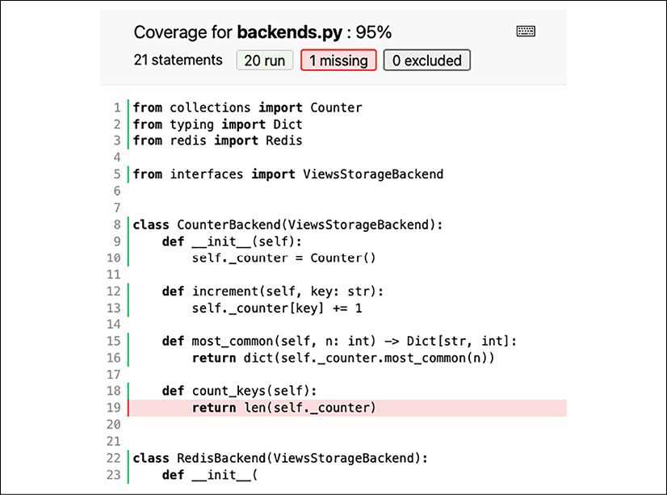

软件很复杂。无论你使用什么语言，构建在什么框架上，无论你的编码风格多么优雅，都很难仅通过阅读代码来验证软件的正确性。这不仅是因为非平凡的应用程序通常由大量代码组成。还因为完整的软件通常由许多层组成，并依赖于许多外部或可互换的组件，例如操作系统、库、数据库、缓存、Web API 或用于与代码交互的客户端（例如浏览器）。

现代软件的复杂性意味着验证其正确性通常需要你超越代码。你需要考虑代码运行的环境、可替换组件的变体以及与代码交互的方式。这就是为什么高质量软件的开发人员经常采用特殊的测试技术，使他们能够快速可靠地验证他们编写的代码是否满足所需的验收标准。

复杂软件的另一个关注点是其可维护性。这可以理解为维持一个软件的持续开发是多么容易。开发不仅涉及实施新功能或增强功能，还涉及诊断和修复在此过程中不可避免地会发现的问题。可维护软件是指无需付出多少努力就可以引入新的变更，并且在变更时引入新缺陷的风险很低的软件。

正如你可能猜到的那样，可维护性是许多软件方面的产物。自动化测试当然有助于通过强制现有和未来代码正确覆盖已知用例来降低更改风险。但这还不足以确保未来的更改易于实施。这就是为什么现代测试方法还依赖自动化代码质量测量和测试来强制执行特定的编码约定、突出显示潜在错误的代码片段或扫描安全漏洞的原因。

现代测试领域是广阔的。很容易迷失在测试方法、工具、框架、库和实用程序的海洋中。这就是为什么在本章中我们将回顾专业 Python 开发人员经常使用的最流行的测试和质量自动化技术。这应该让你对一般情况下可能发生的事情有一个很好的概述，并且还允许你构建自己的测试例程。我们将涵盖以下主题：

- 测试驱动开发的原则
- 使用 pytest 编写测试
- 质量自动化
- 突变测试
- 有用的测试工具

我们将使用很多来自 PyPI 的包，所以让我们从本章的技术要求开始。

## 技术要求

以下是本章提到的Python包，可以从PyPI下载：

- pytest
- redis
- coverage
- mypy
- mutmut
- faker
- freezegun

关于如何安装包的信息包含在第 2 章，现代 Python 开发环境中。

> 本章的代码文件可以在 https://github.com/PacktPublishing/Expert-Python-Programming-Fourth-Edition/tree/main/Chapter%2010 找到。

## 测试驱动开发的原则

测试是软件开发过程中最重要的元素之一。它非常重要，甚至有一种称为测试驱动开发 (TDD) 的软件开发方法。它提倡将软件需求作为测试作为开发代码的第一步（也是最重要的）。

原则很简单：你首先关注测试。使用它们来描述软件的行为、验证它并检查潜在的错误。只有当这些测试完成后，你才应继续实际实施以满足测试。

TDD 最简单的形式是一个迭代过程，包括以下步骤：

- 编写测试：测试应反映尚未实现的功能或改进的规范。
- 运行测试：在此阶段，所有新测试都应该失败，因为该功能或改进尚未实施。
- 编写一个最小的有效实现：代码应该非常简单但正确。如果它看起来不优雅或有性能问题也没关系。这个阶段的主要焦点应该是满足在步骤 1 中编写的所有测试。在简单的代码中诊断问题也比在性能优化的代码中更容易。
- 运行测试：在这个阶段，所有测试都应该通过。这包括新的和预先存在的测试。如果其中任何一个失败，则应修改代码，直到满足要求。
- 磨练和打磨：当所有测试都得到满足时，可以逐步重构代码，直到达到所需的质量标准。现在是精简、重构和有时进行明显优化的时候了（如果你用蛮力解决了问题）。每次更改后，应重新运行所有测试以确保没有任何功能被破坏。

这个简单的过程允许你迭代地扩展你的应用程序，而不必担心新的更改会破坏一些预先存在和经过测试的功能。它还有助于避免过早优化，并通过一系列简单的小步骤指导你完成开发。

如果没有适当的工作卫生，TDD 将无法实现承诺的结果。这就是为什么遵循一些基本原则很重要的原因：

- 保持被测试单元的大小：在 TDD 中，我们经常谈论代码单元和单元测试。代码单元是一个简单的自主软件，它（最好）应该只做一件事，并且单个单元测试应该使用一组参数来执行一个函数或方法。这使得编写测试更容易，但也有利于良好的开发实践和模式，如单一职责原则和控制反转（参见第 5 章，接口、模式和模块化）。
- 保持测试小而集中：创建许多小而简单的测试几乎总是比一个冗长而复杂的测试要好。每个测试只应验证预期功能的一个方面/要求。进行粒度测试可以更轻松地诊断潜在问题并提高测试套件的可维护性。小型测试可以更好地查明问题，而且更容易阅读。
- 保持测试隔离和独立：一个测试的成功不应该依赖于测试套件中所有测试的特定执行顺序。如果测试依赖于执行环境的特定状态，则测试本身应确保满足所有先决条件。同样，测试的任何副作用都应在执行后清除。每个测试的准备和清理阶段也称为设置和拆卸。

这几条原则将帮助你编写易于理解和维护的测试。这很重要，因为编写测试只是又一项需要时间并增加初始开发成本的活动。尽管如此，如果做得对，这是一项可以很快获得回报的投资。系统和自动化的测试程序减少了可能会影响最终用户的软件缺陷数量。它还提供了一个用于验证已知软件错误的框架。

严格的测试程序和遵循一些基本原则通常由专用的测试库或框架支持。 Python 程序员真的很幸运，因为 Python 标准库带有两个专为自动化测试而创建的内置模块。这些是：

- doctest：用于测试文档字符串中的交互式代码示例的测试模块。这是将文档与测试合并的便捷方式。 doctest 理论上能够处理单元测试，但它更常用于确保在 docstrings 中找到的代码片段反映正确的用法示例。

    > 你可以在 https://docs.python.org/3/library/doctest.html 上的官方文档中阅读有关 doctest 的更多信息。

- unittest：受 JUnit（一种流行的 Java 测试框架）启发的成熟测试框架。它允许将测试组织成测试用例和测试套件，并提供管理设置和拆卸原语的通用方法。 unittest 带有一个内置的测试运行器，它能够发现整个代码库中的测试模块并执行特定的测试选择。

    > 你可以在 https://docs.python.org/3/library/unittest.html 上的官方文档中阅读有关 unittest 的更多信息。

这两个模块一起可以满足即使是最苛刻的开发人员的大部分测试需求。不幸的是，doctest 专注于一个非常具体的测试用例（代码示例的测试），并且由于面向类的测试组织，单元测试需要相当多的样板。它的转轮也没有应有的灵活。这就是为什么许多专业程序员更喜欢使用 PyPI 上可用的第三方框架之一。

一个这样的框架是 pytest。它可能是目前最好和最成熟的 Python 测试框架之一。它提供了一种更方便的方法，将测试组织为具有测试功能（而不是类）的扁平模块，但也与基于 unittest 类的测试层次结构兼容。它还具有真正卓越的测试运行器，并带有大量可选扩展。

pytest的以上优点是我们不打算讨论unittest和doctest使用细节的原因。它们仍然很棒且有用，但 pytest 几乎总是更好、更实用的选择。这就是为什么我们现在要讨论使用 pytest 作为我们选择的框架来编写测试的示例。

## 使用 pytest 编写测试

现在是将理论付诸实践的时候了。我们已经知道 TDD 的优点，所以我们将尝试在测试的帮助下构建一些简单的东西。我们将讨论典型测试的剖析，然后回顾专业 Python 程序员经常使用的常见测试技术和工具。所有这些都将在 pytest 测试框架的帮助下完成。

为了做到这一点，我们需要解决一些问题。毕竟，测试始于软件开发生命周期的最开始——即定义软件需求时。在许多测试方法中，测试只是一种以可执行形式描述软件需求的代码原生方式。

很难找到一个令人信服的编程挑战，既可以展示各种测试技术，又可以适合书籍格式。这就是为什么我们要讨论一些无关紧要的小问题。我们还将重温本书前几章中的一些示例。

从 TDD 的角度来看，为现有代码编写测试当然是一种非正统的测试方法，因为理想情况下编写测试应该在实现之前，反之亦然。但这是众所周知的做法。对于专业程序员来说，继承一个测试不佳或根本没有测试过的软件并不少见。在这种情况下，如果你想可靠地测试你的软件，你最终将不得不完成缺少的工作。在我们的例子中，为预先存在的代码编写一些测试也将是一个有趣的机会来讨论在代码之后编写测试的挑战。

第一个示例将非常简单。它将让我们了解测试的基本结构以及如何使用 pytest runner 来发现和运行测试。我们的任务是创建一个函数：

- 接受可迭代的元素和批量大小
- 返回一个可迭代的子列表，其中每个子列表都是源列表中的一批连续元素。元素的顺序应该保持不变
- 每批具有相同的尺寸
- 如果源列表没有足够的元素来填充最后一个批次，则该批次应该更短但永远不会为空

那将是一个相对较小但有用的功能。例如，它可以用于处理大量数据流，而无需将它们完全加载到进程内存中。正如我们在第 6 章并发中学到的那样，它还可以用于分配工作块以处理单独的线程或进程工作者。

让我们从编写函数的存根开始，找出我们正在使用的内容。它将被命名为batches()，并将托管在一个名为batch.py 的文件中。签名可以如下：

```python
from typing import Any, Iterable, List


def batches(
    iterable: Iterable[Any], batch_size: int
) -> Iterable[List[Any]]:
    pass
```

我们还没有提供任何实现，因为这是我们将在测试完成后处理的事情。 我们可以看到构成函数和调用者之间契约一部分的输入注解。

完成此操作后，我们就可以将函数导入测试模块以编写测试。 命名测试模块的通用约定是 test_\<module-name\>.py，其中 \<module-name\> 是我们要测试其内容的模块的名称。 让我们创建一个名为 test_batch.py 的文件。

第一个测试会做一件很常见的事情：向函数提供输入数据并比较结果。 我们将使用一个简单的文字列表作为输入。 以下是一些示例测试代码：

```python
from batch import batches


def test_batch_on_lists():
    assert list(batches([1, 2, 3, 4, 5, 6], 1)) == [[1], [2], [3], [4], [5], [6]]
    assert list(batches([1, 2, 3, 4, 5, 6], 2)) == [[1, 2], [3, 4], [5, 6]]
    assert list(batches([1, 2, 3, 4, 5, 6], 3)) == [[1, 2, 3], [4, 5, 6]]
    assert list(batches([1, 2, 3, 4, 5, 6], 4)) == [[1, 2, 3, 4], [5, 6],]
```

assert 语句是 pytest 中测试被测试代码单元的前置和后置条件的首选方式。 pytest 能够检查此类断言，识别它们的异常，并因此以可读的形式输出测试失败的详细报告。

以上是用于测试小型实用程序的流行结构，通常足以确保它们按预期工作。 尽管如此，它并没有清楚地反映我们的要求，所以也许值得对其进行一些重构。

以下是两个额外测试的示例，它们更明确地映射到我们的预定义要求：

```python
from itertools import chain


def test_batch_order():
    iterable = range(100)
    batch_size = 2
    output = batches(iterable, batch_size)
    assert list(chain.from_iterable(output)) == list(iterable)


def test_batch_sizes():
    iterable = range(100)
    batch_size = 2
    output = list(batches(iterable, batch_size))
    for batch in output[:-1]:
        assert len(batch) == batch_size
    assert len(output[-1]) <= batch_size
```

test_batch_order() 测试确保批次中元素的顺序与源迭代中的相同。 test_batch_sizes() 测试确保所有批次具有相同的大小（最后一批除外，它可以更短）。

我们还可以看到两个测试中都出现了一个模式。事实上，许多测试都遵循一个非常常见的结构：

1. 设置：这是准备测试数据和所有其他先决条件的步骤。在我们的例子中，设置包括准备 iterable 和 batch_size 参数。
2. 执行：这是实际测试的代码单元投入使用并保存结果以供以后检查的时间。在我们的例子中，它是对 batches() 函数的调用。
3. 验证：在此步骤中，我们通过检查单元执行的结果来验证特定要求是否得到满足。在我们的例子中，这些都是用于验证保存的输出的断言语句。
4. 清理：这是释放可能影响其他测试的所有资源或返回到它们在设置步骤之前所处状态的步骤。我们没有获得任何这样的资源，所以在我们的例子中这一步可以跳过。

根据测试驱动开发原理部分的测试流程，目前我们的测试应该会失败，因为我们还没有提供任何功能实现。让我们运行 pytest runner 看看它是如何运行的：

```python
$ pytest -v
```

我们得到的输出可能如下所示：

```sh
======================== test session starts ========================
platform darwin -- Python 3.9.2, pytest-6.2.2, py-1.10.0, pluggy-0.13.1 -- .../Expert-Python-Programming-Fourth-Edition/.venv/bin/python
cachedir: .pytest_cache
rootdir: .../Expert-Python-Programming-Fourth-Edition/Chapter 10/01 - Writing tests with pytest
collected 3 items
test_batch.py::test_batch_on_lists FAILED                     [ 33%]
test_batch.py::test_batch_order FAILED                        [ 66%]
test_batch.py::test_batch_sizes FAILED                        [100%]
============================= FAILURES ==============================
________________________ test_batch_on_lists ________________________
    def test_batch_on_lists():
>       assert list(batches([1, 2, 3, 4, 5, 6], 1)) == [
            [1], [2], [3], [4], [5], [6]
        ]
E       TypeError: 'NoneType' object is not iterable
test_batch.py:7: TypeError
_________________________ test_batch_order __________________________
    def test_batch_order():
        iterable = range(100)
        batch_size = 2
        output = batches(iterable, batch_size)
>       assert list(chain.from_iterable(output)) == list(iterable)
E       TypeError: 'NoneType' object is not iterable
test_batch.py:27: TypeError
_________________________ test_batch_sizes __________________________
    def test_batch_sizes():
        iterable = range(100)
        batch_size = 2
>       output = list(batches(iterable, batch_size))
E       TypeError: 'NoneType' object is not iterable
test_batch.py:34: TypeError
====================== short test summary info ======================
FAILED test_batch.py::test_batch_on_lists - TypeError: 'NoneType' ...
FAILED test_batch.py::test_batch_order - TypeError: 'NoneType' obj...
FAILED test_batch.py::test_batch_sizes - TypeError: 'NoneType' obj...
```

正如我们所看到的，测试运行失败，三个单独的测试失败，我们得到了一份详细的错误报告。我们在每次测试中都有相同的失败。 TypeError 表示 NoneType 对象不可迭代，因此无法将其转换为列表。这意味着我们的三个要求都没有得到满足。这是可以理解的，因为 batches() 函数还没有做任何有意义的事情。

现在是时候满足这些测试了。目标是提供最小的工作实现。这就是为什么我们不会做任何花哨的事情，而是会提供一个基于列表的简单而天真的实现。让我们来看看我们的第一次迭代：

```python
from typing import Any, Iterable, List


def batches(
    iterable: Iterable[Any], batch_size: int
) -> Iterable[List[Any]]:
    results = []
    batch = []
    for item in iterable:
        batch.append(item)
        if len(batch) == batch_size:
            results.append(batch)
            batch = []
    if batch:
        results.append(batch)
    return results
```

这个想法很简单。我们创建一个结果列表并遍历输入可迭代对象，并在进行过程中主动创建新批次。当一个批次已满时，我们将其添加到结果列表中并开始一个新的结果。完成后，我们检查是否有未完成的批次并将其添加到结果中。然后我们返回结果。

这是一个非常幼稚的实现，可能无法很好地处理任意大的结果，但它应该满足我们的测试。让我们运行 pytest 命令看看它是否有效：

```python
$ pytest -v
```

测试结果现在应该如下：

```sh
======================== test session starts ========================
platform darwin -- Python 3.9.2, pytest-6.2.2, py-1.10.0, pluggy-0.13.1 -- .../Expert-Python-Programming-Fourth-Edition/.venv/bin/python
cachedir: .pytest_cache
rootdir: .../Expert-Python-Programming-Fourth-Edition/Chapter 10/01 - Writing tests with pytest
collected 3 items
test_batch.py::test_batch_on_lists PASSED                     [ 33%]
test_batch.py::test_batch_order PASSED                        [ 66%]
test_batch.py::test_batch_sizes PASSED                        [100%]
========================= 3 passed in 0.01s =========================
```

如我们所见，所有测试均已成功通过。这意味着 batches() 函数满足我们的测试指定的要求。这并不意味着代码完全没有错误，但它让我们相信它在测试验证的条件范围内运行良好。我们拥有的测试越多，测试越精确，我们对代码正确性的信心就越大。

我们的工作还没有结束。我们做了一个简单的实现并验证了它的工作原理。现在我们准备好继续改进我们的代码的步骤。这样做的原因之一是在使用最简单的代码实现时更容易发现测试中的错误。请记住，测试也是代码，因此在测试中也可能出错。

如果被测试单元的实现简单易懂，则更容易验证被测试代码是否错误或测试本身是否存在问题。

我们的 batches() 函数第一次迭代的明显问题是它需要将所有中间结果存储在结果列表变量中。如果 iterable 参数足够大（甚至无限），它会给你的应用程序带来很大压力，因为它必须将所有数据加载到内存中。更好的方法是将该函数转换为生成连续结果的生成器。这可以通过一点点调整来完成：

```python
def batches(
    iterable: Iterable[Any], batch_size: int
) -> Iterable[List[Any]]:
    batch = []
    for item in iterable:
        batch.append(item)
        if len(batch) == batch_size:
            yield batch
            batch = []
    if batch:
        yield batch
```

另一种方法是使用迭代器和 itertools 模块，如下例所示：

```python
from itertools import islice


def batches(
    iterable: Iterable[Any], batch_size: int
) -> Iterable[List[Any]]:
    iterator = iter(iterable)
    while True:
        batch = list(islice(iterator, batch_size))
        if not batch:
            return
        yield batch
```

这就是 TDD 方法的真正优点。我们现在能够轻松地试验和调整现有的功能实现，同时降低破坏事物的风险。你可以自己测试它，方法是将 batches() 函数实现替换为上面显示的函数实现之一，然后运行测试以查看它是否满足定义的要求。

我们的示例问题很小且易于理解，因此我们的测试很容易编写。但并不是每个代码单元都会这样。在测试更大或更复杂的代码部分时，你通常需要额外的工具和技术来编写干净且可读的测试。在接下来的几节中，我们将回顾 Python 程序员经常使用的常见测试技术，并展示如何在 pytest 的帮助下实现它们。第一个将是测试参数化。

### 测试参数化

使用收到的和预期的函数输出的直接比较是编写简短单元测试的常用方法。它允许你编写清晰和简洁的测试。这就是我们在上一节的第一个 test_batch_on_lists() 测试中使用此方法的原因。

该技术的一个问题是它打破了设置、执行、验证和清理阶段的经典模式。看不清楚哪些指令准备测试上下文，哪些函数调用构成单元执行，哪些指令执行结果验证。

另一个问题是，当输入输出数据样本数量增加时，测试变得过大。它们更难阅读，并且潜在的独立故障没有被正确隔离。让我们回忆一下 test_batch_on_lists() 测试的代码以更好地理解这个问题：

```python
def test_batch_on_lists():
    assert list(batches([1, 2, 3, 4, 5, 6], 1)) == [[1], [2], [3], [4], [5], [6]]
    assert list(batches([1, 2, 3, 4, 5, 6], 2)) == [[1, 2], [3, 4], [5, 6]]
    assert list(batches([1, 2, 3, 4, 5, 6], 3)) == [[1, 2, 3], [4, 5, 6]]
    assert list(batches([1, 2, 3, 4, 5, 6], 4)) == [[1, 2, 3, 4], [5, 6],]
```

每个断言语句负责验证一对输入-输出样本。但是每一对都可以构造成验证初始要求的不同条件。在我们的例子中，前三个语句可以验证每个输出批次的大小是否相同。但是最后一个断言验证如果可迭代参数的长度不能被batch_size整除，则也返回不完整的批处理。测试的意图并不完全清楚，因为它稍微打破了“保持测试小而集中”的原则。

我们可以通过将所有样本的准备工作移到测试的单独设置部分，然后在主执行部分迭代样本，从而稍微改进测试结构。在我们的例子中，这可以通过一个简单的字典文字来完成：

```python
def test_batch_with_loop():
    iterable = [1, 2, 3, 4, 5, 6]
    samples = {
        # even batches
        1: [[1], [2], [3], [4], [5], [6]],
        2: [[1, 2], [3, 4], [5, 6]],
        3: [[1, 2, 3], [4, 5, 6]],
        # batches with rest
        4: [[1, 2, 3, 4], [5, 6]],
    }
    for batch_size, expected in samples.items():
        assert list(batches(iterable, batch_size)) == expected
```

看看测试结构的小改动如何让我们注释哪些样本有望验证特定的功能需求。我们并不总是必须对每个需求使用单独的测试。请记住：实用性胜过纯度。

由于此更改，我们可以更清晰地分离测试的设置和执行部分。我们现在可以说 batch() 函数的执行是用样本字典的内容参数化的。这就像在一次测试运行中运行多个小测试。

在单个测试功能中测试多个样本的另一个问题是测试可能会提前中断。如果第一个 assert 语句失败，测试将立即停止。在我们修复第一个错误并能够继续执行测试之前，我们不知道后续的断言语句是成功还是失败。全面了解所有单个故障通常可以让我们更好地了解测试代码的问题所在。

在基于循环的测试中无法轻松解决此问题。幸运的是，pytest 以 @pytest.mark.parametrize 装饰器的形式提供了对测试参数化的本机支持。这允许我们将测试执行步骤的参数化移动到测试主体之外。 pytest 将足够聪明，可以将每组输入参数视为独立于其他样本运行的单独“虚拟”测试。

@pytest.mark.parametrize 至少需要两个位置参数：

- argnames：这是一个参数名称列表，pytest 将使用这些名称将测试参数作为参数提供给测试函数。它可以是逗号分隔的字符串或字符串列表/元组。
- argvalues：这是每个单独测试运行的可迭代参数集。通常，它是一个列表列表或一个元组元组。

我们可以重写上一个示例以使用 @pytest.mark.parametrize 装饰器，如下所示：

```python
import pytest
@pytest.mark.parametrize(
    "batch_size, expected", [
        # even batches
        [1, [[1], [2], [3], [4], [5], [6]]],
        [2, [[1, 2], [3, 4], [5, 6]]],
        [3, [[1, 2, 3], [4, 5, 6]]],
        # batches with rest
        [4, [[1, 2, 3, 4], [5, 6]]]
    ]
)
def test_batch_parameterized(batch_size, expected):
    iterable = [1, 2, 3, 4, 5, 6]
    assert list(batches(iterable, batch_size)) == expected
```

如果我们现在使用 pytest -v 命令执行到目前为止编写的所有测试，我们将得到以下输出：

```sh
======================== test session starts ========================
platform darwin -- Python 3.9.2, pytest-6.2.2, py-1.10.0, pluggy-0.13.1 -- .../Expert-Python-Programming-Fourth-Edition/.venv/bin/python
cachedir: .pytest_cache
rootdir: .../Expert-Python-Programming-Fourth-Edition/Chapter 10/01 - Writing tests with pytest
collected 8 items
test_batch.py::test_batch_on_lists PASSED                     [ 12%]
test_batch.py::test_batch_with_loop PASSED                    [ 25%]
test_batch.py::test_batch_parameterized[1-expected0] PASSED   [ 37%]
test_batch.py::test_batch_parameterized[2-expected1] PASSED   [ 50%]
test_batch.py::test_batch_parameterized[3-expected2] PASSED   [ 62%]
test_batch.py::test_batch_parameterized[4-expected3] PASSED   [ 75%]
test_batch.py::test_batch_order PASSED                        [ 87%]
test_batch.py::test_batch_sizes PASSED                        [100%]
========================= 8 passed in 0.01s =========================
```

如你所见，测试报告列出了 test_batch_parameterized() 测试运行的四个单独实例。如果其中任何一个失败，它不会影响其他人。

测试参数化有效地将经典测试职责的一部分——测试上下文的设置——置于测试功能之外。这允许更高的测试代码重用性，并更加关注真正重要的事情：单元执行和执行结果的验证。

从测试主体中提取设置责任的另一种方法是使用可重复使用的测试fixture。 pytest 已经对真正神奇的可重用装置提供了很好的原生支持。

### pytest 的fixtures

“fixture”一词来自机械和电子工程。它是一种物理设备，可以采用fixture或fixture的形式，将被测硬件保持在固定位置和配置（因此称为“fixture”），以使其能够在特定环境中进行一致的测试。

软件测试装置也有类似的用途。他们模拟了一个固定的环境配置，试图模拟被测试软件组件的真实使用。 Fixtures 可以是任何东西，从用作输入参数的特定对象到环境变量配置，再到存储在远程数据库中的数据集，这些数据集在测试过程中使用。

在 pytest 中，fixture 是一段可重用的设置和/或拆卸代码，可以作为测试函数的依赖项提供。 pytest 有一个内置的依赖注入机制，允许编写模块化和可扩展的测试套件。

> 我们已经在第 5 章接口、模式和模块化中介绍了 Python 应用程序的依赖注入主题。

要创建 pytest fixtures，你需要定义一个命名函数并使用 @pytest.fixture 装饰器对其进行装饰，如下例所示：

```python
import pytest


@pytest.fixture
def dependency():
    return "fixture value"
```

pytest 在测试执行之前运行fixture函数。fixture函数的返回值（此处为“fixture值”）将作为输入参数提供给测试函数。也可以使用以下生成器语法在同一个fixture函数中同时提供设置和清理代码：

```python
@pytest.fixture


def dependency_as_generator():
    # setup code
    yield "fixture value"
    # teardown code
```

使用生成器语法时，pytest 将获取fixture 函数的生成值并保持挂起，直到测试完成执行。测试完成后，pytest 将在yield 语句之后恢复执行所有使用的fixture 函数，而不管测试结果（失败或成功）。这允许对测试环境进行方便和可靠的清理。

要在测试中使用fixture，你需要使用其名称作为测试函数的输入参数：

```python
def test_fixture(dependency):
    pass
```

启动 pytest runner 时，pytest 将通过检查测试函数签名并将名称与可用的fixture函数匹配来收集所有fixture使用。默认情况下，pytest 有几种方法可以发现设备并执行它们的名称解析：

- 本地fixture：测试能够使用在定义它们的同一模块中可用的所有fixture。这些fixture可以是在同一模块中导入的fixture。本地设备总是优先于共享设备。
- 共享装置：测试能够使用 conftest 模块中可用的装置，该模块存储在与测试模块或其任何父目录相同的目录中。一个测试套件可以有多个 conftest 模块。来自 conftest 的在目录层次结构中更接近的装置优先于那些在目录层次结构中更远的装置。共享装置总是优先于插件装置。
- 插件fixtures：pytest插件可以提供自己的fixtures。这些灯具名称将最后匹配。

最后但并非最不重要的一点是，fixture 可以与决定 fixture 值生命周期的特定范围相关联。这些作用域对于作为生成器实现的装置非常重要，因为它们决定了何时执行清理代码。有五个范围可用：

- “功能”范围：这是默认范围。具有“函数”作用域的fixture函数将针对每个单独的测试运行执行一次，之后将被销毁。
- “类”范围：此范围可用于以 xUnit 风格（基于 unittest 模块）编写的测试方法。在测试类中的最后一个测试之后，具有此范围的装置将被销毁。
- “模块”范围：在测试模块中的最后一个测试之后销毁具有此范围的装置。
- “包”范围：具有此范围的装置在给定测试包（测试模块的集合）中的最后一个测试之后被销毁。
- “会话”范围：这是一种全局范围。具有此范围的装置在整个运行程序执行期间都有效，并在最后一次测试后销毁。

可以使用不同范围的装置来优化测试执行，因为特定的环境设置有时可能需要大量时间来执行。如果许多测试可以安全地重用相同的设置，那么将默认的“功能”范围扩展到“模块”、“包”甚至“会话”可能是合理的。

此外，“会话”装置可用于为整个测试运行执行全局设置以及全局清理。这就是为什么它们经常与 autouse=True 标志一起使用，它将fixture标记为给定测试组的自动依赖项。 autousefixture的范围如下：

- 测试模块fixture的模块级：如果测试模块中包含带有 autouse 标志的fixture（带有 test 前缀的模块），它将被自动标记为该模块中每个测试的依赖项。
- 测试 conftest 模块fixture的包级别：如果具有 autouse 标志的fixture包含在给定测试目录的 conftest 模块中，它将被自动标记为同一目录中每个测试模块中每个测试的依赖项。这也包括子目录。

学习使用各种形式的装置的最好方法是通过例子。我们对上一节中的batch() 函数的测试非常简单，因此不需要大量使用fixture。如果你需要提供一些复杂的对象初始化或外部软件组件（如远程服务或数据库）的设置状态，则fixture特别有用。在第 5 章，接口、模式和模块化中，我们讨论了使用可插拔存储后端跟踪页面查看计数的代码示例，其中一个示例使用 Redis 作为存储实现。测试这些后端将是 pytest fixtures的完美用例，因此让我们回忆一下 ViewsStorageBackend 抽象基类的通用接口：

```python
from abc import ABC, abstractmethod
from typing import Dict


class ViewsStorageBackend(ABC):
    @abstractmethod
    def increment(self, key: str): ...
    @abstractmethod
    def most_common(self, n: int) -> Dict[str, int]: ...
```

抽象基类或任何其他类型的接口实现（如协议子类）在测试方面实际上非常有用。它们允许你专注于类行为而不是实现。

如果我们想测试 ViewsStorageBackend 的任何实现的行为，我们可以测试以下几点：

- 如果我们收到一个空的存储后端， most_common() 方法将返回一个空字典
- 如果我们增加各种键的页数，并请求大于或等于增加的键数的最常用键的数量，我们将收到所有跟踪的计数
- 如果我们增加各种键的页数并请求大于或等于增加的键数的最常用键的数量，我们将收到一组最常用元素的缩短集

我们将从测试开始，然后讨论实际的fixture实现。空存储后端的第一个测试函数将非常简单：

```python
import pytest
import random
from interfaces import ViewsStorageBackend


@pytest.mark.parametrize(
    "n", [0] + random.sample(range(1, 101), 5)
)
def test_empty_backend(backend: ViewsStorageBackend, n: int):
    assert backend.most_common(n) == {}
```

此测试不需要任何复杂的设置。我们可以使用一组静态的 n 个参数参数，但额外的随机值参数化为测试增加了一个很好的接触。后端参数是fixture使用的声明，它将在测试运行期间由 pytest 解析。

获取完整的增量计数集的第二个测试将需要更详细的设置和执行：

```python
import pytest
import random
from interfaces import ViewsStorageBackend


@pytest.mark.parametrize(
    "n", [0] + random.sample(range(1, 101), 5)
)
def test_empty_backend(backend: ViewsStorageBackend, n: int):
    assert backend.most_common(n) == {}
```

测试从一个带有预期增量的文字字典变量的声明开始。这个简单的设置有两个目的：增量变量指导进一步的执行步骤，也用作两个验证断言的验证数据。与之前的测试一样，我们希望后端参数由 pytest fixture提供。

最后一个测试与前一个非常相似：

```python
def test_increments_top(backend: ViewsStorageBackend):
    increments = {
        "key_a": random.randint(1, 10),
        "key_b": random.randint(1, 10),
        "key_c": random.randint(1, 10),
        "key_d": random.randint(1, 10),
    }
    for key, count in increments.items():
        for _ in range(count):
            backend.increment(key)
    assert len(backend.most_common(1)) == 1
    assert len(backend.most_common(2)) == 2
    assert len(backend.most_common(3)) == 3
    top2_values = backend.most_common(2).values()
    assert list(top2_values) == (
        sorted(increments.values(), reverse=True)[:2]
    )
```

设置和执行步骤类似于 test_increments_all() 测试函数中使用的步骤。如果我们不编写测试，我们可能会考虑将这些步骤移到分离可重用的功能。但在这里它可能会对可读性产生负面影响。测试应该保持独立，所以如果允许清晰和明确的测试，那么一点冗余通常不会受到伤害。然而，这当然不是规则，总是需要个人判断。

既然所有的测试都写下来了，是时候提供一个fixture了。在第 5 章，接口、模式和模块化中，我们包含了后端的两种实现：CounterBackend 和 RedisBackend。最终，我们希望对两个存储后端使用相同的测试集。我们最终会做到这一点，但现在让我们假设只有一个后端。它会稍微简化一些事情。

现在让我们假设我们只测试 RedisBackend。它肯定比 CounterBackend 更复杂，所以我们这样做会更有趣。我们可以只编写一个后端设备，但 pytest 允许我们拥有模块化设备，所以让我们看看它是如何工作的。我们将从以下几点开始：

```python
from redis import Redis
from backends import RedisBackend


@pytest.fixture
def backend(redis_client: Redis):
    set_name = "test-page-counts"
    redis_client.delete(set_name)
    return RedisBackend(
        redis_client=redis_client,
        set_name=set_name
    )
```

redis_client.delete(set_name) 删除Redis 数据存储中的键（如果存在）。我们将在 RedisBackend 初始化中使用相同的键。存储我们所有增量的底层 Redis 键将在第一次存储修改时创建，因此我们无需担心不存在的键。通过这种方式，我们确保每次初始化fixture时，存储后端都是完全空的。默认fixture会话范围是“函数”，这意味着使用该fixture的每个测试都将收到一个空后端。

> Redis 不是大多数系统发行版的一部分，因此你可能必须自己安装它。大多数 Linux 发行版都在其软件包存储库中的 redis-server 软件包名称下提供它。你还可以使用 Docker 和 Docker Compose。以下是一个简短的 docker-compose.yml 文件，可让你在本地快速启动它：
>
> ```yaml
> version: "3.7"
> services:
>   redis:
>     image: redis
>     ports:
>       - 6379:6379
> ```
>
> 你可以在第 2 章现代 Python 开发环境中找到有关使用 Docker 和 Docker Compose 的更多详细信息。

你可能已经注意到，我们没有在 backend() fixture中实例化 Redis 客户端，而是将其指定为fixture函数的输入参数。

pytest 中的依赖注入机制也涵盖了fixture 函数。这意味着你可以在fixture内请求其他fixture。

以下是 redis_client() fixtures的示例：

```python
from redis import Redis


@pytest.fixture(scope="session")
def redis_client():
    return Redis(host='localhost', port=6379)
```

为了避免使事情过于复杂，我们只是硬编码了 Redis 主机和端口参数的值。由于上述模块化，如果你决定使用远程地址，那么全局替换这些值会更容易。

将所有测试保存在 test_backends.py 模块中，在本地启动 Redis 服务器，使用 pytest -v 命令执行 pytest runner。你将获得如下所示的输出：

```python
======================= test session starts =========================
platform darwin -- Python 3.9.2, pytest-6.2.2, py-1.10.0, pluggy-0.13.1 -- .../Expert-Python-Programming-Fourth-Edition/.venv/bin/python
cachedir: .pytest_cache
rootdir: .../Expert-Python-Programming-Fourth-Edition/Chapter 10/03 - Pytest's fixtures
collected 8 items
test_backends.py::test_empty_backend[0] PASSED                   [ 12%]
test_backends.py::test_empty_backend[610] PASSED                 [ 25%]
test_backends.py::test_empty_backend[611] PASSED                 [ 37%]
test_backends.py::test_empty_backend[7] PASSED                   [ 50%]
test_backends.py::test_empty_backend[13] PASSED                  [ 62%]
test_backends.py::test_empty_backend[60] PASSED                  [ 75%]
test_backends.py::test_increments_all PASSED                     [ 87%]
test_backends.py::test_increments_top PASSED                     [100%]
======================== 8 passed in 0.08s =========================
```

所有测试通过意味着我们已经成功验证了 RedisBackend 实现。如果我们可以为 CounterBackend 做同样的事情，那就太好了。最简单的做法是复制测试并重写测试装置，现在提供后端的新实现。但这是我们希望避免的重复。

我们知道测试应该保持独立。尽管如此，我们的三个测试只引用了 ViewsStorageBackend 抽象基类。因此，无论测试存储后端的实际实现如何，它们都应该始终相同。我们要做的是找到一种方法来定义一个参数化的fixture，这将允许我们对各种后端实现重复相同的测试。

fixture功能的参数化与测试功能的参数化略有不同。 @pytest.fixture 装饰器接受一个可选的 params 关键字值，该值接受一个可迭代的fixture参数。带有 params 关键字的fixture还必须声明使用特殊的内置请求fixture，除其他外，它允许访问当前fixture参数：

```python
import pytest


@pytest.fixture(params=[param1, param2, ...])
def parmetrized_fixture(request: pytest.FixtureRequest):
    return request.param
```

我们可以使用参数化fixture和 request.getfixturevalue() 方法根据fixture参数动态加载fixture。我们的测试功能的修订和完整的装置现在可以如下所示：

```python
import pytest
from redis import Redis
from backends import RedisBackend, CounterBackend


@pytest.fixture
def counter_backend():
    return CounterBackend()


@pytest.fixture(scope="session")
def redis_client():
    return Redis(host='localhost', port=6379)


@pytest.fixture
def redis_backend(redis_client: Redis):
    set_name = "test-page-counts"
    redis_client.delete(set_name)
    return RedisBackend(
        redis_client=redis_client,
        set_name=set_name
    )


@pytest.fixture(params=["redis_backend", "counter_backend"])
def backend(request):
    return request.getfixturevalue(request.param)
```

如果你现在使用一组新的装置运行相同的测试套件，你将看到执行的测试数量增加了一倍。以下是 pytest -v 命令的一些示例输出：

```python
======================== test session starts ========================
platform darwin -- Python 3.9.2, pytest-6.2.2, py-1.10.0, pluggy-0.13.1 -- .../Expert-Python-Programming-Fourth-Edition/.venv/bin/python
cachedir: .pytest_cache
rootdir: .../Expert-Python-Programming-Fourth-Edition/Chapter 10/03 - Pytest's fixtures
collected 16 items
test_backends.py::test_empty_backend[redis_backend-0] PASSED     [  6%]
test_backends.py::test_empty_backend[redis_backend-72] PASSED    [ 12%]
test_backends.py::test_empty_backend[redis_backend-23] PASSED    [ 18%]
test_backends.py::test_empty_backend[redis_backend-48] PASSED    [ 25%]
test_backends.py::test_empty_backend[redis_backend-780] PASSED   [ 31%]
test_backends.py::test_empty_backend[redis_backend-781] PASSED   [ 37%]
test_backends.py::test_empty_backend[counter_backend-0] PASSED   [ 43%]
test_backends.py::test_empty_backend[counter_backend-72] PASSED  [ 50%]
test_backends.py::test_empty_backend[counter_backend-23] PASSED  [ 56%]
test_backends.py::test_empty_backend[counter_backend-48] PASSED  [ 62%]
test_backends.py::test_empty_backend[counter_backend-780] PASSED [ 68%]
test_backends.py::test_empty_backend[counter_backend-781] PASSED [ 75%]
test_backends.py::test_increments_all[redis_backend] PASSED      [ 81%]
test_backends.py::test_increments_all[counter_backend] PASSED    [ 87%]
test_backends.py::test_increments_top[redis_backend] PASSED      [ 93%]
test_backends.py::test_increments_top[counter_backend] PASSED    [100%]
======================== 16 passed in 0.08s ========================
```


由于巧妙地使用了fixtures，我们在不影响测试可读性的情况下减少了测试代码的数量。我们还可以重用相同的测试函数来验证应该具有相同行为但不同实现的类。因此，无论何时需求发生变化，我们都可以确定我们将能够识别同一接口的类之间的差异。

> 在设计fixture时需要谨慎，因为过度使用依赖注入会使理解整个测试套件变得更加困难。fixture功能应保持简单并有详细记录。

使用fixtures 为Redis 等外部服务提供连接很方便，因为Redis 的安装非常简单，不需要任何自定义配置即可将其用于测试目的。但有时你的代码将使用远程服务或资源，你无法在测试环境中轻松提供这些服务或资源，或者在不进行破坏性更改的情况下无法对其执行测试。例如，在使用第三方 Web API、硬件或封闭的库/二进制文件时，这可能很常见。在这种情况下，一种常见的技术是使用可以替代真实对象的假对象或模拟。我们将在下一节讨论这种技术。

### 使用fakes

编写单元测试的前提是你可以隔离正在测试的代码单元。测试通常为函数或方法提供一些数据，并验证其返回值和/或其执行的副作用。这主要是为了确保：

- 测试与应用程序的原子部分有关，它可以是函数、方法、类或接口
- 测试提供确定性、可重复的结果

有时，程序组件的适当隔离并不明显或不容易完成。在上一节中，我们讨论了一个测试套件的示例，其中包括验证与 Redis 数据存储交互的一段代码。我们使用 pytest fixtures提供了到 Redis 的连接，我们发现这并不难。但是我们是只测试了我们的代码，还是还测试了 Redis 的行为？

在这种特殊情况下，包括与 Redis 的连接是一个务实的选择。我们的代码只做了一点工作，将大部分繁重的工作留给了外部存储引擎。如果 Redis 不能正常工作，它就不能正常工作。为了测试整个解决方案，我们必须测试我们的代码和 Redis 数据存储的集成。此类测试通常称为集成测试，通常用于测试严重依赖外部组件的软件。

但是安全的集成测试并不总是可行的。并非你将使用的每项服务都像 Redis 一样容易在本地启动。有时你会处理那些在普通生产用途之外无法复制的“特殊”组件。

在这种情况下，你将不得不用模拟真实组件的假对象替换依赖项。

为了更好地理解在测试中使用fakes的典型用例，让我们考虑以下虚构的故事：我们正在构建一个可扩展的应用程序，使我们的客户能够实时跟踪其网站上的页面计数。与我们的竞争对手不同，我们提供高度可用和可扩展的解决方案，具有极低的延迟，并且能够在全球许多数据中心以一致的结果运行。我们产品的基石是来自 backends.py 模块的一个小计数器类。

拥有一个高度可用的分布式哈希映射（我们在 Redis 中使用的数据类型）来确保多区域设置中的低延迟并非易事。当然，一个 Redis 实例不会做我们向客户宣传的那样。值得庆幸的是，云计算供应商 ACME 公司最近与我们取得了联系，提供了他们最新的测试版产品之一。它被称为 ACME Global HashMap 服务，它完全符合我们的要求。但有一个问题：它仍处于测试阶段，因此 ACME 公司根据他们的政策还没有提供我们可以用于测试目的的沙箱环境。此外，由于一些不明确的法律原因，我们不能在我们的自动化测试管道中使用生产服务端点。

那么，我们能做什么呢？我们的代码每天都在增长。计划中的 AcmeStorageBackend 类可能会有额外的代码来处理日志记录、遥测、访问控制和许多其他花哨的东西。我们绝对希望能够对其进行彻底的测试。因此，我们决定使用我们应该集成到我们产品中的 ACME Corp SDK 的假替代品。

ACME Corp Python SDK 以 acme_sdk 包的形式出现。除其他外，它包括以下两个接口：

```python
from typing import Dict

class AcmeSession:
    def __init__(self, tenant: str, token: str): ...


class AcmeHashMap:
    def __init__(self, acme_session: AcmeSession): ...
    def incr(self, key: str, amount):
        """Increments any key by specific amount"""
        ...
    def atomic_incr(self, key: str, amount):
        """Increments any key by specific amount atomically"""
        ...
    def top_keys(self, count: int) -> Dict[str, int]:
        """Returns keys with top values"""
```

AcmeSession 会话是一个对象，它封装了到 ACME 公司服务的连接，而 AcmeHashMap 是我们要使用的服务客户端。我们很可能会使用 atomic_incr() 方法来增加页面查看计数。 top_keys() 将为我们提供获取最常见页面的能力。

要构建一个fake，我们只需要定义一个新类，该类具有与我们使用 AcmeHashMap 兼容的接口。我们可以采取务实的方法，只实现我们计划使用的那些类和方法。 AcmeHashMapFake 的最小实现如下：

```python
from collections import Counter
from typing import Dict


class AcmeHashMapFake:
    def __init__(self):
        self._counter = Counter()
    def atomic_incr(self, key: str, amount):
        self._counter[key] += amount
    def top_keys(self, count: int) -> Dict[str, int]:
        return dict(self._counter.most_common(count))
```

我们可以使用 AcmeHashMapFake 在现有的测试套件中为我们的存储后端提供一个新的装置。假设我们在 backends 模块中有一个 AcmeBackend 类，它将 AcmeHashMapFake 实例作为其唯一的输入参数。然后我们可以提供以下两个 pytest fixture函数：

```python
from backends import AcmeBackend
from acme_fakes import AcmeHashMapFake


@pytest.fixture
def acme_client():
    return AcmeHashMapFake()


@pytest.fixture
def acme_backend(acme_client):
    return AcmeBackend(acme_client)
```

将设置分成两个fixtures让我们为不久的将来可能发生的事情做好准备。当我们最终接触到 ACME Corp 沙箱环境时，我们只需要修改一个装置：

```python
from acme_sdk import AcmeHashMap, AcmeSession


@pytest.fixture
def acme_client():
    return AcmeHashMap(AcmeSession(..., ...))
```

总而言之，fake 为我们无法在测试期间构建或我们根本不想构建的对象提供了等效的行为。这对于必须与外部服务通信或访问远程资源的情况特别有用。通过内部化这些资源，你可以更好地控制测试环境，从而能够更好地隔离被测试的代码单元。

如果你必须构建其中的许多，构建定制的赝品可能会成为一项乏味的任务。幸运的是，Python 库带有 unittest.mock 模块，可用于自动创建假对象。

### 模拟和 unittest.mock 模块

模拟对象是通用的假对象，可用于隔离测试代码。它们使伪造对象的输入和输出的构建过程自动化。在静态类型语言中，模拟对象的使用水平更高，猴子补丁更难，但它们在 Python 中仍然有用，可以缩短模仿外部 API 的代码。

Python 中提供了很多模拟库，但最受认可的是unittest.mock，它在标准库中提供。

> unittest.mock 最初是作为 PyPI 上可用的第三方模拟包创建的。一段时间后，它作为临时包包含在标准库中。要了解有关临时标准库包的更多信息，请访问 https://docs.python.org/dev/glossary.html#term-provisional-api。

模拟几乎总是可以用来代替定制的假对象。它们对于伪造我们在测试期间无法完全控制的外部组件和资源特别有用。当我们不得不违背主要的 TDD 原则时——也就是说，当我们必须在编写实现之后编写测试时，它们也是必不可少的实用程序。

我们已经在上一节中讨论了将连接层伪装成外部资源的例子。现在，我们将仔细研究一种情况，即我们必须为尚未进行任何测试的现有代码段编写测试。

假设我们有以下 send() 函数，它应该通过 SMTP 协议发送电子邮件消息：

```python
import smtplib
import email.message


def send(
    sender, to,
    subject='None',
    body='None',
    server='localhost'
):
    """sends a message."""
    message = email.message.Message()
    message['To'] = to
    message['From'] = sender
    message['Subject'] = subject
    message.set_payload(body)
    client = smtplib.SMTP(server)
    try:
        return client.sendmail(sender, to, message.as_string())
    finally:
        client.quit()
```

该函数创建自己的 smtplib.SMTP 实例绝对没有帮助，它清楚地表示 SMTP 客户端连接。如果我们先从测试开始，我们可能会提前想到它并利用一个小的控制反转来提供 SMTP 客户端作为函数参数。但伤害已经造成。 send() 函数在我们的整个代码库中使用，我们还不想开始重构。我们需要先测试一下。

send() 函数存储在邮件程序模块中。我们将从黑盒方法开始，并假设它不需要任何设置。我们创建了一个测试，它天真地尝试调用该函数并希望成功。我们的第一次迭代如下：

```python
from mailer import send


def test_send():
    res = send(
        'john.doe@example.com',
        'john.doe@example.com',
        'topic',
        'body'
    )
    assert res == {}
```

除非你有本地运行的 SMTP 服务器，否则在运行 pytest 时你将看到以下输出：

```sh
$ py.test -v --tb line
======================= test session starts =========================
platform darwin -- Python 3.9.2, pytest-6.2.2, py-1.10.0, pluggy-0.13.1 -- .../Expert-Python-Programming-Fourth-Edition/.venv/bin/python
cachedir: .pytest_cache
pytest-mutagen-1.3 : Mutations disabled
rootdir: .../Expert-Python-Programming-Fourth-Edition/Chapter 10/05 - Mocks and unittest.mock module
plugins: mutagen-1.3
collected 1 item
test_mailer.py::test_send FAILED                                [100%]
============================ FAILURES ===============================
/Library/Frameworks/Python.framework/Versions/3.9/lib/python3.9/socket.py:831: ConnectionRefusedError: [Errno 61] Connection refused
======================= short test summary info =======================
FAILED test_mailer.py::test_send - ConnectionRefusedError: [Errno 61...
======================== 1 failed in 0.05s ==========================
```

> py.test 命令的 --tb 参数可用于控制测试失败时回溯输出的长度。在这里，我们使用 --tb 行来接收单行回溯。其他值包括 auto、long、short、native 和 no。

我们的希望就在那里。发送函数失败，出现 ConnectionRefusedError 异常。如果我们不想在本地运行 SMTP 服务器或通过连接到真实的 SMTP 服务器发送真实的消息，我们将不得不找到一种方法来用假对象替换 smtplib.SMTP 实现。

为了实现我们的目标，我们将使用两种技术：

- 猴子补丁：我们将在测试运行期间动态修改 smtplib 模块，以欺骗 send() 函数使用假对象代替 smtplib.SMTP 类。
- 对象模拟：我们将创建一个通用模拟对象，它可以充当绝对任何对象的假冒对象。我们这样做只是为了简化我们的工作。

在我们更详细地解释这两种技术之前，让我们先看一个示例测试函数：

```python
from unittest.mock import patch
from mailer import send


def test_send():
    sender = "john.doe@example.com"
    to = "jane.doe@example.com"
    body = "Hello jane!"
    subject = "How are you?"
    with patch('smtplib.SMTP') as mock:
        client = mock.return_value
        client.sendmail.return_value = {}
        res = send(sender, to, subject, body)
        assert client.sendmail.called
        assert client.sendmail.call_args[0][0] == sender
        assert client.sendmail.call_args[0][1] == to
        assert subject in client.sendmail.call_args[0][2]
        assert body in client.sendmail.call_args[0][2]
        assert res == {}
```

unittest.mock.path 上下文管理器创建一个新的 unittest.mock.Mock 类实例并将其替换为特定的导入路径。当 send() 函数尝试访问 smtplib.SMTP 属性时，它将接收模拟实例而不是 SMTP 类对象。

模拟非常神奇。如果你尝试访问 unittest.mock 模块保留的名称集之外的任何模拟属性，它将返回一个新的模拟实例。模拟也可以用作函数，并且在调用时还返回一个新的模拟实例。

send() 函数期望 stmptlib.SMTP 是一个类型对象，因此它将使用 SMTP() 调用来获取 SMTP 客户端对象的实例。我们使用 mock.return_value（return_value 是保留名称之一）来获取该客户端对象的模拟并控制 client.sendmail() 方法的返回值。

在执行 send() 函数之后，我们使用了几个其他保留名称（call 和 call_args）来验证 client.sendmail() 方法是否被调用并检查调用参数。

> 请注意，我们在这里所做的可能不是一个好主意，因为我们只是回顾了 send() 函数的实现。你应该避免在你自己的测试中这样做，因为在测试中仅仅解释被测试函数的实现是没有意义的。无论如何，这更多的是展示 unittest.mock 模块的功能，而不是展示应该如何编写测试。

unittest.mock 模块中的 patch() 上下文管理器是在测试运行期间动态修补导入路径的一种方法。它也可以用作装饰器。这是一个非常复杂的功能，因此修补你想要的内容并不总是那么容易。此外，如果你想一次修补多个对象，则需要进行一些嵌套，这可能非常不方便。

pytest 提供了一种执行猴子修补的替代方法。它带有一个内置的monkeypatch fixtures，用作修补代理。如果我们想使用monkeypatch fixture 重写前面的示例，我们可以执行以下操作：

```python
import smtplib
from unittest.mock import Mock
from mailer import send


def test_send(monkeypatch):
    sender = "john.doe@example.com"
    to = "jane.doe@example.com"
    body = "Hello jane!"
    subject = "How are you?"
    smtp = Mock()
    monkeypatch.setattr(smtplib, "SMTP", smtp)
    client = smtp.return_value
    client.sendmail.return_value = {}
    res = send(sender, to, subject, body)
    assert client.sendmail.called
    assert client.sendmail.call_args[0][0] == sender
    assert client.sendmail.call_args[0][1] == to
    assert subject in client.sendmail.call_args[0][2]
    assert body in client.sendmail.call_args[0][2]
    assert res == {}
```

猴子补丁和模拟很容易被滥用。在实现之后编写测试时尤其经常发生这种情况。这就是为什么如果有其他可靠的测试软件的方法应该避免模拟和猴子补丁。否则，你最终可能会得到一个包含大量测试的项目，这些测试只是空壳，并没有真正验证软件的正确性。没有什么比虚假的安全感更危险的了。还有一种风险是你的模拟会采取与现实不同的行为。

在下一节中，我们将讨论与 TDD 相吻合的质量自动化主题。

## 质量自动化

没有任意的尺度可以确定某些代码的质量是好是坏。不幸的是，代码质量的抽象概念不能用数字的形式来衡量和表达。相反，我们可以测量已知与代码质量高度相关的软件的各种指标。以下是一些：

- 测试覆盖的代码百分比
- 代码风格违规次数
- 文件数量
- 复杂度指标，例如 McCabe 的圈复杂度
- 静态代码分析警告数

许多项目在其持续集成工作流中使用代码质量测试。一种流行的好方法是至少测试基本指标（测试覆盖率、静态代码分析和代码风格违规），并且不允许将任何代码合并到在这些指标上得分不佳的主分支。

在以下部分中，我们将讨论一些有趣的工具和方法，它们将使你能够自动评估选定的代码质量指标。

### 测试覆盖率

测试覆盖率，也称为代码覆盖率，是一个非常有用的指标，可提供有关某些给定源代码的测试情况的客观信息。它只是衡量在测试运行期间执行了多少行和哪些代码行。它通常表示为百分比，100% 的覆盖率意味着每一行代码都在测试期间执行。

用于测量 Python 代码的最流行的代码覆盖率工具是覆盖率包，它在 PyPI 上免费提供。它的使用非常简单，只包括两步：

- 使用覆盖工具运行测试套件
- 以所需格式报告覆盖率报告

第一步是在 shell 中使用运行所有测试的脚本/程序的路径执行覆盖运行命令。对于 pytest，它可能是这样的：

```sh
$ coverage run $(which pytest)
```

which 命令是一个有用的 shell 实用程序，它在标准输出中返回另一个命令的可执行文件的路径。 $() 表达式可以在许多 shell 中用作子表达式，以将命令输出作为值替换到给定的 shell 语句中。

调用覆盖运行的另一种方法是使用 -m 标志，它指定可运行模块。这类似于使用 python -m 调用可运行模块。 pytest 包和 unittest 模块都提供它们的测试运行器作为可运行模块：

```sh
$ python -m pytest
$ python -m unittest
```

因此，为了在覆盖工具的监督下运行测试套件，你可以使用以下 shell 命令：

```sh
$ coverage run -m pytest
$ coverage run -m unittest
```

默认情况下，覆盖率工具将测量测试运行期间导入的每个模块的测试覆盖率。因此，它还可能包括为你的项目安装在虚拟环境中的外部包。你通常只想衡量你自己项目的源代码的测试覆盖率，而排除外部源。覆盖命令接受 --source 参数，它允许你将测量限制为特定路径，如下例所示：

```sh
$ coverage run --source . -m pytest
```

> 覆盖率工具允许你在 setup.cfg 文件中指定一些配置标志。上述覆盖运行调用的 setup.cfg 示例内容如下：
>
> ```sh
> [coverage:run]
> source =
>     .
> ```

在测试运行期间，覆盖率工具将创建一个 .coverage 文件，其中包含覆盖率测量的中间结果。运行后，你可以通过发出覆盖率报告命令来查看结果。

为了了解覆盖率测量在实践中是如何工作的，假设我们决定对 pytest 的fixtures部分中提到的一个类进行临时扩展，但我们没有费心对其进行适当的测试。我们将 count_keys() 方法添加到 CounterClass，如下例所示：

```python
class CounterBackend(ViewsStorageBackend):
    def __init__(self):
        self._counter = Counter()
    def increment(self, key: str):
        self._counter[key] += 1
    def most_common(self, n: int) -> Dict[str, int]:
        return dict(self._counter.most_common(n))
    def count_keys(self):
        return len(self._counter)
```

这个 count_keys() 方法没有包含在我们的接口声明中（ViewsStorageBackend 抽象基类），所以我们在编写测试套件时没有预料到它的存在。

现在让我们使用覆盖率工具执行快速测试运行并查看整体结果。这是示例外壳记录，显示了我们可能会看到的内容：

```sh
$ coverage run –source . -m pytest -q
................                                                                                                                                                                                                                  [100%]
16 passed in 0.12s
$ coverage report -m
Name               Stmts   Miss  Cover   Missing
------------------------------------------------
backends.py           21      1    95%   19
interfaces.py          7      0   100%
test_backends.py      39      0   100%
------------------------------------------------
TOTAL                 67      1    99%
```

覆盖运行命令中 -m \<module\> 参数之后的所有参数和标志将直接传递给可运行模块调用。这里的 -q 标志是一个 pytest runner 标志，表示我们想要获得测试运行的简短（安静）报告。

如我们所见，所有测试都已通过，但覆盖率报告显示 backends.py 模块被测试覆盖了 95%。这意味着 5% 的行在测试运行期间没有被执行。这突出表明我们的测试套件中存在差距。

> Missing 列（感谢覆盖率报告命令的 -m 标志）显示测试运行期间丢失的行数。对于覆盖率高的小模块，定位缺失的覆盖缺口就足够了。当覆盖率很低时，你可能需要更深入的报告。

覆盖率工具带有一个覆盖率 html 命令，它将生成 HTML 格式的交互式覆盖率报告：



测试覆盖率是一个非常好的指标，与代码的整体质量高度相关。测试覆盖率低的项目在统计上会有更多的质量问题和缺陷。假设测试是根据测试驱动开发原则部分强调的良好实践编写的，覆盖率高的项目通常会有更少的缺陷和质量问题。

> 即使是 100% 覆盖率的项目也可能出现不可预测的行为，并且充满臭名昭著的错误。在这种情况下，可能有必要使用可以验证现有测试套件的有用性并发现遗漏的测试条件的技术。一种这样的技术是突变测试，在突变测试部分讨论过。

尽管如此，编写可大大增加测试覆盖率的无意义测试还是很容易的。始终非常小心地审查新项目的测试覆盖率结果，不要将结果视为项目代码质量的明确陈述。

此外，软件质量不仅与软件测试的精确程度有关，还与阅读、维护和扩展的难易程度有关。因此，它还与代码风格、通用约定、代码重用和安全性有关。值得庆幸的是，这些编程领域的测量和验证可以在一定程度上实现自动化。

> 在本节中，我们以“经典”的方式使用了覆盖率工具。如果你使用 pytest，你可以使用 pytest-cov 插件简化覆盖率测量，该插件可以自动向每次测试运行添加覆盖运行。你可以在 https://github.com/pytest-dev/pytest-cov 上阅读有关 pytest-cov 的更多信息。

让我们从代码样式自动化和 linter 开始，因为它们是专业 Python 程序员使用的质量自动化的最常见示例。

### 样式固定器和代码linters

代码读起来比写起来难。无论编程语言如何，都是如此。如果编写的不一致或具有奇怪的格式或编码约定，则软件不太可能是高质量的。这不仅是因为它很难阅读和理解，还因为它很难以恒定的速度扩展和维护，软件质量既涉及代码的当前状态，也涉及它可能的未来。

为了提高整个代码库的一致性，程序员使用可以验证代码风格和各种编码约定的工具。这些工具被称为 linter。一些此类工具还可以搜索看似无害但可能有问题的结构，其中包括：

- 未使用的变量或导入语句
- 从托管类外部访问受保护的属性
- 重新定义现有功能
- 不安全地使用全局变量
- 无效的except子句顺序
- 引发不良（非异常）类型

尽管 linter 是用于标记样式错误/不一致以及可疑和潜在危险代码结构的任何工具的总称，但近年来我们已经看到了 linter 的持续专业化。 Python 社区中常见的 linter 主要有两类：

- 样式固定器：这些是专注于编码约定并强制执行特定样式指南的linters。对于 Python，这可以是 PEP 8 准则或任何任意编码约定。样式修复器能够发现样式错误并自动应用修复。一些流行的 Python 样式修复程序的示例是 black、autopep8 和 yapf。还有一些高度专业化的风格修正器，它们只关注代码风格的一个方面。一个主要的例子是 isort，它专注于对导入语句进行排序。
- Classic linters：这些linters更侧重于可能导致错误和/或未定义行为的可疑/危险构造，尽管它们也可以包含特定样式约定的规则集。经典的 linter 通常在仅抱怨模式下工作。他们能够标记问题，但无法自动修复这些问题。流行的经典 Python linter 的示例是 pylint 和 pyflakes。一个常见的只有样式的经典 linter 是 pycodestyle。

> 还有一些实验性混合 linter 专注于自动修复可疑代码结构，如 autoflake。不幸的是，由于这些可疑结构（如未使用的导入语句或变量）的微妙性质，在不引入副作用的情况下执行安全修复并不总是可能的。应该非常小心地使用这些固定器。

在编写高质量软件时，尤其是专业用途时，样式修复程序和经典linters工具都是必不可少的。像 pyflakes 和 pylint 这样流行的经典 linter 有大量的错误、警告和自动推荐规则，而且规则列表还在不断扩大。

大量规则意味着将这些 linter 中的一个引入预先存在的大型项目通常需要进行一些调整以匹配常见的编码约定。你可能会发现其中一些规则非常随意（例如默认行长度、特定导入模式或最大函数参数数）并决定使某些默认检查静音。这需要一些努力，但从长远来看，这是一项真正值得的努力。

无论如何，配置 linter 是一项相当乏味的任务，因此我们不会深入研究。 pylint 和 pyflakes 都有很好的文档，清楚地描述了它们的使用。绝对比经典linters更令人兴奋的是样式修复器。它们通常需要很少的配置或根本不需要配置。

只需执行一个命令，它们就可以为现有代码库带来很多一致性。我们将在本书的代码包示例中看到它是如何工作的。

本书中的所有示例通常都是根据 PEP 8 代码风格编写的。仍然受到媒体的限制，我们不得不进行一些调整，以确保代码示例清晰、简洁，并且在纸上可读。这些调整如下：

- 尽可能使用一个空的新行而不是两个：PEP 8 在某些地方推荐了两个（主要用于函数、方法和类的分离）。我们决定使用一个只是为了节省空间并避免在两页上破坏更长的代码示例。
- 使用较低的每行字符数：PEP 8 行宽限制为 79 个字符。不是很多，但事实证明，这对于一本书来说仍然太多了。书籍通常采用纵向格式，单字字体的标准 79-80 个字符通常不适合印刷中的一行。此外，一些读者可能会使用电子书阅读器，而作者无法控制代码示例的显示。使用较短的行使得纸质和电子书阅读器上的示例更有可能看起来相同。
- 不将导入分组为部分：PEP 8 建议将标准库模块、第三方模块和本地模块的导入分组，并用单个换行符分隔它们。这对于代码模块是有意义的，但在书籍格式中，我们很少使用每个示例超过两个导入，它只会引入噪音并浪费宝贵的页面空间。

这些与 PEP 8 指南的小偏差对于书籍格式来说绝对是合理的。但是相同的代码示例也可以在专用于本书的 Git 存储库中找到。如果你在自己喜欢的 IDE 中打开这些示例只是为了看到代码不自然地压缩为书籍格式，你可能会感到有些不安。因此，有必要以最适合计算机显示的格式包含代码包。

本书代码包包含 100 多个 Python 源文件，以两种风格独立编写它们会容易出错并花费我们大量时间。那么，我们做了什么？我们使用非正式书籍格式处理 Git 存储库中的书籍样本。每一章都经过多位编辑审核，所以有些例子不得不更新几次。当我们知道一切都正确并按预期工作时，我们只需使用black工具来发现所有样式违规并自动应用修复程序。

black工具的使用非常简单。你可以使用 black \<sources\> 命令调用它，其中 \<sources\> 是源文件或包含要重新格式化的源文件的目录的路径。要重新格式化当前工作目录中的所有源文件，你可以使用：

```sh
$ black .
```

当你对本书的代码包运行 black 时，你将看到如下输出：

```sh
(...)
reformatted /Users/swistakm/dev/Expert-Python-Programming-Fourth-Edition/Chapter 8/01 - One step deeper: class decorators/autorepr.py
reformatted /Users/swistakm/dev/Expert-Python-Programming-Fourth-Edition/Chapter 6/07 - Throttling/throttling.py
reformatted /Users/swistakm/dev/Expert-Python-Programming-Fourth-Edition/Chapter 8/01 - One step deeper: class decorators/autorepr_subclassed.py
reformatted /Users/swistakm/dev/Expert-Python-Programming-Fourth-Edition/Chapter 7/04 - Subject-based style/observers.py
reformatted /Users/swistakm/dev/Expert-Python-Programming-Fourth-Edition/Chapter 8/04 - Using __init__subclass__ method as alternative to metaclasses/autorepr.py
reformatted /Users/swistakm/dev/Expert-Python-Programming-Fourth-Edition/Chapter 9/06 - Calling C functions using ctypes/qsort.py
reformatted /Users/swistakm/dev/Expert-Python-Programming-Fourth-Edition/Chapter 8/04 - Using __init__subclass__ method as alternative to metaclasses/autorepr_with_init_subclass.py
All done! 
64 files reformatted, 37 files left unchanged.
```

> black 命令的实际输出要长几倍，我们不得不大幅截断它。

多亏了black工具，否则我们需要花费数小时的平凡工作才能在几秒钟内完成。

当然，你不能依赖项目中的每个开发人员对提交到中央代码存储库的每个更改都始终运行black。这就是为什么black工具可以使用 --check 标志在只检查模式下运行的原因。因此，black还可以用作共享构建系统中的样式验证步骤，提供更改的持续集成。

像black这样的工具通过确保代码的轻松和一致的格式，肯定会提高代码的质量。多亏了这一点，代码将更容易阅读并且（希望）更容易理解。另一个优点是它节省了大量时间，否则这些时间会浪费在无数的代码格式辩论上。但这只是质量范围的一小部分。不能保证格式一致的代码会有更少的错误或明显更易于维护。

在缺陷发现和可维护性方面，经典的 linter 通常比任何自动修复程序都要好得多。一组经典的 linter 尤其擅长发现代码中可能有问题的部分。这些是能够执行静态类型分析的 linter。我们将在下一节中仔细研究其中一个。

### 静态类型分析

Python 不是静态类型的，但具有自愿类型注释。在高度专业化的 linter 的帮助下，这一单一功能可以使 Python 代码几乎与经典静态类型语言一样类型安全。

键入注释的自愿性质还有另一个优点。你可以随时决定是否使用类型注释。类型化参数、变量函数和方法对于保持一致性和避免愚蠢的错误非常有用，但是当你尝试做一些不寻常的事情时可能会妨碍你。有时你只需要使用猴子补丁向预先存在的对象实例添加额外的属性，或者通过似乎不想合作的第三方库进行破解。如果语言不强制执行类型检查，这样做自然更容易。

Python 的主要静态检查器类型目前是 mypy。它分析可以使用类型模块中的类型提示层次结构定义的函数和变量注释。为了工作，它不需要你用类型注释整个代码。 mypy 的这一特性在维护遗留代码库时尤其重要，因为可以逐渐引入类型注释。

> 你可以通过阅读 PEP 484 -- Type Hints 文档了解有关 Python 类型层次结构的更多信息，该文档位于 https://www.python.org/dev/peps/pep-0484/。

与其他 linter 一样，mypy 的基本用法非常简单。只需编写你的代码（使用或不使用类型注释）并使用一个 mypy \<path\> 命令验证其正确性，其中 \<path\> 是一个源文件或包含多个源文件的目录。 mypy 将识别具有类型注释的代码部分，并验证函数和变量的使用是否与声明的类型匹配。

尽管 mypy 是 PyPI 上可用的独立包，但主流 Python 开发以 Typeshed 项目的形式完全支持用于静态分析的类型提示。 Typeshed（可在 https://github.com/python/typeshed 获得）是一个库存根集合，包含标准库和许多流行的第三方项目的静态类型定义。

> 你可以在 http://mypy-lang.org 的官方项目页面上找到有关 mypy 及其命令行用法的更多信息。

到目前为止，我们已经讨论了与应用程序代码相关的质量自动化主题。我们使用测试作为工具来提高整体软件质量并测量测试覆盖率，以了解测试的编写情况。我们还没有谈到测试的质量，这与被测试代码的质量一样重要。糟糕的测试会给你一种安全和软件质量的错误感觉。这几乎与根本没有任何测试一样有害。

通常，基本的质量自动化工具也可以应用于测试代码。这意味着可以使用 linter 和样式修复程序来维护测试代码库。但是这些工具并没有给我们任何关于测试检测新的和现有的错误的能力的定量测量。衡量测试的有效性和质量需要稍微不同的技术。其中一项技术是突变测试。让我们来了解那是什么。

## 突变测试

在你的项目中拥有 100% 的测试覆盖率确实是一件令人满意的事情。但是它越高，你就会越快了解到它永远不是防弹软件的保证。无数具有高覆盖率的项目在测试已经覆盖的部分代码中发现了新错误。怎么会这样？

原因各不相同。有时需求不明确，测试没有涵盖他们应该涵盖的内容。有时测试包括错误。最后，测试只是代码，并且像任何其他代码一样容易受到错误的影响。

但有时糟糕的测试只是空壳——它们执行一些代码单元并比较一些结果，但实际上并不关心真正验证软件的正确性。令人惊讶的是，如果你真的关心质量并衡量测试覆盖率，则更容易陷入这个陷阱。那些空壳通常是在最后阶段编写的测试，只是为了实现完美的覆盖。

验证测试质量的方法之一是故意以一种我们知道肯定会破坏软件的方式修改代码，看看测试是否可以发现问题。如果至少有一个测试失败，我们确信它们足以捕获该特定错误。如果它们都没有失败，我们可能需要考虑重新访问测试套件。

由于错误的可能性是无数的，如果没有工具和特定方法的帮助，很难经常和重复地执行此过程。一种这样的方法是突变测试。

变异测试基于这样的假设，即软件的大多数故障都是由小错误引起的，例如一对一错误、翻转比较运算符、错误范围等。还有一种假设是，这些小错误会级联成较大的错误，这些错误应该可以通过测试识别。

变异测试使用定义明确的修改运算符，称为变异，模拟小的和典型的程序员错误。这些示例可以是：

- 用 is 运算符替换 == 运算符
- 用 1 替换 0 文字
- 切换 < 操作符的操作数
- 向字符串文字添加后缀
- 用 continue 替换 break 语句

在每一轮突变测试中，对原始程序稍作修改以产生所谓的突变体。如果突变体可以通过所有测试，我们就说它通过了测试。如果至少有一个测试失败，我们就说它在测试期间被杀死了。突变测试的目的是加强测试套件，使其不允许新的突变体存活。

在这一点上，所有这些理论可能听起来有点模糊，所以我们现在将看一个突变测试会话的实际例子。我们将尝试测试一个 is_prime() 函数，该函数应该验证一个整数是否是素数。

质数是大于 1 的自然数，只能被它自己和 1 整除。我们不想重复自己，因此除了提供一些示例数据之外，没有简单的方法来测试 is_prime() 函数。我们将从以下简单测试开始：

```python
from primes import is_prime


def test_primes_true():
    assert is_prime(5)
    assert is_prime(7)


def test_primes_false():
    assert not is_prime(4)
    assert not is_prime(8)
```

我们可以使用一些参数化，但让我们稍后再说。让我们将其保存在 test_primes.py 文件中并转到 is_prime() 函数。我们现在关心的是简单性，因此我们将创建一个非常简单的实现，如下所示：

```python
def is_prime(number):
    if not isinstance(number, int) or number < 0:
        return False
    if number in (0, 1):
        return False
    for element in range(2, number):
        if number % element == 0:
            return False
    return True
```

它可能不是最高性能的实现，但它非常简单，因此应该很容易理解。只有大于 1 的整数才能是素数。我们从检查类型和值 0 和 1 开始。对于其他数字，我们遍历小于 number 和大于 1 的整数。如果 number 不能被这些整数中的任何一个整除，则表示它是素数。让我们将该函数保存在 primes.py 文件中。

现在是评估我们测试质量的时候了。 PyPI 上有一些可用的突变测试工具。看起来最简单的一个是 mutmut，我们将在我们的变异测试会话中使用它。 mutmut 要求你定义一个次要配置，告诉它如何运行测试以及如何改变你的代码。它在公共 setup.cfg 文件中使用自己的 [mutmut] 部分。我们的配置如下：

```ini
[mutmut]
paths_to_mutate=primes.py
runner=python -m pytest -x
```

path_to_mutate 变量指定了 mutmut 能够变异的源文件的路径。大型项目中的变异测试可能需要大量时间，因此指导 mutmut 确定它应该变异的内容至关重要，只是为了节省时间。

runner 变量指定用于运行测试的命令。 mutmut 与框架无关，因此它支持任何类型的测试框架，这些框架具有作为 shell 命令的 runner 可执行文件。这里我们使用带有 -x 标志的 pytest。此标志告诉 pytest 在第一次失败时中止测试。突变测试就是发现幸存的突变体。如果任何测试失败，我们就已经知道突变体没有存活下来。

现在是时候开始突变测试会话了。 mutmut 工具的用法和coverage 工具很相似，所以我们的工作从run 子命令开始：

```python
$ mutmut run
```

整个运行将需要几秒钟。 mutmut 完成对突变体的验证后，我们将看到以下运行摘要：

```python
- Mutation testing starting -
These are the steps:
1. A full test suite run will be made to make sure we
   can run the tests successfully and we know how long
   it takes (to detect infinite loops for example)
2. Mutants will be generated and checked
Results are stored in .mutmut-cache.
Print found mutants with `mutmut results`.
Legend for output:
 Killed mutants.   The goal is for everything to end up in this bucket.
 Timeout.          Test suite took 10 times as long as the baseline so were killed.
 Suspicious.       Tests took a long time, but not long enough to be fatal.
 Survived.         This means your tests needs to be expanded.
 Skipped.          Skipped.
1. Running tests without mutations
 Running...Done
2. Checking mutants
 15/15   8   0   0   7   0
```

最后一行显示了结果的简短摘要。我们可以通过运行 mutmut results 命令获得详细视图。我们在会话中得到以下输出：

```python
$ mutmut results
To apply a mutant on disk:
    mutmut apply <id>
To show a mutant:
    mutmut show <id>
Survived  (7)
---- primes.py (7) ----
8-10, 12-15
```

最后一行显示了在测试中幸存下来的突变体的标识符。我们可以看到有 7 个突变体存活下来，它们的标识符在 8-10 和 12-15 范围内。输出还显示了有关如何使用 mutmut show <id> 命令查看突变体的有用信息。你还可以使用源文件名作为 \<id\> 值批量查看突变体。

我们这样做只是为了说明目的，所以我们将只审查两个突变体。我们先看第一个ID为8的：

```python
$ mutmut show 8
--- primes.py
+++ primes.py
@@ -2,7 +2,7 @@
     if not isinstance(number, int) or number < 0:
         return False
-    if number in (0, 1):
+    if number in (1, 1):
         return False
     for element in range(2, number):
```

mutmut 修改了 (...) 中 if 数的范围值，我们的测试显然没有发现问题。这意味着我们可能必须在我们的测试条件中包含这些值。

现在让我们看看最后一个 ID 为 15 的突变体：

```python
$ mutmut show 15
--- primes.py
+++ primes.py
@@ -1,6 +1,6 @@
 def is_prime(number):
     if not isinstance(number, int) or number < 0:
-        return False
+        return True
     if number in (0, 1):
         return False
```

mutmut 在类型和值范围检查后翻转了 bool 文字的值。突变体幸存下来是因为我们包含了类型检查，但没有测试当输入值的类型错误时会发生什么。

在我们的例子中，如果我们在测试中包含更多的测试样本，所有这些突变体都可能被杀死。如果我们扩展测试套件以涵盖更多极端情况和无效值，它可能会使其更加健壮。以下是一组修订后的测试：

```python
from primes import is_prime
def test_primes_true():
    assert is_prime(2)
    assert is_prime(5)
    assert is_prime(7)
def test_primes_false():
    assert not is_prime(-200)
    assert not is_prime(3.1)
    assert not is_prime(0)
    assert not is_prime(1)
    assert not is_prime(4)
    assert not is_prime(8)
```

变异测试是一种混合方法，因为它不仅可以验证测试质量，还可以突出显示潜在的冗余代码。例如，如果我们实施上述示例中的测试改进，我们仍然会看到两个幸存的突变体：

```python
# mutant 12
--- primes.py
+++ primes.py
@@ -1,5 +1,5 @@
 def is_prime(number):
-    if not isinstance(number, int) or number < 0:
+    if not isinstance(number, int) or number <= 0:
         return False
     if number in (0, 1):
# mutant 13
--- primes.py
+++ primes.py
@@ -1,5 +1,5 @@
 def is_prime(number):
-    if not isinstance(number, int) or number < 0:
+    if not isinstance(number, int) or number < 1:
         return False
     if number in (0, 1):
```

这两个突变体幸存下来是因为我们使用的两个 if 子句可能处理相同的条件。这意味着我们编写的代码可能过于复杂，可以简化。如果我们将两个 if 语句合并为一个，我们将能够杀死这两个杰出的变种人：

```python
def is_prime(number):
    if not isinstance(number, int) or number <= 1:
        return False
    for element in range(2, number):
        if number % element == 0:
            return False
    return True
```

突变测试是一种非常有趣的技术，可以提高测试质量。一个问题是它不能很好地扩展。在较大的项目中，潜在突变体的数量将非常大，为了验证它们，你必须运行整个测试套件。如果你有许多长时间运行的测试，则执行单个变更会话将花费大量时间。这就是为什么变异测试适用于简单的单元测试，但在集成测试方面却非常有限。尽管如此，它仍然是一个很好的工具，可以在那些完美的覆盖测试套件中找到漏洞。

在过去的几节中，我们一直专注于编写测试和质量自动化的系统工具和方法。这些系统方法为你的测试操作奠定了良好的基础，但并不能保证你编写测试的效率或测试会很容易。测试有时可能是乏味和无聊的。让它更有趣的是 PyPI 上可用的大量实用程序集合，可以让你减少无聊的部分。

## 有用的测试工具

当谈到编写测试的效率时，它通常归结为处理所有那些平凡或不方便的问题，例如提供真实的数据条目、处理时间敏感的处理或使用远程服务。有经验的程序员通常会在处理所有这些典型小问题的大量小工具的帮助下提高他们的效率。让我们来看看其中的一些。

### 伪造真实的数据值

在编写基于输入输出数据样本的测试时，我们经常需要提供在我们的应用程序中具有某种意义的值：

- 人名
- 地址
- 电话号码
- 电子邮件地址
- 身份号码，如税务或社会保障标识符

最简单的方法是使用硬编码值。我们已经在 Mocks 和 unittest.mock 模块部分的 test_send() 函数示例中完成了该操作：

```python
def test_send():
    sender = "john.doe@example.com"
    to = "jane.doe@example.com"
    body = "Hello jane!"
    subject = "How are you?"
    ...
```

这样做的好处是任何阅读测试的人都能够直观地理解这些值，因此它也可以用于测试文档目的。但是使用硬编码值的问题在于它不允许测试有效地搜索潜在错误的巨大空间。我们已经在 Mutation 测试部分看到一小组测试样本如何导致低质量的测试和对代码质量的错误安全感。

我们当然可以通过参数化测试和使用更真实的数据样本来解决这个问题。但这是许多平凡的可重复工作，许多开发人员不愿意在更大范围内这样做。

解决样本数据集这种单调性的一种方法是使用可以提供现实值的现成的数据条目生成器。一个这样的生成器是 PyPI 上可用的 faker 包。 faker 带有一个内置的 pytest 插件，它提供了一个可以轻松用于任何测试的 faker fixture。以下是使用 faker fixture的 test_send() 函数的修改部分：

```python
from faker import Faker
def test_send(faker: Faker):
    sender = faker.email()
    to = faker.email()
    body = faker.paragraph()
    subject = faker.sentence()
    ...
```

在每次运行时，faker 将使用不同的数据样本进行测试。因此，你更有可能发现潜在问题。此外，如果你想使用各种随机值多次运行相同的测试，你可以使用以下 pytest 参数化技巧：

```python
import pytest
@pytest.mark.parametrize("iteration", range(10))
def test_send(faker: Faker, iteration: int):
    ...
```

pytest 有几十个数据提供者类，每个类都有几个数据输入方法。每个方法都可以通过 Faker 类实例直接获取。它还支持本地化，因此在不同语言的版本中可以使用许多提供程序类。

faker 还可以提供各种标准的日期和时间条目。它不能做的是冻结时间。但别担心，我们有一个不同的包。

### 伪造时间值

出于某种原因，你可能希望改变应用程序体验时间流逝的方式。这在测试时间敏感处理（例如工作调度）或检查特定对象的自动分配的创建时间戳时可能很有用。

你当然可以随时暂停你的应用程序。在 POSIX 系统上，你可以使用 pause() 系统调用暂停进程。在 Python 中，你可以使用 breakpoint() 函数设置断点。但这并不影响时间的流逝。时间还在流逝。此外，当应用程序暂停时，它无法继续处理，因此你无法继续测试。

相反，我们需要做的是让我们的代码认为时间以不同的速度移动，或者在不干扰正常执行的情况下停在一个点上。 PyPI 上有一个很棒的 freezegun 包，可以做到这一点。

冻结枪的使用非常简单。它提供了一个 @freeze_time 装饰器，可用于测试函数以冻结特定日期和时间的时间：

```python
from freeze_gun import freeze_time
@freeze_time("1988-02-05 05:10:00")
def test_with_time():
    ...
```

在测试期间，对返回当前时间值的标准库函数的所有调用都将返回用装饰器参数指定的值。除此之外，这意味着 time.time() 将返回一个纪元值，而 datetime.datetime.now() 将返回一个 datetime 对象，它们都位于同一时间点，即 1988-02-05 05： 10:00。

freeze_time() 调用也可以用作上下文管理器。它将返回一个特殊的 FrozenDateTimeFactory 允许你精确控制时间流，如下例所示：

```python
from datetime import timedelta
from freeze_gun import freeze_time
with freeze_time("1988-02-04 05:10:00") as frozen:
    frozen.move_to("1988-02-05 05:10:00")
    frozen.tick()
    frozen.tick(timedelta(hours=1))
```

move_to() 方法将当前时间上下文移动到指定的时间点（字符串格式或日期时间对象），并且 tick() 以指定的间隔（默认为 1 秒）推进时间。

冻结时间当然应该非常小心地完成。如果你的应用程序使用 time.time() 主动检查当前时间并等待特定时间过去，你可以轻松地将其锁定在无限期睡眠中。

## 概括

使用 TDD 开发软件最重要的事情总是从测试开始。这是确保代码单元易于测试的唯一方法。这也自然地鼓励了良好的设计实践，如单一职责原则或控制反转。坚持这些原则有助于编写良好且可维护的代码。我们已经看到，当测试只是事后的想法时，可靠地测试代码是多么困难。

但是关心软件的正确性和可维护性并不止于测试和质量自动化。这两个允许我们验证我们知道的要求并修复我们发现的错误。我们当然可以深化测试套件，并且我们已经了解到变异测试是一种发现潜在测试盲点的有效技术，但这种方法有其局限性。

接下来通常是持续监控应用程序并听取用户提交的错误报告。你可能不希望将你的用户视为自由劳动力，并希望他们发现无数错误，但从长远来看，它们将是你可以获得的最佳见解来源。这既是由于它们的规模，也是因为它们是最有兴趣拥有可工作的软件的人。

但是在你的用户能够使用你的应用程序之前，你需要打包并发布它。这将是下一章的唯一主题。我们将学习如何准备 Python 包以在 PyPI 上分发，并讨论发布基于 Web 的软件和桌面应用程序的常见模式。
