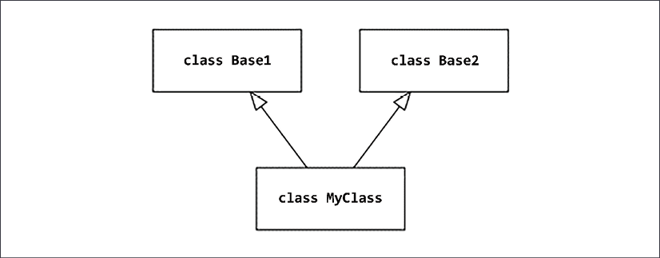
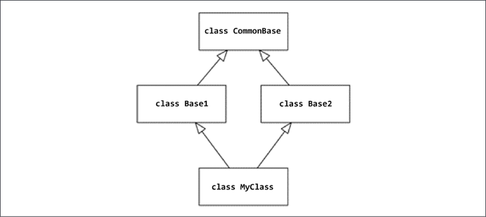

许多程序员在使用 Python 之前都有其他编程语言的经验。 经常发生的是，他们已经熟悉这些语言的编程习惯用法，并尝试在 Python 中复制它们。 由于每种编程语言都是独一无二的，因此引入此类外来习语通常会导致代码过于冗长或欠佳。

没有经验的程序员经常使用的外国习语的经典示例是列表迭代。 熟悉 C 语言中数组的人可以编写类似于以下示例的 Python 代码：

```python
for index in range(len(some_list)):
    print(some_list[index])
```

一个有经验的 Pythonic 程序员很可能会写：

```python
for item in some_list:
    print(item)
```

编程语言通常按范式分类，范式可以理解为支持某些“编程风格”的内聚特性集。 Python 是一种多范式语言，因此，它与大量其他编程语言有许多相似之处。因此，你几乎可以像在 Java、C++ 或任何其他主流编程语言中那样编写和构建 Python 代码。

不幸的是，这通常不如使用公认的 Python 模式有效。了解原生习语可以让你编写更具可读性和效率的代码。

本章面向有其他编程语言经验的程序员。我们将回顾 Python 的一些重要特性以及解决常见问题的惯用方法。我们还将了解这些与其他编程语言的比较，以及对于刚刚开始 Python 之旅的经验丰富的程序员来说，潜藏着哪些常见的陷阱。在此过程中，我们将涵盖以下主题：

- 类模型和面向对象编程
- 动态多态
- 数据类
- 函数式编程
- 枚举

让我们首先考虑技术要求。

## 技术要求

本章的代码文件可以在 https://github.com/PacktPublishing/Expert-Python-Programming-Fourth-Edition/tree/main/Chapter%204 找到。

## 类模型和面向对象编程

Python 最流行的范式是面向对象编程（也称为 OOP）。它以封装数据（以对象属性的形式）和行为（以方法的形式）的对象为中心。 OOP 可能是最多样化的范式之一。它有许多风格、风格和实现，这些都是在多年的编程历史中发展起来的。 Python 从许多其他语言中汲取了灵感，因此在本节中，我们将通过不同语言的棱镜来看看 Python 中 OOP 的实现。

为了促进代码重用、可扩展性和模块化，OOP 语言通常提供用于类组合或继承的方法。 Python 也不例外，像许多其他面向对象的语言一样，支持类型的子类化。

Python 可能没有其他 OOP 语言那么多的面向对象特性，但它具有非常灵活的数据和类模型，允许你以极其优雅的方式实现大多数 OOP 模式。此外，Python 中的一切都是对象，包括函数和类定义以及整数、浮点数、布尔值和字符串等基本值。

如果我们想找到另一种具有类似面向对象语法特征和类似数据模型的流行编程语言，最接近的匹配之一可能是 Kotlin，它是一种（主要）在 Java 虚拟机 (JVM) 上运行的语言.以下是 Kotlin 和 Python 的相似之处：

- 一种调用超类方法的便捷方式：Kotlin 提供了 super 关键字，Python 提供了 super() 函数来显式引用超类的方法或属性。
- 对象自引用的表达式：Kotlin 提供了 this 表达式，它总是引用类的当前对象。在 Python 中，该方法的第一个参数始终是一个实例引用。按照惯例，它被命名为 self。
- 支持创建数据类：与 Python 一样，Kotlin 提供数据类作为经典类定义的“语法糖”，以简化不应传达大量行为的基于类的数据结构的创建。
- 属性的概念：Kotlin 允许你将类属性 setter 和 getter 定义为函数。 Python 提供了类似目的的 property() 装饰器，以及描述符的概念，它允许你完全自定义对象的属性访问。

让 Python 在 OOP 实现方面真正脱颖而出的是继承的方法。与 Kotlin 和许多其他语言不同，Python 自由地允许多重继承（尽管这通常不是一个好主意）。其他语言通常不允许这样做或提供一些限制。 Python 的另一个重要区别是缺少私有/公共关键字来控制对类定义之外的内部对象属性的访问。

让我们仔细看看 Python 与 Kotlin 和其他一些基于 JVM 的编程语言共享的一个特性，即通过 super() 调用访问超类。

### 访问超类

在 OOP 语言中有多种封装对象行为的方法，但最常见的方法之一是使用类。 Python 的 OOP 实现正是基于类和子类化的概念。

子类化是一种通过增强或专门化现有类的行为来重用现有类的便捷方式。子类通常依赖于其基类的行为，但会使用其他方法对其进行扩展，或者通过覆盖其定义为现有方法提供全新的实现。

但是在无法访问子类中原始实现的情况下覆盖方法根本不会促进代码重用。这就是 Python 提供 super() 函数的原因，该函数将代理对象返回给所有基类中的方法实现。为了更好地理解 super() 函数的潜力，让我们假设我们想要对 Python 字典类型进行子类化，以允许通过不区分大小写的键查找来访问存储的键。例如，你可以使用它来存储 HTTP 协议标头值，因为 HTTP 协议规范规定标头名称不区分大小写。

以下是通过子类化在 Python 中实现这种结构的简单示例：

```python
from collections import UserDict
from typing import Any
class CaseInsensitiveDict(UserDict):
    def __setitem__(self, key: str, value: Any):
        return super().__setitem__(key.lower(), value) 
    def __getitem__(self, key: str) -> Any:
        return super().__getitem__(key.lower())
    def __delitem__(self, key: str) -> None:
        return super().__delitem__(key.lower())
```

我们的 CaseInsensitiveDict 实现依赖于 collections.UserDict 而不是内置的 dict 类型。尽管从 dict 类型继承是可能的，但我们很快就会遇到不一致的情况，因为内置的 dict 类型并不总是调用 \_\_setitem\_\_() 来更新其状态。最重要的是，它不会用于对象初始化和 update() 方法调用。对列表类型进行子类化时可能会出现类似的问题。这就是为什么好的做法要求使用 collections.UserDict 类对 dict 类型进行子类化，而 collections.UserList 用于对列表类型进行子类化。

修改后的字典行为的核心发生在 \_\_getitem\_\_(self, item: str) 和 \_\_setitem\_\_(self, key: str, value: Any) 中。这些方法分别负责使用 dictionary[key] 访问字典元素和使用 dictionary[key] = value 语法设置字典值。类型注释帮助我们表示键应该是字符串，而值可以是任何 Python 类型。

\_\_setitem\_\_() 负责存储和修改字典值。子类化基本字典类型而不利用其内部键值存储是没有意义的。这就是为什么我们使用 super().\_\_setitem\_\_() 来调用原始的 set-item 实现。但是在我们允许存储值之前，我们使用 str.lower() 方法将键转换为小写。这样我们确保存储在字典中的所有键总是小写的。

\_\_getitem\_\_() 方法类似于 \_\_setitem\_\_() 实现。我们知道每个键在存储到字典之前都会被转换为小写。因此，当发生键查找时，我们也可以将其转换为小写。如果 \_\_getitem\_\_() 方法的 super 实现没有返回结果，我们可以确定字典中没有不区分大小写的匹配项。

最后但并非最不重要的是， \_\_delitem\_\_() 方法删除现有的字典键。它使用相同的技术将键转换为小写并调用超类实现。多亏了这一点，我们将能够使用 del dictionary[key] 语句删除字典键。

以下成绩单显示了我们正在执行的类的不区分大小写的键查找：

```python
>>> headers = CaseInsensitiveDict({
...     "Content-Length": 30,
...     "Content-Type": "application/json",
... })
>>> headers["CONTENT-LENGTH"]
30
>>> headers["content-type"]
'application/json'
```

super() 函数的上述用例应该很容易理解和理解，但是当涉及到多重继承时，事情会变得有点复杂。 Python 允许你通过引入方法解析顺序 (MRO) 来使用多重继承。 我们将在下一节中仔细研究它。

### 多重继承和方法解析顺序

Python MRO 基于 C3 线性化，这是最初为 Dylan 编程语言创建的确定性 MRO 算法。 C3 算法构建类的线性化，也称为优先级，它是祖先的有序列表。此列表用于在类继承树中查找属性。

> 你可以在 http://opendylan.org 上找到有关 Dylan 编程语言的更多信息，维基百科上有一篇关于 C3 线性化的精彩文章，可以在 https://en.wikipedia.org/wiki/C3_linearization 上找到。

Python 从一开始就没有将 C3 线性化算法作为其 MRO。它是在 Python 2.3 中与所有对象的通用基类型（即对象类型）一起引入的。在更改为 C3 线性化方法之前，如果一个类有两个祖先（请参阅图 4.1），那么解析方法的顺序只是易于计算和跟踪的简单情况，在一个类中没有使用多重继承模型级联方式。

以下是不需要任何特殊 MRO 的简单多重继承模式的示例：

```python
class Base1: 
    pass


class Base2:
    def method(self):
        print("Base2.method() called")


class MyClass(Base1, Base2): 
    pass
```

在 Python 2.3 之前，这将是对类层次结构树的简单深度优先搜索。 换句话说，当 MyClass().method() 被调用时，解释器在 MyClass 中寻找方法，然后是 Base1，最后在 Base2 中找到。



当我们在类层次结构的顶部引入一个 CommonBase 类时（参见图 4.2），事情会变得更加复杂：

```python
class CommonBase:
    pass


class Base1(CommonBase): 
    pass 
     
 
class Base2(CommonBase):
    def method(self):
        print("Base2.method() called")


class MyClass(Base1, Base2): 
    pass
```

结果，根据从左到右的深度优先规则的简单分辨率顺序在查看 Base2 类之前通过 Base1 类回到顶部。 该算法会产生违反直觉的输出。 如果没有 C3 线性化，执行的方法将不会是继承树中最接近的方法。



这种继承场景（称为菱形类层次结构）对于定制类来说是相当罕见的。标准库通常不会以这种方式构建继承层次结构，许多开发人员认为这是不好的做法。无论如何，Python 是可能的，因此需要一个定义明确且清晰的处理策略。

此外，从 Python 2.3 开始， object 位于类的类型层次结构的顶部。本质上，每个类都是大型菱形类继承层次结构的一部分。它也成为必须在语言的 C 端解决的问题。这就是 Python 现在将 C3 线性化作为 MRO 算法的原因。

> 在 Python 2 中，从对象类型继承的类被称为新式类。类没有从对象隐式继承。在 Python 3 中，每个类都是新式类，旧式类不可用。

Michele Simionato 编写的 Python MRO 的原始参考文档使用以下词语描述了线性化：

> C 的线性化是 C 的总和加上父项的线性化和父项列表的合并。

> 可以在 http://www.python.org/download/releases/2.3/mro 找到详细解释 Python 的 MRO 的 Michele Simionato 参考文档。

以上仅表示C3是递归算法。应用于我们之前的继承示例的 C3 符号表示法如下：

```
L[MyClass(Base1, Base2)] = 
        [MyClass] + merge(L[Base1], L[Base2], [Base1, Base2])
```

这里，L[MyClass] 是 MyClass 的线性化，merge 是一个特定的算法，它合并了几个线性化结果。

合并算法负责删除重复项并保留正确的顺序。它使用列表头尾的概念。头部是列表的第一个元素，尾部是头部后面的列表的其余部分。 Simionato 描述了这样的合并算法（适应我们的例子）：

> 取第一个链表的头部，即L[Base1][0]；如果这个头部不在任何其他列表的尾部，则将其添加到 MyClass 的线性化中并从合并中的列表中移除，否则查看下一个列表的头部并取下它，如果它是一个好头。
> 然后，重复该操作，直到所有的类都被移除或者不可能找到好头为止。在这种情况下，无法构建合并； Python 2.3 将拒绝创建 MyClass 类并将引发异常。

换句话说，C3 对每个父级进行递归深度查找以获得一系列列表。然后，当一个类涉及多个列表时，它计算一个从左到右的规则来合并所有列表并消除歧义。

如果我们必须通过一系列符号步骤手动计算 MyClass 的 MRO，我们首先必须展开所有 L[class] 线性化：

```python
L[MyClass]
  = [MyClass] + merge(L[Base1], L[Base2], [Base1, Base2])]
  = [MyClass] + merge(
      [Base1 + merge(L[CommonBase], [CommonBase])],
      [Base2 + merge(L[CommonBase], [CommonBase])],
      [Base1, Base2]
    )
  = [MyClass] + merge(
      [Base1] + merge(L[CommonBase], [CommonBase]),
      [Base2] + merge(L[CommonBase], [CommonBase]),
      [Base1, Base2]
    )
  = [MyClass] + merge(
      [Base1] + merge([CommonBase] + merge(L[object]), [CommonBase]),
      [Base2] + merge([CommonBase] + merge(L[object]), [CommonBase]),
      [Base1, Base2]
    )
```

本质上，对象类没有祖先，所以它的 C3 线性化只是一个单元素列表 [object]。 这意味着我们继续展开merge([object])到[object]：

```
= [MyClass] + merge(
    [Base1] + merge([CommonBase] + merge([object]), [CommonBase]),
    [Base2] + merge([CommonBase] + merge([object]), [CommonBase]),
    [Base1, Base2]
  )
```

merge([object]) 只有一个元素列表，所以它立即展开到 [object]：

```
= [MyClass] + merge(
    [Base1] + merge([CommonBase, object], [CommonBase]),
    [Base2] + merge([CommonBase, object], [CommonBase]),
    [Base1, Base2]
  )
```

现在是展开merge([CommonBase, object], [CommonBase]) 的时候了。 第一个列表的头部是 CommonBase。 它不在其他列表的尾部。 我们可以立即将其从合并中移除，并将其添加到外部线性化结果中：

```
= [MyClass] + merge(
    [Base1, CommonBase] + merge([object]),
    [Base2, CommonBase] + merge([object]),
    [Base1, Base2]
  )
```

我们再次留下 merge([object]) ，我们可以继续展开：

```
= [MyClass] + merge(
    [Base1, CommonBase, object],
    [Base2, CommonBase, object],
    [Base1, Base2]
  )
```

现在我们剩下最后一次合并，这最终是重要的。 第一个头是Base1。 在其他列表的尾部找不到它。 我们可以将其从合并中移除，并将其添加到外部线性化结果中：

```
= [MyClass, Base1] + merge(
    [CommonBase, object],
    [Base2, CommonBase, object],
    [Base2]
  )
```

现在第一个头是 CommonBase。 它位于第二个列表 [Base2, CommonBase, object] 的尾部。 这意味着我们目前无法处理它，必须移动到下一个头，即 Base2。 在其他列表的尾部找不到它。 我们可以将其从合并中移除，并将其添加到外部线性化结果中：

```
= [MyClass, Base1, Base2] + merge(
    [CommonBase, object],
    [CommonBase, object],
    []
  )
```

现在，CommonBase 再次成为第一个头部，但这次不再在其他列表尾部中找到它。 我们可以将其从合并中移除，并将其添加到外部线性化结果中：

```
= [MyClass, Base1, Base2, CommonBase] + merge(
    [object],
    [object],
    []
  )
```

最后的 merge([object], [object], []) 步骤很简单。 最终的线性化结果如下：

```[MyClass, Base1, Base2, CommonBase, object]```

你可以通过验证任何类的 __mro__ 属性轻松检查 C3 线性化的结果。 以下成绩单显示了 MyClass 的计算 MRO：

```python
>>> MyClass.__mro__
(<class '__main__.MyClass'>, <class '__main__.Base1'>, <class '__main__.Base2'>, <class '__main__.CommonBase'>, <class 'object'>)
```

类的 __mro__ 属性（只读）存储 C3 线性化计算的结果。加载类定义时完成计算。你还可以调用 MyClass.mro() 来计算并获取结果。

### 类实例初始化

OOP 中的对象是将数据和行为封装在一起的实体。在 Python 中，数据被包含为对象属性，它们只是对象变量。另一方面，行为由方法表示。这对于几乎所有 OOP 语言都是通用的，但确切的命名有时会有所不同。例如，在 C++ 和 Java 中，对象数据被称为存储在字段中。在 Kotlin 中，对象数据存储在属性之后（尽管它们不仅仅是简单的对象变量）。

Python 与静态类型 OOP 语言的不同之处在于它的对象属性声明和初始化方法。简而言之，Python 类不需要你在类主体中定义属性。变量在初始化时就存在。这就是为什么声明对象属性的规范方法是在 \_\_init\_\_() 方法中的对象初始化期间分配它们的值：

```python
class Point:
   def __init__(self, x, y):
      self.x = x
      self.y = y
```

对于那些对静态类型编程语言有先验知识的人来说，这可能会让人感到困惑。 在这些语言中，对象字段的声明通常是静态的，并且存在于对象初始化函数之外。 这就是为什么具有 C++ 或 Java 背景的程序员通常倾向于通过在主类主体中分配一些默认值作为类属性来复制这种模式：

```python
class Point:
   x = 0
   y = 0
   def __init__(self, x, y):
      self.x = x
      self.y = y
```

上面的代码是一个用Python复制的外语习语的经典例子。最重要的是，它是多余的：类属性值在初始化时总是会被对象属性遮蔽。但这也是一种危险的代码异味：如果决定将可变类型（如 list 或 dict）分配为类属性，则可能会导致有问题的错误。

代码异味是代码的一种特征，可能是更深层次问题的迹象。一段特定的代码在功能上可能是正确的并且没有错误，但可能是未来问题的存根。代码异味通常是小的架构缺陷或吸引错误的不安全构造。

问题来自于类属性（在方法主体之外分配的属性）被分配给类型对象而不是类型实例的事实。当使用 self.attribute 访问属性时，Python 将首先在类实例命名空间中查找 name 属性值。如果该查找失败，它将在类类型命名空间中执行查找。在类方法中通过 self.attribute 赋值时，行为完全不同：新值总是在类实例命名空间中赋值。这对于可变类型尤其麻烦，因为这可能会导致类实例之间的对象状态意外泄漏。

因为使用可变类型作为类属性而不是实例属性是一种不好的做法，所以很难想出实用的代码示例。但这并不意味着我们不能快速了解它的实际工作原理。考虑以下类，它应该将值聚合为列表并跟踪最后一个聚合值：

```python
class Aggregator:
    all_aggregated = []
    last_aggregated = None
    def aggregate(self, value):
        self.last_aggregated = value
        self.all_aggregated.append(value)
```

要查看问题出在哪里，让我们开始一个交互式会话，创建两个不同的聚合器，然后开始聚合元素：

```python
>>> a1 = Aggregator()
>>> a2 = Aggregator()
>>> a1.aggregate("a1-1")
>>> a1.aggregate("a1-2")
>>> a2.aggregate("a2-1")
```

如果我们现在查看两个实例的聚合列表，我们会看到非常令人不安的输出：

```python
>> a1.all_aggregated
['a1-1', 'a1-2', 'a2-1']
>>> a2.all_aggregated
['a1-1', 'a1-2', 'a2-1']
```

阅读代码的人可能会认为所有聚合器实例都应该跟踪它们自己聚合的历史记录。但是我们看到，相反，所有 Aggregator 实例共享 all_aggregated 属性的状态。另一方面，当查看最后的聚合值时，我们会看到两个聚合器的正确值：

```python
>>> a1.last_aggregated
'a1-2'
>>> a2.last_aggregated
'a2-1'
```

在这种情况下，通过检查未绑定的类属性值很容易解开谜团：

```python
>>> Aggregator.all_aggregated
['a1-1', 'a1-2', 'a2-1']
>>> Aggregator.last_aggregated
>>>
```

正如我们从上面的记录中看到的，所有的 Aggregator 实例都通过可变的 Aggregator.all_aggregated 属性共享它们的状态。像这样的事情可能是预期的行为，但通常只是有时难以追踪的错误示例。由于这个事实，对于每个类实例应该是唯一的所有属性值绝对应该只在 \_\_init\_\_() 方法中初始化。

Aggregator 类的固定版本如下：

```python
class Aggregator:
    def __init__(self):
        self.all_aggregated = []
        self.last_aggregated = None
    def aggregate(self, value):
        self.last_aggregated = value
        self.all_aggregated.append(value)
```

我们只是将 all_aggregated 和 last_aggregated 属性的初始化移动到 \_\_init\_\_() 方法。 现在让我们重复上一个会话中相同的初始化和聚合调用：

```python
>>> a1 = Aggregator()
>>> a2 = Aggregator()
>>> a1.aggregate("a1-1")
>>> a1.aggregate("a1-2")
>>> a2.aggregate("a2-1")
```

如果我们现在检查 Aggregator 实例的状态，我们将看到它们独立跟踪其聚合的历史记录：

```python
>>> a1.all_aggregated
['a1-1', 'a1-2']
>>> a2.all_aggregated
['a2-1']
```

如果你真的很想在类定义的顶部对所有属性进行某种声明，则可以使用类型注释，如下例所示：

```python
from typing import Any, List
class Aggregator:
    all_aggregated: List[Any]
    last_aggregated: Any
    def __init__(self):
        self.all_aggregated = []
        self.last_aggregated = None
    def aggregate(self, value: Any):
        self.last_aggregated = value
        self.all_aggregated.append(value)
```

拥有类属性注释实际上并不是一个坏习惯。 静态类型验证器或 IDE 可以使用它们来提高代码质量并更好地传达类的预期用途和可能的类型约束。 这样的类属性注释也用于简化数据类的初始化，我们将在数据类部分讨论。

### 属性访问模式

将 Python 与其他静态类型的面向对象语言区分开来的另一件事是缺乏公共、私有和受保护类成员的概念。 在其他语言中，这些通常用于限制或开放对类外代码的对象属性的访问。 最接近这个概念的 Python 特性是名称修改。 每当一个属性在类体中以 __（两个下划线）为前缀时，它就会被解释器动态重命名：

```python
class MyClass: 
    def __init__(self):
        self.__secret_value = 1
```

请注意，双下划线模式被称为“dunder”。 有关更多信息，请参阅 Dunder 方法（语言协议）部分。

在类外通过其初始名称访问 __secret_value 属性将引发 AttributeError 异常：

```python
>>> instance_of = MyClass()
>>> instance_of.__secret_value
Traceback (most recent call last):
  File "<stdin>", line 1, in <module>
AttributeError: 'MyClass' object has no attribute '__secret_value'
>>> instance_of._MyClass__secret_value
1
```

人们可能认为这是其他 OOP 语言中常见的私有/受保护字段和方法的同义词。它确实使在类之外访问此类属性变得更加困难，但并没有使此类访问变得不可能。许多其他 OOP 语言中的私有和受保护字段和方法是提供类封装的一种手段。它们用于限制特定类（私有）之外的任何人或继承树（受保护）之外的任何人对特定符号的访问。在 Python 中，名称修改不会以任何方式限制属性访问。它只会让它变得不那么方便。

名称修改的目的是一种避免命名冲突的隐式方法。例如，可能会发生特定标识符非常适合某些子类中的新内部属性的情况。如果该名称已在继承树中的某处使用，则名称冲突可能会导致意外行为。

在这种情况下，程序员可能决定使用不同的名称或使用名称修改来解决冲突。名称修改还有助于避免子类中的名称冲突。尽管如此，默认情况下不建议在基类中使用名称修改，只是为了提前避免任何冲突。

这一切都归结为 Python 的做事方式。带有私有/受保护关键字的静态类型语言强制执行属性访问限制。这意味着通常无法在类之外访问此类私有/受保护的属性。在 Python 中，更常见的是清楚地传达每个属性的预期用途，而不是限制用户为所欲为。不管有没有名称修改，程序员都会找到一种方法来访问属性。那么，让这对他们来说不那么方便的目的是什么？

当属性不公开时，使用的约定是 _ 前缀。这不涉及任何名称修改算法，但通常只是将属性记录为类的内部元素，不打算在类上下文之外使用。许多 IDE 和样式检查器已经意识到这个约定，并且能够突出显示在它们的类之外访问此类内部成员的位置。

Python 还有其他机制将类的公共部分与其私有代码分开。两个这样的机制是描述符和属性。

### 描述符

描述符使你可以自定义在引用对象的属性时应执行的操作。描述符是 Python 中复杂属性访问的基础。它们在内部用于实现属性、方法、类方法、静态方法和超级。它们是定义如何访问另一个类的属性的对象。换句话说，一个类可以将一个属性的管理委托给另一个类。

描述符类基于构成描述符协议的三个特殊方法：

- \_\_set\_\_(self, obj, value)：每当设置属性时都会调用它。在以下示例中，我们将其称为 setter。
- \_\_get\_\_(self, obj, owner=None)：每当读取属性时都会调用它（称为getter）。
    \_\_delete\_\_(self, obj)：在属性上调用 del 时调用此方法。

实现 \_\_get\_\_() 和 \_\_set\_\_() 的描述符称为数据描述符。如果它只是实现了 \_\_get\_\_()，那么它被称为非数据描述符。

实际上，描述符协议的方法在每次属性查找时都由对象的特殊 \_\_getattribute\_\_() 方法调用（不要将它与具有不同目的的 \_\_getattr\_\_() 混淆）。每当执行这样的查找时，通过使用 instance.attribute 形式的点表示法或使用 getattr(instance, 'attribute') 函数调用， \_\_getattribute\_\_() 方法被隐式调用，它在以下顺序：

1. 它验证属性是否是实例的类对象上的数据描述符
2. 如果没有，则查看是否可以在实例对象的 \_\_dict\_\_ 查找中找到该属性
3. 最后，在实例的类对象上查看属性是否为非数据描述符

换句话说，数据描述符优先于 \_\_dict\_\_ 查找，而 \_\_dict\_\_ 查找优先于非数据描述符。

为了更清楚，这里有一个来自官方 Python 文档的修改示例，它展示了描述符如何在真实代码上工作：

```python
class RevealAccess(object): 
    """A data descriptor that sets and returns values 
       normally and prints a message logging their access. 
    """ 
 
    def __init__(self, initval=None, name='var'): 
        self.val = initval 
        self.name = name 
 
    def __get__(self, obj, objtype): 
        print('Retrieving', self.name) 
        return self.val 
 
    def __set__(self, obj, val): 
        print('Updating', self.name) 
        self.val = val 
 
    def __delete__(self, obj): 
        print('Deleting', self.name) 
 
class MyClass(object): 
    x = RevealAccess(10, 'var "x"') 
    y = 5
```

> 可以在 https://docs.python.org/3.9/howto/descriptor.html 找到有关使用描述符的官方指南以及许多示例。

请注意， x = RevealAccess() 被定义为类属性，而不是在 __init__() 方法中分配它。 描述符为了工作，需要定义为类属性。 此外，它们比普通变量属性更接近方法。 以下是在交互式会话中使用 RevealAccess 描述符的示例：

```python
>>> m = MyClass()
>>> m.x
Retrieving var "x"
10
>>> m.x = 20
Updating var "x"
>>> m.x
Retrieving var "x"
20
>>> m.y
5
>>> del m.x
Deleting var "x"
```

前面的例子清楚地表明，如果一个类具有给定属性的数据描述符，那么每次检索实例属性时都会调用描述符的 \_\_get\_\_() 方法返回值，并且每当有值时调用 \_\_set\_\_()分配给这样的属性。每当使用 del instance.attribute 语句或 delattr(instance, 'attribute') 调用删除实例属性时，就会调用描述符的 \_\_del\_\_ 方法。

由于本节开头强调的原因，数据和非数据描述符之间的区别很重要。 Python 已经使用描述符协议将类函数作为方法绑定到实例。

描述符还支持 classmethod 和 staticmethod 装饰器背后的机制。这是因为，事实上，函数对象也是非数据描述符：

```python
>>> def function(): pass
>>> hasattr(function, '__get__')
True
>>> hasattr(function, '__set__')
False
```

对于使用 lambda 表达式创建的函数也是如此：

```python
>>> hasattr(lambda: None, '__get__')
True
>>> hasattr(lambda: None, '__set__')
False
```

因此，如果 \_\_dict\_\_ 优先于非数据描述符，我们将无法在运行时动态覆盖已构造实例上的特定方法。幸运的是，由于描述符在 Python 中的工作方式，这是可能的；因此，开发人员可以使用一种称为猴子补丁的流行技术来改变实例的工作方式，而无需子类化。

> Monkey patching 是一种在运行时通过添加、修改或删除属性动态修改类实例的技术，而无需触及类定义或源代码。

#### 现实生活中的例子——懒惰评估的属性

描述符的一个示例用法可能是将类属性的初始化延迟到从实例访问它的那一刻。如果此类属性的初始化取决于在导入类时尚不可用的某些上下文，则这可能很有用。另一种情况是节省资源，当这种初始化在计算资源方面非常昂贵，但不知道在导入类时是否会使用该属性。这样的描述符可以如下实现：

```python
class InitOnAccess: 
    def __init__(self, init_func, *args, **kwargs): 
        self.klass = init_func 
        self.args = args 
        self.kwargs = kwargs 
        self._initialized = None 
 
    def __get__(self, instance, owner): 
        if self._initialized is None: 
            print('initialized!') 
            self._initialized = self.klass(*self.args, **self.kwargs) 
        else: 
            print('cached!') 
        return self._initialized
```

InitOnAccess 描述符类包括一些 print() 调用，它们允许我们查看值是在访问时初始化还是从缓存中访问。

假设我们想要一个类，其中所有实例都可以访问已排序随机值的共享列表。列表的长度可以任意长，因此对所有实例重用它是有意义的。另一方面，对很长的输入进行排序可能很耗时。这就是 InitOnAccess 类将确保此类列表仅在第一次访问时初始化的原因。我们的类定义可能如下：

```python
import random
class WithSortedRandoms:
    lazily_initialized = InitOnAccess(
        sorted,
        [random.random() for _ in range(5)]
    )
```

请注意，我们对 range() 函数使用了相当小的输入，以使输出可读。以下是 WithSortedRandoms 类在交互式会话中的示例用法：

```python
>>> m = WithSortedRandoms()
>>> m.lazily_initialized
initialized!
[0.2592159616928279, 0.32590583255950756, 0.4015520901807743, 0.4148447834912816, 0.4187058605495758, 0.4534290894962043, 0.4796775578337028, 0.6963642650184283, 0.8449725511007807, 0.8808174325885045] 
>>> m.lazily_initialized
cached!
[0.2592159616928279, 0.32590583255950756, 0.4015520901807743, 0.4148447834912816, 0.4187058605495758, 0.4534290894962043, 0.4796775578337028, 0.6963642650184283, 0.8449725511007807, 0.8808174325885045]
```

PyPI 上以 PyOpenGL 名称提供的官方 OpenGL Python 库使用类似的技术来实现既是装饰器又是数据描述符的 lazy_property 对象：

```python
class lazy_property(object): 
    def __init__(self, function): 
        self.fget = function 
 
    def __get__(self, obj, cls): 
        value = self.fget(obj) 
        setattr(obj, self.fget.__name__, value) 
        return value
```


setattr() 函数允许你使用提供的位置参数中的属性来设置对象实例的属性。在这里，它是 self.fget.__name__。它是这样构造的，因为 lazy_property 描述符应该用作方法的装饰器，充当初始化值的提供者，如下例所示：

```python
class lazy_property(object):
    def __init__(self, function):
        self.fget = function
    def __get__(self, obj, cls):
        value = self.fget(obj)
        setattr(obj, self.fget.__name__, value)
        return value
class WithSortedRandoms:
    @lazy_property
    def lazily_initialized(self):
        return sorted([[random.random() for _ in range(5)]])
```

这种实现类似于使用下一节中描述的属性装饰器。用它包装的函数只执行一次，然后实例属性被替换为该函数属性返回的值。此实例属性优先于描述符（类属性），因此不会在给定的类实例上执行更多初始化。当需要同时满足以下两个要求时，此技术通常很有用：

- 一个对象实例需要存储为一个类属性，在它的实例之间共享（以节省资源）
- 此对象在导入时无法初始化，因为其创建过程取决于某些全局应用程序状态/上下文

在使用 OpenGL 编写的应用程序的情况下，你会经常遇到这种情况。例如，在 OpenGL 中创建着色器的成本很高，因为它需要编译用 OpenGL 着色语言 (GLSL) 编写的代码。只创建一次它们是合理的，同时，将它们的定义包含在需要它们的类的附近。另一方面，着色器编译不能在没有 OpenGL 上下文初始化的情况下执行，因此在导入时很难在全局模块命名空间中可靠地定义和编译它们。

下面的例子展示了在一些虚构的基于 OpenGL 的应用程序中可能使用 PyOpenGL 的 lazy_property 装饰器（这里是 lazy_class_attribute）的修改版本。为了允许在不同的类实例之间共享属性，需要对原始 lazy_property 装饰器进行突出显示的更改：

```python
import OpenGL.GL as gl 
from OpenGL.GL import shaders 
 
 
class lazy_class_attribute(object): 
    def __init__(self, function): 
        self.fget = function 
 
    def __get__(self, obj, cls):
        value = self.fget(cls)
        # note: storing in class object not its instance
        #       no matter if its a class-level or
        #       instance-level access
        setattr(cls, self.fget.__name__, value)
        return value 
  
class ObjectUsingShaderProgram(object): 
    # trivial pass-through vertex shader implementation 
    VERTEX_CODE = """ 
        #version 330 core 
        layout(location = 0) in vec4 vertexPosition; 
        void main(){ 
            gl_Position =  vertexPosition; 
        } 
    """ 
    # trivial fragment shader that results in everything 
    # drawn with white color 
    FRAGMENT_CODE = """ 
        #version 330 core 
        out lowp vec4 out_color; 
        void main(){ 
            out_color = vec4(1, 1, 1, 1); 
        } 
    """ 
 
    @lazy_class_attribute 
    def shader_program(self): 
        print("compiling!") 
        return shaders.compileProgram( 
            shaders.compileShader( 
                self.VERTEX_CODE, gl.GL_VERTEX_SHADER 
            ), 
            shaders.compileShader( 
                self.FRAGMENT_CODE, gl.GL_FRAGMENT_SHADER 
            ) 
        )
```

像每一个高级 Python 语法特性一样，这个特性也应该谨慎使用，并在代码中得到很好的记录。描述符影响类行为的基本部分。对于没有经验的开发人员来说，改变后的类行为可能非常令人困惑和出乎意料。因此，确保你的所有团队成员都熟悉描述符并很好地理解这个概念（如果它在你的项目代码库中扮演重要角色）非常重要。

### 特性

任何用 C++ 或 Java 编程一段时间的人都应该熟悉术语封装。它是一种保护对类字段的直接访问的方法，假设类所拥有的所有内部数据都应被视为私有。在完全封装的类中，应将尽可能少的方法公开为公共。对对象状态的任何写或读访问都应该通过能够保护正确使用的 setter 和 getter 方法公开。例如，在 Java 中，此模式如下所示：

```python
public class UserAccount {
  private String username;
  public String getUsername() {
    return username;
  }
  public void setUsername(String newUsername) {
    this.username = newUsername;
  }
}
```

getUsername() 方法是一个用户名 getter，而 setUsername() 方法是一个用户名 setter。前提相当好。通过在 getter 和 setter（也称为访问器和修改器）后面隐藏对类成员的访问，你可以保护对内部类值的正确访问（假设对 setter 执行验证）。你还在类公共 API 中创建了一个扩展点，只要有这样的需要，就可以潜在地通过其他行为来丰富它，而不会破坏类 API 的向后兼容性。

假设你有一个用于用户帐户的类，其中存储用户的密码。如果你想在访问密码时发出审计日志，你可以确保代码中访问用户密码的每个地方都有适当的审计日志调用，或者通过一组 setter 和 getter 方法代理对密码条目的所有访问默认情况下添加日志记录调用。

问题是你永远无法确定将来需要额外扩展什么。这个简单的事实通常会导致过度封装和无休止的 setter 和 getter 方法，用于每个可能的字段，否则它们可能是公开的。它们写起来很乏味，而且往往几乎没有任何好处，只会降低信噪比。

幸运的是，Python 通过属性机制对访问器和修改器模式采用了完全不同的方法。属性允许你自由地公开类的公共成员，并在需要时简单地将它们转换为 getter 和 setter 方法。你可以完全做到这一点，而不会破坏类 API 的向后兼容性。考虑不使用属性功能的封装 UserAccount 类的示例：

```python
class UserAccount:
    def __init__(self, username, password):
        self._username = username
        self._password = password
    def get_username(self):
        return self._username
    def set_username(self, username):
        self._username = username
    def get_password(self):
        return self._password
    def set_username(self, password):
        self._password = password
```

每当你看到类似上面的代码（可以通过大量的 get_ 和 set_ 方法识别）时，你几乎可以 100% 确定你正在处理外语习语。这是 C++ 或 Java 程序员可以编写的东西。经验丰富的 Python 程序员宁愿编写以下内容：

```python
class UserAccount:
    def __init__(self, username, password):
        self.username = username
        self.password = password
```

只有当确实需要在属性后面隐藏特定字段时，经验丰富的程序员才会提供以下修改：

```python
class UserAccount:
    def __init__(self, username, password):
        self.username = username
        self._password = password
    
    @property
    def password(self):
        return self._password
    @password.setter
    def password(self, value):
        self._password = value
```

属性提供了一个内置的描述符类型，它知道如何将属性链接到一组方法。 property() 函数接受四个可选参数：fget、fset、fdel 和 doc。可以提供最后一个函数来定义一个链接到属性的文档字符串函数，就好像它是一个方法一样。这是一个 Rectangle 类的示例，可以通过直接访问存储两个角点的属性或使用 width 和 height 属性来控制它：

```python
class Rectangle: 
    def __init__(self, x1, y1, x2, y2): 
        self.x1, self.y1 = x1, y1 
        self.x2, self.y2 = x2, y2 
 
    def _width_get(self): 
        return self.x2 - self.x1 
 
    def _width_set(self, value): 
        self.x2 = self.x1 + value 
 
    def _height_get(self): 
        return self.y2 - self.y1 
 
    def _height_set(self, value): 
        self.y2 = self.y1 + value 
 
    width = property( 
        _width_get, _width_set, 
        doc="rectangle width measured from left" 
    ) 
    height = property( 
        _height_get, _height_set, 
        doc="rectangle height measured from top" 
    ) 
 
    def __repr__(self): 
        return "{}({}, {}, {}, {})".format( 
            self.__class__.__name__, 
            self.x1, self.y1, self.x2, self.y2 
        )
```

以下是交互式会话中此类已定义属性的示例：

```python
>>> rectangle = Rectangle(10, 10, 25, 34)
>>> rectangle.width, rectangle.height
(15, 24)
>>> rectangle.width = 100
>>> rectangle
Rectangle(10, 10, 110, 34)
>>> rectangle.height = 100
>>> rectangle
Rectangle(10, 10, 110, 110)
>>> help(Rectangle)
Help on class Rectangle
    
class Rectangle(builtins.object)
 |  Methods defined here:
 |  
 |  __init__(self, x1, y1, x2, y2)
 |      Initialize self.  See help(type(self)) for accurate signature.
 |  
 |  __repr__(self)
 |      Return repr(self).
 |  
 |  --------------------------------------------------------
 |  Data descriptors defined here:
 |  (...)
 |  
 |  height
 |      rectangle height measured from top
 |  
 |  width
 |      rectangle width measured from left
```

这些属性使编写描述符更容易，但在对类使用继承时必须小心处理。创建的属性是使用当前类的方法动态创建的，不会使用派生类中覆盖的方法。

例如，以下示例将无法覆盖父类的 width 属性的 fget 方法的实现：

```python
>>> class MetricRectangle(Rectangle):
...     def _width_get(self):
...         return "{} meters".format(self.x2 - self.x1)
...         
>>> Rectangle(0, 0, 100, 100).width
100
```

为了解决这个问题，只需在派生类中覆盖整个属性：

```python
>>> class MetricRectangle(Rectangle):
...     def _width_get(self):
...         return "{} meters".format(self.x2 - self.x1)
...     width = property(_width_get, Rectangle.width.fset)
...     
>>> MetricRectangle(0, 0, 100, 100).width
'100 meters'
```

不幸的是，前面的代码有一些可维护性问题。如果开发人员决定更改父类但忘记更新属性调用，则可能会造成混淆。这就是为什么不建议仅覆盖部分属性行为的原因。如果你需要更改它们的工作方式，建议你重写派生类中的所有属性方法，而不是依赖父类的实现。在大多数情况下，这是唯一的选择，因为通常，对属性 setter 行为的更改也意味着对 getter 行为的更改。

因此，创建属性的最佳语法是将属性用作装饰器。这将减少类中方法签名的数量并使代码更具可读性和可维护性：

```python
class Rectangle:
    def __init__(self, x1, y1, x2, y2):
        self.x1, self.y1 = x1, y1
        self.x2, self.y2 = x2, y2
    @property
    def width(self):
        """rectangle width measured from left"""
        return self.x2 - self.x1
    @width.setter
    def width(self, value):
        self.x2 = self.x1 + value
    @property
    def height(self):
        """rectangle height measured from top"""
        return self.y2 - self.y1
    @height.setter
    def height(self, value):
        self.y2 = self.y1 + value
```

Python 属性机制的最大优点是它可以逐渐引入到一个类中。你可以从公开类实例的公共属性开始，并仅在需要时将它们转换为属性。代码的其他部分不会注意到类 API 中的任何更改，因为访问属性就像访问普通实例属性一样。

到目前为止，我们已经讨论了 Python 的面向对象数据模型与不同编程语言的比较。但数据模型只是 OOP 格局的一部分。每种面向对象语言的另一个重要因素是多态方法。 Python 提供了一些多态的实现，这将是下一节的主题。

## 动态多态

多态是 OOP 语言中常见的一种机制。多态从对象的类型中抽象出对象的接口。不同的编程语言通过不同的方式实现多态。对于静态类型语言，通常通过以下方式实现：

- 子类型：类型 A 的子类型可以用于每个需要类型 A 的接口。接口是明确定义的，子类型/子类继承其父类的接口。这是在 C++ 中发现的一种多态机制。
- 隐式接口：每个类型都可以在需要类型 A 的接口的接口中使用，只要它实现与类型 A 相同的方法（具有相同的接口）。接口的声明仍然是显式定义的，但子类/子类型不不必显式继承定义此类接口的基类/类型。这是 Go 中发现的一种多态机制。

Python 是一种动态类型语言，因此使用了一种相当松散的多态机制，通常称为鸭子类型。鸭子类型的原则是这样说的：

> 如果它走路像鸭子，叫起来像鸭子，那它一定是鸭子。

该原则在 Python 中的应用意味着任何对象都可以在给定的上下文中使用，只要该对象按上下文期望的方式工作和行为即可。这种类型哲学非常接近 Go 中已知的隐式接口，尽管它不需要对函数参数的预期接口进行任何声明。因为 Python 不强制执行函数参数的类型或接口，所以向函数提供什么类型的对象并不重要。重要的是函数体内实际使用了这些对象的哪些方法。

为了更好地理解这个概念，请考虑下面的函数示例，该函数应该读取文件、打印其内容，然后关闭文件：

```python
def printfile(file):
    try:
        contents = file.read()
        print(file)
    finally:
        file.close()
```

从 printfile() 函数的签名，我们已经可以猜到它需要一个文件或一个类似文件的对象（比如来自 io 模块的 StringIO）。但事实是，如果我们能够确保输入参数：

- 文件参数有一个 read() 方法
- file.read() 的结果是 print() 函数的有效参数
- 文件参数具有 close() 方法

以上三点也说明了上面例子中发生多态的三个地方。根据文件参数的实际类型，printfile() 函数将使用 read() 和 close() 方法的不同实现。内容变量的类型也可以根据 file.read() 实现而不同，在这种情况下，print() 函数将使用对象字符串表示的不同实现。

这种多态性和类型化的方法非常强大和灵活，尽管它有一些缺点。由于缺乏类型和接口强制执行，在执行之前更难验证代码的正确性。这就是为什么高质量的应用程序必须依赖广泛的代码测试，并严格覆盖代码执行可以采取的每条路径。 Python 允许你通过类型提示注释部分解决这个问题，这些注释可以在运行前使用其他工具进行验证。

Python 的动态类型系统与鸭子类型原则一起创建了一种隐式且无所不在的动态多态形式，这使得 Python 与 JavaScript 非常相似，后者也缺乏静态类型强制。但是还有其他形式的多态性可供 Python 开发人员使用，它们本质上更“经典”和明确。其中一种形式是运算符重载。

### 运算符重载

运算符重载是一种特定类型的多态性，它允许语言根据操作数的类型具有特定运算符的不同实现。

许多编程语言中的运算符已经是多态的。考虑以下在 Python 中是有效构造的表达式：

```python
7 * 6
3.14 * 2
["a", "b"] * 3
"abba" * 2
```

Python 中的这些表达式有四种不同的实现：

7 * 6 是整数乘法，结果为 42
3.14 * 2 是浮点乘法导致浮点值为 6.28
["a", "b"] * 3 是列表乘法，结果列表值为 ['a', 'b', 'a', 'b', 'a', 'b']
"abba" * 2 是字符串乘法产生的字符串值 'abbaabba'
根据操作数的类型，所有 Python 运算符的语义和实现已经不同。 Python 提供了多种内置类型及其运算符的各种实现，但这并不意味着每个运算符都可以用于任何类型。

例如，+ 运算符用于操作数的求和或连接。连接数字类型（如整数或浮点数）以及连接字符串和列表是有意义的。但是这个运算符不能与集合或字典一起使用，因为这样的操作没有数学意义（集合可以相交或连接）并且预期的结果是不明确的（两个字典的哪个值应该在以下情况下使用）冲突？）。

运算符重载只是对已经包含在编程语言中的运算符的内置多态性的扩展。许多编程语言（包括 Python）允许你为没有有效运算符实现或通过子类化隐藏现有实现的操作数类型定义新实现。

#### Dunder 方法（语言协议）

Python 数据模型指定了许多特殊命名的方法，可以在你的自定义类中覆盖这些方法，以便为它们提供额外的语法功能。你可以通过使用双下划线包裹方法名称的特定命名约定来识别这些方法。因此，它们有时被称为 dunder 方法。它只是双下划线的简写。

这种 dunder 方法最常见和最明显的例子是 __init__()，它用于类实例初始化：

```python
class CustomUserClass:
    def __init__(self, initiatization_argument):
         ...
```

这些方法，无论是单独定义还是以特定组合定义时，都构成了所谓的语言协议。 如果我们说一个对象实现了特定的语言协议，则意味着它与 Python 语言语法的特定部分兼容。 下表列出了 Python 语言中最常见的协议。

| 协议名称             | 方法                                            | 描述                                                         |
| -------------------- | ----------------------------------------------- | ------------------------------------------------------------ |
| Callable protocol    | \_\_call\_\_()                                  | Allows objects to be called with parentheses:<br/>instance() |
| Descriptor protocols | \_\_set\_\_(), \_\_get\_\_(), and \_\_del\_\_() | Allows us to manipulate the attribute access pattern of classes (see the Descriptors section) |
| Container protocol   | \_\_contains\_\_()                              | Allows us to test whether or not an object contains some value using the in keyword:<br/><br/>value in instance |
| Iterable protocol    | \_\_iter\_\_()                                  | Allows objects to be iterated using the for keyword:<br/><br/>for value in instance:<br/>    ... |
| Sequence protocol    | \_\_getitem\_\_(),<br/>\_\_len\_\_()            | Allows objects to be indexed with square bracket syntax and queried for length using a built-in function:<br/><br/>item = instance[index]<br/><br/>length = len(instance) |

Python 中可用的每个运算符都有自己的协议，并且运算符重载是通过实现该协议的 dunder 方法来实现的。 Python 提供了 50 多个可重载运算符，可分为五个主要组：

- 算术运算符
- 就地赋值运算符
- 比较运算符
- 身份运算符
- 按位运算符

这是很多协议，所以我们不会在这里讨论所有这些。相反，我们将看一个实际示例，让你更好地了解如何自己实现运算符重载。

> 可用的 dunder 方法的完整列表可以在 https://docs.python.org/3/reference/datamodel.html 提供的官方 Python 文档的数据模型部分中找到。
>
> 所有操作符也作为操作符模块中的普通函数公开。该模块的文档很好地概述了 Python 运算符。可以在 https://docs.python.org/3.9/library/operator.html 找到它。

让我们假设我们正在处理一个可以通过矩阵方程解决的数学问题。矩阵是线性代数的数学元素，具有明确定义的运算。在最简单的形式中，它是一个二维数字数组。除了在列表中嵌套列表之外，Python 缺乏对多维数组的原生支持。因此，提供一个封装矩阵和它们之间的操作的自定义类将是一个好主意。让我们从初始化我们的类开始：

```python
class Matrix:
    def __init__(self, rows):
        if len(set(len(row) for row in rows)) > 1:
            raise ValueError("All matrix rows must be the same length")
        self.rows = rows
```


Matrix 类的第一个 dunder 方法是 \_\_init\_\_()，它允许我们安全地初始化矩阵。它通过参数解包接受矩阵行的变量列表作为输入参数。由于每一行都需要具有相同数量的列，我们迭代它们并验证它们都具有相同的长度。

现在让我们添加第一个运算符重载：

```python
def __add__(self, other):
    if (
        len(self.rows) != len(other.rows) or
        len(self.rows[0]) != len(other.rows[0])
    ):
        raise ValueError("Matrix dimensions don't match")
    return Matrix([
        [a + b for a, b in zip(a_row, b_row)]
        for a_row, b_row in zip(self.rows, other.rows)
    ])
```

\_\_add\_\_() 方法负责重载 +（加号）运算符，在这里它允许我们将两个矩阵相加。只能将相同维度的矩阵相加。这是一个相当简单的操作，涉及将所有矩阵元素一个一个地相加以形成一个新矩阵。

\_\_sub\_\_() 方法负责重载将负责矩阵减法的 –（减号）运算符。要减去两个矩阵，我们使用与 – 运算符类似的技术：

```python
def __sub__(self, other):
    if (
        len(self.rows) != len(other.rows) or
        len(self.rows[0]) != len(other.rows[0])
    ):
        raise ValueError("Matrix dimensions don't match")
    return Matrix([
        [a - b for a, b in zip(a_row, b_row)]
        for a_row, b_row in zip(self.rows, other.rows)
    ])
```

以下是我们添加到类中的最后一个方法：

```python
def __mul__(self, other):
    if not isinstance(other, Matrix):
        raise TypeError(
            f"Don't know how to multiply {type(other)} with Matrix"
        )
    if len(self.rows[0]) != len(other.rows):
        raise ValueError(
            "Matrix dimensions don't match"
        )
    rows = [[0 for _ in other.rows[0]] for _ in self.rows]
    for i in range(len(self.rows)):
        for j in range(len(other.rows[0])):
            for k in range(len(other.rows)):
                rows[i][j] += self.rows[i][k] * other.rows[k][j]
    return Matrix(rows)
```

最后一个重载运算符是最复杂的。这是 * 运算符，它是通过 __mul__() 方法实现的。在线性代数中，矩阵没有与实数相同的乘法运算。如果第一个矩阵的列数等于第二个矩阵的行数，则两个矩阵可以相乘。该操作的结果是一个新矩阵，其中每个元素都是第一个矩阵的相应行和第二个矩阵的相应列的点积。

在这里，我们构建了我们自己的矩阵实现来展示运算符重载的想法。尽管 Python 缺少矩阵的内置类型，但你不需要从头开始构建它们。 NumPy 包是最好的 Python 数学包之一，其中包括对矩阵代数的原生支持。你可以轻松地从 PyPI 获取 NumPy 包。

#### 与 C++ 的比较

运算符重载特别常见的一种编程语言是 C++。它是一种静态类型的 OOP 语言，与 Python 完全不同。 Python 具有 OOP 元素和一些本质上类似于 C++ 的机制。这些主要是类的存在和类继承以及重载运算符的能力。但是这些机制在语言中的实现方式是完全不同的。这就是比较这两种语言如此迷人的原因。

与 Python 相比，C++ 具有多种共存的多态机制。主要机制是通过子类型化，这在 Python 中也可用。 C++ 中第二种主要的多态类型是通过函数重载的临时多态性。 Python 缺少该功能的直接对应物。

C++ 中的函数重载允许你根据输入参数对同一函数进行多个实现。这意味着你可以拥有两个共享相同名称但具有不同数量和/或类型的参数的函数或方法。由于 C++ 是一种静态类型语言，参数的类型总是事先知道的，并且在编译时选择确切的实现。

为了使其更加灵活，函数重载可以与运算符重载一起使用。如果我们带回矩阵乘法用例，可以更好地理解这种重载共存的用例。我们知道两个矩阵可以相乘，我们已经在上一节中学习了如何做到这一点。但是线性代数还允许你将矩阵与实数等标量类型相乘。此操作产生一个新矩阵，其中每个元素都乘以标量。在代码中，这实质上意味着乘法运算符的另一种实现。

在 C++ 中，你可以简单地提供多个共存的 * 运算符重载函数。以下是重载运算符的 C++ 函数签名示例，这些运算符可以允许各种矩阵和标量乘法实现：

```c++
Matrix operator+(const Matrix& lhs, const Matrix& rhs)
Matrix operator+(const Matrix& lhs, const int& rhs)
Matrix operator+(const Matrix& lhs, const float& rhs)
Matrix operator+(const int& lhs, const Matrix& rhs)
Matrix operator+(const float& lhs, const Matrix& rhs)
```


Python 是一种动态类型语言，这也是它不像 C++ 那样具有函数重载的主要原因。如果我们想在支持矩阵乘法和标量乘法的 Matrix 类上实现 * 运算符重载，我们需要在运行时验证运算符输入类型。这可以通过内置的 isinstance() 函数来完成，如下例所示：

```python
def __mul__(self, other):
    if isinstance(other, Matrix):
        ...
    elif isinstance(other, Number):
        return Matrix([
            [item * other for item in row]
            for row in self.rows
        ])
    else:
        raise TypeError(f"Can't subtract {type(other)} from Matrix")
```

另一个主要区别是 C++ 运算符重载是通过自由函数而不是类方法完成的，而在 Python 中，运算符总是从一个操作数的 dunder 方法解析。可以使用标量实现的示例再次显示这种差异。前面的示例允许我们按以下形式将矩阵乘以整数：

```c++
Matrix([[1, 1], [2, 2]]) * 3
```

这将起作用，因为重载的运算符实现将从左操作数解析。另一方面，以下表达式将导致 TypeError：

```c++
3 * Matrix([1, 1], [2, 2]])
```

在 C++ 中，你可以提供多个版本的运算符重载，涵盖 * 运算符的所有操作数类型组合。在 Python 中，该问题的解决方法是提供 \_\_rmul\_\_() 方法。如果左侧 \_\_mul\_\_() 运算符引发 TypeError，则此方法从右侧操作数解析。大多数中缀运算符都有其右侧的实现替代方案。以下是 Matrix 类的 \_\_rmul\_\_() 方法示例，该方法允许你使用右侧数字参数执行标量乘法：

```python
    def __rmul__(self, other):
        if isinstance(other, Number):
            return self * other
```

如你所见，它仍然需要通过 isinstance() 函数使用类型评估，因此应该非常谨慎地使用运算符重载，特别是如果重载的运算符获得了不符合其原始目的的全新含义。

需要根据单个操作数类型提供运算符的替代重载实现，通常表明运算符已失去其明确含义。例如，矩阵乘法和标量乘法在数学上是两个不同的运算。它们具有不同的特性。例如，标量乘法是累积的，而矩阵乘法不是。为具有多个内部实现的自定义类提供重载运算符会很快导致混淆，尤其是在处理数学问题的代码中。

我们故意对 Python 实际上有一个专用的矩阵乘法运算符这一事实保持沉默，尽管它没有内置的矩阵类型。这只是为了更好地展示过度使用运算符重载的危险和复杂性。矩阵乘法的专用运算符是 @，实际上，标量和矩阵乘法之间的潜在混淆是引入该运算符的主要原因之一。

在许多编程语言中，运算符重载可以被认为是函数和方法重载的一种特殊情况，它们通常成对出现。令人惊讶的是，Python 具有运算符重载但不提供真正的函数和方法重载。它提供了不同的模式来填补这一空白。我们将在下一节讨论它们。

### 函数和方法重载

许多编程语言的一个共同特点是函数和方法重载。它是另一种类型的多态机制。重载允许你通过使用不同的调用签名来实现单个函数的多个实现。语言编译器或解释器都能够根据提供的函数调用参数集选择匹配的实现。函数重载通常基于以下解决方案：

函数数量（参数数量）：如果两个函数定义的签名期望不同数量的参数，则它们可以共享一个函数名称。
参数类型：如果两个函数定义的签名期望不同类型的参数，则它们可以共享一个函数名称。
正如在运算符重载部分已经说明的那样，除了运算符重载之外，Python 缺少函数和方法的重载机制。如果在单个模块中定义多个共享相同名称的函数，则后一个定义将始终隐藏所有先前的定义。

如果需要根据提供的参数类型或数量提供不同行为的多个函数实现，Python 提供了几种替代方案：

使用方法和/或子类化：你可以通过将其定义为该类型的方法来将其绑定到特定类型，而不是依靠函数来区分参数类型。
使用参数和关键字参数解包：Python 允许在函数签名方面具有一定的灵活性，以通过 *args 和 **kwargs 模式（也称为可变参数函数）支持可变数量的参数。
使用类型检查： isinstance() 函数允许我们针对特定类型和基类测试输入参数，以决定如何处理它们。
当然，上述每个选项都有一些限制。如果所述方法不构成独特的对象行为，则将函数实现直接推送到类定义作为方法将没有任何意义。参数和关键字参数解包会使函数签名模糊且难以维护。

通常，Python 中函数重载的最可靠和最易读的替代方法就是简单的类型检查。在讨论运算符重载时，我们已经看到了这种技术的实际应用。让我们回忆一下能够区分矩阵乘法和标量乘法的 __mul__() 方法：

```python
def __mul__(self, other):
    if isinstance(other, Matrix):
        ...
    elif isinstance(other, Number):
        ...
    else:
        raise TypeError(f"Can't subtract {type(other)} from Matrix")
```

如你所见，在静态类型语言中必须通过函数重载来完成的事情，在 Python 中可以通过简单的 isinstance() 调用来解决。这可以理解为 Python 的优点而不是缺点。尽管如此，这种技术仅适用于少数调用签名。当支持的类型数量增加时，使用更多的模块化模式通常会更好。这种模式依赖于单分派功能。

#### 单例功能

在需要替代函数重载并且替代函数实现的数量非常大的情况下，使用多个 if isinstance(...) 子句可能会很快失控。好的设计实践要求编写小的、单一用途的函数。一个跨越多种类型以不同方式处理输入参数的大型函数很少是一个好的设计。

Python 标准库提供了一个方便的替代方案。 functools.singledispatch() 装饰器允许你注册一个函数的多个实现。这些实现可以接受任意数量的参数，但将根据第一个参数的类型调度实现。单分派从一个函数的定义开始，该函数将默认用于任何非注册类型。假设我们需要一个函数，该函数可以以人类可读的格式输出各种变量，以便在控制台输出中显示更大的报告。默认情况下，我们可以使用 f 字符串来表示字符串格式的原始值：

```python
from functools import singledispatch
@singledispatch
def report(value):
    return f"raw: {value}"
```

从那里，我们可以开始使用 report.register() 装饰器为各种类型注册不同的实现。该装饰器能够读取函数参数类型注释以注册特定类型处理程序。假设我们希望以 ISO 格式报告日期时间对象：

```python
from datetime import datetime
@report.register
def _(value: datetime):
    return f"dt: {value.isoformat()}"
```

请注意，我们使用 _ 标记作为实际的函数名称。这有两个目的。首先，它是不应该显式使用的对象名称的约定。其次，如果我们改用报告名称，我们将隐藏原始函数，从而失去访问它和注册新类型的能力。

让我们再定义几个类型处理程序：

```python
from numbers import Real
@report.register
def _(value: complex):
    return f"complex: {value.real}{value.imag:+}j"
@report.register
def _(value: Real):
    return f"real: {value:f}"
```

请注意，输入注释不是必需的，但我们已将它们用作良好实践的元素。如果你不想使用类型注释，你可以将注册类型指定为 register() 方法参数，如下例所示：

```python
@report.register(complex)
def _(value):
    return f"complex: {value.real}{value.imag:+}j"
@report.register(real)
def _(value):
    return f"real: {value:f}"
```

如果我们尝试在交互式会话中验证我们的单分派实现集合的行为，我们将得到如下输出：

```python
>>> report(datetime.now())
'dt: 2020-12-12T00:22:31.690377'
>>> report(100-30j)
'complex: 100.0-30.0j'
>>> report(9001)
'real: 9001.000000'
>>> report("January")
'raw: January'
>>> for key, value in report.registry.items():
...     print(f"{key} -> {value}")
...
<class 'object'> -> <function report at 0x7fdfd6929a60>
<class 'datetime.datetime'> -> <function _ at 0x7fdfd69a5af0>
<class 'complex'> -> <function _ at 0x7fdfd6993d30>
<class 'float'> -> <function _ at 0x7fdfd6d7ab80>
<class 'int'> -> <function _ at 0x7fdfd6d7ab80>
```

如我们所见，report() 函数现在是已注册函数集合的入口点。无论何时使用参数调用它，它都会查看存储在 report.registry 中的注册表映射。总是至少有一个键将对象类型映射到函数的默认实现。

此外，还有专用于类方法的单分派机制的变体。方法总是接收当前对象实例作为它们的第一个参数。这意味着 functools.singledispatch() 装饰器不会有效，因为方法的第一个参数总是相同的类型。功能工具。 singledispatchmethod() 装饰器牢记该调用约定，并允许你在方法上注册多个特定于类型的实现。它通过解析第一个非自我、非 cls 参数来工作：

```python
from functools import singledispatchmethod
class Example:
    @singledispatchmethod
    def method(self, argument):
        pass
    @method.register
    def _(self, argument: float):
        pass
```

请记住，虽然单分派机制是一种类似于函数重载的多态形式，但它并不完全相同。你不能使用它来为多个参数类型提供函数的多个实现，并且 Python 标准库目前缺少这样的多分派实用程序。

## 数据类

正如我们从类实例初始化部分了解到的，声明类实例属性的规范方法是通过在 __init__() 方法中分配它们，如下例所示：

```python
class Vector:
    def __init__(self, x, y):
        self.x = x
        self.y = y
```

假设我们正在构建一个执行一些几何计算的程序，而 Vector 是一个允许我们保存有关二维向量信息的类。我们将在屏幕上显示向量的数据并执行常见的数学运算，例如加法、减法和相等比较。我们已经知道我们可以使用特殊方法和运算符重载以方便的方式实现该目标。我们可以按如下方式实现 Vector 类：

```python
class Vector:
    def __init__(self, x, y):
        self.x = x
        self.y = y
    def __add__(self, other):
        """Add two vectors using + operator"""
        return Vector(
            self.x + other.x,
            self.y + other.y,
        )
    def __sub__(self, other):
        """Subtract two vectors using - operator"""
        return Vector(
            self.x - other.x,
            self.y - other.y,
        )
    def __repr__(self):
        """Return textual representation of vector"""
        return f"<Vector: x={self.x}, y={self.y}>"
    def __eq__(self, other):
        """Compare two vectors for equality"""
        return self.x == other.x and self.y == other.y
```

以下是交互式会话示例，显示了它与常用运算符一起使用时的行为方式：

```python
>>> Vector(2, 3)
<Vector: x=2, y=3>
>>> Vector(5, 3) + Vector(1, 2)
<Vector: x=6, y=5>
>>> Vector(5, 3) - Vector(1, 2)
<Vector: x=4, y=1>
>>> Vector(1, 1) == Vector(2, 2)
False
>>> Vector(2, 2) == Vector(2, 2)
True
```

前面的向量实现很简单，但是涉及到很多可以避免的代码。我们的 Vector 类专注于数据。它提供的大部分行为都集中在通过数学运算创建新的 Vector 实例上。它不提供复杂的初始化或自定义属性访问模式。对于专注于数据的各种类，诸如相等比较、字符串表示和属性初始化之类的事情看起来非常相似和重复。
如果你的程序使用许多类似的简单类专注于不需要复杂初始化的数据，那么你最终会为 \_\_init\_\_()、\_\_repr\_\_() 和 \_\_eq\_\_() 方法编写大量样板代码。

使用 dataclasses 模块，我们可以使 Vector 类代码更短：

```python
from dataclasses import dataclass
@dataclass
class Vector:
    x: int
    y: int
    def __add__(self, other):
        """Add two vectors using + operator"""
        return Vector(
            self.x + other.x,
            self.y + other.y,
        )
    def __sub__(self, other):
        """Subtract two vectors using - operator"""
        return Vector(
            self.x - other.x,
            self.y - other.y,
        )
```

dataclass 类装饰器读取 Vector 类的属性注释并自动创建 __init__()、__repr__() 和 __eq__() 方法。默认相等比较假设两个实例相等，如果它们各自的所有属性彼此相等。

但这还不是全部。数据类提供了许多有用的功能。它们也可以很容易地与其他 Python 协议兼容。假设我们希望 Vector 类实例是不可变的。因此，它们可以用作字典键和集合中的内容值。你可以通过向数据类装饰器添加一个frozen=True 参数来完成此操作，如下例所示：

```python
from dataclasses import dataclass
@dataclass(frozen=True)
class FrozenVector:
    x: int
    y: int
```

这样一个冻结的 Vector 数据类变得完全不可变，因此你将无法修改其任何属性。你仍然可以像我们的示例一样添加和减去两个 Vector 实例；这些操作只是创建新的 Vector 对象。

我们已经了解了将默认值分配给主类主体中的类属性而不是 __init__() 函数的危险。 dataclass 模块通过 field() 构造函数提供了一个有用的替代方法。这个构造函数允许你以一种理智和安全的方式为数据类属性指定可变和不可变的默认值，而不会冒在类实例之间泄漏状态的风险。使用 field(default=value) 调用提供静态和不可变的默认值。应该始终通过使用 field(default_factory=constructor) 调用提供类型构造函数来传递可变值。以下是具有两个属性的数据类示例，这些属性的默认值通过 field() 构造函数分配：

```python
from dataclasses import dataclass, field
@dataclass
class DataClassWithDefaults:
    immutable: str = field(default="this is static default value")
    mutable: list = field(default_factory=list)
```

一旦数据类属性分配了其默认值，该字段的相应初始化参数就变为可选。以下脚本介绍了初始化 DataClassWithDefaults 类实例的各种方法：

```python
>>> DataClassWithDefaults()
DataClassWithDefaults(immutable='this is static default value', mutable=[])
>>> DataClassWithDefaults("This is immutable")
DataClassWithDefaults(immutable='This is immutable', mutable=[])
>>> DataClassWithDefaults(None, ["this", "is", "list"])
DataClassWithDefaults(immutable=None, mutable=['this', 'is', 'list'])
```

数据类本质上类似于 C 或 Go 中的结构。它们的主要目的是保存数据并为实例属性的繁琐初始化提供快捷方式。但是它们不应该用作每个可能的自定义类的基础。如果你的类不打算表示数据，和/或需要自定义或复杂的状态初始化，你应该使用默认的初始化方式：通过 \_\_init\_\_() 方法。

Python 不仅与 OOP 相关。它也支持其他编程范式。其中一种范式是函数式编程，它专注于函数的评估。纯函数式编程语言通常与它们的 OOP 对应物截然不同。但是多范式编程语言试图充分利用许多编程风格。 Python 也是如此。在下一节中，我们将回顾 Python 中支持函数式编程的一些元素。你很快就会注意到 Python 中的这种范式实际上是建立在 OOP 奠定的基础之上的。

## 函数式编程

使用 Python 编程的一大好处是，你永远不会受限于单一的程序思考方式。解决给定问题的方法总是多种多样，有时最好的方法需要一种与最明显的方法略有不同的方法。有时，这种方法需要使用声明式编程。幸运的是，Python 凭借其丰富的语法和庞大的标准库，提供了函数式编程的特性，而函数式编程是声明式编程的主要范式之一。

函数式编程是一种范式，其中程序流主要通过对（数学）函数的评估而不是通过一系列改变程序状态的步骤来实现。纯函数式程序避免了状态的改变（副作用）和可变数据结构的使用。

更好地理解函数式编程的一般概念的最好方法之一是熟悉函数式编程的基本术语：

- 副作用：如果函数在其本地环境之外修改状态，则称其具有副作用。换句话说，副作用是由于函数调用而在函数作用域之外发生的任何可观察到的变化。此类副作用的一个示例可能是全局变量的修改、在函数范围之外可用的对象属性的修改，或将数据保存到某些外部服务。副作用是 OOP 概念的核心，其中类实例是用于封装应用程序状态的对象，而方法是绑定到那些应该操纵这些对象状态的对象的函数。过程式编程也严重依赖副作用。
- 引用透明：当一个函数或表达式是引用透明的，它可以被替换为与其输出对应的值，而不会改变程序的行为。因此，没有副作用是引用透明的要求，但并不是每个没有副作用的函数都是引用透明的函数。例如，Python 的内置 pow(x, y) 函数是引用透明的，因为它没有副作用，并且对于每个 x 和 y 参数，它都可以替换为 xy 的值。另一方面，datetime 类型的 datetime.now() 构造函数方法似乎没有任何可观察到的副作用，但每次调用都会返回不同的值。因此，它在引用上是不透明的。
- 纯函数：纯函数是一种没有任何副作用的函数，并且对于同一组输入参数始终返回相同的值。换句话说，它是一个引用透明的函数。根据定义，每个数学函数都是纯函数。类似地，为外部世界留下执行痕迹的函数（例如，通过修改接收到的对象）不是纯函数。
- 一等函数：如果该语言中的函数可以被视为任何其他值或实体，则称该语言包含一等函数。一等函数可以作为参数传递给其他函数，作为函数返回值返回，并分配给变量。换句话说，具有一等函数的语言是将函数视为一等公民的语言。 Python 中的函数是一等函数。

使用这些概念，我们可以将纯函数式语言描述为这样一种语言：

拥有一流的功能
只关心纯函数
避免任何状态修改和副作用
当然，Python 并不是一种纯函数式编程语言，很难想象一个有用的 Python 程序只使用纯函数而没有任何副作用。另一方面，Python 提供了多种功能，多年来，这些功能只能通过纯函数式语言访问，例如：

- Lambda 函数和一等函数
- map()、filter() 和 reduce() 函数
- 部分对象和函数
- 生成器和生成器表达式

这些特性使得以函数式方式编写大量 Python 代码成为可能，即使 Python 不是纯函数式的。

### Lambda 函数

Lambda 函数是一个非常流行的编程概念，在函数式编程中尤为深刻。在其他编程语言中，lambda 函数有时称为匿名函数、lambda 表达式或函数文字。 Lambda 函数是匿名函数，不必绑定到任何标识符（变量）。

> 在 Python 3 的开发过程中，曾就将 lambda 函数的特性与 map()、filter() 和 reduce() 函数一起删除的问题进行了激烈的讨论。你可以在 https://www.artima.com/weblogs/viewpost.jsp?thread=98196 上了解有关 Guido van Rossum 的关于删除这些功能的原因的文章的更多信息。

Python 中的 Lambda 函数只能使用表达式来定义。 lambda 函数的语法如下：

```python
lambda <arguments>: <expression>
```

呈现 lambda 函数语法的最佳方式是将“普通”函数定义与其匿名对应物进行比较。下面是一个简单的函数，它返回给定半径的圆的面积：

```python
import math
def circle_area(radius):
    return math.pi * radius ** 2
```

表示为 lambda 函数的相同函数将采用以下形式：

```python
lambda radius: math.pi * radius ** 2
```

Lambda 函数是匿名的，但这并不意味着不能使用标识符来引用它们。 Python 中的函数是一等对象，因此无论何时使用函数名，实际上都是在使用一个变量，该变量是对函数对象的引用。与任何其他函数一样，lambda 函数是一等公民，因此它们也可以分配给新变量。一旦分配给一个变量，除了一些元数据属性外，它们似乎与其他函数没有区别。以下来自交互式口译会话的记录说明了这一点：

```python
>>> import math
>>> def circle_area(radius):
...     return math.pi * radius ** 2
...
>>> circle_area(42)
5541.769440932395
>>> circle_area
<function circle_area at 0x10ea39048>
>>> circle_area.__class__
<class 'function'>
>>> circle_area.__name__
'circle_area'
>>> circle_area = lambda radius: math.pi * radius ** 2
>>> circle_area(42)
5541.769440932395
>>> circle_area
<function <lambda> at 0x10ea39488>
>>> circle_area.__class__
<class 'function'>
>>> circle_area.__name__
'<lambda>'
```

lambda 表达式的主要用途是定义上下文一次性函数，这些函数不必在其他地方重用。为了更好地了解他们的潜力，让我们假设我们有一个存储有关人员信息的应用程序。为了表示一个人的数据记录，我们可以使用以下数据类：

```python
from dataclasses import dataclass
@dataclass
class Person:
    age: int
    weight: int
    name: str
```

现在让我们假设我们有一组这样的记录，我们想按不同的字段对它们进行排序。 Python 提供了一个 sorted() 函数，它能够对任何列表进行排序，只要元素可以与至少“小于”比较（< 运算符）进行比较。我们可以在 Person 类上定义自定义运算符重载，但我们必须提前知道我们的记录将在哪个字段上排序。

幸运的是， sorted() 函数接受 key 关键字参数，它允许你指定一个函数，将输入的每个元素转换为可以由函数自然排序的值。 Lambda 表达式允许你根据需要定义此类排序键。例如，可以使用以下调用按年龄对人员进行排序：

```python
sorted(people, key=lambda person: person.age)
```

sorted() 函数的上述行为提供了一种常见模式，即允许代码接受解决某些注入行为的可调用参数。 Lambda 表达式通常是定义此类行为的便捷方式。

### map()、filter() 和 reduce() 函数

map()、filter() 和 reduce() 函数是三个最常与 lambda 函数结合使用的内置函数。它们通常用于函数式 Python 编程，因为它们允许我们声明任何复杂性的转换，同时避免副作用。

在 Python 2 中，所有三个函数都可用作不需要额外导入的默认内置函数。在 Python 3 中，reduce() 函数已移至 functools 模块，因此需要额外导入。

map(func, iterable, ...) 将 func 函数参数应用于可迭代的每个项目。你可以将更多可迭代对象传递给 map() 函数。如果这样做， map() 将同时消耗每个迭代中的元素。 func 函数将接收与每个映射步骤上的可迭代对象一样多的参数。如果迭代器大小不同，map() 会在最短的迭代器用完时停止。值得记住的是，map() 不会一次评估整个结果，而是返回一个迭代器，以便每个结果项只能在必要时进行评估。

以下是用于计算从 0 开始的前 10 个整数的平方的 map() 示例：

```python
>>> map(lambda x: x**2, range(10))
<map object at 0x10ea09cf8>
>>> list(map(lambda x: x**2, range(10)))
[0, 1, 4, 9, 16, 25, 36, 49, 64, 81]
```

以下是在多个不同大小的可迭代对象上使用 map() 函数的示例：

```python
>>> mapped = list(map(print, range(5), range(4), range(5)))
0 0 0
1 1 1
2 2 2
3 3 3
>>> mapped
[None, None, None, None]
```

filter(func, iterable) 的工作方式与 map() 类似，通过一一评估输入元素。与 map() 不同，filter() 函数不会将输入元素转换为新值，但允许我们过滤掉那些不符合 func 参数定义的谓词的输入值。以下是 filter() 函数用法的示例：

```python
>>> evens = filter(lambda number: number % 2 == 0, range(10))
>>> odds = filter(lambda number: number % 2 == 1, range(10))
>>> print(f"Even numbers in range from 0 to 9 are: {list(evens)}")
Even numbers in range from 0 to 9 are: [0, 2, 4, 6, 8]
>>> print(f"Odd numbers in range from 0 to 9 are: {list(odds)}")
Odd numbers in range from 0 to 9 are: [1, 3, 5, 7, 9]
>>> animals = ["giraffe", "snake", "lion", "squirrel"]
>>> animals_s = filter(lambda animal: animal.startswith('s'), animals)
>>> print(f"Animals that start with letter 's' are: {list(animals_s)}")
Animals that start with letter 's' are: ['snake', 'squirrel']]
```

reduce(func, iterable) 函数的工作方式与 map() 完全相反。顾名思义，此函数可用于将可迭代对象减少为单个值。它不是采用可迭代项并将它们以一对一的方式映射到 func 返回值，而是对所有可迭代项累积执行 func 指定的操作。因此，对于 reduce() 的以下输入：

```python
reduce(func, [a, b, c, d])
```

返回值将等于：

```python
func(func(func(a, b), c), d)
```

让我们考虑以下使用 reduce() 调用的示例来对包含在各种可迭代对象中的元素的值求和：

```python
>>> from functools import reduce
>>> reduce(lambda a, b: a + b, [2, 2]) 
4
>>> reduce(lambda a, b: a + b, [2, 2, 2]) 
6
>>> reduce(lambda a, b: a + b, range(100))
4950
```

map() 和 filter() 的一个有趣方面是它们可以处理无限序列。当然，将无限序列评估为列表类型或尝试对这样的序列进行普通循环将导致程序永无止境。 itertools 中的 count() 函数是一个返回无限可迭代对象的函数示例。它只是从 0 到无穷大计数。如果你尝试像下面的例子那样循环它，你的程序将永远不会停止：

```python
from itertools import count
for i in count():
    print(i)
```

但是，map() 和 filter() 的返回值是迭代器。你可以使用 next() 函数来使用迭代器的连续元素，而不是使用 for 循环。让我们再看看我们之前的 map() 调用，它生成了从 0 开始的连续整数平方：

```python
map(lambda x: x**2, range(n))
```

range() 函数返回一个包含 n 个项目的有界迭代。如果我们不知道我们想要生成多少项，我们可以简单地用 count() 替换它：

```python
map(lambda x: x**2, count())
```

从现在开始，我们可以开始消耗连续的方块。我们不能使用 for 循环，因为它永远不会结束。但是我们可以多次使用 next() 并一次消耗一个项目：

```python
sequence = map(lambda x: x**2, count())
next(sequence)
next(sequence)
next(sequence)
...
```

与 map() 和 filter() 函数不同，reduce() 函数需要评估所有输入项才能返回其值，因为它不会产生中间结果。这意味着它不能用于无限序列。

### 偏对象和偏函数

偏对象与数学中偏函数的概念松散相关。偏函数是数学函数的泛化，它不会强制将每个可能的输入值范围（域）映射到其结果。在 Python 中，部分对象可用于通过将给定函数的某些参数设置为固定值来分割给定函数的可能输入范围。

在前面的部分中，我们使用 x ** 2 表达式来获取 x 的平方值。 Python 提供了一个名为 pow(x, y) 的内置函数，可以计算任何数字的任何幂。因此，我们的 lambda x: x ** 2 表达式是 pow(x, y) 函数的偏函数，因为我们将 y 的域值限制为单个值 2。来自 functools 模块的 partial() 函数提供了一种无需 lambda 表达式即可轻松定义此类部分函数的替代方法，这有时会变得很笨拙。

假设我们现在想用 pow() 创建一个稍微不同的部分函数。上一次，我们生成了连续数字的平方。现在，让我们缩小其他输入参数的范围，假设我们想要生成数字 2 的连续幂 - 所以，1、2、4、8、16 等等。

部分对象构造函数的签名是 partial(func, *args, 、\*\*keywords)。部分对象的行为与 func 完全相同，但其输入参数将预先填充 *args（从最左侧开始）和 \*\*keywords。 pow(x, y) 函数不支持关键字参数，因此我们必须按如下方式预填充最左边的 x 参数：

```python
>>> from functools import partial
>>> powers_of_2 = partial(pow, 2)
>>> powers_of_2(2)
4
>>> powers_of_2(5)
32
>>> powers_of_2(10)
1024
```

请注意，如果你不想重用它，则不需要将部分对象分配给任何标识符。你可以像使用 lambda 表达式一样成功地使用它来定义一次性函数。

> itertools 模块是一个帮助器和实用程序的宝库，用于以各种方式迭代任何类型的可迭代对象。它提供了各种功能，除其他外，允许我们循环容器、将它们的内容分组、将可迭代对象拆分为块以及将多个可迭代对象链接为一个。该模块中的每个函数都返回迭代器。如果你对 Python 中的函数式编程感兴趣，你绝对应该熟悉这个模块。你可以在 https://docs.python.org/3/library/itertools.html 找到 itertools 模块的文档。

#### 生成器

生成器提供了一种优雅的方式来为返回元素序列的函数编写简单高效的代码。基于 yield 语句，它们允许你暂停函数并返回中间结果。该函数保存其执行上下文，如有必要，可以稍后恢复。

例如，可以使用生成器语法编写返回斐波那契数列的连续数字的函数。以下代码是取自 PEP 255（简单生成器）文档的示例：

```python
def fibonacci():
    a, b = 0, 1
    while True:
        yield b
        a, b = b, a + b
```

你可以从生成器中检索新值，就像它们是迭代器一样，因此使用 next() 函数或 for 循环：

```python
>>> fib = fibonacci()
>>> next(fib)
1
>>> next(fib)
1
>>> next(fib)
2
>>> for item in fibonacci():
...    print(item)
...    if item > 10:
...        break
...
1
1
2
3
5
8
13
```

我们的 fibonacci() 函数返回一个生成器对象，一个知道如何保存执行上下文的特殊迭代器。它可以无限地调用，每次都产生序列的下一个元素。语法简洁，算法的无限性不影响代码的可读性。它不必提供使函数可停止的方法。事实上，它看起来类似于在伪代码中设计序列生成函数的方式。

在许多情况下，处理一个元素所需的资源少于存储整个序列所需的资源。因此，它们可以保持在较低水平，从而使程序更有效率。例如，斐波那契数列是无限的，但是生成它的生成器不需要无限量的内存来一个一个地提供值，理论上可以无限地工作。一个常见的用例是使用生成器（例如，来自文件）流式传输数据缓冲区。它们可以在数据处理管道的任何阶段根据需要暂停、恢复和停止，无需将整个数据集加载到程序的内存中。

在函数式编程中，生成器可用于提供有状态函数，否则需要将中间结果保存为副作用，就好像它是无状态函数一样。

### 生成器表达式

生成器表达式是另一种语法元素，它允许你以更实用的方式编写代码。它的语法类似于用于字典、集合和列表文字的推导式。生成器表达式由括号表示，如下例所示：

```python
(item for item in iterable_expression)
```

生成器表达式可以在任何接受可迭代对象的函数中用作输入参数。它们还允许 if 子句以与列表、字典和集合推导相同的方式过滤特定元素。这意味着你通常可以用更具可读性和紧凑性的生成器表达式替换复杂的 map() 和 filter() 结构。

在语法上，生成器表达式与任何其他理解式表达式没有区别。他们的主要优势是他们一次只评估一个项目。因此，如果你处理任意长的可迭代表达式，生成器表达式可能是一个很好的选择，因为它不需要将整个中间结果集合放入程序内存中。

Lambdas、map、reduce、filter、partial 函数和生成器专注于将程序逻辑呈现为函数调用表达式的评估。函数式编程的另一个重要元素是拥有一流的函数。在 Python 中，所有函数都是对象，并且像任何其他对象一样，可以在运行时检查和修改它们。它允许使用称为函数装饰器的有用语法特性。

### 装饰器

装饰器通常是一个可调用表达式，它在调用时接受单个参数（它将是装饰函数）并返回另一个可调用对象。

> 在 Python 3.9 之前，只有命名表达式可以与专用装饰器语法一起使用。从 Python 3.9 开始，任何表达式都是专用装饰器语法的有效目标，包括 lambda 表达式。

虽然装饰器经常在方法和函数的范围内讨论，但它们不限于它们。事实上，任何可调用的（任何实现 \_\_call\_\_ 方法的对象都被认为是可调用的）都可以用作装饰器，而且它们返回的对象通常不是简单的函数，而是更复杂的类的实例，这些类正在实现自己的 \_\_call\_\_方法。

装饰器语法只是语法糖。考虑以下装饰器用法：

```python
@some_decorator 
def decorated_function(): 
    pass
```

这总是可以用显式装饰器调用和函数重新分配来代替：

```python
def decorated_function(): 
    pass 
decorated_function = some_decorator(decorated_function)
```

但是，如果在单个函数上使用多个装饰器，后者可读性较差，并且也很难理解。

> 装饰器甚至不需要返回可调用对象！
>
> 事实上，任何函数都可以用作装饰器，因为 Python 并没有强制要求装饰器的返回类型。因此，使用某个函数作为接受单个参数但不返回可调用对象的装饰器，比如说 str，在语法方面是完全有效的。如果你尝试调用以这种方式装饰的对象，这最终会失败。这部分装饰器语法为一些有趣的实验创建了一个字段。

装饰器是受面向方面编程和装饰器设计模式启发的编程语言元素。主要用例是使用来自应用程序其他方面的额外行为方便地增强现有功能实现。

考虑以下来自 Flask 框架文档的示例：

```python
@app.route('/secret_page')
@login_required
def secret_page():
    pass
```

secret_page() 是一个视图函数，大概应该返回一个秘密页面。它用两个装饰器装饰。 app.route() 为视图函数分配一个 URI 路由， login_required() 强制用户认证。

根据单一职责原则，功能应该是比较小的和单一的用途。在我们的 Flask 应用程序中，secret_page() 视图函数将负责准备稍后可以在 Web 浏览器中呈现的 HTTP 响应。它可能不应该处理诸如解析 HTTP 请求、验证用户凭据等事情。

顾名思义，secret_page() 函数返回一些秘密的东西，不应该被任何人看到。验证用户凭据不是视图功能的职责的一部分，但它是“秘密页面”一般概念的一部分。 @login_required 装饰器允许你将用户身份验证的方面带到视图函数附近。它使应用程序更简洁，程序员的意图更具可读性。

让我们进一步看看 Flask 框架文档中 @login_required 装饰器的实际示例：

```python
from functools import wraps
from flask import g, request, redirect, url_for
def login_required(f):
    @wraps(f)
    def decorated_function(*args, **kwargs):
        if g.user is None:
            return redirect(url_for('login', next=request.url))
        return f(*args, **kwargs)
    return decorated_function
```


@wraps 装饰器允许你复制装饰的函数元数据，如名称和类型注释。在你自己的装饰器中使用 @wraps 装饰器是一个很好的做法，因为它可以简化调试并提供对原始函数类型注释的访问。

正如我们所看到的，这个装饰器返回一个新的装饰函数（）函数，首先验证全局 g 对象是否分配了有效的用户。这是在 Flask 中测试用户是否已通过身份验证的常用方法。如果测试成功，则装饰函数通过返回 f(*args, **kwargs) 调用原始函数。如果登录测试失败，装饰函数会将浏览器重定向到登录页面。

正如我们所见， login_required() 装饰器传达的不仅仅是简单的检查或失败行为。这使得装饰器成为一种很好的代码重用机制。登录要求可能是应用程序的一个常见方面，但该方面的实现可能会随着时间而改变。装饰器提供了一种方便的方法来将这些方面打包到可移植的行为中，这些行为可以轻松地添加到现有功能之上。

我们将在第 8 章元编程的元素中更详细地使用和解释装饰器，我们将在那里讨论装饰器作为一种元编程技术。

## 枚举

无论主要的编程范式如何，在许多编程语言中都可以找到通用的编程功能。一个这样的特性是具有有限数量的命名值的枚举类型。它们对于为变量或函数参数编码一组封闭的值特别有用。

在 Python 标准库中找到的一种特殊的方便类型是 enum 模块中的 Enum 类。这是一个允许你定义符号枚举的基类，其概念类似于许多其他编程语言（C、C++、C#、Java 等）中经常用 enum 关键字表示的枚举类型。

为了在 Python 中定义你自己的枚举，你需要继承 Enum 类并将所有枚举成员定义为类属性。以下是一个简单的 Python 枚举示例：

```python
from enum import Enum
class Weekday(Enum):
    MONDAY = 0
    TUESDAY = 1
    WEDNESDAY = 2
    THURSDAY = 3
    FRIDAY = 4
    SATURDAY = 5
    SUNDAY = 6
```

Python 文档为枚举定义了以下命名法：

- enumeration 或 enum：这是 Enum 基类的子类。在这里，这将是工作日。
- member：这是你在 Enum 子类中定义的属性。在这里，它将是 Weekday.MONDAY、Weekday.TUESDAY 等等。
- name：这是定义成员的 Enum 子类属性的名称。在这里，Weekday.MONDAY 为 MONDAY，Weekday.TUESDAY 为 TUESDAY，依此类推。
- value：这是分配给定义成员的 Enum 子类属性的值。在这里，对于 Weekday.MONDAY 它将是一个，对于 Weekday.TUESDAY 它将是两个，依此类推。

你可以使用任何类型作为枚举成员值。如果成员值在你的代码中不重要，你甚至可以使用 auto() 类型，它将被自动生成的值替换。这是一个使用 auto 编写的类似示例：

```python
from enum import Enum, auto
class Weekday(Enum):
    MONDAY = auto()
    TUESDAY = auto()
    WEDNESDAY = auto()
    THURSDAY = auto()
    FRIDAY = auto()
    SATURDAY = auto()
    SUNDAY = auto()
```

Python 中的枚举在某些变量只能采用有限数量的值/选择的每个地方都非常有用。例如，它们可用于定义对象的状态，如下例所示：

```python
from enum import Enum, auto
class OrderStatus(Enum):
    PENDING = auto()
    PROCESSING = auto()
    PROCESSED = auto()
class Order:
    def __init__(self):
        self.status = OrderStatus.PENDING
    def process(self):
        if self.status == OrderStatus.PROCESSED:
            raise ValueError(
                ""Can't process order that has ""
                ""been already processed""
            )
        self.status = OrderStatus.PROCESSING
        ...
        self.status = OrderStatus.PROCESSED
```

枚举的另一个用例是存储非排他性选项的选择。在数字的位操作非常常见的语言（如 C）中，这通常使用位标志和位掩码来实现。在 Python 中，这可以使用 Flag 基枚举类以更具表现力和方便的方式完成：

```python
from enum import Flag, auto
class Side(Flag):
    GUACAMOLE = auto()
    TORTILLA = auto()
    FRIES = auto()
    BEER = auto()
    POTATO_SALAD = auto()
```

你可以使用按位运算符（| 和 & 运算符）组合此类标志，并使用 in 关键字测试标志成员资格。以下是 Side 枚举的一些示例：

```python
>>> mexican_sides = Side.GUACAMOLE | Side.BEER | Side.TORTILLA
>>> bavarian_sides = Side.BEER | Side.POTATO_SALAD
>>> common_sides = mexican_sides & bavarian_sides
>>> Side.GUACAMOLE in mexican_sides
True
>>> Side.TORTILLA in bavarian_sides
False
>>> common_sides
<Side.BEER: 8>
```


符号枚举与字典和命名元组有一些相似之处，因为它们都将名称/键映射到值。主要区别在于 Enum 定义是不可变的和全局的。只要有一组封闭的可能值在程序运行时无法动态更改，就应该使用它，特别是如果该组应该只定义一次且全局定义。字典和命名元组是数据容器。你可以根据需要创建任意数量的实例。

## 概括

在本章中，我们通过不同编程范式的棱镜研究了 Python 语言。只要它是明智的，我们就会尝试将它与具有相似功能的其他编程语言进行比较，以了解 Python 的优点和缺点。

我们深入研究了面向对象编程概念的细节，并扩展了我们对函数式编程等补充范例的知识，因此我们现在已做好充分准备开始讨论有关构建和构建整个应用程序的主题。

下一章将非常广泛地介绍这一点，因为它将完全致力于各种设计模式和方法。
